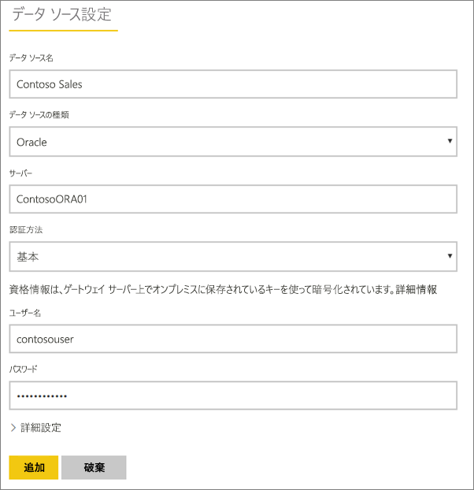
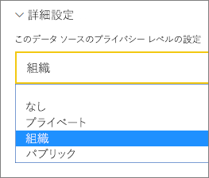
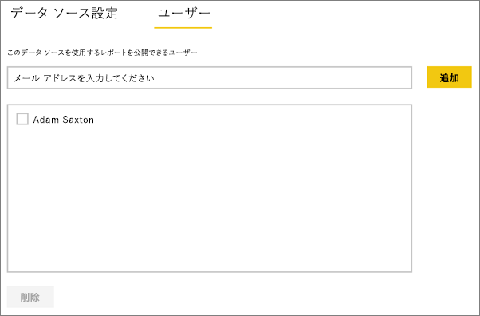
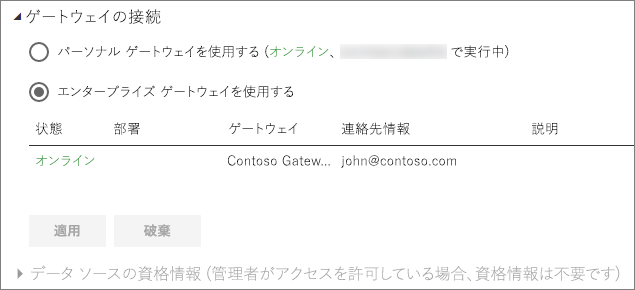

# データ ソースの管理 - インポート/スケジュールされた更新
オンプレミス データ ゲートウェイをインストールしたら、ゲートウェイで使用できるデータ ソースを追加する必要があります。 この記事では、DirectQuery やライブ接続ではなく、スケジュールされた更新に使用されるゲートウェイとデータ ソースの操作方法について取り上げます。

## ゲートウェイをダウンロードしてインストールする
ゲートウェイは Power BI サービスからダウンロードできます。 **[ダウンロード]** > **[Data Gateway]** の順に選択するか、[ゲートウェイのダウンロード ページ](https://go.microsoft.com/fwlink/?LinkId=698861)に移動します。

## ゲートウェイの追加
ゲートウェイを追加する場合は、使用している環境のサーバー上にエンタープライズ ゲートウェイを[ダウンロード](https://go.microsoft.com/fwlink/?LinkId=698863)してインストールするだけです。 インストール済みのゲートウェイは、 **[ゲートウェイの管理]**の下のゲートウェイ一覧に表示されます。

> [!NOTE]
> **[ゲートウェイの管理]** は、少なくとも 1 つのゲートウェイの管理者になるまで表示されません。 つまり、ゲートウェイの管理者に追加されるか、または自身でゲートウェイをインストールして構成した場合に表示されます。
> 
> 

## ゲートウェイの削除
ゲートウェイを削除すると、そのゲートウェイの下にあるデータ ソースもすべて削除されます。  それらのデータ ソースに依存するダッシュボードやレポートも中断されます。

1. 画面右上の歯車アイコン  をクリックし、**[ゲートウェイの管理]** を選択します。
2. [ゲートウェイ] > **[削除]** をクリックします。
   
   

## データ ソースの追加
データ ソースを追加するには、ゲートウェイを選択して **[データ ソースの追加]** をクリックするか、または [ゲートウェイ] > **[データ ソースの追加]** をクリックします。

次に、一覧から **[データ ソースの種類]** を選択します。 一覧表示されているすべてのデータ ソースが、エンタープライズ ゲートウェイでのスケジュールされた更新に使用できます。 Analysis Services、SQL Server、SAP HANA は、スケジュールされた更新、DirectQuery/ライブ接続のどちらに対しても使用できます。

次に、データ ソースにアクセスするために使用するソース情報や資格情報などの、データ ソースの情報を記入できます。

> [!NOTE]
> データ ソースへのすべてのクエリは、これらの資格情報を使用して実行されます。 詳細については、[資格情報](service-gateway-onprem.md#credentials)の保存方法を説明している主なオンプレミス データ ゲートウェイ記事を参照してください。
> 
> 

すべての情報を入力したら、 **[追加]** をクリックできます。  これで、オンプレミス データと一緒に、スケジュールされた更新にこのデータ ソースを使用できるようになりました。 接続に成功すると、「 *接続成功* 」というメッセージが表示されます。

<!-- Shared Install steps Include -->
[!INCLUDE [gateway-onprem-datasources-include](./includes/gateway-onprem-datasources-include.md)]

### 詳細設定
データ ソースのプライバシー レベルを構成できます。 データを加工できる方法を制御します。 これは、スケジュールされた更新にのみ使用します。 [詳細情報](https://support.office.com/article/Privacy-levels-Power-Query-CC3EDE4D-359E-4B28-BC72-9BEE7900B540)

## データ ソースの削除
データ ソースを削除すると、そのデータ ソースに依存するすべてのダッシュボードやレポートが中断されます。  

データ ソースを削除するには、[データ ソース] > **[削除]** をクリックします。

## 管理者の管理
ゲートウェイの [管理者] タブで、ゲートウェイを管理できるユーザーを追加および削除できます。 現時点では、ユーザーのみを追加できます。 セキュリティ グループを追加することはできません。

## ユーザーの管理
データ ソースの [ユーザー] タブで、このデータ ソースを使用できるユーザーまたはセキュリティ グループを追加および削除できます。

> [!NOTE]
> ユーザー一覧は、だれがレポートを公開できるかを制御します。 レポート所有者は、ダッシュボードやコンテンツ パックを作成し、それらを他のユーザーと共有できます。
> 
> 

## スケジュールされた更新でデータ ソースを使用する
作成したデータ ソースは、DirectQuery 接続かスケジュールされた更新のいずれかによって使用されます。

> [!NOTE]
> Power BI Desktop とオンプレミス データ ゲートウェイ内のデータ ソースとの間で、サーバーとデータベース名が一致している必要があります。
> 
> 

データセットとゲートウェイ内のデータ ソース間のリンクは、サーバー名とデータベース名に基づいています。 このため、これらは一致している必要があります。 たとえば、Power BI Desktop 内でサーバー名の IP アドレスを指定する場合は、ゲートウェイ構成内のデータ ソースでもその IP アドレスを使用する必要があります。 Power BI Desktop で *SERVER\INSTANCE* を使用する場合は、ゲートウェイ用に構成されているデータ ソース内でも同じものを使用する必要があります。

ゲートウェイ内に構成されているデータ ソースの **[ユーザー]** タブの一覧に自分のアカウントが表示されていて、さらにサーバーとデータベース名が一致している場合は、スケジュールされた更新で使用するオプションとして、ゲートウェイが表示されます。

> [!WARNING]
> データセットに複数のデータ ソースが含まれる場合、ゲートウェイで各データ ソースを追加する必要があります。 ゲートウェイに追加されていないデータ ソースがある場合、そのゲートウェイはスケジュールされた更新に更新可能なものとして表示されません。
> 
> 

## 制限事項
* OAuth は、オンプレミスのデータ ゲートウェイでサポートされる認証方式ではありません。 OAuth を必要とするデータ ソースを追加することはできません。 データセットに OAuth を必要とするデータ ソースが含まれる場合は、スケジュールされた更新にゲートウェイを使用できません。

## 次の手順
[オンプレミス データ ゲートウェイ](service-gateway-onprem.md)  
[オンプレミス データ ゲートウェイの詳細](service-gateway-onprem-indepth.md)  
[オンプレミス データ ゲートウェイのトラブルシューティング](service-gateway-onprem-tshoot.md)  
他にわからないことがある場合は、 [Power BI コミュニティを利用してください](http://community.powerbi.com/)。

