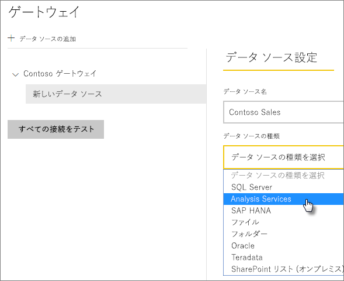
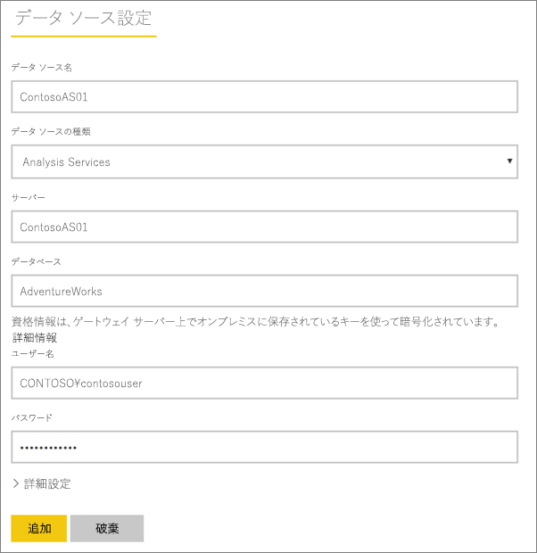
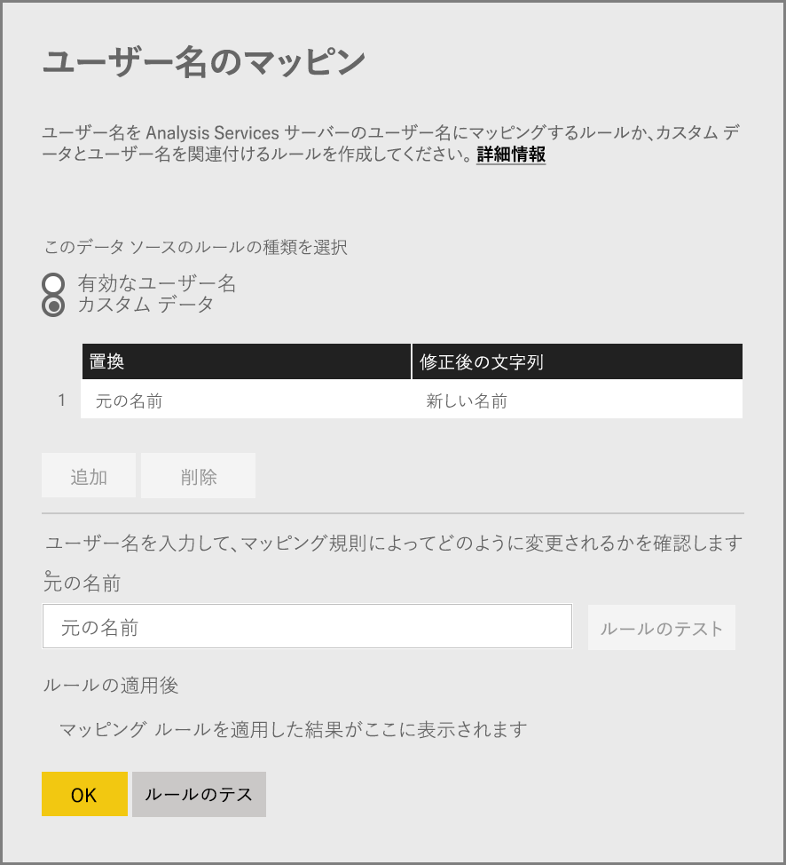
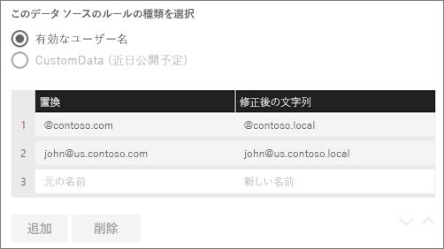
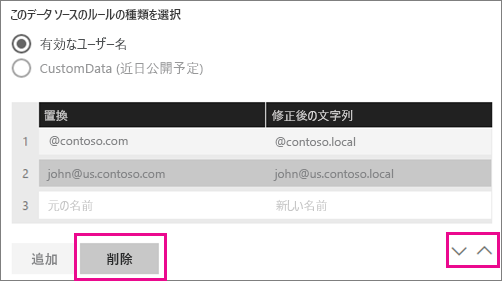
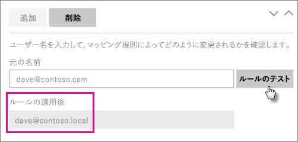
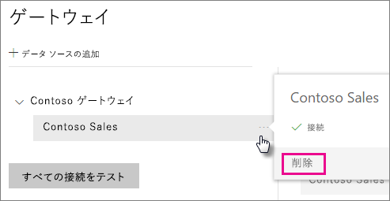
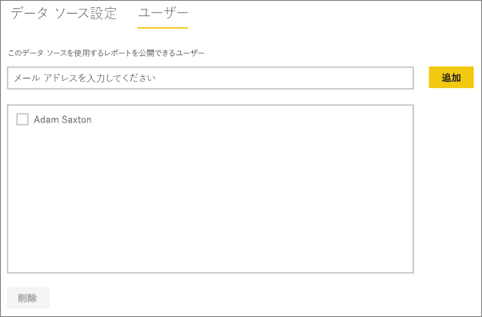

# データ ソースの管理 - Analysis Services
オンプレミス データ ゲートウェイをインストールしたら、ゲートウェイで使用できるデータ ソースを追加する必要があります。 この記事では、ゲートウェイとデータ ソースの操作方法について説明します。 Analysis Services データ ソースは、スケジュールされた更新とライブ接続のどちらにも使用できます。

<iframe width="560" height="315" src="https://www.youtube.com/embed/ownIGbcRAAU" frameborder="0" allowfullscreen></iframe>

## ゲートウェイをダウンロードしてインストールする
ゲートウェイは Power BI サービスからダウンロードできます。 **[ダウンロード]** > **[Data Gateway]** の順に選択するか、[ゲートウェイのダウンロード ページ](https://go.microsoft.com/fwlink/?LinkId=698861)に移動します。

## Analysis Services のライブ接続の制限事項
表形式または多次元インスタンスに対してライブ接続を使用することはできません。

| **サーバーのバージョン** | **必要な SKU** |
| --- | --- |
| 2012 SP1 CU4 以降 |Business Intelligence と Enterprise SKU |
| 2014 |Business Intelligence と Enterprise SKU |
| 2016 |Standard SKU 以上 |

* セル レベルの書式設定および変換機能はサポートされていません。
* アクションおよび名前付きセットは Power BI には公開されませんが、アクションまたは名前付きセットも含む多次元キューブに接続し、ビジュアルおよびレポートを作成することはできます。

## ゲートウェイの追加
ゲートウェイを追加する場合は、使用している環境のサーバー上にゲートウェイを[ダウンロード](https://go.microsoft.com/fwlink/?LinkId=698861)してインストールするだけです。 インストール済みのゲートウェイは、 **[ゲートウェイの管理]**の下のゲートウェイ一覧に表示されます。

> [!NOTE]
> **[ゲートウェイの管理]** は、少なくとも 1 つのゲートウェイの管理者になるまで表示されません。 つまり、ゲートウェイの管理者に追加されるか、または自身でゲートウェイをインストールして構成した場合に表示されます。
> 
> 

## ゲートウェイの削除
ゲートウェイを削除すると、そのゲートウェイの下にあるデータ ソースもすべて削除されます。  それらのデータ ソースに依存するダッシュボードやレポートも中断されます。

1. 画面右上の歯車アイコン  をクリックし、**[ゲートウェイの管理]** を選択します。
2. [ゲートウェイ] > **[削除]** をクリックします。
   
   

## データ ソースの追加
データ ソースを追加するには、ゲートウェイを選択して **[データ ソースの追加]** をクリックするか、または [ゲートウェイ] > **[データ ソースの追加]** をクリックします。

次に、一覧から **[データ ソースの種類]** を選択します。 多次元サーバーまたは表形式サーバーのどちらかに接続している場合は、[Analysis Services] を選択します。

次に、 **[サーバー]** や **[データベース]**など、データ ソースの情報を入力する必要があります。  

入力した **ユーザー名** と **パスワード** は、Analysis Services インスタンスに接続するために、ゲートウェイによって使用されます。

> [!NOTE]
> 入力した Windows アカウントには、接続先のインスタンスに対するサーバー管理者権限が必要です。 このアカウントのパスワードに有効期限が設定されている場合、データ ソースのパスワードが更新されないと、接続エラーになることがあります。 詳細については、[資格情報](service-gateway-onprem.md#credentials)の保存方法を説明している主なオンプレミス データ ゲートウェイ記事を参照してください。
> 
> 

すべての情報を入力したら、 **[追加]** をクリックできます。  これで、オンプレミスである Analysis Services インスタンスに対するスケジュールされた更新またはライブ接続にこのデータ ソースを使用できます。  接続に成功すると、「 *接続成功* 」というメッセージが表示されます。

### 詳細設定
データ ソースのプライバシー レベルを構成できます。 データを加工できる方法を制御します。 これは、スケジュールされた更新にのみ使用します。 ライブ接続には適用されません。 [詳細情報](https://support.office.com/article/Privacy-levels-Power-Query-CC3EDE4D-359E-4B28-BC72-9BEE7900B540)

## Analysis Services でのユーザー名
Analysis Services に接続されているレポートをユーザーが操作するたびに、有効なユーザー名がゲートウェイに渡され、次にオンプレミスの Analysis Services サーバーに渡されます。 Power BI にサインインするときに使用する電子メール アドレスは、私たちが有効なユーザーとして Analysis Services に渡すものです。 これは、接続プロパティ [EffectiveUserName](https://msdn.microsoft.com/library/dn140245.aspx#bkmk_auth) に渡されます。 この電子メール アドレスは、ローカルの Active Directory ドメイン内で定義されている UPN と一致する必要があります。 UPN は、Active Directory アカウントのプロパティです。 その Windows アカウントは、Analysis Services ロールに存在する必要があります。 Active Directory での一致を検出できない場合は、ログインは正常に実行されません。 [詳細情報](https://msdn.microsoft.com/library/ms677605.aspx)

Power BI サインイン名をローカル ディレクトリの UPN にマッピングすることもできます。 [詳細情報](service-gateway-enterprise-manage-ssas.md#map-user-names)

<iframe width="560" height="315" src="https://www.youtube.com/embed/Qb5EEjkHoLg" frameborder="0" allowfullscreen></iframe>

### 自分の UPN を確認する方法
自分の UPN がわからないけれども、自分がドメイン管理者ではない場合もあります。 ワークステーションから次のコマンドを実行して、自分のアカウントの UPN を確認できます。

    whoami /upn

結果は電子メール アドレスに似ていますが、これはドメイン アカウントの UPN です。 Analysis Services データ ソースをライブ接続に使用している場合に、この UPN が Power BI へのサインインに使用している電子メール アドレスと一致しない場合は、[ユーザー名をマッピング](#map-user-names)する方法を参照してください。

## ユーザー名のマッピング
<iframe width="560" height="315" src="https://www.youtube.com/embed/eATPS-c7YRU" frameborder="0" allowfullscreen></iframe>

Analysis Services のユーザー名は、次の 2 つの方法でマッピングすることができます。

1. 手動によるユーザーの再マッピング 
2. オンプレミスの Active Directory プロパティ参照を使用して Active Directory ユーザーに AAD UPN を再マップする (AD 参照マッピング)

2 番目の方法を使用して手動マッピングを実行することは可能ですが、その場合、操作に時間がかかるほか、維持も大変です。特に、AAD とオンプレミスの AD との間でドメイン名が異なる場合や AAD と AD との間でユーザー アカウント名が異なる場合など、パターン一致が十分でないときに難しくなります。 そのため、2 番目の方法での手動マッピングはお勧めできません。

このような 2 つの方法を順番に次の 2 つのセクションで説明します。

### 手動でのユーザー名の再マッピング
Analysis Services データ ソースの場合は、カスタムのユーザー プリンシパル名 (UPN) 規則を構成できます。 これは、Power BI サービスのログイン名とローカル ディレクトリの UPN が一致していない場合に役立ちます。 たとえば、john@contoso.com で Power BI にサインインしているものの、ローカル ディレクトリの UPN が john@contoso.local の場合は、john@contoso.local を Analysis Services に渡すマッピング規則を構成できます。

UPN マッピングの画面にアクセスするには、次のように操作します。

1. **歯車アイコン**をクリックし、**[ゲートウェイの管理]** を選択します。
2. Analysis Services データ ソースを格納するゲートウェイを展開します。 または、Analysis Services データ ソースを作成していない場合は、この時点で作成します。
3. データ ソースを選択してから、**[ユーザー]** タブを選択します。
4. **[ユーザー名のマップ]** を選択します。
   
    

ルールを追加するオプションと、特定のユーザーについてテストするオプションが表示されます。

> [!NOTE]
> 誤って別のユーザーを変更してしまう場合があります。 たとえば、**[置換前] \(元の値)** が *@contoso.com* で **[置換後] \(新しい名前)** が *@contoso.local* の場合、*@contoso.com* を含むサインイン名を持つすべてのユーザーが *@contoso.local* に置き換えられます。 また、**[置換前] \(元の名前)** が *dave@contoso.com* で **[置換後] \(新しい名前)** が *dave@contoso.local* の場合、v-dave@contoso.com でサインインしたユーザーは、v-dave*@contoso.local* として送信されます。
> 
> 

### AD 参照マッピング
オンプレミスの AD プロパティ参照を実行して AAD UPN を Active Directory ユーザーに再マップするには、次のセクションの手順に従ってください。 まず始めに、このしくみを確認しましょう。

**Power BI サービス**では、次の処理が実行されます。

- オンプレミスの SSAS サーバーに対して Power BI AAD ユーザーがクエリを実行するたびに、firstName.lastName@contoso.com のような UPN 文字列が渡されます。

> [!NOTE]
> Power BI データ ソースの構成内で手動 UPN ユーザー マッピングが定義されている場合は、それが適用されて "*から*"、ユーザー名文字列がオンプレミスのデータ ゲートウェイに送信されます。
> 
> 

構成可能なカスタム ユーザー マッピングを持つオンプレミス データ ゲートウェイで、次の操作を行います。

1. 検索する Active Directory を特定します (自動または構成可能)。
2. **Power BI サービス**から届いた UPN 文字列 (“firstName.lastName@contoso.com”) に基づいて AD ユーザーの属性 (*電子メール*など) を参照します。
3. AD 参照が失敗すると、SSAS への EffectiveUser として渡された UPN の使用を試みます。
4. AD 参照が成功すると、その AD ユーザーの *UserPrincipalName* が取得されます。 
5. 次に、*"UserPrincipalName"* のメール アドレスが *"EffectiveUser"* として SSAS に渡されます (たとえば、*Alias@corp.on-prem.contoso*)。

AD 参照を実行するようにゲートウェイを構成する方法:

1. 最新のゲートウェイをダウンロードしてインストールします。
2. ゲートウェイでは、ドメイン アカウントで実行されるように**オンプレミスのデータ ゲートウェイ サービス**を変更する必要があります (ローカル サービス アカウントは使用しません。これを使用すると、実行時に AD 参照が正しく機能しません)。 変更内容を有効にするには、ゲートウェイ サービスを再起動する必要があります。  コンピューター上のゲートウェイ アプリに進みます ("on-premises data gateway" を検索)。 そのためには、**[サービス設定]、[サービス アカウントの変更]** の順に進みます。 同じコンピューター上で新しいゲートウェイを作成しない場合はゲートウェイを復元する必要があるため、目的のゲートウェイの回復キーがあることを確認してください。 
3. ゲートウェイのインストール フォルダー (*"C:\Program Files\On-premises data gateway"*) に管理者として移動し、書き込みアクセス許可があることを確認して、次のファイルを編集します。
   
       Microsoft.PowerBI.DataMovement.Pipeline.GatewayCore.dll.config 
4. AD ユーザーの*"目的の"* Active Directory 属性の構成に従って、次の 2 つの構成値を編集します。 次に示す構成値は単なる例です。Active Directory の構成に基づいて値を指定する必要があります。 
   
   
5. 構成の変更を有効にするには、**オンプレミスのデータ ゲートウェイ** サービスを再起動します。

### マッピング規則を作成する
マッピング規則を作成するには、**[元の名前]** と **[新しい名前]** の値を入力し、**[追加]** を選択します。

| フィールド | 説明 |
| --- | --- |
| 置換前 (元の名前) |Power BI へのサインインに使用している電子メール アドレス。 |
| 置換後 (新しい名前) |元の名前を置き換える値。 ここで置き換えた値が、Analysis Services 接続の *EffectiveUserName* プロパティに渡されます。 |

一覧の項目を選択するときに、**シェブロン アイコン**を使用して項目を並べ替えたり、項目を**削除**したりできます。

### ワイルドカード (\*) を使用する
**\[置換前] \(元の名前)** の文字列でワイルドカードを使用できます。 ワイルドカードは単独でのみ使用でき、その他の文字列パーツと併用はできません。 そのため、すべてのユーザーを取得してデータ ソースに単一の値を渡すことができます。 これは、組織内のすべてのユーザーにローカル環境内の同じユーザーを割り当てる場合に便利です。

### マッピング規則をテストする
**[元の名前]** に値を入力して **[ルールのテスト]** を選択すると、名前の置き換えを検証することができます。

> [!NOTE]
> 保存されているルールがサービスで使用開始されるまでに、数分かかります。 ブラウザー内では、ルールはすぐに有効になります。
> 
> 

### マッピング規則の制限事項
* マッピングは、構成されている特定のデータ ソース向けです。 グローバルな設定ではありません。 複数の Analysis Services データ ソースがある場合は、データ ソースごとにユーザーをマッピングする必要があります。

## データ ソースの削除
データ ソースを削除すると、そのデータ ソースに依存するすべてのダッシュボードやレポートが中断されます。  

データ ソースを削除するには、[データ ソース]、**[削除]** の順にクリックします。

## 管理者の管理
ゲートウェイの [管理者] タブで、ゲートウェイを管理できるユーザー (またはセキュリティ グループ) を追加および削除できます。

## ユーザーの管理
データ ソースの [ユーザー] タブで、このデータ ソースを使用できるユーザーまたはセキュリティ グループを追加および削除できます。

> [!NOTE]
> ユーザー一覧は、だれがレポートを公開できるかを制御します。 レポート所有者は、ダッシュボードやコンテンツ パックを作成し、それらを他のユーザーと共有できます。
> 
> 

## データ ソースの使用
作成したデータ ソースは、ライブ接続かスケジュールされた更新のいずれかによって使用されます。

> [!NOTE]
> Power BI Desktop とオンプレミス データ ゲートウェイ内のデータ ソースとの間で、サーバーとデータベース名が一致している必要があります。
> 
> 

データセットとゲートウェイ内のデータ ソース間のリンクは、サーバー名とデータベース名に基づいています。 このため、これらは一致している必要があります。 たとえば、Power BI Desktop 内でサーバー名の IP アドレスを指定する場合は、ゲートウェイ構成内のデータ ソースでもその IP アドレスを使用する必要があります。 Power BI Desktop で *SERVER\INSTANCE* を使用する場合は、ゲートウェイ用に構成されているデータ ソース内でも同じものを使用する必要があります。

これは、ライブ接続とスケジュールされた更新のどちらにも該当します。

### ライブ接続でデータ ソースを使用する
Power BI Desktop とゲートウェイ用に構成されているデータ ソースとの間では、サーバーとデータベース名が一致している必要があります。 また、ライブ接続のデータセットを公開するには、自分のアカウントがデータ ソースの **[ユーザー]** タブの一覧に表示されている必要があります。 ライブ接続の選択は、最初にデータをインポートする Power BI Desktop 内で発生します。

公開した後は、Power BI Desktop か **[データの取得]** のいずれかから、レポート機能が利用可能になります。 ゲートウェイ内にデータ ソースを作成してから、接続が使用できるようになるまでには、数分ほどかかることがあります。

### スケジュールされた更新でデータ ソースを使用する
ゲートウェイ内に構成されているデータ ソースの **[ユーザー]** タブの一覧に自分のアカウントが表示されていて、さらにサーバーとデータベース名が一致している場合は、スケジュールされた更新で使用するオプションとして、ゲートウェイが表示されます。

## 次の手順
[オンプレミス データ ゲートウェイ](service-gateway-onprem.md)  
[オンプレミス データ ゲートウェイの詳細](service-gateway-onprem-indepth.md)  
[オンプレミス データ ゲートウェイのトラブルシューティング](service-gateway-onprem-tshoot.md)  
他にわからないことがある場合は、 [Power BI コミュニティを利用してください](http://community.powerbi.com/)。

