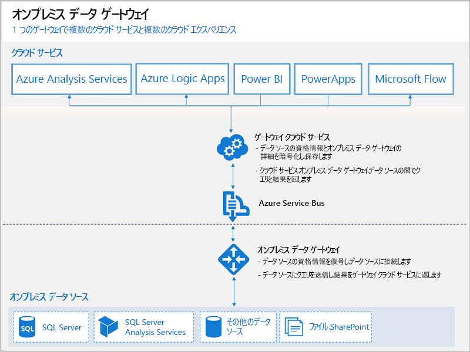

# Power BI ゲートウェイとは

Power BI ゲートウェイは、オンプレミス ネットワーク内にインストールするソフトウェアです。それはネットワーク内のデータへのアクセスを容易にします。 それは門番のような存在であり、接続要求を待ち受け、ユーザーの要求が一定の条件を満たしたときにのみ、要求に応えます。 これにより、オンプレミス ネットワーク上の組織のデータベースと他のデータ ソースを維持したままで、オンプレミス データを Power BI のレポートとダッシュボードで安全に使用できます。

次の図は、ゲートウェイの基本的な動作を示しています。ここでは、3 台のプレミス コンピューターに対するクラウドからの要求を処理しています。 この記事の中で詳しく説明します。

## ゲートウェイの種類

Power BI では 2 つのゲートウェイを提供しますが、それらはシナリオは異なります。

* **オンプレミス データ ゲートウェイ (個人用モード)** – 1 人のユーザーがソースに接続できます。他のユーザーと共有できません。 Power BI でのみ利用できます。 このゲートウェイは、レポートを作成するユーザーが 1 人だけであり、データ ソースを他のユーザーと共有する必要がないシナリオに適しています。

* **オンプレミス データ ゲートウェイ**– 複数のユーザーが複数のオンプレミスのデータ ソースに接続できるようにします。 単一のゲートウェイのインストールによって、Power BI、PowerApps、Flow、Azure Analysis Services、および Azure Logic Apps のすべてで使用できます。 このゲートウェイは、複数のユーザーが複数のデータ ソースにアクセスする複雑なシナリオに適しています。 

## ゲートウェイの使用

ゲートウェイを使用するための 4 つの主要な手順があります。

1. **ゲートウェイをインストールする**: ローカル コンピューター上に適切なモードを使用してインストールします。
2. **ゲートウェイにユーザーを追加する**: ユーザーがオンプレミス データ ソースにアクセスできるようにします。
3. **データ ソースに接続する**: データ ソースを レポートとダッシュボードで使用できるようにします。
4. **オンプレミス データを更新する**: Power BI レポートが最新の状態になるようにします。

ゲートウェイは、スタンドアロンでインストールすることも、"*クラスター*" に追加することもできます。高可用性を実現するために後者をお勧めします。

## ゲートウェイのしくみ

インストールしたゲートウェイは、Windows サービスの**オンプレミス データ ゲートウェイ**として実行されます。 このローカル サービスは、Azure Service Bus 経由でゲートウェイ クラウド サービスに登録されます。 次の図は、ゲートウェイを使用するオンプレミス データとクラウド サービス間のフローを示しています。

クエリとデータ フロー:

1. クラウド サービスによって、オンプレミス データ ソースの暗号化された資格情報付きのクエリが作成されます。 その後、処理するためにゲートウェイのキューに送信されます。
2. ゲートウェイ クラウド サービスは、クエリを分析し、要求を Azure Service Bus にプッシュします。
3. オンプレミス データ ゲートウェイは、Azure Service Bus へのポーリングを実行して保留中の要求の有無を確認します。
4. ゲートウェイはクエリを取得して資格情報の暗号化を解除し、その資格情報を使用してデータ ソースに接続します。
5. クエリは、ゲートウェイによってデータ ソースへ送信され、実行されます。
6. データ ソースからゲートウェイに結果が返送され、さらにクラウド サービスとサーバーに送信されます。

## 次の手順
[オンプレミス データ ゲートウェイのインストール](service-gateway-install.md)

他にわからないことがある場合は、 [Power BI コミュニティを利用してください](http://community.powerbi.com/)。

