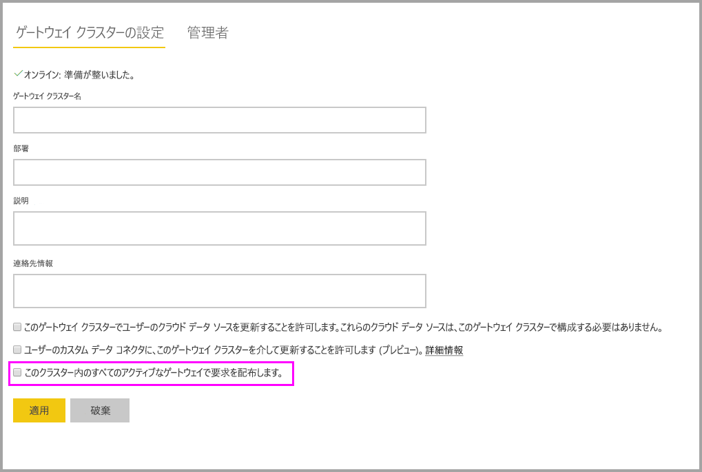

# <a name="high-availability-clusters-for-on-premises-data-gateway"></a>オンプレミス データ ゲートウェイの高可用性クラスター

**オンプレミス データ ゲートウェイ** インストールの**高可用性クラスター**を作成すると、組織は Power BI レポートとダッシュボードで使用されるオンプレミス データ リソースにアクセスできるようになります。 このようなクラスターでは、管理者はゲートウェイをグループ化して、オンプレミス データ リソースへのアクセス時に単一障害点を回避できます。 Power BI サービスでは、常にクラスターのプライマリ ゲートウェイが使用されます。ただし、使用不可の場合を除きます。 その場合、サービスはクラスターの次のゲートウェイに切り替え、以下同様に切り替えます。

この記事では、オンプレミス データ ゲートウェイの高可用性クラスターを作成するために実行できる手順について説明し、クラスターのセットアップ時のベスト プラクティスを共有します。 高可用性ゲートウェイ クラスターには、オンプレミス データ ゲートウェイの 2017 年 11 月以降の更新プログラムが必要です。

## <a name="setting-up-high-availability-clusters-of-gateways"></a>ゲートウェイの高可用性クラスターのセットアップ

**オンプレミス データ ゲートウェイ**のインストール プロセス時に、ゲートウェイを既存のゲートウェイ クラスターに追加する必要があるかどうかを指定できます。 


既存のクラスターにゲートウェイを追加するには、新しいゲートウェイを結合するクラスターのプライマリ ゲートウェイ インスタンスに*回復キー*を提供する必要があります。 クラスターのプライマリ ゲートウェイは、2017 年 11 月以降のゲートウェイ更新プログラムを実行する必要があります。 

## <a name="managing-a-gateway-cluster"></a>ゲートウェイ クラスターの管理

ゲートウェイ クラスターが 2 つ以上のゲートウェイで構成されると、データ ソースの追加やゲートウェイへの管理アクセス許可の付与などの、すべてのゲートウェイ管理操作が、クラスターの一部であるすべてのゲートウェイに適用されます。

管理者が **Power BI サービス**の歯車アイコンの下にある **[ゲートウェイの管理]** メニュー項目を使用するときに、登録済みクラスターまたは個々のゲートウェイのリストが表示されますが、クラスターのメンバーである個々のゲートウェイ インスタンスは表示されません。

新しい**スケジュールされている更新**要求と DirectQuery 操作はすべて、指定されたゲートウェイ クラスターのプライマリ インスタンスに自動的にルーティングされます。 プライマリ ゲートウェイ インスタンスがオンラインでない場合、要求はクラスターの別のゲートウェイ インスタンスにルーティングされます。

## <a name="distribute-requests-traffic-across-all-gateways-in-a-cluster"></a>クラスターにあるすべてのゲートウェイ間で要求トラフィックを分散する

クラスターにあるすべてのゲートウェイ間でトラフィックを分散することを選択できます。 **Power BI サービス**の **[ゲートウェイの管理]** ページで、左のナビゲーション ツリーにある一覧でゲートウェイ クラスターをクリックすると、"このクラスター内のすべてのアクティブなゲートウェイで要求を配布します" というオプションを有効にできます。



## <a name="powershell-support-for-gateway-clusters"></a>PowerShell でのゲートウェイ クラスターのサポート

PowerShell スクリプトは、オンプレミス データ ゲートウェイのインストール フォルダーにあります。 既定では、そのフォルダーは *C:\Program Files\On-premises data gateway* にあります。 これらのスクリプトを正しく機能させるには、PowerShell バージョン 5 以上を使用する必要があります。 ユーザーは PowerShell スクリプトを使用して、以下の操作を実行できます。

-   ユーザーが使用できるゲートウェイ クラスターのリストを取得する
-   クラスターで登録されているゲートウェイ インスタンスのリストと、状態 (オンラインまたはオフライン) を取得する
-   クラスター内のゲートウェイ インスタンスの有効/無効の状態と、他のゲートウェイ プロパティを変更する
-   ゲートウェイの削除

表の PowerShell コマンドを実行するには、まず、以下の手順を実行する必要があります。

1. 管理者として、PowerShell コマンド ウィンドウを開きます。
2. その後、以下の 1 回限りの PowerShell コマンドを実行します (ここでは、現在のコンピューターで PowerShell コマンドを実行したことがないと仮定します)。

    ```
    Set-ExecutionPolicy -ExecutionPolicy Unrestricted -Force
    ```

3. 次に、PowerShell ウィンドウでオンプレミス データ ゲートウェイのインストール フォルダーに移動して、以下のコマンドを使用して必要なモジュールをインポートします。

    ```
    Import-Module .\OnPremisesDataGatewayHAMgmt.psm1
    ```

これらの手順が完了したら、以下の表のコマンドを使用してゲートウェイ クラスターを管理できます。

| **コマンド** | **説明** | **パラメーター** |
| --- | --- | --- |
| *Login-OnPremisesDataGateway* |このコマンドを使用すると、ユーザーはログインして自分のオンプレミス データ ゲートウェイ クラスターを管理できます。  他の高可用性コマンドが正しく機能するように、*あらかじめ*このコマンドを実行してログインする必要があります。 注: ログイン呼び出しの一環として取得される AAD 認証トークンが有効なのは 1 時間だけです。1 時間が経過すると、期限切れとなります。 ログイン コマンドを再実行することで新しいトークンを取得できます。| AAD のユーザー名とパスワード (初回の呼び出し時ではなく、コマンドの実行時に指定)|
| *Get-OnPremisesDataGatewayClusters* | ログイン ユーザーのゲートウェイ クラスターのリストを取得します。 | 必要に応じて、読みやすいように、このコマンドに *Format-Table -AutoSize -Wrap* などの書式設定パラメーターを渡すことができます。 |
| *Get-OnPremisesDataClusterGateways* | 指定されたクラスター内のゲートウェイのリストと、ゲートウェイごとの追加情報 (オンライン/オフライン状態、コンピューター名など) を取得します。 | *-ClusterObjectID xyz*  (この *xyz* は実際のクラスター オブジェクト ID の値に置き換えます。値は、*Get-OnPremisesDataGatewayClusters* コマンドを使用して取得できます)|
| *Set-OnPremisesDataGateway* | 特定のゲートウェイ インスタンスの有効化/無効化など、クラスター内の指定されたゲートウェイのプロパティ値を設定できます。  | *-ClusterObjectID xyz* (*xyz* は *Get-OnPremisesDataGatewayClusters* コマンドで取得できる実際のオブジェクト ID の値に置き換える必要があります) *-GatewayObjectID abc* (*abc* は *Get-OnPremisesDataClusterGateways* コマンドで取得できる実際のゲートウェイ オブジェクト ID の値に置き換える必要があり、クラスター ID を指定する必要があります) |
| *Get-OnPremisesDataGatewayStatus* | クラスター内の指定されたゲートウェイ インスタンスの状態を取得できます。  | *-ClusterObjectID xyz* (*xyz* は *Get-OnPremisesDataGatewayClusters* コマンドで取得できる実際のオブジェクト ID の値に置き換える必要があります)。  *-GatewayObjectID abc*  (*abc* は *Get-OnPremisesDataClusterGateways* コマンドで取得できる実際のゲートウェイ オブジェクト ID の値に置き換える必要があります。また、クラスター ID を指定する必要があります。) |
| *Remove-OnPremisesDataGateway*  | クラスターからゲートウェイ インスタンスを削除できます。クラスター内のプライマリ ゲートウェイは、クラスター内の他のすべてのゲートウェイが削除されるまで削除できないことにご注意ください。| *-ClusterObjectID xyz* (*xyz* は *Get-OnPremisesDataGatewayClusters* コマンドで取得できる実際のオブジェクト ID の値に置き換える必要があります)。  *-GatewayObjectID abc*  (*abc* は *Get-OnPremisesDataClusterGateways* コマンドで取得できる実際のゲートウェイ オブジェクト ID の値に置き換える必要があります。また、クラスター ID を指定する必要があります。) |

## <a name="next-steps"></a>次の手順

-   [データ ソースの管理 - Analysis Services](service-gateway-enterprise-manage-ssas.md)  
-   [データ ソースの管理 - SAP HANA](service-gateway-enterprise-manage-sap.md)  
-   [データ ソースの管理 - SQL Server](service-gateway-enterprise-manage-sql.md)  
-   [データ ソースの管理 - Oracle](service-gateway-onprem-manage-oracle.md)  
-   [データ ソースの管理 - インポート/スケジュールされた更新](service-gateway-enterprise-manage-scheduled-refresh.md)  
-   [オンプレミス データ ゲートウェイの詳細](service-gateway-onprem-indepth.md)  
-   [オンプレミス データ ゲートウェイ (個人用モード)](service-gateway-personal-mode.md)
-   [オンプレミス データ ゲートウェイのプロキシ設定を構成する](service-gateway-proxy.md)  
-   [Power BI からオンプレミス データ ソースへの SSO (シングル サインオン) に Kerberos を使用する](service-gateway-kerberos-for-sso-pbi-to-on-premises-data.md)  

他にわからないことがある場合は、 [Power BI コミュニティを利用してください](http://community.powerbi.com/)。
