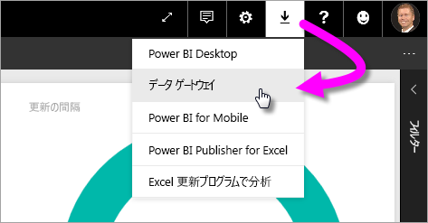
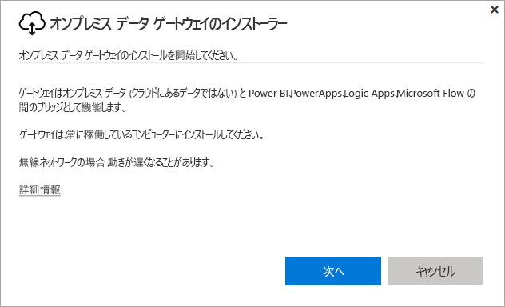
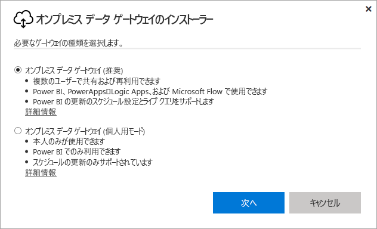
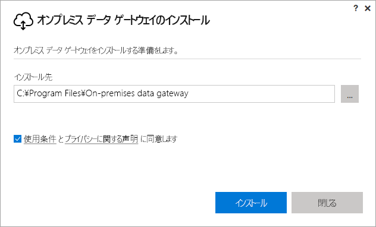
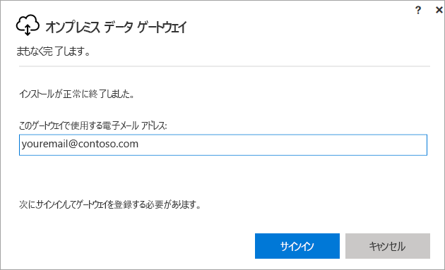
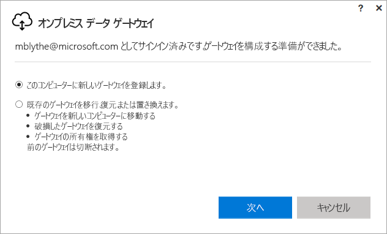
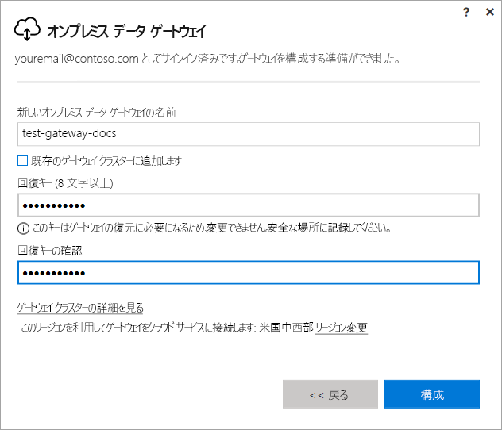
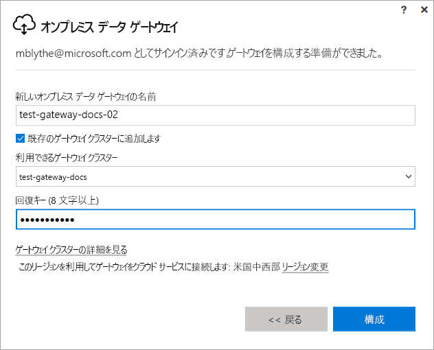

# Power BI 用のゲートウェイをインストールする

Power BI ゲートウェイは、オンプレミス ネットワーク内にインストールするソフトウェアです。ゲートウェイがあると、そのネットワーク内のデータに簡単にアクセスできるようになります。 「[概要](service-gateway-getting-started.md)」で説明したように、個人用モードまたは標準モード (推奨) でゲートウェイをインストールできます。 標準モードの場合、ゲートウェイをスタンドアロンでインストールすることも、"*クラスター*" に追加することもできます。高可用性を実現するために後者をお勧めします。 この記事では、標準ゲートウェイをインストールし、もう 1 つのゲートウェイを追加してクラスターを作成する方法について説明します。

Power BI にサインアップしていない場合は、[無料の試用版にサインアップ](https://app.powerbi.com/signupredirect?pbi_source=web)してください。

## ゲートウェイをダウンロードしてインストールする

ゲートウェイはインストール先のコンピューターで実行されるので、常に起動しているコンピューターにインストールしてください。 パフォーマンスと信頼性を向上させるために、ワイヤレス ネットワークではなくワイヤード (有線) ネットワークにコンピューターを接続することをお勧めします。

1. Power BI サービスで、右上にある **ダウンロード アイコン**  > **[データ ゲートウェイ]** の順に選択します。

    

2. ダウンロード ページで**ゲートウェイのダウンロード** ボタンを選択します。

3. **[次へ]** を選びます。     

    

4. **[オンプレミス データ ゲートウェイ (推奨)]** > **[次へ]** の順に選択します。

    

5. 既定のインストール パスのままにして使用条件に同意し、**[インストール]** を選択します。

    

6. Power BI へのサインインに使用するアカウントを入力し、**[サインイン]** を選択します。

    

    ゲートウェイは Power BI アカウントに関連付けられています。ゲートウェイは、Power BI サービス内から管理します。 これで、アカウントにサインインしました。

7. **[このコンピューターに新しいゲートウェイを登録します]** > **[次へ]** の順に選択します。

    

8. ゲートウェイの名前 (テナント全体で一意である必要があります) と回復キーを入力します。 ゲートウェイを復旧または移動する場合に、回復キーが必要になります。 **[構成]** を選択します。

    

    **[既存のゲートウェイ クラスターに追加します]** というオプションがあります。 このオプションはこの記事の次のセクションで使用します。

9. 最後のウィンドウで情報を確認します。 このゲートウェイは、Power BI だけでなく、PowerApps と Flow でも利用できます。3 つのすべてに同じアカウントを使用しているためです。 **[閉じる]** を選びます。

    ![[概要] 画面](media/service-gateway-install/summary-screen.png)

ゲートウェイのインストールが完了したら、もう 1 つのゲートウェイを追加してクラスターを作成できます。

## もう 1 つのゲートウェイを追加してクラスターを作成する

クラスターを使用すると、ゲートウェイ管理者はオンプレミス データ アクセスの単一障害点を回避できます。 プライマリ ゲートウェイが使用できない場合、追加する 2 番目のゲートウェイにデータ要求がルーティングされます。 1 台のコンピューターには標準ゲートウェイを 1 つしかインストールできないので、別のコンピューターにクラスター用の 2 番目のゲートウェイをインストールする必要があります。 クラスターに冗長性が必要なので、この方法は意味があります。

高可用性ゲートウェイ クラスターには、オンプレミス データ ゲートウェイの 2017 年 11 月以降の更新プログラムが必要です。

1. ゲートウェイを別のコンピューターにダウンロードしてインストールします。

2. Power BI アカウントにサインインした後、ゲートウェイを登録します。 **[既存のゲートウェイ クラスターに追加します]** を選択します。 **[使用可能なゲートウェイ クラスター]** で、インストールした最初のゲートウェイ (*プライマリ ゲートウェイ*) を選択し、そのゲートウェイの回復キーを入力します。 **[構成]** を選択します。

    

## 次の手順

[Power BI ゲートウェイを管理する](service-gateway-manage.md)

他にわからないことがある場合は、 [Power BI コミュニティを利用してください](http://community.powerbi.com/)。