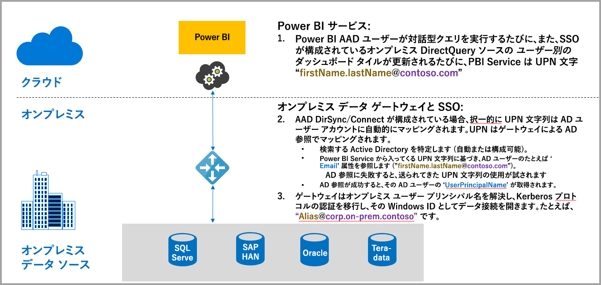
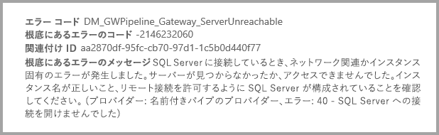
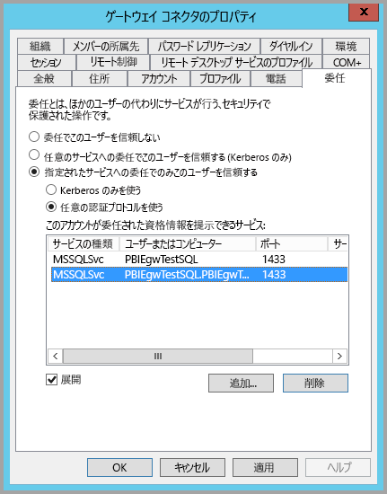
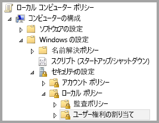
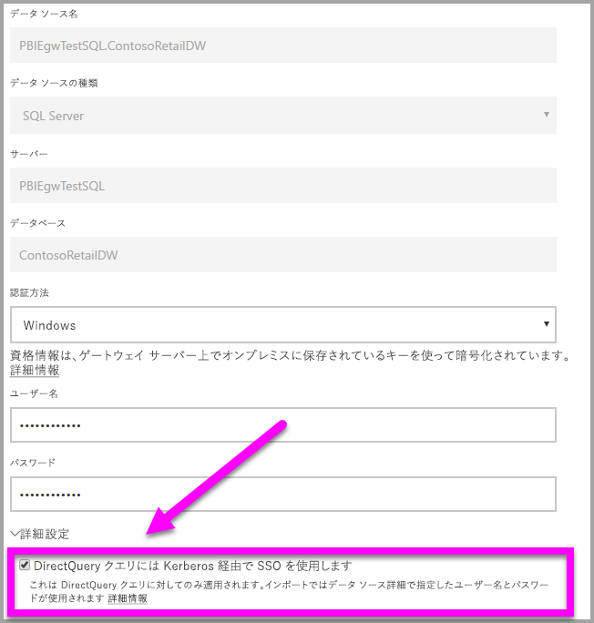
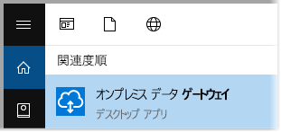
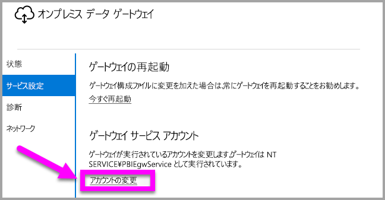

# Power BI からオンプレミス データ ソースへの SSO (シングル サインオン) に Kerberos を使用する
オンプレミスのデータ ゲートウェイと Kerberos を構成することにより、シームレスなシングル サインオン接続を確立して、Power BI のレポートとダッシュボードをオンプレミスのデータで更新することができます。 オンプレミス データ ゲートウェイにより、DirectQuery を使うシングル サインオン (SSO) が容易になります。この場合、オンプレミスのデータ ソースへの接続に使われます。

現在、SQL Server、SAP HANA、Teradata の各データ ソースがサポートされています。これらはすべて、[Kerberos の制約付き委任](https://technet.microsoft.com/library/jj553400.aspx)に基づきます。

* SQL Server
* SAP HANA
* SAP BW
* Teradata

ユーザーが Power BI サービスで DirectQuery レポートを操作すると、クロスフィルター、スライス、並べ替え、レポート編集の各操作で、基になるオンプレミス データ ソースに対してクエリがライブ実行される場合があります。  データ ソースにシングル サインオンが構成されていると、Power BI を操作しているユーザーの ID でクエリが実行されます (つまり、Web エクスペリエンスまたは Power BI モバイル アプリで)。 これにより、各ユーザーには、そのユーザーが基になるデータ ソースでアクセス許可を持っているデータだけが表示されます。シングル サインオンを構成すると、異なるユーザー間で共有されるデータ キャッシュはありません。

## SSO でのクエリ実行手順
SSO を使ったクエリ実行は、次の図に示す 3 つのステップで構成されます。

> [!NOTE]
> Oracle 用の SSO は、まだ有効になっていませんが、開発中であり近日公開予定です。
> 
> 

これらの手順の詳細を次に示します。

1. 各クエリに対し、**Power BI サービス**は構成されたゲートウェイに送信するクエリ要求に*ユーザー プリンシパル名* (UPN) を組み込みます。
2. ゲートウェイは、Azure Active Directory の UPN を Active Directory のローカル ID にマップする必要があります。
   
   a.  AAD DirSync (*AAD Connect* とも呼ばれる) が構成されている場合は、マッピングがゲートウェイで自動的に動作します。
   
   b.  それ以外の場合、ゲートウェイは、ローカルの Active Directory ドメインに対して検索を実行することにより、Azure AD UPN を参照し、これをローカル ユーザーにマップします。
3. ゲートウェイ サービスのプロセスは、マップされたローカル ユーザーを偽装して、基になるデータベースへの接続を開き、クエリを送信します。 ゲートウェイはデータベースと同じコンピューターにインストールされている必要はありません。
   
   - ユーザーの偽装やデータベースへの接続が成功するのは、ゲートウェイ サービス アカウントがドメイン アカウント (またはサービス SID) である場合、およびゲートウェイ サービス アカウントからの Kerberos チケットを受け入れるようにデータベースに対して Kerberos 制約付き委任が構成されている場合のみです。  
   
   > [!NOTE]
   > サービス SID に関して、AAD DirSync/Connect が構成されていて、ユーザー アカウントが同期されている場合、ゲートウェイは実行時にローカル AD 参照を実行する必要はなく、ゲートウェイ サービスに対して (ドメイン アカウントを要求する代わりに) ローカル サービス SID を使うことができます。  このドキュメントで説明する Kerberos の制約付き委任の構成手順は同じものです (ドメイン アカウントではなく、単にサービス SID に基づいて適用されます)。
   > 
   > 

> [!NOTE]
> SAP HANA で SSO を有効にするには:
>
> - SAP HANA サーバーが必要な最小バージョンを実行していることを確認します。これは、SAP Hana サーバー プラットフォームのレベルによって異なります。
>     - [HANA 2 SPS 01 改訂 012.03](https://launchpad.support.sap.com/#/notes/2557386)
>     - [HANA 2 SPS 02 改訂 22](https://launchpad.support.sap.com/#/notes/2547324)
>     - [HANA 1 SP 12 改訂 122.13](https://launchpad.support.sap.com/#/notes/2528439)
>
> - ゲートウェイ マシンに、SAP の最新の HANA ODBC ドライバーをインストールする。  最小バージョンは 2017 年 8 月の HANA ODBC バージョン 2.00.020.00 です。
>
> Kerberos を使って SAP HANA に対するシングル サインオンのセットアップと構成を行う方法について詳しくは、SAP HANA セキュリティ ガイドのトピック「[Single Sign-on Using Kerberos](https://help.sap.com/viewer/b3ee5778bc2e4a089d3299b82ec762a7/2.0.03/en-US/1885fad82df943c2a1974f5da0eed66d.html)」(Kerberos を用いたシングル サインオン) とそのページからのリンク (特に SAP Note 1837331 – HOWTO HANA DBSSO Kerberos/Active Directory) をご覧ください。 
>
>

## Kerberos の不適切な構成によるエラー
基になっているデータベース サーバーとゲートウェイが **Kerberos の制約付き委任**用に正しく構成されていない場合、次のエラー メッセージが表示される可能性があります。

また、エラー メッセージに関連付けられている技術的な詳細は次のようになります。

つまり、Kerberos の構成が不十分なため、ゲートウェイは元のユーザーを適切に偽装できず、データベース接続の試行は失敗しました。

## Kerberos の制約付き委任のための準備
Kerberos の制約付き委任が正しく機能するためには、*サービス プリンシパル名* (SPN) やサービス アカウントでの委任の設定など、いくつかのことを構成する必要があります。

### 前提条件 1: オンプレミス データ ゲートウェイをインストールして構成する
オンプレミス データ ゲートウェイのこのリリースでは、インプレース アップグレードだけでなく既存のゲートウェイの引き継ぎの設定がサポートされています。

### 前提条件 2: ゲートウェイの Windows サービスをドメイン アカウントとして実行する
標準のインストールでは、ゲートウェイは、次の図のようにコンピューター ローカル サービス アカウントとして実行されます (具体的には、*NT Service\PBIEgwService*)。

AAD が既に (AAD DirSync/Connect を使って) ローカルの Active Directory と同期されている場合を除き、**Kerberos の制約付き委任**を有効にするには、ゲートウェイをドメイン アカウントとして実行する必要があります。 このアカウント変更を正常に動作させるには、次の 2 つのオプションがあります。

* 前のバージョンのオンプレミス データ ゲートウェイから始める場合は、次の記事で説明されている 5 ステップのすべての手順を正確に順番に実行します (ステップ 3 のゲートウェイ構成ウィザードの実行を含めて)。
  
  * [ドメイン ユーザーへのゲートウェイ サービス アカウントの変更](https://powerbi.microsoft.com/documentation/powerbi-gateway-proxy/#changing-the-gateway-service-account-to-a-domain-user)
  * オンプレミス データ ゲートウェイのプレビュー バージョンを既にインストールした場合は、ゲートウェイ構成ウィザード内から直接サービス アカウントを切り替える新しい UI ガイド付きアプローチがあります。 この記事の最後近くにある「**ゲートウェイをドメイン アカウントに切り替える**」セクションをご覧ください。

> [!NOTE]
> AAD DirSync/Connect が構成されていて、ユーザー アカウントが同期されている場合、ゲートウェイは実行時にローカル AD 参照を実行する必要はなく、ゲートウェイ サービスに対して (ドメイン アカウントを要求する代わりに) ローカル サービス SID を使うことができます。 この記事で説明する Kerberos の制約付き委任の構成手順は、その構成と同じです (ドメイン アカウントではなく、サービス SID に基づいて単に適用されます)。
> 
> 

### 前提条件 3: SPN (SetSPN) および Kerberos 制約付き委任の設定を構成するためのドメイン管理者権限がある
ドメイン管理者権限を要求せず、ドメイン管理者が SPN および Kerberos 委任を構成する権限を一時的または永続的に他のユーザーに許可することは技術的には可能ですが、そのような方法はお勧めできません。 次のセクションで、**前提条件 3** に必要な構成手順を詳しく説明します。

## ゲートウェイとデータ ソースに対して Kerberos の制約付き委任を構成する
システムを正しく構成するには、次の 2 つのことを構成または検証する必要があります。

1. 必要な場合は、ゲートウェイ サービスのドメイン アカウントに SPN を構成します (まだ作成されていない場合)。
2. ゲートウェイ サービスのドメイン アカウントに委任設定を構成します。

これら 2 つの構成手順はドメイン管理者が実行する必要があることに注意してください。

以下のセクションでは、これらの手順を順番に説明します。

### ゲートウェイ サービス アカウントに SPN を構成する
最初に、以下の手順に従って、ゲートウェイ サービス アカウントとして使われるドメイン アカウントに SPN が既に作成されているかどうかを調べます。

1. ドメイン管理者として **[Active Directory ユーザーとコンピューター]** を起動します
2. ドメインを右クリックし、**[検索]** を選んで、ゲートウェイ サービス アカウントのアカウント名を入力します
3. 検索結果で、ゲートウェイ サービス アカウントを右クリックして、**[プロパティ]** を選びます。
   
   * **[委任]** タブが **[プロパティ]** ダイアログに表示される場合、SPN は既に作成されており、委任設定の構成に関する次のサブセクションに進むことができます。

**[委任]** タブが **[プロパティ]** ダイアログにない場合は、そのアカウントに SPN を手動で作成でき、作成すると **[委任]** タブが追加されます (これが、委任設定を構成する最も簡単な方法です)。 SPN の作成は、Windows に付属する [setspn ツール](https://technet.microsoft.com/library/cc731241.aspx)を使って行うことができます (SPN を作成するにはドメイン管理者権限が必要です)。

たとえば、ゲートウェイ サービス アカウントが "PBIEgwTest\GatewaySvc" で、ゲートウェイ サービスを実行しているコンピューターの名前が **Machine1** であるとします。 この例のコンピューターにゲートウェイ サービス アカウントの SPN を設定するには、次のコマンドを実行します。

このステップが完了したら、委任設定の構成に進むことができます。

### ゲートウェイ サービス アカウントで委任設定を構成する
2 番目の構成要件は、ゲートウェイ サービス アカウントでの委任の設定です。 この手順は複数のツールを使って実行できます。 この記事では **[Active Directory ユーザーとコンピューター]** を使います。これは、ディレクトリ内の情報の管理と発行に使うことができる Microsoft 管理コンソール (MMC) のスナップインであり、ドメイン コントローラーでは既定で利用できます。 他のコンピューターでの **Windows 機能**の構成により有効にすることもできます。

プロトコル遷移のある **Kerberos の制約付き委任**を構成する必要があります。 制約付き委任では、委任先のサービスが明確にわかっている必要があります (たとえば、SQL Server または SAP HANA サーバーだけがゲートウェイ サービス アカウントからの委任呼び出しを受け付けるなど)。

このセクションでは、基になるデータ ソース (SQL Server、SAP HANA、Teradata など) に対して SPN を既に構成してあるものとします。 これらのデータ ソース サーバーの SPN を構成する方法については、それぞれのデータベース サーバーの技術ドキュメントをご覧ください。 [*アプリで必要な SPN*](https://blogs.msdn.microsoft.com/psssql/2010/06/23/my-kerberos-checklist/) について説明されているブログ投稿もご覧ください。

次の手順では、ゲートウェイ コンピューターとデータベース サーバー (SQL Server データベース) の 2 つのコンピューターで構成されるオンプレミス環境を想定します。また、この例では次の設定と名前を使います。

* ゲートウェイのコンピューター名: **PBIEgwTestGW**
* ゲートウェイのサービス アカウント: **PBIEgwTest\GatewaySvc** (アカウントの表示名: Gateway Connector)
* SQL Server データ ソースのコンピューター名: **PBIEgwTestSQL**
* SQL Server データ ソースのサービス アカウント: **PBIEgwTest\SQLService**

これらの例の名前と設定を使うと、構成手順は次のようになります。

1. ドメイン管理者権限で、**[Active Directory ユーザーとコンピューター]** を起動します。
2. ゲートウェイのサービス アカウント (**PBIEgwTest\GatewaySvc**) を右クリックし、**[プロパティ]** を選びます。
3. **[委任]** タブを選びます。
4. **[指定されたサービスへの委任でのみこのコンピューターを信頼する]** をオンにします。
5. **[任意の認証プロトコルを使う]** をオンにします。
6. **[このアカウントが委任された資格情報を提示できるサービス]** で **[追加]** を選びます。
7. 新しいダイアログで、**[ユーザーまたはコンピューター]** を選択します。
8. SQL Server データベース サービスのサービス アカウント (**PBIEgwTest\SQLService**) を入力し、**[OK]** を選びます。
9. データベース サーバー用に作成した SPN を選びます。 この例では、SPN は **MSSQLSvc** で始まります。 データベース サービスに FQDN と NetBIOS 両方の SPN を追加した場合は、両方とも選びます。 1 つだけしか表示されない場合があります。
10. **[OK]** を選択します。 リストに SPN が表示されます。
11. 必要に応じて、**[展開済み]** を選んで FQDN SPN と NetBIOS SPN を両方表示できます。
12. **[展開済み]** をオンにした場合、ダイアログの表示は次のようになります。
    
    
13. **[OK]** を選択します。
    
    最後に、ゲートウェイ サービス (この例では **PBIEgwTestGW**) を実行しているコンピューターで、ゲートウェイ サービス アカウントにローカル ポリシー "認証後にクライアントを偽装" を付与する必要があります。 これは、ローカル グループ ポリシー エディター (**gpedit**) で実行/確認できます。
14. ゲートウェイ コンピューターで、*gpedit.msc* を実行します。
15. **[ローカル コンピューター ポリシー] > [コンピューターの構成] > [Windows の設定] > [セキュリティの設定] > [ローカル ポリシー] > [ユーザー権利の割り当て]** の順に移動します (次の図を参照)。
    
    
16. **[ユーザー権利の割り当て]** のポリシーの一覧で、**[認証後にクライアントを偽装]** を選びます。
    
    
    
    右クリックして、**[認証後にクライアントを偽装]** の **[プロパティ]** を開き、アカウントの一覧を確認します。 ゲートウェイ サービス アカウント (**PBIEgwTest\GatewaySvc**) が含まれている必要があります。
17. **[ユーザー権利の割り当て]** のポリシーの一覧から、**[オペレーティング システムの一部として機能 (SeTcbPrivilege)]** を選びます。 アカウントの一覧にゲートウェイ サービス アカウントが含まれることも確認します。
18. **オンプレミス データ ゲートウェイ** サービス プロセスを再起動します。

## Power BI レポートを実行する
この記事でこれまでに説明したすべての構成手順が完了すると、Power BI の **[Manage Gateway]\(ゲートウェイの管理\)** ページを使ってデータ ソースを構成し、**[詳細設定]** で SSO を有効にした後、そのデータ ソースに対するレポートとデータセットのバインドを発行できます。

この構成は、ほとんどの場合に機能します。 ただし、Kerberos については、環境に応じて構成が異なる可能性があります。 レポートがまだ読み込まれない場合は、ドメイン管理者に連絡してさらに詳しく調査する必要があります。

## ゲートウェイをドメイン アカウントに切り替える
この記事の前半で、**オンプレミス データ ゲートウェイ**のユーザー インターフェイスを使って、ゲートウェイをローカル サービス アカウントからドメイン アカウントとして実行するように切り替えることを説明しました。 そのために必要な手順を以下に示します。

1. **[オンプレミスのデータ ゲートウェイ]** 構成ツールを起動します。
   
   
2. メイン ページの **[サインイン]** ボタンを選び、Power BI アカウントでサインインします。
3. サインインが完了した後、**[サービスの設定]** タブを選びます。
4. 次の図に示すように、**[アカウントの変更]** をクリックしてガイド付きチュートリアルを開始します。
   
   

## 次の手順
**オンプレミス データ ゲートウェイ**と **DirectQuery** の詳細については、次のリソースをご覧ください。

* [オンプレミス データ ゲートウェイ](service-gateway-onprem.md)
* [Power BI の DirectQuery](desktop-directquery-about.md)
* [DirectQuery でサポートされるデータ ソース](desktop-directquery-data-sources.md)
* [DirectQuery と SAP BW](desktop-directquery-sap-bw.md)
* [DirectQuery と SAP HANA](desktop-directquery-sap-hana.md)

