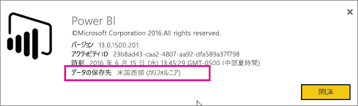
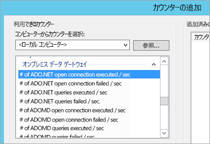
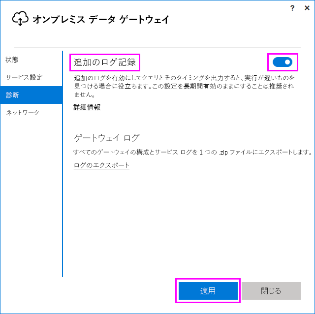
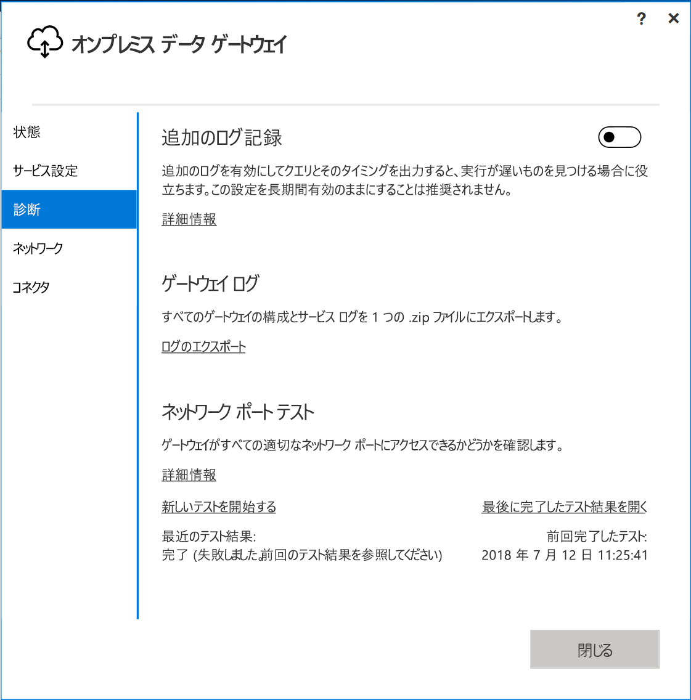
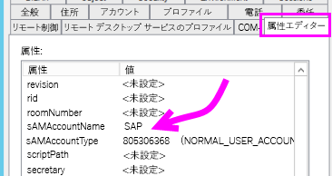
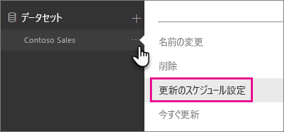

# <a name="troubleshooting-the-on-premises-data-gateway"></a>オンプレミス データ ゲートウェイのトラブルシューティング

この記事では、**オンプレミス データ ゲートウェイ**使用時の一般的な問題について説明します。

<!-- Shared Community & support links Include -->
[!INCLUDE [gateway-onprem-tshoot-support-links-include](./includes/gateway-onprem-tshoot-support-links-include.md)]

<!-- Shared Troubleshooting Install Include -->
[!INCLUDE [gateway-onprem-tshoot-install-include](./includes/gateway-onprem-tshoot-install-include.md)]

## <a name="configuration"></a>構成

### <a name="how-to-restart-the-gateway"></a>ゲートウェイを再起動する方法

ゲートウェイは Windows サービスとして実行するので、いくつかの方法で開始したり停止したりできます。 たとえば、ゲートウェイを実行しているコンピューターで管理者特権を持つコマンド プロンプトを開き、次のいずれかのコマンドを実行できます。

* サービスを停止する場合:

    '''   net stop PBIEgwService   '''

* サービスを開始する場合:

    '''   net start PBIEgwService   '''

### <a name="log-file-configuration"></a>ログ ファイルの構成

ゲートウェイ サービス ログは、情報、エラー、ネットワークという 3 つのバケットに分類されます。 この分類により、より効率的なトラブルシューティングが可能になります。エラーや問題に合わせ、特定の領域に集中的に取り組むことができます。 ゲートウェイ構成ファイルから抜粋した次のスニペットでは、`GatewayInfo.log,GatewayErrors.log,GatewayNetwork.log` という 3 つのカテゴリを確認できます。

```xml
  <system.diagnostics>
    <trace autoflush="true" indentsize="4">
      <listeners>
        <remove name="Default" />
        <add name="ApplicationFileTraceListener"
             type="Microsoft.PowerBI.DataMovement.Pipeline.Common.Diagnostics.RotatableFilesManagerTraceListener, Microsoft.PowerBI.DataMovement.Pipeline.Common"
             initializeData="%LOCALAPPDATA%\Microsoft\On-premises data gateway\,GatewayInfo.log,GatewayErrors.log,GatewayNetwork.log,20,50" />
      </listeners>
    </trace>
  </system.diagnostics>
```

このファイルは既定で *\Program Files\On-premises data gateway\Microsoft.PowerBI.EnterpriseGateway.exe.config* に置かれています。保持するログ ファイルの数を構成するには、最初の数字を変更します。`GatewayInfo.log,GatewayErrors.log,GatewayNetwork.log,20,50` の場合、20 です。

### <a name="error-failed-to-create-a-gateway-try-again"></a>エラー: ゲートウェイを作成できませんでした。 もう一度お試しください

すべての詳細情報を利用できますが、Power BI サービスの呼び出しでエラーが返されました。 エラーとアクティビティ ID が表示されています。 このエラーは、さまざまな理由で発生することがあります。 以下で説明するように、ログを収集して内容を確認し、詳細を調査することができます。

このエラーは、プロキシの構成上の問題によって発生することもあります。 ユーザー インターフェイスからは、プロキシを構成することはできません。 [プロキシ構成の変更](service-gateway-proxy.md)の詳細をご覧ください。

### <a name="error-failed-to-update-gateway-details-please-try-again"></a>エラー: ゲートウェイの詳細を更新できませんでした。 もう一度お試しください

Power BI サービスからの情報がゲートウェイで受信されました。 この情報はローカルの Windows サービスに渡されましたが、必要な値を返すことができませんでした。 あるいは、対称キーの生成に失敗しました。 **[詳細を表示する]** には内部例外が表示されます。 さらに詳細を得るには、以下で説明するように、ログを収集して内容を確認できます。

### <a name="error-power-bi-service-reported-local-gateway-as-unreachable-restart-the-gateway-and-try-again"></a>エラー: Power BI サービスからローカル ゲートウェイが到達不可という報告がありました。 ゲートウェイを再起動してからもう一度お試しください

構成の最後に、Power BI サービスがもう一度呼び出されてゲートウェイが検証されます。 Power BI サービスは、ゲートウェイを *ライブ* 状態として報告しませんでした。 Windows サービスを再起動すると、通信が成功する場合があります。 以下で説明するように、ログを収集して内容を確認し、詳細を調査することができます。

### <a name="script-error-during-sign-into-power-bi"></a>Power BI へのサインイン時のスクリプト エラー

オンプレミス データ ゲートウェイの構成の一部として、Power BI にサインインしたとき、スクリプト エラーが表示される場合があります。 次のセキュリティ更新プログラムをインストールすると、問題は解決します。 これは、Windows Update を介してインストールできます。

[MS16-051: Internet Explorer のセキュリティ更新プログラム: 2016 年 5 月 10 日 (KB 3154070)](https://support.microsoft.com/kb/3154070)

### <a name="gateway-configuration-failed-with-a-null-reference-exception"></a>ゲートウェイの構成が null 参照例外で失敗する

次のようなエラーが発生する場合があります。

        Failed to update gateway details.  Please try again.
        Error updating gateway configuration.

これにはスタック トレースが含まれ、そのスタック トレースには次のメッセージが含まれる場合があります。

        Microsoft.PowerBI.DataMovement.Pipeline.Diagnostics.CouldNotUpdateGatewayConfigurationException: Error updating gateway configuration. ----> System.ArgumentNullException: Value cannot be null.
        Parameter name: serviceSection

古いゲートウェイからアップグレードする場合、構成ファイルを保持します。 欠落しているセクションがある可能性があります。 ゲートウェイがそれを読み取ろうとすると、上記の null 参照例外が発生することがあります。

これを修正するには、次の手順を行います。

1. ゲートウェイをアンインストールします。
2. 次のフォルダーを削除します。

        c:\Program Files\On-premises data gateway
3. ゲートウェイを再インストールします。
4. 必要に応じて、回復キーを適用して既存のゲートウェイを復元します。

### <a name="support-for-tls-1112"></a>TLS 1.1/1.2 のサポート

2017 年 8 月の更新以降、オンプレミス データ ゲートウェイは既定でトランスポート層セキュリティ (TLS) 1.1 または 1.2 を利用して **Power BI サービス**と通信します。 オンプレミス データ ゲートウェイの以前のバージョンは、既定で、TLS 1.0 を使用します。 オンプレミス データ ゲートウェイを引き続き利用するには、そのときまでに 2017 年 8 月公開以降のものにアップグレードする必要があります。

>[!NOTE]
>2017 年 11 月 1 日に TLS 1.0 のサポートが終了しました。

2017 年 11 月 1 日まではオンプレミス データ ゲートウェイは TLS 1.0 に対応しており、フォールバック メカニズムとしてゲートウェイに利用されることにご留意ください。 すべてのゲートウェイ トラフィックで TLS 1.1 または 1.2 が使用されるように (また、ゲートウェイで TLS 1.0 の使用を防止するために)、ゲートウェイ サービスを実行しているコンピューターで次のレジストリ キーを追加または変更する必要があります。

        [HKEY_LOCAL_MACHINE\SOFTWARE\Microsoft\.NETFramework\v4.0.30319]"SchUseStrongCrypto"=dword:00000001
        [HKEY_LOCAL_MACHINE\SOFTWARE\Wow6432Node\Microsoft\.NETFramework\v4.0.30319]"SchUseStrongCrypto"=dword:00000001

> [!NOTE]
> これらのレジストリ キーを追加したり、変更したりすると、すべての .NET アプリケーションに変更が適用されます。 他のアプリケーションの TLS に影響を与えるレジストリ変更については、[トランスポート層セキュリティ (TLS) レジストリ設定](https://docs.microsoft.com/windows-server/security/tls/tls-registry-settings)をご覧ください。

## <a name="data-sources"></a>データ ソース

### <a name="error-unable-to-connect-details-invalid-connection-credentials"></a>エラー: 接続できません。 詳細: "接続の資格情報が正しくありません"

**[詳細を表示する]** には、データ ソースから受信したエラー メッセージが表示されます。 SQL Server の場合、次のように表示されます。

    Login failed for user 'username'.

ユーザー名とパスワードが正しいことを確認します。 また、これらの資格情報を使用してデータ ソースに正常に接続できることを確認します。 使用されているアカウントが、 **[認証方法]** と一致していることを確認してください。

### <a name="error-unable-to-connect-details-cannot-connect-to-the-database"></a>エラー: 接続できません。 詳細: "データベースに接続できません"

サーバーには接続できましたが、指定されたデータベースには接続できませんでした。 データベースの名前を確認し、そのデータベースにアクセスできる適切なアクセス許可がユーザー資格情報に付与されていることを確認します。

**[詳細を表示する]** には、データ ソースから受信したエラー メッセージが表示されます。 SQL Server の場合、次のように表示されます。

    Cannot open database "AdventureWorks" requested by the login. The login failed. Login failed for user 'username'.

### <a name="error-unable-to-connect-details-unknown-error-in-data-gateway"></a>エラー: 接続できません。 詳細: "Unknown error in data gateway" (データ ゲートウェイでの不明なエラー)

このエラーは、さまざまな理由で発生する可能性があります。 ゲートウェイをホストしているコンピューターからデータ ソースに接続できることを必ず確認してください。 サーバーにアクセスできない場合も、このエラーが表示されることがあります。

**[詳細を表示する]** には、**DM_GWPipeline_UnknownError** のエラー コードが表示されます。

また、[イベント ログ]、**[アプリケーションとサービス ログ]** > **[On-premises Data Gateway Service]\(オンプレミス データ ゲートウェイ サービス\)** で、詳細を確認することができます。

### <a name="error-we-encountered-an-error-while-trying-to-connect-to-server-details-we-reached-the-data-gateway-but-the-gateway-cant-access-the-on-premises-data-source"></a>エラー: <server> に接続しようとしているときにエラーが発生しました。 詳細: "data gateway に到達しましたが、ゲートウェイがオンプレミスのデータ ソースにアクセスできません。"

指定したデータ ソースに接続できませんでした。 そのデータ ソースについて提供された情報を検証してください。

**[詳細を表示する]** には、**DM_GWPipeline_Gateway_DataSourceAccessError** のエラー コードが表示されます。

基になっているエラー メッセージが次のような場合は、データ ソースに対して使用しているアカウントがその Analysis Services インスタンスのサーバー管理者ではないことを意味しています。 [詳細情報](https://docs.microsoft.com/sql/analysis-services/instances/grant-server-admin-rights-to-an-analysis-services-instance)

    The 'CONTOSO\account' value of the 'EffectiveUserName' XML for Analysis property is not valid.

基になっているエラー メッセージが次のような場合は、Analysis Services のサービス アカウントに [token-groups-global-and-universal](https://msdn.microsoft.com/library/windows/desktop/ms680300.aspx) (TGGAU) ディレクトリ属性がない可能性があります。

    The username or password is incorrect.

Windows 2000 以前と互換性のあるアクセス権を持つドメインでは TGGAU 属性は有効になります。 ただし、最近作成されたドメインではこの属性が既定で有効になりません。 詳細については、[こちら](https://support.microsoft.com/kb/331951)を参照してください。

これは、以下のようにして確認できます。

1. SQL Server Management Studio 内の Analysis Services マシンに接続します。 詳細接続プロパティ内に、該当するユーザーの EffectiveUserName を含め、エラーが再現するかどうかを確認します。
2. dsacls Active Directory ツールを使用すれば、属性がリストされるかどうかを確認できます。 このツールはドメイン コントローラーにあります。 アカウントのドメインの識別名を確認し、ツールに渡す必要があります。

        dsacls "CN=John Doe,CN=UserAccounts,DC=contoso,DC=com"

    結果は次のようになります。

            Allow BUILTIN\Windows Authorization Access Group
                                          SPECIAL ACCESS for tokenGroupsGlobalAndUniversal
                                          READ PROPERTY

この問題を修正するには、Analysis Services Windows サービスで使用するアカウントで TGGAU を有効にする必要があります。

#### <a name="another-possibility-for-username-or-password-incorrect"></a>ユーザー名またはパスワードが間違っている可能性もある

Analysis Service サーバーがユーザーとは異なるドメインにあり、双方向の信頼が確立されていない場合にも、このエラーが発生することがあります。

ドメイン管理者と協力して、ドメイン間の信頼関係を確認する必要があります。

#### <a name="unable-to-see-the-data-gateway-data-sources-in-the-get-data-experience-for-analysis-services-from-the-power-bi-service"></a>Power BI サービスの Analysis Services の [データの取得] エクスペリエンスで、データ ゲートウェイのデータ ソースが表示されない

ゲートウェイ構成内のデータ ソースの **[ユーザー]** タブに、自分のアカウントが表示されていることを確認します。 ゲートウェイへのアクセス権がない場合は、ゲートウェイの管理者に連絡して確認を依頼してください。 **[ユーザー]** の一覧にあるアカウントのみが、Analysis Services の一覧にあるデータ ソースを参照できます。

### <a name="error-you-dont-have-any-gateway-installed-or-configured-for-the-data-sources-in-this-dataset"></a>エラー: このデータセットのデータ ソースにゲートウェイがインストールされていないか、構成されていません

「[データ ソースの追加](service-gateway-manage.md#add-a-data-source)」の説明に従って、ゲートウェイに 1 つまたは複数のデータ ソースを追加しておきます。 管理ポータルの **[ゲートウェイの管理]** にゲートウェイが表示されない場合は、ブラウザーのキャッシュをクリアするか、サービスからサインアウトして再度サインインしてみてください。

## <a name="datasets"></a>データセット

### <a name="error-there-is-not-enough-space-for-this-row"></a>エラー: この行に十分な領域がありません

このエラーは、1 つのサイズが 4 MB を超える行がある場合に発生します。 データ ソースから行を特定し、その行をフィルターで除外するか、その行のサイズを減らす必要があります。

### <a name="error-the-server-name-provided-doesnt-match-the-server-name-on-the-sql-server-ssl-certificate"></a>エラー: 指定されたサーバー名が、SQL Server SSL 証明書のサーバー名と一致しません

このエラーは、証明書の CN がサーバーの完全修飾ドメイン名 (FQDN) に対するものであるときに、サーバーの NetBIOS 名だけを指定すると発生します。 これにより、証明書の不一致が発生します。 この問題を解決するには、ゲートウェイのデータ ソースおよび PBIX ファイルのサーバー名で、サーバーの FQDN を使うようにする必要があります。

### <a name="i-dont-see-the-on-premises-data-gateway-present-when-configuring-scheduled-refresh"></a>スケジュールされた更新を構成するときに、オンプレミス データ ゲートウェイが表示されない

原因としてはさまざまなシナリオが考えられます。

1. サーバーおよびデータベース名が、Power BI Desktop で入力されたものと、ゲートウェイに対して構成されているデータの間で、一致していません。 これらは同じ値である必要があります。 大文字と小文字は区別されません。
2. ゲートウェイ構成内のデータ ソースの **[ユーザー]** タブに、自分のアカウントが表示されていません。 ゲートウェイの管理者に依頼して、そのリストに追加してもらう必要があります。
3. Power BI Desktop ファイルに複数のデータ ソースがあり、ゲートウェイですべてのデータ ソースが構成されていません。 スケジュールされている更新にゲートウェイを表示させるには、ゲートウェイで各データ ソースを定義する必要があります。

### <a name="error-the-received-uncompressed-data-on-the-gateway-client-has-exceeded-the-limit"></a>エラー: ゲートウェイ クライアントで受信した非圧縮データが制限を超えています

テーブルごとの非圧縮データの上限は 10 GB です。 この問題か発生した場合、最適化してこの問題を回避することができる適切な選択肢があります。 特に、不変性が高く長い文字列値の使用を減らし、代わりに正規化されたキーを使用するか、(使用されていない列の場合は) 列を削除する方法があります。

## <a name="reports"></a>レポート

### <a name="report-could-not-access-the-data-source-because-you-do-not-have-access-to-our-data-source-via-an-on-premises-data-gateway"></a>オンプレミス データ ゲートウェイ経由でデータ ソースにアクセスする権限がないため、レポートからデータ ソースにアクセスできない

これは通常、次のいずれかの原因によって発生します。

1. データ ソースの情報が、基になるデータセットの情報と一致しません。 オンプレミス データ ゲートウェイ用に定義されているデータ ソースと Power BI Desktop で指定するものとの間では、サーバーとデータベース名が一致している必要があります。 Power BI Desktop で IP アドレスを使用する場合は、オンプレミス データ ゲートウェイ用のデータ ソースでも IP アドレスを使用する必要があります。
2. 組織内のゲートウェイには、使用可能なデータ ソースがありません。 新規または既存のオンプレミス データ ゲートウェイでデータ ソースを構成できます。

### <a name="error-data-source-access-error-please-contact-the-gateway-administrator"></a>エラー: データ ソースのアクセス エラー。 ゲートウェイの管理者にお問い合わせください

このレポートで Analysis Services ライブ接続を使用している場合、有効でないか、Analysis Services コンピューターへのアクセス許可のない EffectiveUserName に渡される値に関する問題が発生することがあります。 通常、認証の問題は、EffectiveUserName に渡される値がローカルのユーザー プリンシパル名 (UPN) と一致していない場合に発生します。

これは、次の操作を行って確認できます。

1. [ゲートウェイ ログ](#logs)内で有効なユーザー名を見つけます。
2. 値が渡されたら、それが正しいことを確認します。 自分のユーザーの場合は、コマンド プロンプトから次のコマンドを使用して、UPN を確認できます。 UPN は電子メール アドレスのような形式です。

        whoami /upn

必要に応じて、Azure Active Directory から Power BI が取得した内容を確認できます。

1. [https://developer.microsoft.com/graph/graph-explorer](https://developer.microsoft.com/graph/graph-explorer) にアクセスします。
2. 右上の **[サインイン]** を選択します。
3. 次のクエリを実行します。 かなり大きな JSON 応答が表示されます。

        https://graph.windows.net/me?api-version=1.5
4. **userPrincipalName** を探します。

Azure Active Directory UPN がローカルの Active Directory UPN と一致しない場合は、[[ユーザー名のマップ]](service-gateway-enterprise-manage-ssas.md#map-user-names) 機能を使用して、有効な値に置き換えることができます。 あるいは、テナント管理者、またはローカルの Active Directory 管理者と協力して、UPN を変更することができます。

<!-- Shared Troubleshooting Firewall/Proxy Include -->
[!INCLUDE [gateway-onprem-tshoot-firewall-include](./includes/gateway-onprem-tshoot-firewall-include.md)]

データ センターの地域は、次の手順を実行して見つけることができます。

1. **[?]** ( Power BI サービスの右上にあります) を選択します。
2. **[About Power BI]** (Power BI のバージョン情報) を選択します。
3. **[データの保存先]** にデータの地域がリストされます。

    

それでも見つからない場合は、[fiddler](#fiddler) または netsh などのツールを使用してネットワーク トレースの取得を試みることができます。ただし、この方法は高度な収集方法であるため、収集したデータの分析に支援が必要になる場合があります。 支援が必要な場合は、[サポート](https://support.microsoft.com)にお問い合わせください。

## <a name="performance"></a>パフォーマンス

<iframe width="560" height="315" src="https://www.youtube.com/embed/IJ_DJ30VNk4?showinfo=0" frameborder="0" allowfullscreen></iframe>

### <a name="performance-counters"></a>パフォーマンス カウンター

ゲートウェイのアクティビティを計測するために使用できるパフォーマンス カウンターがいくつかあります。 大量のアクティビティが存在するため、新しいゲートウェイを用意する必要があるかどうかを判断するのに役立つことがあります。 アクティビティに必要な時間は反映されません。

カウンターには Windows パフォーマンス モニター ツールからアクセスできます。



カウンターには一般的なグループがあります。

| カウンターの種類 | 説明 |
| --- | --- |
| ADO.NET |DirectQuery 接続に使用されます。 |
| ADOMD |Analysis Services 2014 以前に使用されます。 |
| OLEDB |特定のデータ ソースでこれが使用されます。 これには SAP HANA と Analysis Service 2016 以降が含まれます。 |
| Mashup |これにはあらゆるインポートされたデータ ソースが含まれます。 更新を予定している場合、またはオンデマンドの更新を実行している場合、マッシュアップ エンジンが利用されます。 |

利用できるパフォーマンス カウンターの一覧は次のとおりです。

| カウンター | 説明 |
| --- | --- |
| # of ADO.NET open connection executed / sec |1 秒間に実行された ADO.NET オープン接続アクションの数 (成功または失敗)。 |
| # of ADO.NET open connection failed / sec |1 秒間に実行された ADO.NET オープン接続アクションの数 (失敗)。 |
| # of ADO.NET queries executed / sec |1 秒間に実行された ADO.NET クエリの数 (成功または失敗)。 |
| # of ADO.NET queries failed / sec |1 秒間に実行された ADO.NET クエリの数 (失敗)。 |
| # of ADOMD open connection executed / sec |1 秒間に実行された ADOMD オープン接続の数 (成功または失敗)。 |
| # of ADOMD open connection failed / sec |1 秒間に実行された ADOMD オープン接続アクションの数 (失敗)。 |
| # of ADOMD queries executed / sec |1 秒間に実行された ADOMD クエリの数 (成功または失敗)。 |
| # of ADOMD queries failed / sec |1 秒間に実行された ADOMD クエリの数 (失敗)。 |
| # of all open connection executed / sec |1 秒間に実行されたオープン接続の数 (成功または失敗)。 |
| # of all open connection failed / sec |1 秒間に実行されたオープン接続アクションの数 (失敗)。 |
| # of all queries executed / sec |1 秒間に実行されたクエリの数 (成功または失敗)。 |
| # of items in the ADO.NET connection pool |ADO.NET 接続プールのアイテムの数 |
| # of items in the OLEDB connection pool |OLEDB 接続プールのアイテムの数 |
| # of items in the Service Bus pool |Service Bus プールのアイテムの数 |
| # of Mashup open connection executed / sec |1 秒間に実行された Mashup オープン接続アクションの数 (成功または失敗)。 |
| # of Mashup open connection failed / sec |1 秒間に実行された Mashup オープン接続アクションの数 (失敗)。 |
| # of Mashup queries executed / sec |1 秒間に実行された Mashup クエリの数 (成功または失敗)。 |
| # of Mashup queries failed / sec |1 秒間に実行された Mashup クエリの数 (失敗)。 |
| # of OLEDB multiple result set queries failed / sec |1 秒間に実行された OLEDB クエリの複数結果セットの数 (失敗)。 |
| # of OLEDB multiple result sets of queries executed / sec |1 秒間に実行された OLEDB クエリの複数結果セットの数 (成功または失敗)。 |
| # of OLEDB open connection executed / sec |1 秒間に実行された OLEDB オープン接続アクションの数 (成功または失敗)。 |
| # of OLEDB open connection failed / sec |1 秒間に実行された OLEDB オープン接続アクションの数 (失敗)。 |
| # of OLEDB queries executed / sec |1 秒間に実行された OLEDB クエリの複数結果セットの数 (成功または失敗)。 |
| # of OLEDB queries failed / sec |1 秒間に実行された OLEDB クエリの複数結果セットの数 (失敗)。 |
| # of OLEDB single result set queries executed / sec |1 秒間に実行された OLEDB クエリの単一結果セットの数 (成功または失敗)。 |
| # of queries failed / sec |1 秒間に実行されたクエリの数 (失敗)。 |
| # of single result set OLEDB queries failed / sec |1 秒間に実行された OLEDB クエリの単一結果セットの数 (失敗)。 |

## <a name="reviewing-slow-performing-queries"></a>実行速度の遅いクエリを確認する

ゲートウェイを介した応答が遅いことがあります。 DirectQuery クエリの場合や、インポートされたデータセットを更新する場合などです。 追加のログを有効にしてクエリとそのタイミングを出力すると、実行が遅いものを見つける場合に役立ちます。 実行時間の長いクエリが見つかったとき、クエリのパフォーマンスを調整するために、データ ソースの追加の修正が必要になることがあります。 たとえば、SQL Server クエリのインデックスの調整などです。

クエリの時間を判断するには、2 つの設定ファイルを修正する必要があります。

### <a name="microsoftpowerbidatamovementpipelinegatewaycoredllconfig"></a>Microsoft.PowerBI.DataMovement.Pipeline.GatewayCore.dll.config

*Microsoft.PowerBI.DataMovement.Pipeline.GatewayCore.dll.config* ファイル内で `EmitQueryTraces` 値を `False` から `True` に変更します。 このファイルは、既定では *C:\Program Files\On-premises data gateway* にあります。 `EmitQueryTraces` を有効にすると、ゲートウェイからデータ ソースに送信されるクエリがログに記録されます。

> [!IMPORTANT]
> EmitQueryTraces を有効にすると、ゲートウェイの使用状況によっては、ログのサイズが大幅に増える可能性があります。 ログの確認が終了した後は、場合によっては、EmitQueryTraces を False に設定する必要があります。 この設定を長期間有効のままにすることは推奨されません。

```
<setting name="EmitQueryTraces" serializeAs="String">
    <value>True</value>
</setting>
```

**クエリ エントリの例**

```
DM.EnterpriseGateway Information: 0 : 2016-09-15T16:09:27.2664967Z DM.EnterpriseGateway    4af2c279-1f91-4c33-ae5e-b3c863946c41    d1c77e9e-3858-4b21-3e62-1b6eaf28b176    MGEQ    c32f15e3-699c-4360-9e61-2cc03e8c8f4c    FF59BC20 [DM.GatewayCore] Executing query (timeout=224) "<pi>
SELECT
TOP (1000001) [t0].[ProductCategoryName],[t0].[FiscalYear],SUM([t0].[Amount])
 AS [a0]
FROM
(
(select [$Table].[ProductCategoryName] as [ProductCategoryName],
    [$Table].[ProductSubcategory] as [ProductSubcategory],
    [$Table].[Product] as [Product],
    [$Table].[CustomerKey] as [CustomerKey],
    [$Table].[Region] as [Region],
    [$Table].[Age] as [Age],
    [$Table].[IncomeGroup] as [IncomeGroup],
    [$Table].[CalendarYear] as [CalendarYear],
    [$Table].[FiscalYear] as [FiscalYear],
    [$Table].[Month] as [Month],
    [$Table].[OrderNumber] as [OrderNumber],
    [$Table].[LineNumber] as [LineNumber],
    [$Table].[Quantity] as [Quantity],
    [$Table].[Amount] as [Amount]
from [dbo].[V_CustomerOrders] as [$Table])
)
 AS [t0]
GROUP BY [t0].[ProductCategoryName],[t0].[FiscalYear] </pi>"
```

### <a name="microsoftpowerbidatamovementpipelinediagnosticsdllconfig"></a>Microsoft.PowerBI.DataMovement.Pipeline.Diagnostics.dll.config

*Microsoft.PowerBI.DataMovement.Pipeline.Diagnostics.dll.config* ファイル内で `TracingVerbosity` 値を `4` から `5` に変更します。 このファイルは、既定では *C:\Program Files\On-premises data gateway* にあります。 この設定を変更すると、詳細なエントリがゲートウェイ ログに記録されます。 期間を示すエントリが含まれます。 オンプレミス ゲートウェイ アプリケーションの [追加ログ] ボタンを有効にして、エントリの詳細表示を有効にすることもできます。

   

> [!IMPORTANT]
> `5` に対して TracingVerbosity を有効にすると、ゲートウェイの使用状況によっては、ログのサイズが大幅に増える可能性があります。 ログの確認が終了した後は、TraceVerbosity を `4` に設定する必要があります。 この設定を長期間有効のままにすることは推奨されません。

```
<setting name="TracingVerbosity" serializeAs="String">
    <value>5</value>
</setting>
```

<a name="activities"></a>

### <a name="activity-types"></a>アクティビティの種類

| アクティビティの種類 | 説明 |
| --- | --- |
| MGEQ |ADO.NET で実行されたクエリ。 DirectQuery データ ソースが含まれます。 |
| MGEO |OLEDB で実行されたクエリ。 これには SAP HANA と Analysis Services 2016 が含まれます。 |
| MGEM |マッシュアップ エンジンから実行されたクエリ。 スケジュールされている更新、またはオンデマンドの更新を使用しているインポートされたデータセットで使用されます。 |

### <a name="determine-the-duration-of-a-query"></a>クエリの時間を判断する
データ ソースのクエリにかかった時間は次の方法で判断できます。

1. ゲートウェイ ログを開きます。
2. [アクティビティの種類](#activities)を探し、クエリを見つけます。 この例では、MGEQ になります。
3. 2 つ目の GUID をメモします。これが要求 ID です。
4. FireActivityCompletedSuccessfullyEvent エントリと時間が見つかるまで MGEQ をさらに探します。 エントリに同じ要求 ID があることを確認できます。実行時間の単位はミリ秒です。

        DM.EnterpriseGateway Verbose: 0 : 2016-09-26T23:08:56.7940067Z DM.EnterpriseGateway    baf40f21-2eb4-4af1-9c59-0950ef11ec4a    5f99f566-106d-c8ac-c864-c0808c41a606    MGEQ    21f96cc4-7496-bfdd-748c-b4915cb4b70c    B8DFCF12 [DM.Pipeline.Common.TracingTelemetryService] Event: FireActivityCompletedSuccessfullyEvent (duration=5004)

   > [!NOTE]
   > FireActivityCompletedSuccessfullyEvent は詳細エントリです。 TraceVerbosity のレベルが 5 でなければ、このエントリはログに記録されません。

## <a name="firewall-or-proxy"></a>ファイアウォールまたはプロキシ

ゲートウェイのプロキシ情報の指定については、「[Power BI Gateway のプロキシ設定を構成する](service-gateway-proxy.md)」を参照してください。

PowerShell プロンプトから [Test-NetConnection](https://docs.microsoft.com/powershell/module/nettcpip/test-netconnection) を実行して、ファイアウォールまたはプロキシが接続をブロックしている可能性があるかどうかをテストできます。 これにより、Azure Service Bus への接続がテストされます。 これはネットワーク接続のみをテストし、クラウド サーバー サービスやゲートウェイとはまったく関係ありません。 コンピューターが実際にインターネットに接続できるかどうかを確認するのに役立ちます。

    Test-NetConnection -ComputerName watchdog.servicebus.windows.net -Port 9350

> [!NOTE]
> Test-NetConnection を使用できるのは、Windows Server 2012 R2 以降だけです。 Windows 8.1 以降でも使用できます。 これらより前のバージョンの OS では、Telnet を使ってポートの接続をテストできます。

結果は次のようになります。 違いは TcpTestSucceeded にあります。 **TcpTestSucceeded** が *true* でない場合、ファイアウォールによってブロックされています。

    ComputerName           : watchdog.servicebus.windows.net
    RemoteAddress          : 70.37.104.240
    RemotePort             : 5672
    InterfaceAlias         : vEthernet (Broadcom NetXtreme Gigabit Ethernet - Virtual Switch)
    SourceAddress          : 10.120.60.105
    PingSucceeded          : False
    PingReplyDetails (RTT) : 0 ms
    TcpTestSucceeded       : True

すべてを網羅するには、**ComputerName** と **Port** の値を、「[ポート](https://docs.microsoft.com/power-bi/service-gateway-onprem#ports)」に記載されている値に置き換えます。

ファイアウォールが Azure Service Bus から Azure データ センターへの接続をブロックしている場合もあります。 そのような場合には、お住まいの地域のデータ センターの IP アドレスをホワイトリストに指定 (ブロック解除) します。 Azure IP アドレスのリストは[こちら](https://www.microsoft.com/download/details.aspx?id=41653)で取得できます。

### <a name="network-ports-test"></a>ネットワーク ポート テスト

ネットワーク ポート テストは、データを転送するためにゲートウェイで要求されるすべてのリモート サーバーについて、お使いのゲートウェイで正しいポートにアクセスできるかどうかを確認するためのツールです。 ネットワーク ポート テストでどのポートにも接続できない場合、お使いのゲートウェイにはネットワークに問題が発生している可能性があります。 現在、お使いのゲートウェイにネットワークの問題がある場合、ネットワーク ポート テストを実行し、ネットワーク環境が最適であることを確認します。  

#### <a name="start-a-new-test"></a>新しいテストを開始する

オンプレミス データ ゲートウェイのユーザー インターフェイスで新しいネットワーク ポート テストを実行します。


ネットワーク ポート テストを実行するとき、お使いのゲートウェイでは Azure Service Bus からポートとサーバーの一覧を取得し、すべてのサーバーとポートに接続を試行します。 [新しいテストを開始する] リンクが再び表示されたとき、ネットワーク ポート テストは実行を完了しています。  

#### <a name="test-results"></a>テスト結果

テストの概要は [新しいテストを開始する] の下に [最近のテスト結果] として表示されます。 結果は成功で完了か、失敗で完了になります。失敗の場合、最後のテスト結果を見るように指示されます。 テストに成功した場合、お使いのゲートウェイは必要なすべてのポートに正常に接続されます。 テストに失敗した場合、お使いのネットワーク環境では、必要なポートやサーバーがブロックされている可能性があります。 



前回完了したテストの結果を表示するには、以下に示す [最後に完了したテスト結果を開く] リンクを選択します。 テスト結果は Windows の既定のテキスト エディターで開きます。  

テスト結果には、お使いのゲートウェイで必要とされるすべてのサーバー、ポート、IP アドレスが一覧表示されます。 テスト結果で以下に示すようにいずれかのポートに [閉じています] が表示される場合、お使いのネットワーク環境で接続がブロックされていないことを確認してください。 場合によっては、必要なポートを開くようにネットワーク管理者に依頼する必要があります。


## <a name="kerberos"></a>Kerberos

基になるデータベース サーバーとオンプレミス データ ゲートウェイが [Kerberos の制約付き委任](service-gateway-sso-kerberos.md)用に適切に構成されていない場合は、ゲートウェイで[詳細なログ](#microsoftpowerbidatamovementpipelinediagnosticsdllconfig)を有効にし、トラブルシューティングの出発点としてゲートウェイのログ ファイルのエラー/トレースに基づいて調査します。

### <a name="impersonationlevel"></a>ImpersonationLevel

ImpersonationLevel は、SPN の設定またはローカル ポリシーの設定に関連しています。

```
[DataMovement.PipeLine.GatewayDataAccess] About to impersonate user DOMAIN\User (IsAuthenticated: True, ImpersonationLevel: Identification)
```

**解決方法**

問題を解決するには、次の手順を実行します。
1. オンプレミス ゲートウェイ用に SPN を設定します
2. Active Directory (AD) で制約付きの委任を設定します

### <a name="failedtoimpersonateuserexception-failed-to-create-windows-identity-for-user-userid"></a>FailedToImpersonateUserException: ユーザーの userid の Windows ID を作成できませんでした

FailedToImpersonateUserException は、別のユーザーを偽装できない場合に発生します。 この問題は、偽装しようとしているアカウントが、ゲートウェイ サービス ドメインとは別のドメインのアカウントの場合にも発生する可能性があります (これは制限です)。

**解決方法**

* 前述の ImpersonationLevel に関するセクションの手順に従って構成が正しいことを確認します
* 偽装しようとしている userid が有効な AD アカウントであることを確認します

### <a name="general-error-1033-error-while-parsing-the-protocol"></a>一般的なエラー: プロトコルの解析中の 1033 エラー

ユーザーが UPN (alias@domain.com) を使用して偽装されていると、SAP HANA で構成された外部 ID がログインと一致しない場合に 1033 エラーが発生します。 ログには、次のように "Original UPN 'alias@domain.com' replaced with a new UPN 'alias@domain.com' at the top of the error logs as seen below" と表示されます。

```
[DM.GatewayCore] SingleSignOn Required. Original UPN 'alias@domain.com' replaced with new UPN 'alias@domain.com.'
```

**解決方法**

* SAP HANA では、偽装されるユーザーが AD (ユーザー エイリアス) で sAMAccountName 属性を使用する必要があります。 これが正しくない場合は、1033 エラーが表示されます。

    

* ログには、UPN ではなく sAMAccountName (エイリアス) が表示されます。このエイリアスの後にドメイン (alias@doimain.com) が続きます。

    

```
      <setting name="ADUserNameReplacementProperty" serializeAs="String">
        <value>sAMAccount</value>
      </setting>
      <setting name="ADServerPath" serializeAs="String">
        <value />
      </setting>
      <setting name="CustomASDataSource" serializeAs="String">
        <value />
      </setting>
      <setting name="ADUserNameLookupProperty" serializeAs="String">
        <value>AADEmail</value>
```

### <a name="sap-aglibodbchdb-dllhdbodbc-communication-link-failure-10709-connection-failed-rte-1-kerberos-error-major-miscellaneous-failure-851968-minor-no-credentials-are-available-in-the-security-package"></a>[SAP AG][LIBODBCHDB DLL][HDBODBC] Communication link failure;-10709 Connection failed (RTE:[-1] Kerberos エラー。 メジャー: "Miscellaneous failure [851968]"、マイナー: "No credentials are available in the security package"

AD で委任が正しく構成されていない場合は、-10709 Connection failed エラー メッセージが表示されます。

**解決方法**

* AD のゲートウェイ サービス アカウントの [委任] タブに SAP Hana サーバーがあることを確認します

   ![[委任] タブ](media/service-gateway-onprem-tshoot/delegation-in-AD.png)

<!-- Shared Troubleshooting tools Include -->
[!INCLUDE [gateway-onprem-tshoot-tools-include](./includes/gateway-onprem-tshoot-tools-include.md)]

### <a name="refresh-history"></a>更新履歴

スケジュールされた更新にゲートウェイを使用している場合、**更新履歴**が発生したエラーを確認するのに役に立つことがあります。サポート要求を作成する必要がある場合は有用なデータを提供します。 スケジュールされた更新のほか、オンデマンドの更新も表示できます。 **更新履歴**を取得する方法を次に示します。

1. Power BI ナビゲーション ウィンドウの **[データセット]** で、データセットを選択してから、&gt;[メニューを開く] &gt; **[更新のスケジュール設定]** を選択します。

    
2. **[設定]**&gt; **[更新のスケジュール設定]** で、**[更新履歴]** を選択します。

    

    

更新に関するトラブルシューティングのシナリオの詳細については、「[更新に関するトラブルシューティング シナリオ](refresh-troubleshooting-refresh-scenarios.md)」を参照してください。

## <a name="next-steps"></a>次の手順
[Power BI Gateway のプロキシ設定を構成する](service-gateway-proxy.md)  
[オンプレミス データ ゲートウェイ](service-gateway-onprem.md)  
[オンプレミス データ ゲートウェイの詳細](service-gateway-onprem-indepth.md)  
[データ ソースの管理 - Analysis Services](service-gateway-enterprise-manage-ssas.md)  
[データ ソースの管理 - SAP HANA](service-gateway-enterprise-manage-sap.md)  
[データ ソースの管理 - SQL Server](service-gateway-enterprise-manage-sql.md)  
[データ ソースの管理 - インポート/スケジュールされた更新](service-gateway-enterprise-manage-scheduled-refresh.md)  
他にわからないことがある場合は、 [Power BI コミュニティを利用してください](http://community.powerbi.com/)。
