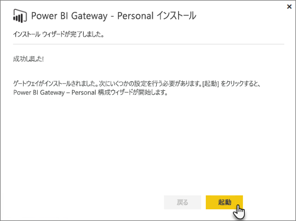
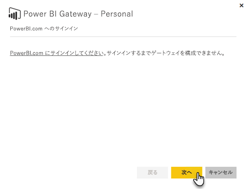
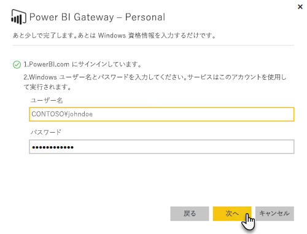

# オンプレミス データ ゲートウェイ
オンプレミス データ ゲートウェイはブリッジとして機能します。オンプレミス データ (クラウドにないデータ) と Power BI、Microsoft Flow、Logic Apps、PowerApps サービスの間で迅速かつ安全にデータを転送します。

1 つのゲートウェイを複数のサービスで同時に使用できます。 PowerApps と共に Power BI を使用している場合、1 つのゲートウェイを両方に使用できます。 サインインに使用したアカウントによって決まります。

> [!NOTE]
> オンプレミス データ ゲートウェイは、すべてのモードでデータ圧縮およびトランスポートの暗号化を実行します。
> 
> 

<!-- Shared Requirements Include -->
[!INCLUDE [gateway-onprem-requirements-include](./includes/gateway-onprem-requirements-include.md)]

### Analysis Services のライブ接続の制限事項
表形式または多次元インスタンスに対してライブ接続を使用することはできません。

| **サーバーのバージョン** | **必要な SKU** |
| --- | --- |
| 2012 SP1 CU4 以降 |Business Intelligence と Enterprise SKU |
| 2014 |Business Intelligence と Enterprise SKU |
| 2016 |Standard SKU 以上 |

* セル レベルの書式設定および変換機能はサポートされていません。
* アクションおよび名前付きセットは Power BI には公開されませんが、アクションまたは名前付きセットも含む多次元キューブに接続し、ビジュアルおよびレポートを作成することはできます。

<!-- Shared Install steps Include -->
[!INCLUDE [gateway-onprem-datasources-include](./includes/gateway-onprem-datasources-include.md)]

## オンプレミス データ ゲートウェイをダウンロードし、インストールする
ゲートウェイをダウンロードするには、[ダウンロード] メニューで **[データ ゲートウェイ]** を選択します。 [オンプレミス データ ゲートウェイ](http://go.microsoft.com/fwlink/?LinkID=820925)をダウンロードします。

<!-- Shared Install steps Include -->
[!INCLUDE [gateway-onprem-install-include](./includes/gateway-onprem-install-include.md)]

## 個人モードでゲートウェイをインストールする
> [!NOTE]
> Personal は Power BI でのみ機能します。
> 
> 

Personal Gateway をインストールしたら、**Power BI Gateway - Personal 構成ウィザード**を起動する必要があります。

Power BI にサインインし、クラウド サービスにゲートウェイを登録する必要があります。

また、Windows サービスを実行するユーザー名とパスワードを入力する必要があります。 自分の Windows アカウントとは別のアカウントを指定できます。 このアカウントを使用して、ゲートウェイ サービスが実行されます。

インストールの完了後、Power BI 内のデータセットに移動し、オンプレミス データ ソースの資格情報を入力する必要があります。

## 暗号化された資格情報をクラウドに格納する
データ ソースをゲートウェイに追加する場合は、そのデータ ソースの資格情報を指定する必要があります。 データ ソースへのすべてのクエリは、これらの資格情報を使用して実行されます。 資格情報は、クラウド内で解読されないように、クラウドに格納される前に非対称暗号化を使用して安全に暗号化されます。 資格情報は、データ ソースにアクセスするときに、ゲートウェイを実行しているオンプレミスのコンピューターに送信されて暗号化が解除されます。

<!-- Account and Port information -->
[!INCLUDE [gateway-onprem-accounts-ports-more](./includes/gateway-onprem-accounts-ports-more.md)]

<!-- How the gateway works -->
[!INCLUDE [gateway-onprem-how-it-works-include](./includes/gateway-onprem-how-it-works-include.md)]

## トラブルシューティング
ゲートウェイをインストールおよび構成するときに問題が発生する場合は、「[オンプレミス データ ゲートウェイのトラブルシューティング](service-gateway-onprem-tshoot.md)」をご覧ください。 ファイアウォールで問題が発生していると思われる場合は、トラブルシューティング記事の[ファイアウォールまたはプロキシ](service-gateway-onprem-tshoot.md#firewall-or-proxy)に関するセクションを参照してください。

ゲートウェイでプロキシの問題が発生していると思われる場合は、「[Power BI Gateway のプロキシ設定を構成する](service-gateway-proxy.md)」をご覧ください。

## 次の手順
[データ ソースの管理 - Analysis Services](service-gateway-enterprise-manage-ssas.md)  
[データ ソースの管理 - SAP HANA](service-gateway-enterprise-manage-sap.md)  
[データ ソースの管理 - SQL Server](service-gateway-enterprise-manage-sql.md)  
[データ ソースの管理 - Oracle](service-gateway-onprem-manage-oracle.md)  
[データ ソースの管理 - インポート/スケジュールされた更新](service-gateway-enterprise-manage-scheduled-refresh.md)  
[オンプレミス データ ゲートウェイの詳細](service-gateway-onprem-indepth.md)  
[オンプレミス データ ゲートウェイ (個人用モード) - 新しいバージョンのパーソナル ゲートウェイ](service-gateway-personal-mode.md)
[オンプレミス データ ゲートウェイのプロキシ設定を構成する](service-gateway-proxy.md)  
他にわからないことがある場合は、 [Power BI コミュニティを利用してください](http://community.powerbi.com/)。

