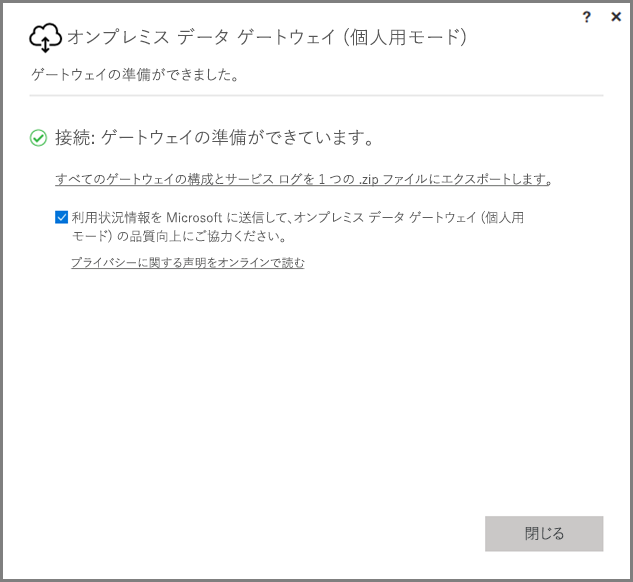
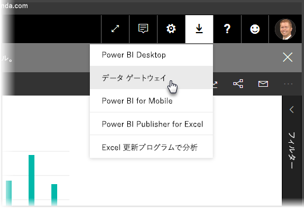
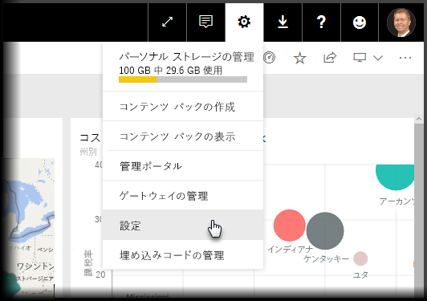
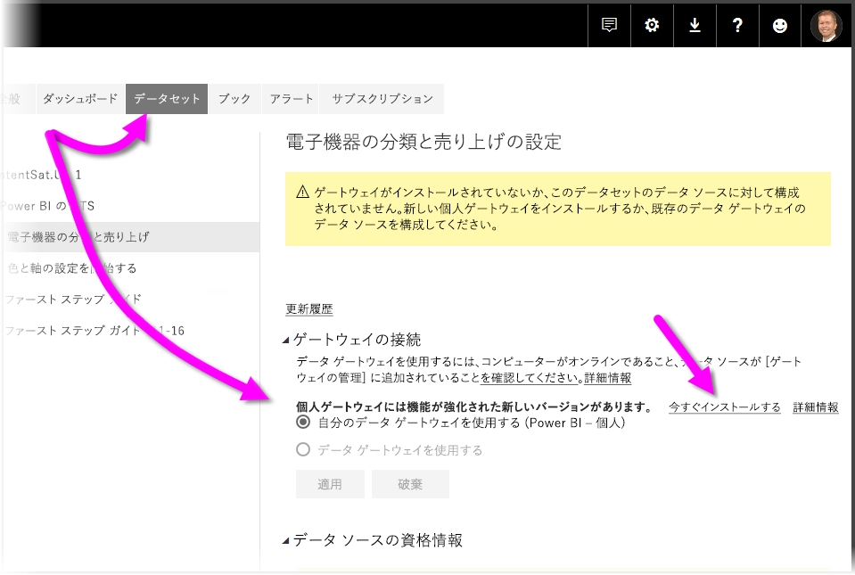
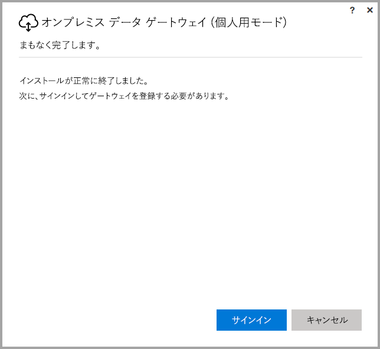
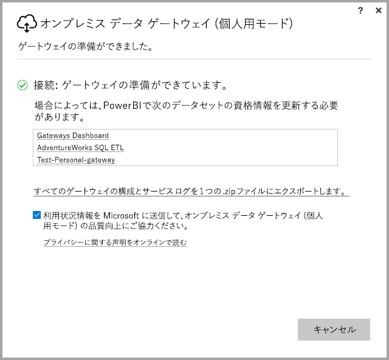

# <a name="on-premises-data-gateway-personal-mode"></a>オンプレミス データ ゲートウェイ (個人用モード)
ゲートウェイを利用し、オンプレミス データ ソースを使用したり、Power BI のレポートやダッシュボードを作成したりできます。 **ゲートウェイ**は、プライベートのオンプレミス ネットワークに保存されているデータへのアクセスを促進し、**Power BI サービス**など、オンライン サービスでそのデータを使用することを可能にするソフトウェアです。 **オンプレミス データ ゲートウェイ (個人用モード)** は最近公開された、Power BI ゲートウェイの更新プログラムであり、個人が自分のコンピューターにゲートウェイをインストールし、オンプレミス データにアクセスすることを可能にします。



> [!NOTE]
> **オンプレミス データ ゲートウェイ (個人用モード)** は、以前にサポートされていた、**Power BI Gateway - Personal** という名称のバージョンの個人ゲートウェイに取って代わるものです。 以前の個人ゲートウェイは 2017 年 7 月 31 日まで動作します。 新しいバージョンに更新する方法については、下のセクションをご覧ください。
> 
> 

## <a name="features-of-the-on-premises-data-gateway-personal-mode"></a>オンプレミス データ ゲートウェイの機能 (個人用モード)
**オンプレミス データ ゲートウェイ (個人用モード)** が公開され、改善されたさまざまな機能を利用できるようになりました。 以前のバージョンの個人ゲートウェイ (**Power BI Gateway - Personal**) では、導入に制限がありました。 多くの Power BI 製品と同様に、Microsoft はお客様のニーズ、要望、製品の使用方法を調査しました。 結果として、**オンプレミス データ ゲートウェイ (個人用モード)** は一から設計が見直され、次の機能/機能改善が追加されました。

* **信頼性の向上** - 新しいバージョンの個人ゲートウェイはコードや構造型ソフトウェアが改善されたことで、以前のバージョンに比べて信頼性が上がっています。
* **拡張性の向上** - 構造型ソフトウェアが改善されたことで、追加機能が利用可能になったとき、個人ゲートウェイに簡単に追加できるようになりました。
* **Power BI サービスから個人ゲートウェイを削除** - 新しいバージョンが公開されたことで、**Power BI サービス**内から個人ゲートウェイを削除できるようになりました。
* **構成とサービスのログ** - 新しいバージョンでは、1 回のクリックで構成とサービスのログを .zip ファイルに簡単にエクスポートできるようになりました。

## <a name="installing-on-premises-data-gateway-personal-mode"></a>オンプレミス データ ゲートウェイ (個人用モード) のインストール
以前のバージョンのゲートウェイがインストールされていない状態で**オンプレミス データ ゲートウェイ (個人用モード)** をインストールするには、**[Power BI サービス]** の歯車アイコンを選択し、**[データ ゲートウェイ]** を選択します。



ゲートウェイは[この場所](https://go.microsoft.com/fwlink/?LinkId=820925&clcid=0x409)からもダウンロードできます。 インストール手順に従います。インストール プロセスではいずれのバージョンのゲートウェイ (他のユーザーと共有可能な標準ゲートウェイまたは個人用モード) もインストールできるので、インストールするゲートウェイのバージョン選択を求められたら、**[オンプレミス データ ゲートウェイ]\(個人用モード)** を選択してください。

### <a name="updating-from-the-previous-personal-gateway"></a>以前の個人ゲートウェイを更新する
**Power BI Gateway - Personal** ゲートウェイを既にインストールしている場合、**Power BI サービス**の **[設定]** で **[データセット]** を表示すると、機能強化された新しいバージョンをインストールするように求められます。



データセットを選択し、**[ゲートウェイ接続]** を選択すると、機能強化された新しいバージョンの個人ゲートウェイが利用できることが通知されます。 **[今すぐインストールする]** を選択します。



> [!NOTE]
> 以前のバージョンの **Power BI Gateway - Personal** のプロセスを管理者特権で実行している場合、新しいゲートウェイ プロセスも管理者特権で開始してください。それにより、データセットの資格情報が自動的に更新されます。 管理者特権で実行しない場合、データセットの資格情報を手動で更新する必要があります。
> 
> 

更新プロセスが進行し、完了後、インストールが正常に終了したことが表示されます。 まだ閉じないでください。最後の手順が残っています。



最後の手順は次のようになります。 新しい個人ゲートウェイがインストールされたら (最後のインストール画面がまだ表示されている状態で)、**Power BI サービス**にサインインし、ゲートウェイがオンラインになるまで待ちます。次の画像のようになります。



以前のゲートウェイがインストールされているものと同じコンピューターで個人ゲートウェイを更新した場合、資格情報が自動的に更新され、あらゆる更新作業が新しいゲートウェイで進行します。 以前のゲートウェイは別のコンピューターにインストールしていた場合、特定のデータセットで、資格情報を更新するように求められます。 前の画像で、ウィンドウのデータセット リストに注目してください。資格情報の更新が必要な可能性があるデータセットが一覧表示されます。 一覧表示されたデータセットはすべて、直接のリンクになっています。クリックするだけで資格情報を簡単に更新できます。

これでほぼ完了です。 新しいゲートウェイがインストールされたら、コンピューターにインストールされている以前のバージョンは必要なくなります。アンインストールしてください。 コンピューター上で **Power BI Gateway - Personal** を検索し、アンインストールします。

### <a name="determining-which-version-of-the-personal-gateway-you-have-installed"></a>インストールした個人ゲートウェイのバージョンを確認する
現在インストールしている個人ゲートウェイのバージョンは、次の方法で確認できます。

* 個人ゲートウェイの以前のバージョンの名称は **Power BI Gateway - Personal** です。インストール ダイアログで Power BI アイコンが使用されます。
* 新しいバージョンの個人ゲートウェイの名称は**オンプレミス データ ゲートウェイ (個人用モード)** です。ゲートウェイ アイコンが使用されます (下部に上下矢印が付いた雲)。

**[プログラムの追加と削除]** に進み、**Power BI Gateway - Personal** が一覧に表示されているか確認できます。表示されている場合、以前のバージョンの個人ゲートウェイがインストールされています。

## <a name="using-fast-combine-with-the-personal-gateway"></a>個人ゲートウェイで高速結合を利用する
以前のゲートウェイで**高速結合**を利用していた場合、**オンプレミス データ ゲートウェイ (個人用モード)** と連動させるために、次の手順で**高速結合**を再有効化する必要があります。

1. エクスプローラーを利用し、次のファイルを開きます。
   
   ```
   %localappdata%\Microsoft\On-premises data gateway (personal mode)\Microsoft.PowerBI.DataMovement.Pipeline.GatewayCore.dll.config
   ```
2. ファイルの下部に次のテキストを追加します。
   
       ```
       <setting name="EnableFastCombine" serializeAs="String">```
       <value>true</value>
       </setting>
       ```
3. 完了すると、約 1 分で設定が適用されます。 正常に動作していることを確認するには、**Power BI サービス**でオンデマンド更新を試し、**高速結合**が動作していることを確認します。

## <a name="limitations-and-considerations"></a>制限事項と考慮事項
**オンプレミス データ ゲートウェイ (個人用モード)** を利用するとき、いくつかの考慮事項があります。それをまとめたのが次の一覧です。

* **Windows Hello** またはピン留めを利用して Windows にサインインしている場合、次のエラーが表示されることがあります。 
  * *選択したユーザー アカウントはアプリケーションの要件を満たしていません。別のアカウントを使用してください。*
  * このエラーを解消するには、*[別のアカウントを使う]* を選択し、もう一度サインインします。 

次のデータ ソースは現在のところ、**オンプレミス データ ゲートウェイ (個人用モード)** に対応していません。

* ADO.NET 
* CurrentWorkbook
* FTP
* HDFS
* SAP BusinessObjects         
* Spark

Spark のサポートは、2017 年度の後半に計画されています。

## <a name="frequently-asked-questions-faq"></a>よく寄せられる質問 (FAQ)
* **オンプレミス データ ゲートウェイ (個人用モード)** と**オンプレミス データ ゲートウェイ** (以前、Enterprise バージョンと呼ばれていたもの) は並列実行できますか。
  
  * **回答**: はい。新しいバージョンでは、両方を同時実行できます。
* **オンプレミス データ ゲートウェイ (個人用モード)** はサービスとして実行できますか。
  
  * **回答**: いいえ。 **オンプレミス データ ゲートウェイ (個人用モード)**はアプリケーションとしてのみ実行できます。 ゲートウェイをサービスとして実行する必要がある場合、あるいは管理者モードで実行する必要がある場合、[**オンプレミス データ ゲートウェイ**](service-gateway-onprem.md) (以前、Enterprise ゲートウェイと呼ばれていたもの) の使用を検討する必要があります。
* **オンプレミス データ ゲートウェイ (個人用モード)** はどのくらいの頻度で更新されますか。
  
  * **回答**: 個人ゲートウェイは毎月更新する予定です。
* 資格情報の更新を求められるのはなぜですか。
  
  * **回答**: さまざまな状況で資格情報が要求されます。 最も一般的な状況は、**Power BI - Personal** ゲートウェイとは異なるコンピューターに**オンプレミス データ ゲートウェイ (個人用モード)** を再インストールした場合です。 データ ソースに問題がある、Power BI でテスト接続を実行でなかった、タイムアウトが発生した、システム エラーが発生したなども考えられます。 **Power BI サービス**の資格情報を更新するには、**歯車アイコン**から **[設定]**、**[データセット]** の順に選択し、問題のデータセットを見つけ、*[資格情報の更新]* をクリックします。
* アップグレードの間、以前の個人ゲートウェイはどのくらいの時間オフラインになりますか。
  
  * **回答**: 個人ゲートウェイの最新版への更新は数分で完了します。 
* 2017 年 7 月 31 日までに新しい個人ゲートウェイに移行しないとどうなりますか。
  
  * **回答**: レポートを現在のゲートウェイで更新すると、更新が停止します。 新しい更新スケジュールを設定する唯一の方法は、新しいゲートウェイをインストールし、設定することです。
* R スクリプトを使用しています。 これには対応していますか。
  
  * **回答**: R スクリプトには間もなく対応する予定です。
* **Power BI サービス**にゲートウェイ更新メッセージが表示されません。
  
  * **回答**: おそらく、1 つまたは複数のデータセットに含まれるデータ ソースが現在未対応です。

## <a name="next-steps"></a>次の手順
[Power BI Gateway のプロキシ設定を構成する](service-gateway-proxy.md)  
他にわからないことがある場合は、 [Power BI コミュニティを利用してください](http://community.powerbi.com/)。

