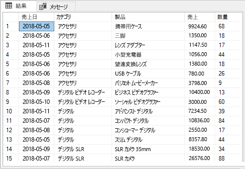
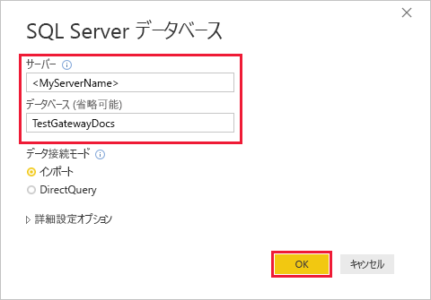
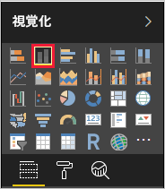
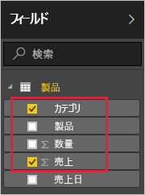
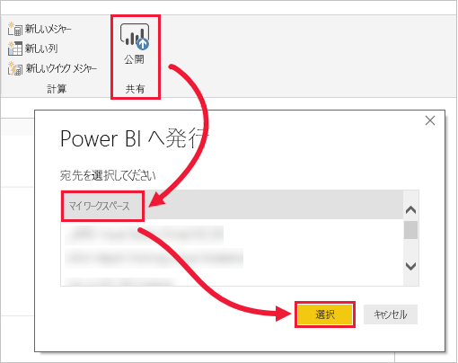
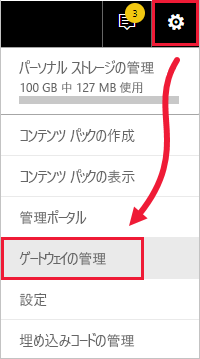
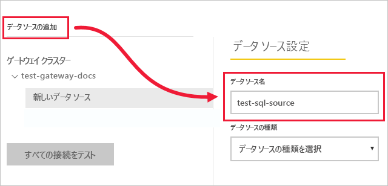
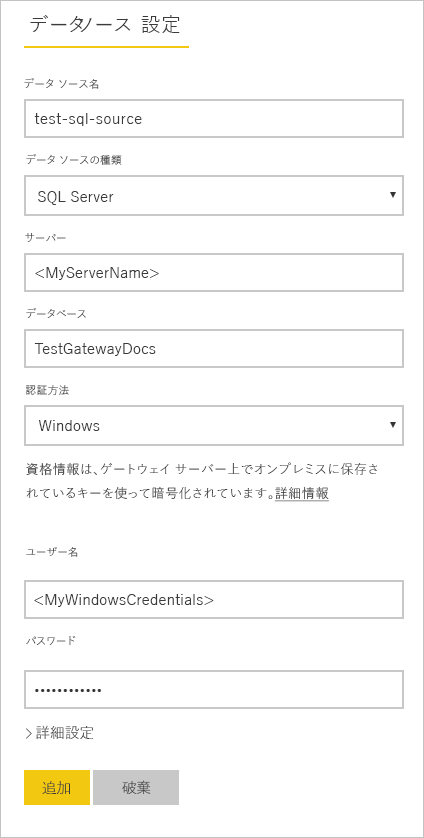
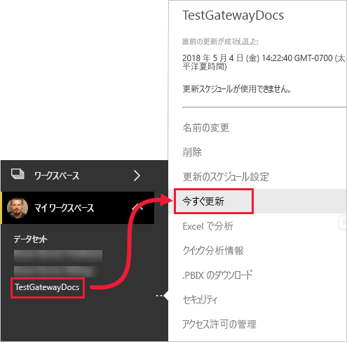
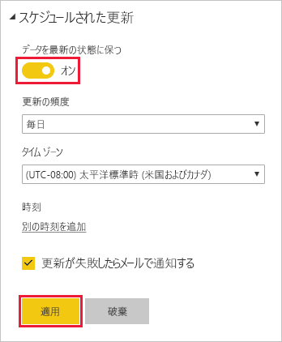

# <a name="tutorial-connect-to-on-premises-data-in-sql-server"></a>チュートリアル: SQL Server でオンプレミス データに接続する

オンプレミス データ ゲートウェイは、オンプレミス ネットワーク内にインストールするソフトウェアです。ゲートウェイがあると、そのネットワーク内のデータに簡単にアクセスできるようになります。 このチュートリアルでは、SQL Server からインポートされたサンプル データに基づいて Power BI Desktop でレポートを作成します。 次に、レポートを Power BI サービスに発行し、サービスがオンプレミス データにアクセスできるようにゲートウェイを構成します。 このアクセスは、レポートを最新の状態に保つためにサービスがデータを更新できることを意味します。

このチュートリアルで学習する内容は次のとおりです。
> [!div class="checklist"]
> * SQL Server のデータからレポートを作成する
> * Power BI サービスにレポートを発行する
> * SQL Server をゲートウェイ データ ソースとして追加する
> * レポートのデータを更新する

Power BI にサインアップしていない場合は、[無料の試用版にサインアップ](https://app.powerbi.com/signupredirect?pbi_source=web)してください。


## <a name="prerequisites"></a>前提条件

* [Power BI Desktop をインストールする](https://powerbi.microsoft.com/desktop/)
* ローカル コンピューターに [SQL Server をインストールする](https://docs.microsoft.com/sql/database-engine/install-windows/install-sql-server) 
* 同じローカル コンピューターに[オンプレミス データ ゲートウェイをインストールする](service-gateway-install.md) (実稼働環境では、通常は別のコンピューターにインストールします)


## <a name="set-up-sample-data"></a>サンプル データを設定する

まずサンプル データを SQL Server に追加し、以降のチュートリアルでそのデータを使用できるようにします。

1. SQL Server Management Studio (SSMS) で、SQL Server のインスタンスに接続し、テスト データベースを作成します。

    ```sql
    CREATE DATABASE TestGatewayDocs
    ```

2. 作成したデータベースにテーブルを追加し、データを挿入します。

    ```sql
    USE TestGatewayDocs

    CREATE TABLE Product (
        SalesDate DATE,
        Category  VARCHAR(100),
        Product VARCHAR(100),
        Sales MONEY,
        Quantity INT
    )

    INSERT INTO Product VALUES('2018-05-05','Accessories','Carrying Case',9924.60,68)
    INSERT INTO Product VALUES('2018-05-06','Accessories','Tripod',1350.00,18)
    INSERT INTO Product VALUES('2018-05-11','Accessories','Lens Adapter',1147.50,17)
    INSERT INTO Product VALUES('2018-05-05','Accessories','Mini Battery Charger',1056.00,44)
    INSERT INTO Product VALUES('2018-05-06','Accessories','Telephoto Conversion Lens',1380.00,18)
    INSERT INTO Product VALUES('2018-05-06','Accessories','USB Cable',780.00,26)
    INSERT INTO Product VALUES('2018-05-08','Accessories','Budget Movie-Maker',3798.00,9)
    INSERT INTO Product VALUES('2018-05-09','Digital video recorder','Business Videographer',10400.00,13)
    INSERT INTO Product VALUES('2018-05-10','Digital video recorder','Social Videographer',3000.00,60)
    INSERT INTO Product VALUES('2018-05-11','Digital','Advanced Digital',7234.50,39)
    INSERT INTO Product VALUES('2018-05-07','Digital','Compact Digital',10836.00,84)
    INSERT INTO Product VALUES('2018-05-08','Digital','Consumer Digital',2550.00,17)
    INSERT INTO Product VALUES('2018-05-05','Digital','Slim Digital',8357.80,44)
    INSERT INTO Product VALUES('2018-05-09','Digital SLR','SLR Camera 35mm',18530.00,34)
    INSERT INTO Product VALUES('2018-05-07','Digital SLR','SLR Camera',26576.00,88)
    ```

3. テーブルからデータを選択して確認します。

    ```sql
    SELECT * FROM Product
    ```

    


## <a name="build-and-publish-a-report"></a>レポートを作成して発行する

作業に使用するサンプル データがあるので、Power BI Desktop で SQL Server に接続し、そのデータに基づいてレポートを作成します。 次に Power BI サービスにレポートを発行します。

1. Power BI Desktop の **[ホーム]** タブで、**[データの取得]** > **[SQL Server]** の順に選択します。

2. **[サーバー]** にサーバー名を入力し、**[データベース]** に「TestGatewayDocs」と入力します。 **[OK]** を選択します。 

    

3. 資格情報を確認し、**[接続]** を選択します。

4. **[ナビゲーター]** の **[Product]** テーブルを選択し、**[読み込む]** を選択します。

    ![[Product] テーブルを選択する](media/service-gateway-sql-tutorial/select-product-table.png)

5. Power BI Desktop の **[レポート]** ビューで、**[視覚化]** ウィンドウから **[積み上げ縦棒グラフ]** を選択します。

        

6. レポート キャンバスで縦棒グラフを選択した状態で、**[フィールド]** ウィンドウの **[Category]** フィールドと **[Sales]** フィールドを選択します。  

    

    グラフは次のように表示されます。

    ![[Product] テーブルを選択する](media/service-gateway-sql-tutorial/finished-chart.png)

    **SLR Camera** が現在最も売れている製品であることがわかります。 このチュートリアルの後半でデータを更新し、レポートを更新すると、この情報は変わります。

7. "TestGatewayDocs.pbix" という名前でレポートを保存します。

8. **[ホーム]** タブで **[発行]** > **[マイ ワークスペース]** > **[選択]** の順に選択します。 Power BI サービスにサインインするように求められたら、サインインします。 

    

9. **[成功]** 画面で、**[Power BI で 'TestGatewayDocs.pbix' を開く]** を選択します。


## <a name="add-sql-server-as-a-gateway-data-source"></a>SQL Server をゲートウェイ データ ソースとして追加する

Power BI Desktop では、SQL Server に直接接続しますが、Power BI サービスにはブリッジとして機能するゲートウェイが必要です。 以上で、(「[前提条件](#prereqisites)」に記載されている) 前の記事で作成したゲートウェイのデータ ソースとして SQL Server のインスタンスを追加する操作は完了です。 

1. Power BI サービスの右上にある歯車アイコン ![[設定] 歯車アイコン](media/service-gateway-sql-tutorial/icon-gear.png) > **[ゲートウェイの管理]** の順に選択します。

    

2. **[データ ソースの追加]** を選択し、**[データ ソース名]** に「test-sql-source」と入力します。

    

3. **[SQL Server]** の **[データ ソースの種類]** を選択し、次のように他の値を入力します。

    

    | オプション | 値 |
    | ---    | ---   |
    | **データ ソース名**       | test-sql-source      |
    | **データ ソースの種類**       | SQL Server      |
    | **サーバー**       |  SQL Server インスタンスの名前 (Power BI Desktop で指定した名前と同じにする必要があります)    |
    | **データベース**       | TestGatewayDocs      |
    | **認証方法**       | Windows      |
    | **ユーザー名**        |  SQL Server への接続に使用するアカウント (michael@contoso.com など)     |
    | **パスワード**       |  SQL Server への接続に使用するアカウントのパスワード    |

4. **[追加]** を選択します。 接続に成功すると、"*接続成功*" というメッセージが表示されます。

    

    これで、このデータ ソースを使用して、Power BI ダッシュボードとレポートに SQL Server のデータを含めることができます。


## <a name="configure-and-use-data-refresh"></a>データ更新の構成と使用

Power BI サービスへのレポート発行と、SQL Server データ ソースの構成が完了しました。 この準備が完了したら、次は Product テーブルに変更を加え、その変更をゲートウェイを介して発行済みレポートに反映します。 また、今後、変更が発生した場合に処理できるように、スケジュールされた更新を構成することもできます。

1. SSMS で、Product テーブルのデータを更新します。

    ```sql
    UPDATE Product
    SET Sales = 32508, Quantity = 252
    WHERE Product='Compact Digital'     

    ```

2. Power BI Service の左側のナビゲーション ウィンドウで、**[マイ ワークスペース]** を選択します。

3. **[データセット]** の **TestGatewayDocs** データセットで **[詳細]** (**. . .**)、**[今すぐ更新]** の順に選択します。

    

4. **[マイ ワークスペース]** > **[レポート]** > **[TestGatewayDocs]** の順に選択します。 更新内容が反映され、最も売れている製品が **Compact Digital** になりました。 

    

5. **[マイ ワークスペース]** > **[レポート]** > **[TestGatewayDocs]** の順に選択します。 **[詳細]**(**. . .**)、**[更新のスケジュール設定]** の順に選択します。

6. **[更新のスケジュール設定]** で更新を **[オン]** に設定し、**[適用]** を選択します。 既定でデータセットは毎日更新されます。

    

## <a name="clean-up-resources"></a>リソースをクリーンアップする
今後はサンプル データを使用しない場合は、SSMS で `DROP DATABASE TestGatewayDocs` を実行します。 SQL Server データ ソースを使用しない場合は、[データ ソースを削除](service-gateway-manage.md#remove-a-data-source)します。 


## <a name="next-steps"></a>次の手順
このチュートリアルでは、次の内容を学習しました。
> [!div class="checklist"]
> * SQL Server のデータからレポートを作成する
> * Power BI サービスにレポートを発行する
> * SQL Server をゲートウェイ データ ソースとして追加する
> * レポートのデータを更新する

さらに学習するには、次の記事に進んでください
> [!div class="nextstepaction"]
> [Power BI ゲートウェイを管理する](service-gateway-manage.md)

