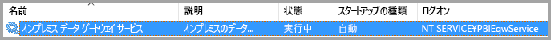
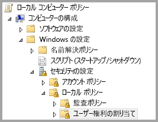
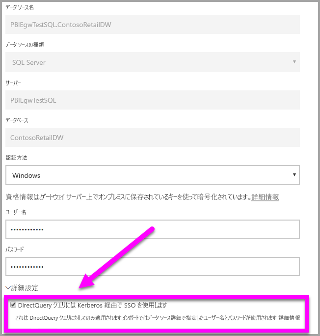
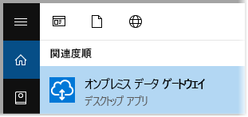
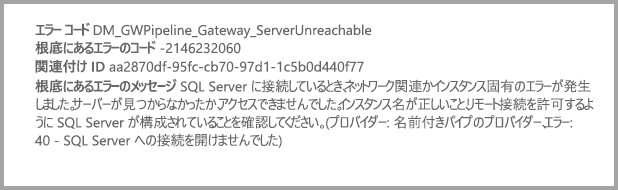

# <a name="use-kerberos-for-single-sign-on-sso-from-power-bi-to-on-premises-data-sources"></a>Power BI からオンプレミス データ ソースへの SSO (シングル サインオン) に Kerberos を使用する

[Kerberos の制約付き委任](/windows-server/security/kerberos/kerberos-constrained-delegation-overview)を使用して、シームレスなシングル サインオン (SSO) 接続を有効にします。 SSO を有効にすると、Power BI レポートおよびダッシュボードはオンプレミスのソースからデータを簡単に更新できるようになります。

## <a name="supported-data-sources"></a>サポートされているデータ ソース

現在サポートされているデータ ソースは次のとおりです。

* SQL Server
* SAP HANA
* SAP BW
* Teradata
* Spark
* Impala

[Security Assertion Markup Language (SAML)](service-gateway-sso-saml.md) を使用した SAP HANA もサポートされています。

### <a name="sap-hana"></a>SAP HANA

SAP HANA で SSO を有効にするには、次の手順に従います。

* SAP HANA サーバーが必要な最小バージョンを実行していることを確認します。これは、SAP HANA サーバー プラットフォームのレベルによって異なります。
  * [HANA 2 SPS 01 改訂 012.03](https://launchpad.support.sap.com/#/notes/2557386)
  * [HANA 2 SPS 02 改訂 22](https://launchpad.support.sap.com/#/notes/2547324)
  * [HANA 1 SP 12 改訂 122.13](https://launchpad.support.sap.com/#/notes/2528439)
* ゲートウェイ マシンに、SAP の最新の HANA ODBC ドライバーをインストールする。  最小バージョンは 2017 年 8 月の HANA ODBC バージョン 2.00.020.00 です。

Kerberos を使用した SAP HANA の SSO の設定に関する詳細については、SAP HANA セキュリティ ガイドの「[「Single Sign-on Using Kerberos](https://help.sap.com/viewer/b3ee5778bc2e4a089d3299b82ec762a7/2.0.03/1885fad82df943c2a1974f5da0eed66d.html)」(Kerberos を用いたシングル サインオン) をご覧ください。 また、このページからのリンク (特に SAP Note 1837331 – HOWTO HANA DBSSO Kerberos/Active Directory) もご確認ください。

## <a name="prepare-for-kerberos-constrained-delegation"></a>Kerberos の制約付き委任のために準備する

Kerberos の制約付き委任が正しく機能するためには、"*サービス プリンシパル名*" (SPN) やサービス アカウントでの委任の設定など、いくつかの項目の構成を行う必要があります。

### <a name="prerequisite-1-install-and-configure-the-microsoft-on-premises-data-gateway"></a>前提条件 1:Microsoft オンプレミス データ ゲートウェイをインストールして構成する

オンプレミス データ ゲートウェイのこのリリースでは、インプレース アップグレードだけでなく既存のゲートウェイの引き継ぎの設定がサポートされています。

### <a name="prerequisite-2-run-the-gateway-windows-service-as-a-domain-account"></a>前提条件 2:ゲートウェイの Windows サービスをドメイン アカウントとして実行する

標準のインストールでは、ゲートウェイは、コンピューター ローカル サービス アカウントとして実行されます (具体的には、*NT Service\PBIEgwService*)。



Azure Active Directory (Azure AD) インスタンスが既に (Azure AD DirSync/Connect を使って) ローカルの Active Directory インスタンスと同期されている場合を除き、Kerberos の制約付き委任を有効にするには、ゲートウェイをドメイン アカウントとして実行する必要があります。 ドメイン アカウントに切り替えるには、この記事で後述する「[ゲートウェイをドメイン アカウントに切り替える](#switch-the-gateway-to-a-domain-account)」をご覧ください。

> [!NOTE]
> Azure AD Connect が構成済みで、かつユーザー アカウントが同期済みの場合、実行時にゲートウェイ サービスでローカル Azure AD 参照を実行する必要はありません。 ゲートウェイ サービスに対してローカル サービス SID を使用できます (ドメイン アカウントは必要ありません)。 この記事で説明する Kerberos の制約付き委任の構成手順は、その構成と同じです。 それらは、ドメイン アカウントではなく、Azure AD でゲートウェイのコンピューター オブジェクトに単に適用されます。

### <a name="prerequisite-3-have-domain-admin-rights-to-configure-spns-setspn-and-kerberos-constrained-delegation-settings"></a>前提条件 3:SPN (SetSPN) および Kerberos 制約付き委任の設定を構成するためのドメイン管理者権限がある

ドメイン管理者権限を要求せず、ドメイン管理者が SPN および Kerberos 委任を構成する権限を一時的または永続的に他のユーザーに許可することはお勧めしません。 次のセクションでは、推奨される構成手順について詳しく説明します。

## <a name="configure-kerberos-constrained-delegation-for-the-gateway-and-data-source"></a>ゲートウェイとデータ ソースに対して Kerberos の制約付き委任を構成する

ドメイン管理者は、ゲートウェイ サービスのドメイン アカウントの SPN を構成し、ゲートウェイ サービスのドメイン アカウントに委任設定を構成します。

### <a name="configure-an-spn-for-the-gateway-service-account"></a>ゲートウェイ サービス アカウントに SPN を構成する

最初に、ゲートウェイ サービス アカウントとして使われるドメイン アカウントに SPN が既に作成されているかどうかを調べます。

1. ドメイン管理者として **[Active Directory ユーザーとコンピューター]** を開きます。

2. ドメインを右クリックし、**[検索]** を選んで、ゲートウェイ サービス アカウントのアカウント名を入力します。

3. 検索結果で、ゲートウェイ サービス アカウントを右クリックして、**[プロパティ]** を選択します。

4. **[委任]** タブが **[プロパティ]** ダイアログ ボックスに表示されている場合、SPN は既に作成されています。 委任設定の構成に進むことができます。

    **[委任]** タブが **[プロパティ]** ダイアログ ボックスにない場合、そのアカウントに SPN を手動で作成できます。 これにより、**[委任]** タブが追加されます。Windows に付属する [setspn ツール](https://technet.microsoft.com/library/cc731241.aspx)を使用してください (SPN を作成するにはドメイン管理者権限が必要です)。

    たとえば、ゲートウェイ サービス アカウントが "PBIEgwTest\GatewaySvc" で、ゲートウェイ サービスを実行しているコンピューターの名前が **Machine1** であるとします。 この例のコンピューターにゲートウェイ サービス アカウントの SPN を設定するには、次のコマンドを実行します。

    

    このステップが完了したら、委任設定の構成に進むことができます。

### <a name="configure-delegation-settings-on-the-gateway-service-account"></a>ゲートウェイ サービス アカウントで委任設定を構成する

2 番目の構成要件は、ゲートウェイ サービス アカウントでの委任の設定です。 この手順は複数のツールを使って実行できます。 ここでは [Active Directory ユーザーとコンピューター] を使用します。これは、ディレクトリ内の情報の管理と発行を行うための Microsoft 管理コンソール (MMC) のスナップインです。 既定ではドメイン コントローラーで使用できます。 他のコンピューターで Windows 機能の構成を使用してこれを有効にすることもできます。

プロトコル遷移のある Kerberos の制約付き委任を構成する必要があります。 制約付き委任では、委任先のサービスを明示的に指定する必要があります。 たとえば、SQL Server または SAP HANA サーバーだけが、ゲートウェイ サービス アカウントからの委任呼び出しを受け入れます。

このセクションでは、基になるデータ ソース (SQL Server、SAP HANA、Teradata、Spark など) に対して SPN を既に構成してあるものとします。 これらのデータ ソース サーバーの SPN を構成する方法については、それぞれのデータベース サーバーの技術ドキュメントを参照してください。 [アプリで必要な SPN](https://blogs.msdn.microsoft.com/psssql/2010/06/23/my-kerberos-checklist/) に関するブログ記事もご覧ください。

次の手順では、ゲートウェイ コンピューターと、SQL Server を実行しているデータベース サーバーの 2 つのコンピューターで構成されるオンプレミス環境を想定しています。 また、この例では次の設定と名前を使用します。

* ゲートウェイ コンピューターの名前:**PBIEgwTestGW**
* ゲートウェイ サービス アカウント:**PBIEgwTest\GatewaySvc** (アカウントの表示名:Gateway Connector)
* SQL Server データ ソースのコンピューター名:**PBIEgwTestSQL**
* SQL Server データ ソースのサービス アカウント:**PBIEgwTest\SQLService**

委任設定を構成する方法を次に示します。

1. ドメイン管理者権限で、**[Active Directory ユーザーとコンピューター]** を開きます。

2. ゲートウェイのサービス アカウント (**PBIEgwTest\GatewaySvc**) を右クリックし、**[プロパティ]** を選択します。

3. **[委任]** タブを選びます。

4. **[指定されたサービスへの委任でのみこのコンピューターを信頼する]** > **[任意の認証プロトコルを使う]** をオンにします。

6. **[このアカウントが委任された資格情報を提示できるサービス]** で **[追加]** を選択します。

7. 新しいダイアログ ボックスで、**[ユーザーまたはコンピューター]** を選びます。

8. SQL Server データ ソースのサービス アカウント (**PBIEgwTest\SQLService**) を入力し、**[OK]** を選択します。

9. データベース サーバー用に作成した SPN を選びます。 この例では、SPN は **MSSQLSvc** で始まります。 データベース サービスに FQDN と NetBIOS 両方の SPN を追加した場合は、両方とも選びます。 1 つだけしか表示されない場合があります。

10. **[OK]** を選択します。 リストに SPN が表示されます。

    必要に応じて、**[展開済み]** を選んで FQDN SPN と NetBIOS SPN を両方表示できます。 **[展開済み]** をオンにした場合、ダイアログ ボックスの表示は次のようになります。 **[OK]** を選択します。

    ![[ゲートウェイ コネクタのプロパティ] ダイアログ ボックスのスクリーン ショット](media/service-gateway-sso-kerberos/gateway-connector-properties.png)

最後に、ゲートウェイ サービス (この例では **PBIEgwTestGW**) が実行されているコンピューターで、ゲートウェイ サービス アカウントにローカル ポリシー **[認証後にクライアントを偽装]** を付与する必要があります。 これは、ローカル グループ ポリシー エディター (**gpedit**) で実行と確認ができます。

1. ゲートウェイ コンピューターで、*gpedit.msc* を実行します。

1. **[ローカル コンピューター ポリシー]** > **[コンピューターの構成]** > **[Windows の設定]** > **[セキュリティの設定]** > **[ローカル ポリシー]** > **[ユーザー権利の割り当て]** の順に移動します。

    

1. **[ユーザー権利の割り当て]** で、ポリシーの一覧から **[認証後にクライアントを偽装]** を選択します。

    

    右クリックして、**[プロパティ]** を開きます。 アカウントの一覧を確認します。 ゲートウェイ サービス アカウント (**PBIEgwTest\GatewaySvc**) が含まれている必要があります。

1. **[ユーザー権利の割り当て]** で、ポリシーの一覧から **[オペレーティング システムの一部として機能 (SeTcbPrivilege)]** を選択します。 アカウントの一覧にゲートウェイ サービス アカウントが含まれることも確認します。

1. **オンプレミス データ ゲートウェイ** サービス プロセスを再起動します。

SAP HANA を使用している場合は、次のパフォーマンスが若干向上させるために次の追加手順を実行することをお勧めします。

1. ゲートウェイのインストール ディレクトリで、次の構成ファイルを見つけて開きます: *Microsoft.PowerBI.DataMovement.Pipeline.GatewayCore.dll.config*。

1. *FullDomainResolutionEnabled* プロパティを見つけて、その値を *True* に変更します。

    ```xml
    <setting name=" FullDomainResolutionEnabled " serializeAs="String">
          <value>True</value>
    </setting>
    ```

## <a name="run-a-power-bi-report"></a>Power BI レポートを実行する

すべての構成手順が完了すると、Power BI の **[Manage Gateway]\(ゲートウェイの管理\)** ページを使ってデータ ソースを構成することができます。 その後、**[詳細設定]** で SSO を有効にし、そのデータ ソースに対するレポートとデータセットのバインドを発行します。



この構成は、ほとんどの場合に機能します。 ただし、Kerberos については、環境に応じて構成が異なる可能性があります。 レポートがまだ読み込まれない場合は、ドメイン管理者に連絡してさらに詳しく調査します。

## <a name="switch-the-gateway-to-a-domain-account"></a>ゲートウェイをドメイン アカウントに切り替える

必要に応じて、**オンプレミス データ ゲートウェイ**のユーザー インターフェイスを使って、ゲートウェイをローカル サービス アカウントからドメイン アカウントとして実行するように切り替えることができます。 次にその方法を示します。

1. **[オンプレミスのデータ ゲートウェイ]** 構成ツールを開きます。

   

2. メイン ページの **[サインイン]** ボタンを選び、Power BI アカウントでサインインします。

3. サインインが完了した後、**[サービスの設定]** タブを選びます。

4. **[アカウントの変更]** を選んでガイド付きチュートリアルを開始します。

   ![[アカウントの変更] オプションが強調表示されている、オンプレミス データ ゲートウェイのデスクトップ アプリのスクリーン ショット](media/service-gateway-sso-kerberos/change-account.png)

## <a name="configure-sap-bw-for-sso"></a>SAP BW に対して SSO を構成する

Kerberos がゲートウェイと連携するしくみを理解できたので、SAP Business Warehouse (SAP BW) に対して SSO を構成できます。 次の手順は、この記事で前述したように、[Kerberos の制約付き委任の準備](#prepare-for-kerberos-constrained-delegation)が既にできていることを前提としています。

このガイドは、可能な限り包括的になるように書かれています。 一部の手順を既に完了している場合は、それをスキップできます。 たとえば、SAP BW サーバーのサービス ユーザーを既に作成して SPN をマップしてある場合や、`gsskrb5` ライブラリを既にインストールしてある場合です。

### <a name="set-up-gsskrb5-on-client-machines-and-the-sap-bw-server"></a>クライアント コンピューターと SAP BW サーバーに gsskrb5 を設定する

> [!NOTE]
> `gsskrb5` は、SAP によって積極的にサポートされなくなりました。 詳細については、[SAP Note 352295](https://launchpad.support.sap.com/#/notes/352295) をご覧ください。 また、データ ゲートウェイから SAP BW メッセージ サーバーへの SSO 接続が `gsskrb5` によって許可されない点についても注意してください。 SAP BW アプリケーション サーバーへの接続のみが可能です。

ゲートウェイを介して SSO 接続を完了するには、クライアントとサーバーの両方で `gsskrb5` が使用されている必要があります。 Common Crypto Library (sapcrypto) は現在サポートされていません。

1. [SAP Note 2115486](https://launchpad.support.sap.com/) から `gsskrb5` - `gx64krb5` をダウンロードします (SAP S-User が必要)。 バージョン 1.0.11.x 以降の gsskrb5.dll および gx64krb5.dll があることを確認します。

1. ゲートウェイ インスタンスによって (また、SAP ログオンを使用して SSO 接続をテストする場合は、SAP GUI によっても) アクセスできるゲートウェイ コンピューター上の場所に、ライブラリを配置します。

1. SAP BW サーバーによってアクセスできる SAP BW サーバー コンピューター上の場所に、別のコピーを配置します。

1. クライアント コンピューターとサーバー コンピューター上で、`SNC\_LIB` 環境変数と `SNC\_LIB\_64` 環境変数を、それぞれ gsskrb5.dll と gx64krb5.dll の場所を指すように設定します。

### <a name="create-a-sap-bw-service-user-and-enable-snc-communication"></a>SAP BW サービス ユーザーを作成し、SNC の通信を有効にする

既に実行したゲートウェイ構成に加えて、SAP BW 固有のいくつかの追加手順があります。 このドキュメントの「[ゲートウェイ サービス アカウントで委任設定を構成する](#configure-delegation-settings-on-the-gateway-service-account)」セクションは、基になるデータ ソースに対して SPN を既に構成していることを前提としています。 SAP BW に対してこの構成を実行するには、次の手順に従います。

1. Active Directory ドメイン コントローラー サーバーで、Active Directory 環境内の SAP BW アプリケーション サーバーに対してサービス ユーザー (最初は単純な Active Directory ユーザー) を作成します。 その後、このユーザーに SPN を割り当てます。

    SAP では `SAP/` で SPN を始めることが推奨されていますが、`HTTP/` などの他のプレフィックスも使用できるはずです。 `SAP/` の後に続く文字は開発者次第です。1 つのオプションとしては、SAP BW サーバーのサービス ユーザーのユーザー名を使用します。 たとえば、サービス ユーザーとして `BWServiceUser@\<DOMAIN\>` を作成した場合、SPN `SAP/BWServiceUser` を使用できます。 SPN のマッピングを設定する方法の 1 つは、setspn コマンドです。 たとえば、先ほど作成したサービス ユーザーの SPN を設定するには、ドメイン コントローラー コンピューターでコマンド ウィンドウからコマンド: `setspn -s SAP/ BWServiceUser DOMAIN\ BWServiceUser` を実行します。 詳しくは、SAP BW のドキュメントをご覧ください。

1. サービス ユーザーに、SAP BW アプリケーション サーバーへのアクセス権を付与します。

    1. SAP BW サーバー コンピューターで、SAP BW サーバーのローカル管理者グループにサービス ユーザーを追加します。 [コンピューターの管理] プログラムを開き、サーバーのローカル管理者グループをダブルクリックします。

        ![[コンピューターの管理] プログラムのスクリーン ショット](media/service-gateway-sso-kerberos/computer-management.png)

    1. ローカル管理者グループをダブルクリックし、**[追加]** を選んで、グループにサービス ユーザーを追加します。 **[名前の確認]** を選んで、名前を正しく入力したことを確認します。 **[OK]** を選択します。

1. SAP BW サーバーのサービス ユーザーを、SAP BW サーバー コンピューターで SAP BW サーバー サービスを開始するユーザーとして設定します。

    1. **[ファイル名を指定して実行]** を開き、「Services.msc」と入力します。 SAP BW アプリケーション サーバー インスタンスに対応するサービスを探します。 それを右クリックし、**[プロパティ]** を選択します。

        ![[プロパティ] が強調表示されている [サービス] のスクリーン ショット](media/service-gateway-sso-kerberos/server-properties.png)

    1. **[ログオン]** タブに切り替えて、ユーザーを SAP BW サービス ユーザーに変更します。 ユーザーのパスワードを入力し、**[OK]** を選択します。

1. SAP ログオンでサーバーにサインインし、RZ10 トランザクションを使用して次のプロファイル パラメーターを設定します。

    1. snc/identity/as プロファイル パラメーターを p:\<作成した SAP BW サービス ユーザー\> (p:BWServiceUser@MYDOMAIN.COM など) に設定します。 サービス ユーザーの UPN の前にある p: に注意してください。 SNC ライブラリとして Common Crypto Lib を使用するときのような、p:CN= ではありません。

    1. snc/gssapi\_lib プロファイル パラメーターを \<サーバー コンピューター上の gsskrb5.dll/gx64krb5.dll へのパス (使用するライブラリは OS のビット数によって異なります)\> に設定します。 SAP BW アプリケーション サーバーがアクセスできる場所にライブラリを配置してください。

    1. また、次の追加のプロファイル パラメーターを設定し、ニーズに合わせて値を変更します。 最後の 5 つのオプションでは、クライアントは SNC を構成することなく、SAP ログオンを使用して SAP BW サーバーに接続することができます。

        | **設定** | **値** |
        | --- | --- |
        | snc/data\_protection/max | 3 |
        | snc/data\_protection/min | 1 |
        | snc/data\_protection/use | 9 |
        | snc/accept\_insecure\_cpic | 1 |
        | snc/accept\_insecure\_gui | 1 |
        | snc/accept\_insecure\_r3int\_rfc | 1 |
        | snc/accept\_insecure\_rfc | 1 |
        | snc/permit\_insecure\_start | 1 |

    1. プロパティ snc/enable を 1 に設定します。

1. これらのプロファイル パラメーターを設定してから、サーバー コンピューターで SAP 管理コンソールを開き、SAP BW インスタンスを再起動します。 サーバーが起動しない場合は、プロファイル パラメーターを正しく設定したことを確認します。 プロファイル パラメーターの設定の詳細については、[SAP のドキュメント](https://help.sap.com/saphelp_nw70ehp1/helpdata/en/e6/56f466e99a11d1a5b00000e835363f/frameset.htm)を参照してください。 また、問題が発生した場合、このセクションで後述するトラブルシューティング情報も参照できます。

### <a name="map-a-sap-bw-user-to-an-active-directory-user"></a>SAP BW ユーザーを Active Directory ユーザーにマップする

Active Directory ユーザーを SAP BW アプリケーション サーバー ユーザーにマップし、SAP ログオンで SSO 接続をテストします。

1. SAP ログオンを使用して、SAP BW サーバーにサインインします。 トランザクション SU01 を実行します。

1. **[ユーザー]** で、SSO 接続を有効にする対象の SAP BW ユーザーを入力します (前のスクリーンショットでは、BIUSER のアクセス許可を設定しています)。 SAP ログオン ウィンドウの左上隅近くにある**編集**アイコン (ペンのイメージ) を選択します。

    ![SAP BW [User maintenance]\(ユーザーの管理\) 画面のスクリーン ショット](media/service-gateway-sso-kerberos/user-maintenance.png)

1. **[SNC]** タブを選びます。SNC 名の入力ボックスに、「p:\<Active Directory ユーザー\>@\<ドメイン\>」と入力します。 Active Directory ユーザーの UPN の前に指定する必須の p: に注意してください。 指定した Active Directory ユーザーは、SAP BW アプリケーション サーバーへの SSO アクセスを有効にする対象の個人または組織に属している必要があります。 たとえば、ユーザー [testuser@TESTDOMAIN.COM](mailto:testuser@TESTDOMAIN.COM) に対して SSO アクセスを有効にする場合、「p:testuser@TESTDOMAIN.COM」と入力します。

    ![SAP BW [Maintain Users]\(ユーザー管理\) 画面のスクリーン ショット](media/service-gateway-sso-kerberos/maintain-users.png)

1. 画面の左上隅近くにある **[保存]** アイコン (フロッピー ディスクのイメージ) を選択します。

### <a name="test-sign-in-by-using-sso"></a>SSO を使用したサインインをテストする

サーバーにサインインできることを確認します。 先ほど SSO アクセスを有効にした対象の Active Directory ユーザーとして、SSO を介した SAP ログオンを使用します。

1. 先ほど SSO アクセスを有効にした対象の Active Directory ユーザーとして、SAP ログオンがインストールされているコンピューターにサインインします。 SAP ログオンを起動し、新しい接続を作成します。

1. **[Create New System Entry]\(新しいシステム エントリの作成\)** 画面で **[User Specified System]\(ユーザー指定のシステム\)**  > **[次へ]** を選択します。

    ![[Create New System Entry]\(新しいシステム エントリの作成\) 画面のスクリーン ショット](media/service-gateway-sso-kerberos/new-system-entry.png)

1. 次の画面で、アプリケーション サーバー、インスタンス番号、システムの ID などの該当する詳細情報を入力します。 その後、**[完了]** を選択します。

1. 新しい接続を右クリックし、**[プロパティ]** を選びます。 **[ネットワーク]** タブを選びます。**[SNC Name]\(SNC 名\)** テキスト ボックスに、「p:\<SAP BW サービス ユーザーの UPN\>」(p:BWServiceUser@MYDOMAIN.COM など) と入力します。 **[OK]** を選択します。

    ![[System Entry Properties]\(システム エントリ プロパティ\) 画面のスクリーン ショット](media/service-gateway-sso-kerberos/system-entry-properties.png)

1. 先ほど作成した接続をダブルクリックして、SAP BW サーバーへの SSO 接続を試みます。 この接続に成功した場合は、次の手順に進みます。 そうでない場合は、このドキュメントの前述の手順を参照して、接続が正常に完了したことを確認するか、または次のトラブルシューティングのセクションを参照します。 このコンテキストで SSO を使用して SAP BW サーバーに接続できない場合は、ゲートウェイのコンテキストで SSO を使用して SAP BW サーバーに接続することはできません。

### <a name="troubleshoot-installation-and-connections"></a>インストールと接続のトラブルシューティングを行う

問題が発生した場合は、以下の手順に従って、SAP ログオンから gsskrb5 インストールと SSO 接続のトラブルシューティングを行います。

- サーバー ログ (サーバー コンピューター上の …work\dev\_w0) を参照すると、gsskrb5 のセットアップ手順の実行時に発生したエラーのトラブルシューティングに役立ちます。 これは、プロファイル パラメーターが変更された後に SAP BW サーバーが起動しない場合に特に役立ちます。

- ログオンに失敗した ために SAP BW サービスを開始できない場合、SAP BW "開始" ユーザーを設定するときに正しくないパスワードを指定した可能性があります。 SAP BW サービス ユーザーとして Active Directory 環境内のコンピューターにログインして、パスワードを確認します。

- SQL 資格情報に関するエラーが発生してサーバーが起動できない場合は、SAP BW データベースへの アクセス権がサービス ユーザーに付与されていることを確認してください。

- メッセージ "(GSS-API) specified target is unknown or unreachable (指定されたターゲットが不明であるか、または到達不能)" が表示される場合があります。 これは通常、正しくない SNC 名が指定されていることを意味します。 サービス ユーザーの UPN 以外には、"p:CN =" やクライアント アプリケーション内の何らかの項目ではなく、必ず "P:" だけを使用してください。

- メッセージ "(GSS-API) An invalid name was supplied (無効な名前が指定されました)" が表示される場合があります。 サーバーの SNC ID プロファイル パラメーターの値に "p:" が含まれることを確認してください。

- メッセージ "(SNC エラー) the specified module could not be found (指定したモジュールが見つかりませんでした)" が表示される場合があります。 これは通常、アクセスするのに高度な特権 (管理者権限) を必要とする場所に `gsskrb5.dll/gx64krb5.dll` を配置したことが原因で発生します。

### <a name="add-registry-entries-to-the-gateway-machine"></a>ゲートウェイ コンピューターにレジストリ エントリを追加する

ゲートウェイがインストールされているコンピューターのレジストリに、必要なレジストリ エントリを追加します。 実行するコマンドを次に示します。

1. REG ADD HKLM\SOFTWARE\Wow6432Node\SAP\gsskrb5 /v ForceIniCredOK /t REG\_DWORD /d 1 /f

1. REG ADD HKLM\SOFTWARE\SAP\gsskrb5 /v ForceIniCredOK /t REG\_DWORD /d 1 /f

### <a name="set-configuration-parameters-on-the-gateway-machine"></a>ゲートウェイ コンピューターで構成パラメーターを設定する

ユーザーが Azure AD ユーザーとして Power BI サービスにサインインできるように Azure AD Connect を構成しているかどうかにより、構成パラメーターの設定には 2 つのオプションがあります。

Azure AD Connect が構成されている場合は、以下の手順のようにします。

1. メインのゲートウェイの構成ファイル `Microsoft.PowerBI.DataMovement.Pipeline.GatewayCore.dll` を開きます。 このファイルは、既定では C:\Program Files\On-premises data gateway に格納されています。

1. **FullDomainResolutionEnabled** プロパティが **True** に設定されていて、**SapHanaSsoRemoveDomainEnabled** が **False** に設定されていることを確認します。

1. 構成ファイルを保存します。

1. タスク マネージャーの **[サービス]** タブで、ゲートウェイ サービスを右クリックして **[再起動]** を選択します。

    ![タスク マネージャーの [サービス] タブのスクリーン ショット](media/service-gateway-sso-kerberos/restart-gateway.png)

Azure AD Connect を構成していない場合は、Azure AD ユーザーにマップするすべての Power BI サービス ユーザーに対して次の手順を実行します。 次の手順では、SAP BW にサインインするアクセス許可を持つ Active Directory ユーザーに、Power BI サービス ユーザーを手動でリンクします。

1. メインのゲートウェイの構成ファイル `Microsoft.PowerBI.DataMovement.Pipeline.GatewayCore.dll` を開きます。 このファイルは、既定では C:\Program Files\On-premises data gateway に格納されています。

1. **ADUserNameLookupProperty** を `msDS-cloudExtensionAttribute1` に、**ADUserNameReplacementProperty** を `SAMAccountName` に設定します。 構成ファイルを保存します。

1. タスク マネージャーの **[サービス]** タブで、ゲートウェイ サービスを右クリックして **[再起動]** を選択します。

    ![タスク マネージャーの [サービス] タブのスクリーン ショット](media/service-gateway-sso-kerberos/restart-gateway.png)

1. Active Directory ユーザーの `msDS-cloudExtensionAttribute1` プロパティを設定します。 これは、SAP BW ユーザーにマップしたユーザーです。 Kerberos SSO を有効にする対象の Power BI サービス ユーザーに、このプロパティを設定します。 `msDS-cloudExtensionAttribute1` プロパティを設定する方法の 1 つは、[Active Directory ユーザーとコンピューター] MMC スナップインを使用することです  (他の方法を使用することもできます)。

    1. 管理者ユーザーとしてドメイン コントローラー コンピューターにサインインします。

    1. スナップイン ウィンドウで**ユーザー** フォルダーを開き、SAP BW ユーザーにマップした Active Directory ユーザーをダブルクリックします。

    1. **[属性エディター]** タブを選びます。

        このタブが表示されない場合は、このタブを有効にする手順を確認するか、または別の方法を使用してプロパティを設定する必要があります。 いずれかの属性を選び、'M' キーを押して、先頭文字が 'm' の Active Directory プロパティに移動します。 `msDS-cloudExtensionAttribute1` プロパティを見つけてダブルクリックします。 その値を、Power BI サービスへのサインインに使用するユーザー名 (YourUser@YourDomain の形式) に設定します。

    1. **[OK]** を選択します。

        ![[文字列属性エディター] ダイアログ ボックスのスクリーン ショット](media/service-gateway-sso-kerberos/edit-attribute.png)

    1. **[適用]** を選びます。 **[値]** 列に正しい値が設定されていることを確認します。

### <a name="add-a-new-sap-bw-application-server-data-source-to-the-power-bi-service"></a>Power BI サービスに新しい SAP BW アプリケーション サーバー データ ソースを追加する

この記事で前述した[レポートの実行](#run-a-power-bi-report)に関する手順に従って、ゲートウェイに SAP BW データ ソースを追加します。

1. データ ソース構成ウィンドウで、Power BI Desktop から SAP BW サーバーにサインインするときと同様に、アプリケーション サーバーの **[ホスト名]**、**[システム番号]**、および **[クライアント ID]** を入力します。 **[認証方法]** で、**[Windows]** を選択します。

1. **[SNC パートナー名]** フィールドに、「p:\<SAP BW サービス ユーザーにマップした SPN\>」と入力します。 たとえば、SPN が SAP/BWServiceUser@MYDOMAIN.COM の場合は、**[SNC パートナー名]** フィールドに「p:SAP/BWServiceUser@MYDOMAIN.COM」と入力する必要があります。

1. SNC ライブラリでは、**SNC\_LIB** または **SNC\_LIB\_64** を選択します。

1. **[ユーザー名]** と **[パスワード]** は、SSO を使用して SAP BW サーバーにサインインする権限のある Active Directory ユーザーのユーザー名とパスワードにする必要があります。 つまり、これらは、SU01 トランザクションを使用して SAP BW ユーザーにマップされている Active Directory ユーザーに属している必要があります。 これらの資格情報は、**[DirectQuery クエリには Kerberos 経由で SSO を使用します]** ボックスがオンになっていない場合にのみ使用されます。

1. **[DirectQuery クエリには Kerberos 経由で SSO を使用します]** ボックスをオンにして、**[適用]** を選択します。 テスト接続が成功しなかった場合は、前のセットアップおよび構成手順が正常に完了したことを確認します。

    ゲートウェイは常に入力された資格情報を使用してサーバーへのテスト接続を確立し、インポート ベースのレポートのスケジュールされた更新を行います。 **[DirectQuery クエリには Kerberos 経由で SSO を使用します]** がオンになっていて、ユーザーが直接クエリ ベースのレポートまたはデータセットにアクセスしている場合にのみ、ゲートウェイは SSO 接続の確立を試みます。

### <a name="test-your-setup"></a>セットアップをテストする

セットアップをテストするには、Power BI Desktop から Power BI サービスに DirectQuery レポートを発行します。 Azure AD ユーザーとして、または Azure AD ユーザーの `msDS-cloudExtensionAttribute1` プロパティにマップしたユーザーとして、Power BI サービスにサインインしていることを確認します。 セットアップが正常に完了したら、Power BI サービスで発行済みのデータセットからレポートを作成できます。 レポート内のビジュアルを通してデータを取り込むこともできます。

### <a name="troubleshoot-gateway-connectivity-issues"></a>ゲートウェイ接続の問題のトラブルシューティングを行う

1. ゲートウェイのログを確認します。 ゲートウェイ構成アプリケーションを開き、**[診断]** > **[ログのエクスポート]** を選択します。 最新のエラーは、確認するログ ファイルの下部に記載されています。

    ![[診断] が強調表示されているオンプレミス データ ゲートウェイ アプリケーションのスクリーン ショット](media/service-gateway-sso-kerberos/gateway-diagnostics.png)

1. SAP BW トレースを有効にし、生成されたログ ファイルを確認します。 さまざまな種類の SAP BW トレースを使用できます。 詳細については、SAP のドキュメントを参照してください。

## <a name="errors-from-an-insufficient-kerberos-configuration"></a>Kerberos の不適切な構成によるエラー

基になっているデータベース サーバーとゲートウェイが Kerberos の制約付き委任用に正しく構成されていない場合、データの読み込み失敗に関する次のエラー メッセージが表示される可能性があります。


エラー メッセージ (DM_GWPipeline_Gateway_ServerUnreachable) に関連付けられている技術的な詳細は次のようになります。



つまり、ゲートウェイは元のユーザーを適切に偽装できず、データベース接続の試行は失敗しました。

## <a name="next-steps"></a>次の手順

**オンプレミス データ ゲートウェイ**と **DirectQuery** の詳細については、次のリソースをご覧ください。

* [オンプレミス データ ゲートウェイ](service-gateway-onprem.md)
* [Power BI の DirectQuery](desktop-directquery-about.md)
* [DirectQuery でサポートされるデータ ソース](desktop-directquery-data-sources.md)
* [DirectQuery と SAP BW](desktop-directquery-sap-bw.md)
* [DirectQuery と SAP HANA](desktop-directquery-sap-hana.md)
