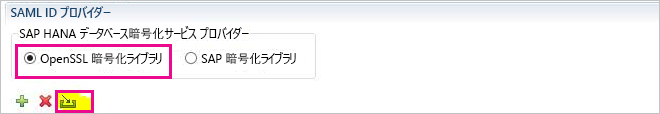
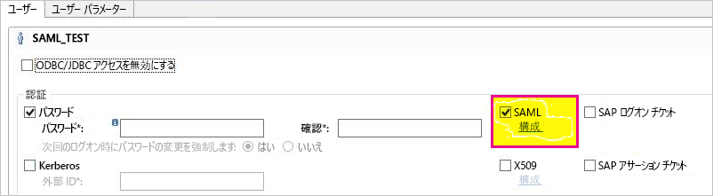
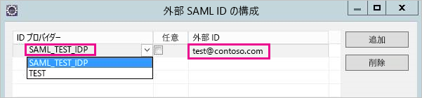
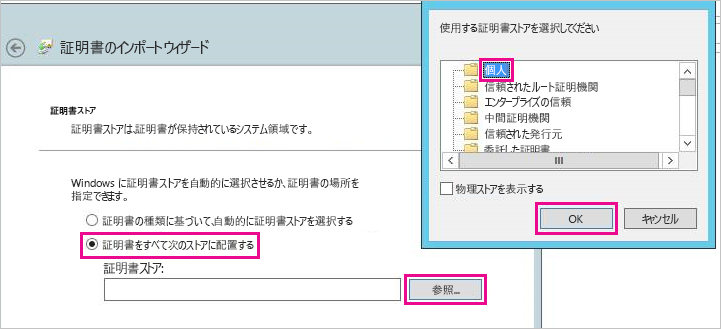
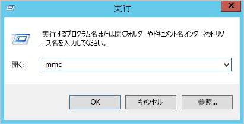
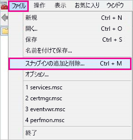
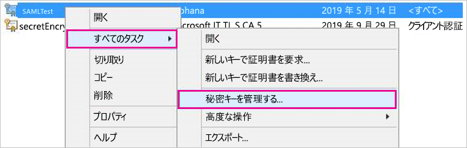
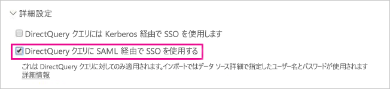

# <a name="use-security-assertion-markup-language-saml-for-single-sign-on-sso-from-power-bi-to-on-premises-data-sources"></a>Power BI からオンプレミス データ ソースへのシングル サインオン (SSO) に Security Assertion Markup Language (SAML) を使用します。

[Security Assertion Markup Language (SAML)](https://www.onelogin.com/pages/saml) を使用し、シームレスなシングル サインオン接続を有効にします。 SSO を有効にすると、Power BI レポートおよびダッシュボードはオンプレミスのソースからデータを簡単に更新できるようになります。

## <a name="supported-data-sources"></a>サポートされているデータ ソース

現在、SAP HANA に SAML をご利用いただけます。 SAML を利用した SAP HANA のシングル サインオンを設定し、構成する方法については、SAP HANA ドキュメントのトピック「[SAML SSO for BI Platform to HANA](https://wiki.scn.sap.com/wiki/display/SAPHANA/SAML+SSO+for+BI+Platform+to+HANA)」(BI プラットフォームの HANA に対する SAML SSO) を参照してください。

[Kerberos](service-gateway-sso-kerberos.md) では、追加のデータ ソースをサポートしています。

## <a name="configuring-the-gateway-and-data-source"></a>ゲートウェイとデータ ソースを構成する

SAML を使用するには、最初に SAML ID プロバイダーの証明書を生成し、それから Power BI ユーザーを ID にマッピングします。

1. 証明書を生成します。 *共通名*に入力するときは、SAP HANA サーバーの FQDN を使用してください。 証明書の有効期限は 365 日で切れます。

    ```
    openssl req -newkey rsa:2048 -nodes -keyout samltest.key -x509 -days 365 -out samltest.crt
    ```

1. SAP HANA Studio で、SAP HANA サーバーを右クリックし、**[Security]\(セキュリティ\)**、**[Open Security Console]\(セキュリティ コンソールを開く\)**、**[SAML Identity Provider]\(SAML ID プロバイダー\)**、**[OpenSSL Cryptographic Library]\(OpenSSL 暗号化ライブラリ\)** の順に移動します。

1. **[Import]\(インポート\)** を選択し、samltest.crt を参照してそれをインポートします。

    

1. SAP HANA Studio で **[Security]\(セキュリティ\)** フォルダーを選択します。

    ![[Security] フォルダー](media/service-gateway-sso-saml/security-folder.png)

1. **[User]\(ユーザー\)** を展開し、Power BI ユーザーをマッピングするユーザーを選択します。

1. **[SAML]** を選択し、**[Configure]\(構成\)** を選択します。

    

1. 手順 2 で作成した ID プロバイダーを選択します。 **[External Identity]\(外部 ID\)** に Power BI ユーザーの UPN を入力し、**[Add]\(追加\)** を選択します。

    

次に、*SAML アサーション*でセットアップを検証します。これには [xmlsec1 tool](http://sgros.blogspot.com/2013/01/signing-xml-document-using-xmlsec1.html) を使用します。

1. 下のアサーションを assertion-template.xml として保存します。 \<MyUserId\> を手順 7 で入力した Power BI ユーザーの UPN に変更します。

    ```xml
    <?xml version="1.0" encoding="UTF-8" ?>
    <saml2:Assertion ID="Assertion12345789" IssueInstant="2015-07-16T04:47:49.858Z" Version="2.0" xmlns:saml2="urn:oasis:names:tc:SAML:2.0:assertion">
      <saml2:Issuer></saml2:Issuer> 
      <Signature xmlns="http://www.w3.org/2000/09/xmldsig#">
        <SignedInfo>
          <CanonicalizationMethod Algorithm="http://www.w3.org/TR/2001/REC-xml-c14n-20010315"/>
          <SignatureMethod Algorithm="http://www.w3.org/2000/09/xmldsig#rsa-sha1"/>
          <Reference URI="">
            <Transforms>
              <Transform Algorithm="http://www.w3.org/2000/09/xmldsig#enveloped-signature"/>
              <Transform Algorithm="http://www.w3.org/2001/10/xml-exc-c14n#"/>
            </Transforms>
            <DigestMethod Algorithm="http://www.w3.org/2000/09/xmldsig#sha1"/>
            <DigestValue />
          </Reference>
        </SignedInfo>
        <SignatureValue />
        <KeyInfo>
          <X509Data />
        </KeyInfo>
      </Signature>
      <saml2:Subject>
        <saml2:NameID Format="urn:oasis:names:tc:SAML:1.1:nameid-format:unspecified"><MyUserId></saml2:NameID>
      </saml2:Subject>
      <saml2:Conditions NotBefore="2010-01-01T00:00:00Z" NotOnOrAfter="2050-01-01T00:00:00Z"/>
    </saml2:Assertion>
    ```

1. 次のコマンドを実行します。 saltest.key と samltest.crt は、手順 1 で生成したキーと証明書です。

    ```
    xmlsec1 --sign --privkey-pem samltest.key, samltest.crt --output signed.xml assertion-template.xml
    ```

1. SAP HANA Studio で、SQL コンソール ウィンドウを開き、次のコマンドを実行します。 \<SAMLAssertion\> を前の手順の xml のコンテンツに変更します。

    ```SQL
    CONNECT WITH SAML ASSERTION '<SAMLAssertion>'
    ```

クエリの成功は、SAP HANA SAML SSO セットアップの成功を意味します。

これで証明書と ID を正しく構成できたので、証明書を pfx 形式に変換し、証明書を使用するようにゲートウェイ コンピューターを構成します。

1. 次のコマンドを実行し、証明書を pfx 形式に変換します。

    ```
    openssl pkcs12 -inkey samltest.key -in samltest.crt -export -out samltest.pfx
    ```

1. ゲートウェイ コンピューターに pfx ファイルをコピーします。

    1. samltest.pfx をダブルクリックし、**[ローカル コンピューター]**、**[次へ]** の順に選択します。

    1. パスワードを入力し、**[次へ]** を選択します。

    1. **[証明書をすべて次のストアに配置する]** を選択し、**[参照]**、**[個人]**、**[OK]** を選択します。

    1. **[次へ]** を選択し、**[完了]** を選択します。

    

1. 証明書の秘密キーにアクセスする許可をゲートウェイ サービス アカウントに付与します。

    1. ゲートウェイ コンピューターで、Microsoft 管理コンソール (MMC) を実行します。

        

    1. **[ファイル]** で **[スナップインの追加と削除]** を選択します。

        

    1. **[証明書]**、**[追加]** の順に選択し、**[コンピューター アカウント]**、**[次へ]** の順に選択します。

    1. **[ローカル コンピューター]**、**[完了]**、**[OK]** の順に選択します。

    1. **[証明書]**、**[個人]**、**[証明書]** の順に展開し、証明書を見つけます。

    1. 証明書を右クリックし、**[すべてのタスク]**、**[Manage Private Keys]\(秘密キーの管理\)** の順に移動します。

        

    1. ゲートウェイ サービス アカウントを一覧に追加します。 既定では、アカウントは **NT SERVICE\PBIEgwService** です。 **services.msc** を実行してゲートウェイ サービスを実行しているアカウントを見つけ、**オンプレミス データ ゲートウェイ サービス**を見つけることができます。

        

最後に、次の手順を実行し、証明書の拇印をゲートウェイ構成に追加します。

1. 次の PowerShell コマンドを実行し、コンピューター上の証明書を一覧表示します。

    ```powershell
    Get-ChildItem -path cert:\LocalMachine\My
    ```
1. 作成した証明書の拇印をコピーします。

1. ゲートウェイ ディレクトリに移動します。このディレクトリは既定で C:\Program Files\On-premises data gateway になります。

1. PowerBI.DataMovement.Pipeline.GatewayCore.dll.config を開き、\*SapHanaSAMLCertThumbprint\* セクションを見つけます。 コピーした拇印を貼り付けます。

1. ゲートウェイ サービスを再起動します。

## <a name="running-a-power-bi-report"></a>Power BI レポートを実行する

これで Power BI の **[Manage Gateway]\(ゲートウェイの管理\)** ページを使用してデータ ソースを構成し、その **[詳細設定]** で SSO を有効にすることができます。 その後、そのデータ ソースにバインドされているレポートやデータセットを公開できます。



## <a name="next-steps"></a>次の手順

**オンプレミス データ ゲートウェイ**と **DirectQuery** の詳細については、次のリソースをご覧ください。

* [オンプレミス データ ゲートウェイ](service-gateway-onprem.md)
* [Power BI の DirectQuery](desktop-directquery-about.md)
* [DirectQuery でサポートされるデータ ソース](desktop-directquery-data-sources.md)
* [DirectQuery と SAP BW](desktop-directquery-sap-bw.md)
* [DirectQuery と SAP HANA](desktop-directquery-sap-hana.md)