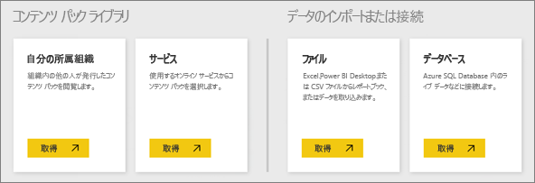
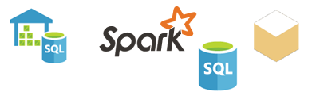

# Power BI サービスのデータ ソース
データは Power BI の中核です。 データを探索したり、グラフとダッシュボードを作成したり、Q&A で質問したりする場合、表示されるすべての視覚エフェクトと回答は、データセットの基になるデータから取得されます。 しかし、そのデータセットはどこから得られるでしょうか。 データ ソースからです。

この記事では、Power BI サービスから接続できるさまざまな種類のデータ ソースを見ていきます。 データを取得できるデータ ソースの種類は他にも多数あることに注意してください。 ただし、最初に Power BI Desktop および Excel の高度なデータ クエリやモデリング機能の使用が必要となる場合があります。 これについては、後で詳しく説明します。 まずは、Power BI サービス サイトから直接接続できるさまざまな種類のデータ ソースについて説明します。

**[マイワークスペース]** > **[データの取得]** をクリックして、Power BI のこれらのデータ ソースのいずれかからデータを取得できます。

## ファイル

**Excel** (.xlsx、xlxm) – Excel は特有で、ワークシートに自分で入力したデータ、および Power Query (Excel 2016 の [取得と変換]) や Power Pivot を使用して外部データ ソースからデータをクエリして読み込んだデータの両方を、ブックに含めることができます。 ワークシートのテーブル内のデータ (データはテーブルに含まれる*必要があります*) またはデータ モデルに読み込まれたデータを、インポートできます。 詳しくは、[Excel からのデータの取得](service-get-data-from-files.md)に関するページをご覧ください。

**Power BI Desktop** (.pbix) - Power BI Desktop を使うと、外部データ ソースのデータのクエリや読み込み、メジャーやリレーションシップを使ったデータ モデルの拡張、レポートの作成を行うことができます。 Power BI Desktop ファイルを Power BI サイトにインポートできます。 Power BI Desktop はデータ ソース、データ クエリや変換、データ モデリングの概念をよく理解している上級ユーザー向けに最適です。 詳しくは、「[Power BI Desktop におけるデータへの接続](desktop-connect-to-data.md)」をご覧ください。

**コンマ区切り値** (.csv) - ファイルは、データ行の単純なテキスト ファイルです。 各行には、1 つ以上の値をコンマで区切って含めることができます。 たとえば、名前と住所データを含む .csv には、各行が名、姓、住所、市町村、都道府県などの値を持つ多数の行を含めることができます。 データを .csv ファイルにインポートすることはできませんが、Excel などの多くのアプリケーションでは、単純なテーブル データを .csv ファイル形式で保存できます。

XML テーブル (.xml) やテキスト (.txt) ファイルなど、その他のファイル形式については、[取得して変換] を使用して最初にそのデータをクエリおよび変換し、Excel または Power BI Desktop ファイルにデータに読み込むことができます。 次に、Excel または Power BI Desktop ファイルを Power BI にインポートできます。

ファイルの保存先にも大きな違いがあります。 OneDrive for Business は優れた柔軟性と Power BI との統合を提供します。 ファイルをローカル ドライブ上に保持しても問題はありませんが、データの更新が必要な場合、追加の手順が必要になります。 詳細については、リンク先の記事で提供されます。

## コンテンツ パック

コンテンツ パックには、必要なすべてのデータとレポートが含まれています。 Power BI では、2 種類のコンテンツ パック (Google アナリティクス、Marketo、Salesforce などのサービスのコンテンツ パックと、ユーザーの組織内で作成され、共有されたコンテンツ パック) があります。

**サービス** – Power BI 用のコンテンツ パックを含むサービスは文字どおり数十個あり、また常に増え続けています。 ほとんどのサービスではアカウントが必要です。 詳しくは、[サービスへの接続](consumer/end-user-connect-to-services.md)に関するページをご覧ください。

**組織** – ユーザーおよび組織内の他のユーザーが Power BI Pro のアカウントを持っている場合、コンテンツ パックを作成、共有、使用できます。 詳しくは、「[組織のコンテンツ パック](service-organizational-content-pack-introduction.md)」をご覧ください。

## データベース

**クラウド内のデータベース** – Power BI サービスから、Azure SQL Database、Azure SQL Data Warehouse、Azure HD Insight 上の Spark、および DirectQuery を使用した SQL Server Analysis Services にライブ接続できます。 Power BI からこれらのデータベースへの接続は、ライブで行われます。たとえば、Azure SQL Database に接続した状態で、Power BI でレポートを作成してデータの探索を開始したり、データをスライスしたり、視覚エフェクトに別のフィールドを追加したりする場合、データベースにクエリが直接実行されます。 詳しくは、「[Azure と Power BI](service-azure-and-power-bi.md)」をご覧ください。

**オンプレミスのデータベース** – Power BI サービスから、SQL Server Analysis Services Tabular モデル データベースに直接接続できます。 Power BI Enterprise Gateway が必要です。 組織の表形式モデル データベースへの接続方法が不明な場合は、管理者または IT 部門に確認してください。 詳しくは、「[Power BI の SQL Server Analysis Services 表形式データ](sql-server-analysis-services-tabular-data.md)」をご覧ください。

組織内の他の種類のデータベースについては、最初に Power BI Desktop または Excel を使用してデータに接続し、データをクエリしてデータ モデルに読み込む必要があります。 その後、データセットを作成した Power BI にファイルをインポートできます。 スケジュールされた更新を設定する場合、Power BI は、構成された更新設定と共にそのファイルからの接続情報を使用してデータ ソースに直接接続し、更新をクエリします。 これらの更新はその後、Power BI のデータセットに読み込まれます。 詳しくは、「[Power BI Desktop におけるデータへの接続](desktop-connect-to-data.md)」をご覧ください。

## 別のソースのデータの場合はどうなるのでしょうか。
Power BI では文字どおり数百のデータ ソースを使用できます。 データをどこから取得するかに関係なく、データは Power BI がレポートやダッシュボードの作成や、Q&A での質問への回答などに使用できる形式にする必要があります。

一部のデータ ソースには、Google アナリティクスや Twilio などのサービス プロバイダーからのコンテンツ パックと同様、Power BI サービスに対応した形式でのデータがあります。 SQL Server Analysis Services 表形式モデル データベースも対応しています。 また、Azure SQL Database や HDInsight 上の Spark のようなクラウドのデータベースにライブ接続できます。

それ以外の場合は、クエリを実行し、ファイルに必要なデータを読み込むことが必要な場合があります。 たとえば、物流データが、組織内のサーバー上のデータ ウェアハウス データベースにあるとします。 Power BI サービスでは、そのデータベースに直接接続し、データの探索を開始することはできません (表形式モデル データベースを除く)。 ただし、Power BI Desktop または Excel を使用してその物流データをクエリし、データ モデルに読み込んでからファイルとして保存できます。 その後、データセットを作成した Power BI にそのファイルをインポートできます。

「でも、データベース上の物流データは毎日変化している。 Power BI 上のデータセットが更新されることを確認するには、どうすればよいだろう」と思われるかもしれません。Power BI Desktop または Excel ファイルからの接続情報は、データと共にデータセットにインポートされます。 スケジュールされた更新のセットアップや、データセットの手動更新を行う場合、Power BI は、データセットからの接続情報と他の設定を組み合わせてデータベースに直接接続、更新をクエリし、データセットに読み込みます。 オンプレミス サーバーと Power BI の間のすべてのデータ転送を保護するために Power BI Gateway が必要となることが想定されます。 レポートとダッシュ ボードのすべての視覚エフェクトが自動的に更新されます。

表示場合は、Power BI サービスから直接データ ソースに接続できないからといって、そのデータを Power BI に取得できないというわけではありません。 いくつかの追加手順を実行するだけの場合や、IT 部門のサポートが必要になる場合もあります。 詳しくは、「[Power BI Desktop のデータ ソース](desktop-data-sources.md)」をご覧ください。

## 詳細
Power BI で使用される用語データセットおよびデータソースが表示されます。 多くの場合、これらは同義語として使用されますが、実際にはわずかに関連した 2 つの異なる事柄です。

***データセット***は、[データの取得] を使用してコンテンツ パックやファイルに接続し、データをインポートするときや、ライブ データ ソースに接続するときに、Power BI で自動的に作成されます。 データセットには、データ ソース、データ ソースの資格情報に関する情報が含まれます。また、多くの場合、データ ソースからコピーされたデータのサブセットが含まれます。 ほとんどの場合、レポートやダッシュボードで視覚エフェクトを作成すると、データセットのデータが表示されます。

***データ ソース***とは、データセット内のデータの取得元のことです。 たとえば、Google アナリティクスや QuickBooks のようなオンライン サービス、Azure SQL Database のようなクラウド上のデータベース、またはお客様の組織にあるローカル コンピューターやサーバー上のデータベースやファイルなどです。

### データ更新
ローカル ドライブまたは組織内のどこかのドライブにファイルを保存する場合、Power BI でデータセットを更新するために Power BI Gateway が必要となることがあります。 また、更新発生時、ファイルの保存先コンピューターの電源はオンにしておく必要があります。 また、ファイルを再インポートしたり、Excel または Power BI Desktop の [発行] を使用できますが、これらは自動化プロセスではありません。

OneDrive for Business または SharePoint – Team Sites でファイルを保存してから Power BI に接続またはそれらのファイルをインポートすると、データセット、レポート、およびダッシュボードは常に最新になります。 OneDrive と Power BI は両方ともクラウド内にあるためクラウド内にあるため、Power BI はおよそ 1 時間ごとに保存済みファイルに直接接続し、更新を確認できます。 更新が検出された場合、データセットと視覚エフェクトは自動的に更新されます。

サービスのコンテンツ パックは自動的に更新されます。 更新頻度はほとんどの場合、1 日に 1 回です。 手動で更新することもできますが、更新されたデータが表示されるかどうかはサービス プロバイダーによって異なります。 組織内の他のユーザーからのコンテンツ パックは、使用されているデータ ソースや、コンテンツ パックの設定更新をどのようにして作成したかによって異なります。

Azure SQL Database、Azure SQL Data Warehouse、および Azure HDInsight 上の Spark は、クラウド内のデータ ソースという点で特有です。 Power BI サービスもクラウドであるため、Power BI は DirectQuery を使用してそれらにライブ接続できます。 Power BI での表示内容は常に同期され、更新を設定する必要はありません。

SQL Server Analysis Services は、Power BI から接続する場合、クラウドでの Azure データベースと同様にライブ接続ですが、組織内のサーバー上にあるという点で特有です。 この種類の接続には、通常は IT 部門が構成する、Power BI Gateway が必要です。

データ更新は Power BI の非常に重要な部分であり、奥が深すぎるためここではカバーできません。 理解を深めたい場合は、「[Power BI でのデータの更新](refresh-data.md)」をご覧ください。

## 考慮事項と制限事項
Power BI サービスで使われるすべてのデータ ソースには、次の考慮事項と制限事項があります。 特定の機能に適用される制限事項が他にもありますが、次の一覧は Power BI サービス全体に適用されます。

* **データセットのサイズの制限** - Power BI サービスの各データセットには、1 GB の制限があります。
* **行数の制限** - データセットの最大行数は 20 億行であり (DirectQuery を使っていない場合)、そのうちの 3 行は予約されています (したがって、使用できるのは最大 1,999,999,997 行)。DirectQuery を使っている場合の最大行数は 100 万行です。
* **列数の制限** - データセットで許可される最大列数は、データセットのすべてのテーブルについて、16,000 列です。 この制限は、Power BI サービスと、Power BI Desktop で使われるデータセットに適用されます。 Power BI では、データセットに含まれるテーブルごとに、内部行番号列が使われます。つまり、データセットで使われる各テーブルの最大列数は、16,000 から 1 を引いた値です。

