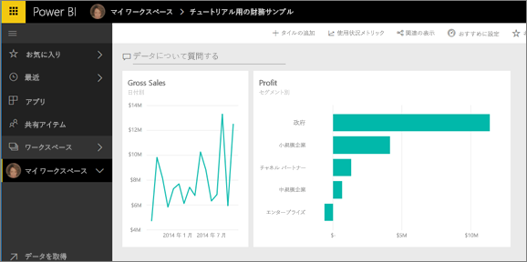

# Power BI サービスの概要 (app.powerbi.com)
このチュートリアルは、初めて ***Power BI サービス***を使うときに役立ちます。 Power BI サービスと他の Power BI 製品の関係を理解するため、最初に「[Power BI とは?](guided-learning/gettingstarted.yml#step-1)」を読むことを強くお勧めします。

Power BI サービスには、無料版と Pro バージョンがあります。 どちらのバージョンを使っていても、"*アカウントが既にある場合は*"、ブラウザーで「app.powerbi.com」と入力すると Power BI サービスが開きます。 新しいユーザーの場合は、代わりに www.powerbi.com から始めることをお勧めします。 ここでは、サービスにログインする前に Power BI について詳しく学習できます。  試す準備ができたら、右上隅に表示されている **[無料でサインアップ]** リンクを選びます。 ユーザーの代わりに管理者が Power BI を既に有効にしている場合は、[無料でサインアップ] ボタンを使わず、app.powerbi.com に直接移動してください。 

Power BI Desktop のヘルプを探している場合は、「[デスクトップを使う](desktop-getting-started.md)」をご覧ください。 Power BI モバイルについては、「[モバイル デバイス用の Power BI アプリ](mobile-apps-for-mobile-devices.md)」をご覧ください。

> [!TIP]
> 自分のペースで進められる無料のトレーニング コースを代わりに選択しますか? [EdX の Analyzing and Visualizing Data (データの分析と視覚化) コースに登録](http://aka.ms/edxpbi)してください。

[YouTube の再生リスト](https://www.youtube.com/playlist?list=PL1N57mwBHtN0JFoKSR0n-tBkUJHeMP2cP)を参照してください。 始めるのに役に立つビデオは、「Introduction to Power BI service」 (Power BI サービスの概要) です。
> 
> <iframe width="560" height="315" src="https://www.youtube.com/embed/B2vd4MQrz4M" frameborder="0" allowfullscreen></iframe>
> 
> 
> 

Microsoft Power BI を使用すると、重要な最新情報の通知を受けることができます。  Power BI サービスの***ダッシュボード***を使うと、ビジネスの最新情報を入手できます。  ダッシュボードに***タイル***が表示されます。タイルをクリックすると、***レポート***を開いてさらに調査できます。  複数の***データ セット***に接続し、関連するすべてのデータを 1 か所にまとめます。 Power BI を構成する要素を理解するうえで助けが必要ですか?  「[Power BI - 基本的な概念](service-basic-concepts.md)」をご覧ください。

Excel ファイルまたは CSV ファイルに重要なデータがある場合、Power BI ダッシュボードを作成し、どこにいても通知が受けられるようにし、他のユーザーと洞察を共有できるようにすることができます。  Salesforce などの SaaS アプリケーションへのサブスクリプションを使用していますか。  Salesforce に接続してそのデータから自動的にダッシュボードを作成するか、接続可能な[その他のすべての SaaS アプリケーションをチェックアウト](service-get-data.md)すると、一歩進んだスタートが切れます。 組織に属している場合は、[アプリ](service-create-distribute-apps.md)が自分に公開されているかどうかを確認します。

その他のすべての方法については、「[Power BI のデータの取得](service-get-data.md)」を参照してください。

## 手順 1: データの取得
CSV ファイルからデータを取得する例を次に示します。 このチュートリアルに従って作業しますか? [このサンプル CSV ファイルをダウンロード](http://go.microsoft.com/fwlink/?LinkID=521962)してください。

1. [Power BI にサインイン](http://www.powerbi.com/)します。 アカウントをお持ちではありませんか。 心配しないでください。無料でサインアップできます。
2. Power BI がブラウザーで開きます。 左ナビゲーション バーの下部にある **[データの取得]** を選びます。
   
   
3. **[ファイル]**を選択します。 
   
   
4. コンピューター上のファイルに移動し、**[開く]** を選びます。 OneDrive for Business に保存してある場合は、そのオプションを選びます。 ローカルに保存してある場合は、**[ローカル ファイル]** を選びます。 
   
   
5. このチュートリアルでは、**[インポート]** を選び、レポートおよびダッシュボードの作成に使用できるデータセットとして、Excel ファイルを追加します。 **[アップロード]** を選択した場合は、Excel ブック全体が Power BI にアップロードされるので、それを Excel Online で開いて編集できます。
   
   
6. データセットの準備ができたら、**[データセットの表示]** を選んでレポート エディターで開きます。 

    

    視覚エフェクトをまだ作成していないため、レポート キャンバスは空白になっています。

    

6. 上部のメニュー バーに **[読み取りビュー]** というオプションがあることを確認してください。 [読み取りビュー] オプションが表示されていれば、現在**編集ビュー**を開いていることを意味します。 

    

    編集ビューが表示されるユーザーはレポートの "*所有者*" なのでレポートを編集できます。このようなユーザーは "*作成者*" でもあります。 同僚とレポートを共有している場合、同僚は読み取りビューでレポートを操作することだけができます。このようなユーザーは "*コンシューマー*" です。 詳しくは、[読み取りビューと編集ビュー](service-reading-view-and-editing-view.md)に関するトピックをご覧ください。
    
    レポート エディターについて詳しく理解するには、[用意されているツアー](service-the-report-editor-take-a-tour.md)をご覧ください。
   > 
 

## 手順 2: データセットを探索する
データに接続したので、探索を開始します。  何か興味深いものを発見したときは、ダッシュボードを作成し、時間経過によってどのように変化するかを監視できます。 そのしくみを見てみましょう。
    
1. レポート エディターで、ページの右側にある **[フィールド]** ウィンドウを使って視覚エフェクトを作成します。  **[Gross Sales]** (総売り上げ) の横にあるチェック ボックスを選び、**[日付]** を選びます。
   
   

2. Power BI は、データを分析して視覚エフェクトを作成します。  最初に **[日付]** を選択した場合、テーブルが表示されます。  最初に **[Gross Sales]** (総売り上げ) を選択した場合、グラフが表示されます。 別のデータ表示方法に切り替えます。 このデータを折れ線グラフにしてみます。 **[視覚化] ウィンドウ**で折れ線グラフ アイコン (テンプレートとも呼ばれます) を選びます。
   
   

3. 役に立ちそうなので、グラフをダッシュボードに "*ピン留め*" します。 視覚エフェクトをポイントし、**[ピン留め]** アイコンを選びます。  この視覚エフェクトをピン留めすると、最新の値がひとめでわかるようにダッシュボードに保存されて最新の様態に維持されます。
   
   

5. これは新しいレポートであるため、視覚エフェクトをダッシュボードにピン留めする前に、レポートを保存するよう要求されます。 レポートに名前を付け (たとえば、"*一定期間内の売上*" など)、**[保存してから続ける]** を選びます。 
   
   
   
6. 新しいダッシュボードに折れ線グラフをピン留めし、"チュートリアルの財務サンプル" という名前を付けます。 
   
   
   
 1. **[Pin]**(ピン留め) を選択します。
   
    右上隅の近くに成功メッセージが表示されたら、視覚エフェクトがダッシュボードにタイルとして追加されたことがわかります。
   
    

8. **[ダッシュボードに移動]** を選び、新しいダッシュボードにタイルとしてピン留めされた折れ線グラフを確認します。 視覚エフェクトのタイルをさらに追加し、[タイルの名前変更やサイズ変更、リンク、位置変更](service-dashboard-edit-tile.md)を行って、ダッシュボードの見栄えをよくします。
   
   
   
   ダッシュボード上の新しいタイルを選ぶと、いつでもレポートに戻ることができます。 Power BI の表示が読み取りビューのレポート エディターに戻ります。 編集ビューに戻すには、上部のメニュー バーから **[レポートの編集]** を選びます。 編集ビューになったら、タイルの調査とピン留めを続けます。 

## 手順 3: Q&A で探索を続行する (自然言語によるクエリ)
1. データのクイック探索については、Q & A ボックスで質問してください。 Q&A の質問ボックスは、ダッシュボードの上部 (**[データについて質問する]**) と、レポートの上部メニュー バー (**[質問する]**) にあります。 たとえば、「what segment had the most revenue」(最も収益が高いセグメントはどれですか) と入力してみてください。
   
   

2. Q&A によって回答が検索され、視覚エフェクトの形式で表示されます。 ピン アイコン  をクリックすることによっても、ダッシュボードの視覚エフェクトを表示できます。
3. "チュートリアルの財務サンプル" ダッシュボードに視覚エフェクトをピン留めします。
   
    

4. ダッシュボードに戻ると、新しいタイルが表示されます。

   

## 次の手順
さらに試してみる準備ができましたか。  次の方法で Power BI を調べることができます。

* [別のデータセットに接続する](service-get-data.md)。
* 同僚と[ダッシュボードを共有する](service-share-dashboards.md)。
* [ダッシュボードのデザインのヒント](service-dashboards-design-tips.md)を見る。
* [モバイル デバイスで Power BI アプリを使用して](mobile-apps-for-mobile-devices.md)ダッシュボードを表示する。

始めるにはもう少し準備が必要ですか。 その場合は、次のトピックから始めてください。これらのトピックで、Power BI に慣れることができます。

* [レポート、データセット、ダッシュボード、およびタイルのすべてをまとめる方法](service-basic-concepts.md)
* [Power BI のガイド付き学習](guided-learning/index.md)サイトにアクセスし、いくつか (非常に短い) コースを受講する
* [Power BI のビデオ](videos.md)を見る
* [使用可能なサンプル](sample-datasets.md)

### Power BI に関する最新情報の入手方法
* Twitter で [@MSPowerBI をフォローする](https://twitter.com/mspowerbi)
* [YouTube ビデオ チャネル](https://www.youtube.com/channel/UCy--PYvwBwAeuYaR8JLmrfg)を購読します。
* オンデマンドの [Power BI の概要に関する Web セミナー](webinars.md)を視聴する
* ヘルプの入手方法がわからない場合は、 「[ヘルプを得るための 10 のヒント](service-tips-for-finding-help.md)」ページをご覧ください。

他にわからないことがある場合は、 [Power BI コミュニティで質問してみてください](http://community.powerbi.com/)。

