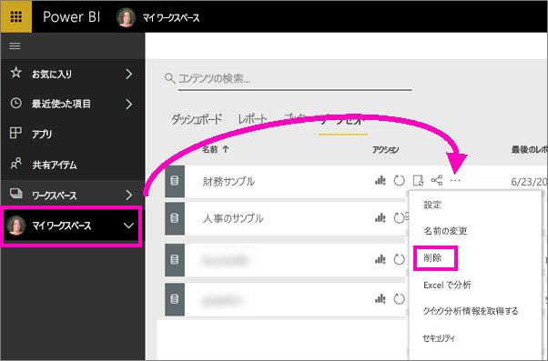

# チュートリアル:Power BI サービスの概要 (app.powerbi.com)
このチュートリアルは、初めて ***Power BI サービス***を使うときに役立ちます。 Power BI サービスと他の Power BI 製品の関係を理解するため、最初に「[Power BI とは?](power-bi-overview.md)」を読むことを強くお勧めします。

このチュートリアルでは、以下の手順を実行します。

> [!div class="checklist"]
> * Power BI サービスのその他の入門コンテンツを探します
> * Power BI オンライン アカウントにサインインするか、まだ行っていない場合はサインアップします
> * Power BI サービスを開きます
> * データをいくつか取得し、それをレポート ビューで開きます
> * そのデータを使用して視覚化を作成し、レポートとして保存します
> * レポートからタイルをピン留めし、ダッシュボードを作成します
> * Q&A 自然言語ツールを利用し、別の視覚化をダッシュボードに追加します
> * データセット、レポート、ダッシュボードを削除してリソースをクリーンアップします

## Power BI サービスにサインアップする
Power BI にサインアップしていない場合は、始める前に[無料の Power BI Pro 試用版にサインアップ](https://app.powerbi.com/signupredirect?pbi_source=web)してください。

アカウントを既に持っている場合は、ブラウザーを開き、「app.powerbi.com」と入力すると Power BI サービスが開きます。 

Power BI Desktop のヘルプを探している場合は、「[Power BI Desktop の概要](desktop-getting-started.md)」をご覧ください。 Power BI モバイルについては、「[モバイル デバイス用の Power BI アプリ](consumer/mobile/mobile-apps-for-mobile-devices.md)」をご覧ください。

> [!TIP]
> 自分のペースで進められる無料のトレーニング コースを代わりに選択しますか? [EdX の Analyzing and Visualizing Data (データの分析と視覚化) コースに登録](http://aka.ms/edxpbi)してください。

[YouTube の再生リスト](https://www.youtube.com/playlist?list=PL1N57mwBHtN0JFoKSR0n-tBkUJHeMP2cP)を参照してください。 使い始める場合は、次のビデオ「Introduction to Power BI service」 (Power BI サービスの概要) が役に立ちます。
> 
> <iframe width="560" height="315" src="https://www.youtube.com/embed/B2vd4MQrz4M" frameborder="0" allowfullscreen></iframe>
> 

## Power BI サービスとは何ですか?
Microsoft Power BI サービスは、Power BI オンラインまたは app.powerbi.com とも呼ばれています。 Power BI を利用すると、自分にとって重要な事柄について常に最新情報を得ることができます。  Power BI サービスの***ダッシュボード***を使うと、ビジネスの実情を正確に把握することができます。  ダッシュボードに***タイル***が表示されます。タイルをクリックすると、***レポート***を開いてさらに調査できます。  複数の***データ セット***に接続し、関連するすべてのデータを 1 か所にまとめます。 Power BI を構成する要素を理解するうえで助けが必要ですか?  「[Power BI - 基本的な概念](consumer/end-user-basic-concepts.md)」をご覧ください。

Excel ファイルまたは CSV ファイルに重要なデータがある場合、Power BI ダッシュボードを作成し、どこにいても通知が受けられるようにし、他のユーザーと洞察を共有できるようにすることができます。  Salesforce などの SaaS アプリケーションへのサブスクリプションを使用していますか。  Salesforce に接続してそのデータから自動的にダッシュボードを作成するか、接続可能な[その他のすべての SaaS アプリケーションをチェックアウト](service-get-data.md)すると、一歩進んだスタートが切れます。 組織に属している場合は、[アプリ](service-create-distribute-apps.md)が自分に公開されているかどうかを確認します。

その他のすべての方法については、「[Power BI のデータの取得](service-get-data.md)」を参照してください。

## 手順 1:データを取得
CSV ファイルからデータを取得する例を次に示します。 このチュートリアルに従って作業しますか? [このサンプル CSV ファイルをダウンロード](http://go.microsoft.com/fwlink/?LinkID=521962)してください。

1. [Power BI にサインイン](http://www.powerbi.com/)します。 アカウントをお持ちではありませんか。 心配はご無用です。無料の試用版にご登録いただけます。
2. Power BI がブラウザーで開きます。 左ナビゲーション バーの下部にある **[データの取得]** を選びます。
   
   
3. **[ファイル]** を選択します。 
   
   
4. コンピューター上のファイルに移動し、 **[開く]** を選びます。 OneDrive for Business に保存してある場合は、そのオプションを選びます。 ローカルに保存してある場合は、 **[ローカル ファイル]** を選びます。 
   
   ![[データの取得] > [ファイル] 画面](media/service-get-started/gs2.png)
5. このチュートリアルでは、 **[インポート]** を選び、レポートおよびダッシュボードの作成に使用できるデータセットとして、Excel ファイルを追加します。 **[アップロード]** を選択した場合は、Excel ブック全体が Power BI にアップロードされるので、それを Excel Online で開いて編集できます。
   
   
6. データセットの準備ができたら、 **[データセットの表示]** を選んでレポート エディターで開きます。 

    

    視覚エフェクトをまだ作成していないため、レポート キャンバスは空白になっています。

    

6. 上部のメニュー バーに **[読み取りビュー]** というオプションがあることを確認してください。 [読み取りビュー] オプションが表示されていれば、現在**編集ビュー**を開いていることを意味します。 

    ![[読み取りビュー] オプション](media/service-get-started/power-bi-editing-view.png)

    編集ビューが表示されるユーザーはレポートの "*所有者*" なのでレポートを編集できます。このようなユーザーは "*作成者*" でもあります。 同僚とレポートを共有している場合、同僚は読み取りビューでレポートを操作することだけができます。このようなユーザーは "*コンシューマー*" です。 詳しくは、[読み取りビューと編集ビュー](consumer/end-user-reading-view.md)に関するトピックをご覧ください。
    
    レポート エディターについて詳しく理解するには、[用意されているツアー](service-the-report-editor-take-a-tour.md)をご覧ください。
   > 
 

## 手順 2:データセットを探索する
データに接続したので、探索を開始します。  何か興味深いものを発見したときは、ダッシュボードを作成し、時間経過によってどのように変化するかを監視できます。 そのしくみを見てみましょう。
    
1. レポート エディターで、ページの右側にある **[フィールド]** ウィンドウを使って視覚エフェクトを作成します。  **[Gross Sales]** (総売り上げ) の横にあるチェック ボックスを選び、 **[日付]** を選びます。
   
   

2. Power BI は、データを分析して視覚エフェクトを作成します。  最初に **[日付]** を選択した場合、テーブルが表示されます。  最初に **[Gross Sales]** (総売り上げ) を選択した場合、グラフが表示されます。 別のデータ表示方法に切り替えます。 このデータを折れ線グラフにしてみます。 **[視覚化] ウィンドウ**で折れ線グラフ アイコン (テンプレートとも呼ばれます) を選びます。
   
   

3. 役に立ちそうなので、グラフをダッシュボードに "*ピン留め*" します。 視覚エフェクトをポイントし、 **[ピン留め]** アイコンを選びます。  この視覚エフェクトをピン留めすると、最新の値がひとめでわかるようにダッシュボードに保存されて最新の様態に維持されます。
   
   

4. これは新しいレポートであるため、視覚エフェクトをダッシュボードにピン留めする前に、レポートを保存するよう要求されます。 レポートに名前を付け (たとえば、"*一定期間内の売上*" など)、 **[保存してから続ける]** を選びます。 
   
   
   
5. 新しいダッシュボードに折れ線グラフをピン留めし、"チュートリアルの財務サンプル" という名前を付けます。 
   
   
   
1. **[Pin]** (ピン留め) を選択します。
   
    右上隅の近くに成功メッセージが表示されたら、視覚エフェクトがダッシュボードにタイルとして追加されたことがわかります。
   
    

6. **[ダッシュボードに移動]** を選び、新しいダッシュボードにタイルとしてピン留めされた折れ線グラフを確認します。 視覚エフェクトのタイルをさらに追加し、[タイルの名前変更やサイズ変更、リンク、位置変更](service-dashboard-edit-tile.md)を行って、ダッシュボードの見栄えをよくします。
   
   
   
   ダッシュボード上の新しいタイルを選ぶと、いつでもレポートに戻ることができます。 Power BI の表示が読み取りビューのレポート エディターに戻ります。 編集ビューに戻すには、上部のメニュー バーから **[レポートの編集]** を選びます。 編集ビューになったら、タイルの調査とピン留めを続けます。 

## 手順 3:Q&A で探索を続行する (自然言語によるクエリ)
1. データのクイック探索については、Q & A ボックスで質問してください。 Q&A の質問ボックスは、ダッシュボードの上部 ( **[データについて質問する]** ) と、レポートの上部メニュー バー ( **[質問する]** ) にあります。 たとえば、「what segment had the most revenue」(最も収益が高いセグメントはどれですか) と入力してみてください。
   
   

2. Q&A によって回答が検索され、視覚エフェクトの形式で表示されます。 ピン留めアイコン  を選ぶことによっても、ダッシュボードの視覚エフェクトを表示できます。
3. "チュートリアルの財務サンプル" ダッシュボードに視覚エフェクトをピン留めします。
   
    

4. ダッシュボードに戻ると、新しいタイルが表示されます。

   

## リソースをクリーンアップする
チュートリアルはこれで完了です。データセット、レポート、ダッシュボードは削除してかまいません。 

1. 左側のナビゲーション バーで **[マイ ワークスペース]** を選択します。
2. **[データセット]** タブを選択し、このチュートリアルのためにインポートしたデータセットを検索します。  
3. 省略記号 (...) を選択し、 **[削除]** を選択します。

    

    データセットを削除すると、レポートとダッシュボードも削除されます。 

## 次の手順
さらに試してみる準備ができましたか。  次の方法で Power BI を調べることができます。

> [!div class="nextstepaction"]
> [使用するオンライン サービスに接続する](service-connect-to-services.md)

