# Power BI サービスの概要
このチュートリアルは、初めて ***Power BI サービス***を使うときに役立ちます。 Power BI サービスと他の Power BI 製品の関係を理解するため、最初に「[Power BI とは?](guided-learning/gettingstarted.yml#step-1)」を読むことを強くお勧めします。

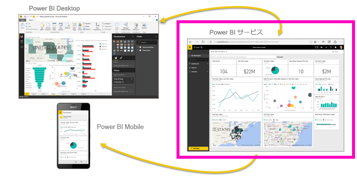

Power BI サービスには、無料版と Pro バージョンがあります。 どちらのバージョンでも、最初はブラウザーで「www.powerbi.com」と入力します。 既にサインアップしている場合は、右上隅に表示される **[サインイン]** リンクを選びます。 Power BI サービスにまだサインアップしていない場合は、**[無料でサインアップ]** リンクを代わりに選びます。

Power BI Desktop のヘルプを探している場合は、「[デスクトップを使う](desktop-getting-started.md)」をご覧ください。 Power BI モバイルについては、「[モバイル デバイス用の Power BI アプリ](mobile-apps-for-mobile-devices.md)」をご覧ください。

> [!TIP]
> 自分のペースで進められる無料のトレーニング コースを代わりに選択しますか? [EdX の Analyzing and Visualizing Data (データの分析と視覚化) コースに登録](http://aka.ms/edxpbi)してください。

[YouTube の再生リスト](https://www.youtube.com/playlist?list=PL1N57mwBHtN0JFoKSR0n-tBkUJHeMP2cP)を参照してください。 始めるのに役に立つビデオは、「Introduction to Power BI service」 (Power BI サービスの概要) です。
> 
> <iframe width="560" height="315" src="https://www.youtube.com/embed/B2vd4MQrz4M" frameborder="0" allowfullscreen></iframe>
> 
> 
> 

Microsoft Power BI を使用すると、重要な最新情報の通知を受けることができます。  Power BI サービスの***ダッシュボード***を使うと、ビジネスの最新情報を入手できます。  ダッシュボードに***タイル***が表示されます。タイルをクリックすると、***レポート***を開いてさらに調査できます。  複数の***データ セット***に接続し、関連するすべてのデータを 1 か所にまとめます。 Power BI を構成する要素を理解するうえで助けが必要ですか?  「[Power BI - 基本的な概念](service-basic-concepts.md)」をご覧ください。

Excel ファイルまたは CSV ファイルに重要なデータがある場合、Power BI ダッシュボードを作成し、どこにいても通知が受けられるようにし、他のユーザーと洞察を共有できるようにすることができます。  Salesforce などの SaaS アプリケーションへのサブスクリプションを使用していますか。  [Salesforce に接続](service-connect-to-salesforce.md)してそのデータから自動的にダッシュボードを作成するか、接続可能な[その他のすべての SaaS アプリケーションをチェックアウト](service-get-data.md)することにより、競争相手より先にスタートが切れます。 組織に属している場合は、[アプリ](service-create-distribute-apps.md)が自分に公開されているかどうかを確認します。

その他のすべての方法については、「[Power BI のデータの取得](service-get-data.md)」を参照してください。

## 手順 1: データの取得
CSV ファイルからデータを取得する例を次に示します。 このチュートリアルに従って作業しますか? [このサンプル CSV ファイルをダウンロード](http://go.microsoft.com/fwlink/?LinkID=521962)してください。

1. [Power BI にサインイン](http://www.powerbi.com/)します。 アカウントをお持ちではありませんか。 心配しないでください。無料でサインアップできます。
2. Power BI がブラウザーで開きます。 左側のナビゲーション ウィンドウの下部にある **[データの取得]** を選択します。
   
   
3. **[ファイル]**を選択します。 
   
   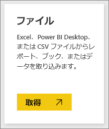
4. **[ローカル ファイル]**を選択し、コンピューター上のファイルに移動し、 **[開く]**を選択します。
   
   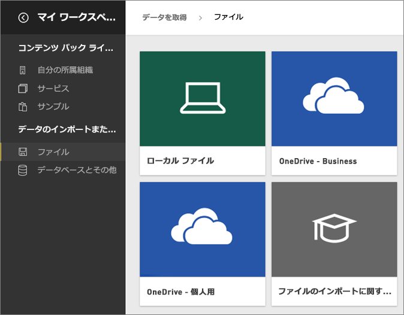
5. このチュートリアルでは、**[インポート]** を選び、レポートおよびダッシュボードの作成に使用できるデータセットとして、Excel ファイルを追加します。  
   
   > [!NOTE]
   > **[アップロード]** を選択した場合は、Excel ブック全体が Power BI にアップロードされるので、それを Excel Online で開いて編集できます。
   > 
   > 
   
   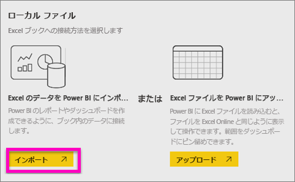
6. データセットの準備ができたら、**[データセットの表示]** を選んでレポート エディターで開きます。 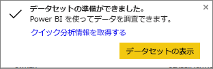
   
   > [!TIP]
   > レポート エディターについて詳しく理解するには、[用意されているツアー](service-the-report-editor-take-a-tour.md)をご覧ください。
   > 
   > 

## 手順 2: データセットを探索する
データに接続した後、洞察を得るために探索します。  監視対象が見つかったら、ダッシュボードを作成し、その変更を追跡します。

1. ダッシュボード上のデータセット イメージを選んで、接続したばかりのデータを探索するか、**[データセット]** 見出しの下でデータセット名を選択してそのデータセットを開きます。 これにより、空のレポートとしてデータセットが開きます。
   
   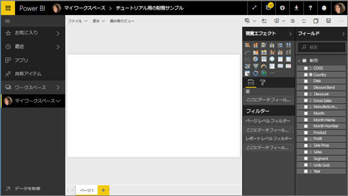
   
   > [!NOTE]
> データを探索するもう 1 つの方法は、**クイック分析情報**です。  詳しくは、「[クイック インサイトの概要](service-insights.md)」をご覧ください。
   > 
   > 
2. ページの右側の **[フィールド]** の一覧から、視覚エフェクトを作成するためのフィールドを選択します。  **[Gross Sales]** (総売り上げ) の横にあるチェック ボックスを選び、**[日付]** を選びます。
   
   
3. Power BI はデータを分析し、視覚エフェクトを作成します。  最初に **[日付]** を選択した場合、テーブルが表示されます。  最初に **[Gross Sales]** (総売り上げ) を選択した場合、グラフが表示されます。 別のデータ表示方法に切り替えます。 折れ線グラフのオプションをクリックして、折れ線グラフに変更してみてください。
   
   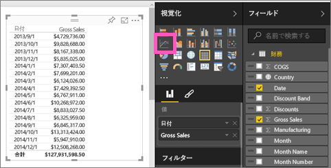
4. 必要な視覚エフェクトがダッシュボードに表示されたら、その視覚エフェクトを選択し、**[ピン]** アイコンを選択します。  この視覚エフェクトをピン留めすると、最新の値が一目でわかるようにダッシュボードに保存されます。
   
   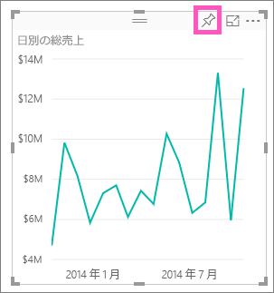
5. これは新しいレポートであるため、そこから視覚エフェクトをダッシュボードにピン留めするには、まず保存する必要があります。 レポートに名前を付け (たとえば、 *一定期間内の売上* など)、 **[保存して続行]** を選択します。 
   
   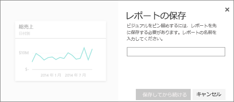
   
   ナビゲーション ウィンドウの **[レポート]** 見出しの下に新しいレポートが表示されます。
6. タイルを既存のダッシュボードまたは新しいダッシュボードにピン留めします。 
   
   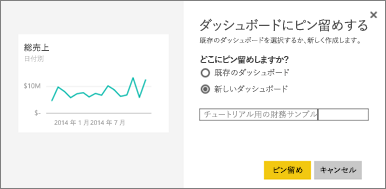
   
   * **既存のダッシュボード**: ドロップダウン リストから、ダッシュボードの名前を選択します。
   * **新しいダッシュボード**: 新しいダッシュボードの名前を入力します。
7. **[Pin]**(ピン留め) を選択します。
   
   右上隅の近くに成功メッセージが表示されたら、視覚エフェクトがダッシュボードにタイルとして追加されたことがわかります。
   
   
8. **[ダッシュボードへ移動]** を選び、タイルがピン留めされた新しいダッシュボードを表示します。 折れ線グラフが、タイルとしてダッシュボードにピン留めされます。 [タイルの名前変更やサイズ変更、リンク、位置変更](service-dashboard-edit-tile.md)を行って、ダッシュボードの見栄えを良くします。
   
   
   
   ダッシュボード上の新しいタイルを選ぶと、いつでもレポートに戻ることができます。

## 手順 3: Q&A で探索を続行する (自然言語によるクエリ)
1. データのクイック探索については、Q & A ボックスで質問してください。 Q&A の質問ボックスは、ダッシュボードの上部にあります。 たとえば、"**what segment had the most revenue (最も収益が高いセグメントはどれですか)**" と入力してみてください。
   
   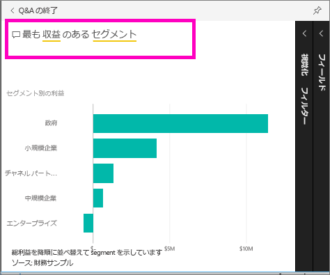
2. ピン アイコン  をクリックすることによっても、ダッシュボードの視覚エフェクトを表示できます。
3. 財務サンプルのダッシュボードに視覚エフェクトをピン留めします。
   
    
4. **[QA の終了]** の戻る矢印  を選択してダッシュボードに戻ると、新しいタイルが表示されます。

## 次の手順
さらに試してみる準備ができましたか。  次の方法で Power BI をさらに調べることができます。

* [別のデータセットに接続する](service-get-data.md)。
* 同僚と[ダッシュボードを共有する](service-share-dashboards.md)。
* [ダッシュボードのデザインのヒント](service-dashboards-design-tips.md)を見る。
* [モバイル デバイスで Power BI アプリを使用して](mobile-apps-for-mobile-devices.md)ダッシュボードを表示する。

始めるにはもう少し準備が必要ですか。 その場合は、次のトピックから始めてください。これらのトピックで、Power BI に慣れることができます。

* [レポート、データセット、ダッシュボード、およびタイルのすべてをまとめる方法](service-basic-concepts.md)
* [Power BI のビデオ](videos.md)
* [使用可能なサンプル](sample-datasets.md)

### Power BI に関する最新情報の入手方法
* Twitter で [@MSPowerBI をフォローする](https://twitter.com/mspowerbi)
* [YouTube ビデオ チャネル](https://www.youtube.com/channel/UCy--PYvwBwAeuYaR8JLmrfg)を購読します。
* オンデマンドの [Power BI の概要に関する Web セミナー](webinars.md)を視聴する
* ヘルプの入手方法がわからない場合は、 「[ヘルプを得るための 10 のヒント](service-tips-for-finding-help.md)」ページをご覧ください。

他にわからないことがある場合は、 [Power BI コミュニティで質問してみてください](http://community.powerbi.com/)。

