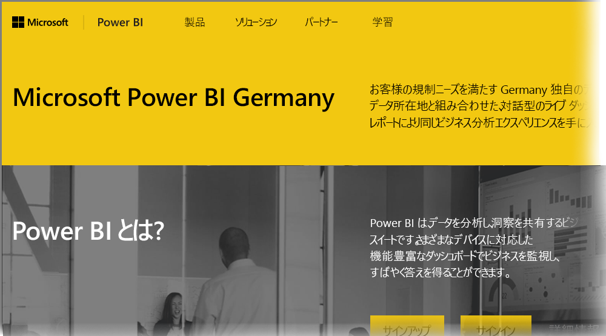

# ドイツ クラウド顧客向け Power BI のよく寄せられる質問用
**Power BI サービス**には、欧州連合/European Free Trade Agreement (EU/EFTA) 顧客向けバージョンがあります (別称 Microsoft Cloud Deutschland、MCD)。 この記事で説明する **Power BI サービス**のバージョンは、EU/EFTA 顧客向けであり、**Power BI サービス**の市販バージョンまたは政府顧客向け Power BI サービスとは別の独立したものです。

次の質問と回答は、EU/EFTA 顧客専用に提供されている Power BI サービス クラウドである Power BI Pro Service in Microsoft Cloud Deutschland (MCD) の重要な情報です。

1. **Germany Cloud 向け Power BI サービスとは何ですか?**
   
   EU/EFTA 顧客向け Power BI サービス (Microsoft Cloud Deutschland (MCD)) は、ドイツのデータセンターから提供される Power BI サービスの EU/EFTA 準拠クラウドです。 EU/EFTA クラウド向け Power BI サービスのすべての顧客データは、独立したドイツのデータ トラスティである T-Systems によってドイツ内に保存され、データへの物理的および論理的アクセスはドイツの法律で管理されます。 EU/EFTA クラウド向け Power BI サービスには、市販バージョンの Power BI サービスとは異なるアカウントが必要です。 Microsoft Cloud Deutschland について詳しくは、[こちら](https://www.microsoft.com/trustcenter/cloudservices/nationalcloud)をご覧ください。
2. **Power BI Germany Cloud の価格とサインアップの情報はどこにありますか?**
   
   価格など多くの情報は、[Power BI Germany Cloud のホーム ページ](https://powerbi.microsoft.com/power-bi-germany/)でご覧になれます。 そのページには、25 ユーザー ライセンス付きで 30 日間有効の **Power BI Pro サービス**試用版にサインアップするためのリンクもあります。 試用版サインアップの一環として、必要に応じて購入またはライセンスを追加できます。 Enterprise Agreement (EA)、政府機関、および非営利料金も提供しています。 詳しくは、担当の Microsoft の顧客担当者にお問い合わせください。
3. **Azure Germany および Office 365 Germany サブスクリプションの一部の Germany Cloud テナントを持っています。既存のテナントを使って Power BI Germany にサインアップできますか?**
   
   はい。 サインアップ プロセスの一部として、既存の Germany Cloud テナント管理者アカウントでログインし、Power BI Pro サービス ライセンスを Germany Cloud の既存のテナントに追加できます。 Germany Cloud テナントとユーザー アカウントは Germany Cloud 用 Power BI サービスとは異なることに注意してください。
4. **Germany Cloud 用 Power BI サービスに無料サービスはありますか?**
   
   いいえ。 Germany Cloud 用 Power BI サービスには無料ライセンス バージョンはありません。 ただし、ビジネス ニーズが Power BI 無料プランで満たされる場合は、[パブリック クラウドの Power BI 無料プラン](https://powerbi.microsoft.com/get-started/)にサインアップすることをお勧めします。
5. **Power BI Desktop、Power BI Mobile、オンプレミス データ ゲートウェイ、Publisher for Excel を Germany Cloud 向け Power BI サービスで使用できますか?**
   
   はい。 Power BI クライアント製品は、Germany Cloud 向け Power BI サービスでシームレスに動くように更新されています。 Germany Cloud 向け Power BI サービス アカウントでログインし、Germany Cloud 向け Power BI サービスで同じクライアント製品を使ってください。 最新バージョンのクライアント製品は次の場所からダウンロードできます。
   
   * [Power BI Desktop](https://powerbi.microsoft.com/desktop/)
   * [Power BI モバイル](https://powerbi.microsoft.com/mobile/)
   * [オンプレミス データ ゲートウェイ](https://powerbi.microsoft.com/gateway/)
   * [Power BI Publisher for Excel](https://powerbi.microsoft.com/excel-dashboard-publisher/)
6. **Germany Cloud 向け Power BI サービスには機能制限がありますか?**
   
   現在、Germany Cloud 向け Power BI サービスでは次のサービス機能は使えません。
   
   * Web に公開
   * Esri による ArcGIS マップ
   * Power BI Embedded (別に測定される ISV ライセンスは、将来 [Microsoft Azure Germany](https://azure.microsoft.com/overview/clouds/germany/) で提供されます)
7. **アプリケーションでの使用と統合に関する Germany Cloud 向け Power BI サービス固有の構成情報はどこにありますか?**
   
   ドイツおよび他の Power BI クラウド固有の構成情報の [SaaS Embedding 開発者サンプル](https://github.com/Microsoft/PowerBI-Developer-Samples)を更新しました。 クラウド固有構成エンドポイントのサンプルの **Cloud Configs** フォルダーをご覧ください。 次の表は、Germany Cloud 向け Power BI サービスのさまざまな構成エンドポイントです (および相互参照用パブリック クラウド)。

| **エンドポイント名および使用方法** | **Germany Cloud 向け Power BI サービスの URL** | **パブリック クラウドの同等の URL (相互参照)** |
| --- | --- | --- |
| ホーム ページ、サインアップ、サインイン |[https://powerbi.microsoft.com/power-bi-germany/](https://powerbi.microsoft.com/power-bi-germany/) |[https://powerbi.microsoft.com/](https://powerbi.microsoft.com/) |
| Power BI サービス直接サインイン |[https://app.powerbi.de/?noSignUpCheck=1](https://app.powerbi.de/?noSignUpCheck=1) |[https://app.powerbi.com/?noSignUpCheck=1](https://app.powerbi.com/?noSignUpCheck=1) |
| サービス API |[https://api.powerbi.de/](https://api.powerbi.de/) |[https://api.powerbi.com/](https://api.powerbi.com/) |
| 管理者によるユーザー ライセンス管理、サービス正常性ステータス、サポート要求用の Office ポータル |[https://portal.office.de/](https://portal.office.de/) |[https://portal.office.com/](https://portal.office.com/) |
| AAD オーソリティ URI |[https://login.microsoftonline.de/common/oauth2/authorize/](https://login.microsoftonline.de/common/oauth2/authorize/) |[https://login.microsoftonline.com/common/oauth2/authorize/](https://login.microsoftonline.com/common/oauth2/authorize/) |
| Power BI サービス リソース URI |[https://analysis.cloudapi.de/powerbi/api](https://analysis.cloudapi.de/powerbi/api) |[https://analysis.windows.net/powerbi/api](https://analysis.windows.net/powerbi/api) |
| カスタム ビジュアル ライブラリ |[https://app.powerbi.de/visuals/](https://app.powerbi.de/visuals/) |[https://app.powerbi.com/visuals/](https://app.powerbi.com/visuals/) |
| Power BI 用アプリケーション登録 (Embedded 用) |[https://app.powerbi.de/apps](https://app.powerbi.de/apps) |[https://app.powerbi.com/apps](https://app.powerbi.com/apps) |
| Azure Portal (Embedded 用) |[https://portal.microsoftazure.de/](https://portal.microsoftazure.de/) |[https://portal.azure.com/](https://portal.azure.com/) |
| コミュニティ |[https://community.powerbi.com/](https://community.powerbi.com/) |[https://community.powerbi.com/](https://community.powerbi.com/) |

### 次の手順
Power BI を使うと、さまざまなことを行えます。 サービスにサインアップする方法を説明する記事など、詳細および学習については、次のリソースをご覧ください。

* [Power BI のガイド付き学習](guided-learning/gettingstarted.yml?tutorial-step=1)
* [Power BI サービスの概要](service-get-started.md)
* [Power BI Desktop の概要](desktop-getting-started.md)

