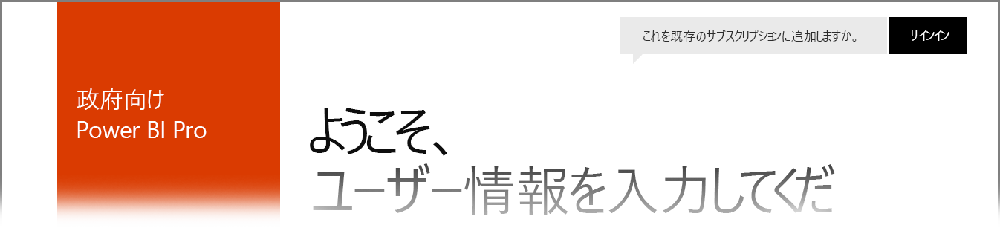

# 米国政府顧客向け Power BI
**Power BI サービス**には、**Office 365 US Government Community** サブスクリプションの一部として米国政府顧客が利用できるバージョンがあります。 この記事で説明する **Power BI サービス**のバージョンは、米国政府顧客向けに特に設計されており、**Power BI サービス**の市販バージョンとは独立した別のものです。

以下のセクションでは、 **Power BI サービス** の米国政府バージョンで使用できる *機能* について説明し、いくつかの *制限事項* を明らかにし、よくある質問 ( **FAQ** ) と回答 (サインアップ方法を含みます) を示して、詳細情報へのリンクを提供します。

## 米国政府向け Power BI の機能
**米国政府向け Power BI** は **Pro ライセンス**のみで入手できます。無償版ライセンスはありません。 Power BI サービスの一部の機能は、このサービスの**米国政府向け Power BI** バージョンで利用できます。

次の機能は **Pro** ライセンスのものであり、**米国政府向け Power BI** で利用できます。

* ダッシュボードとレポートの作成と表示
* [データ容量の制限](service-admin-manage-your-data-storage-in-power-bi.md)
* [スケジュールされたデータ更新](refresh-data.md)
* 更新可能なチーム ダッシュボード
* アクセス制御の共有と管理のための Active Directory グループ
* Excel、CSV、Power BI Desktop ファイルからのレポートと[データのインポート](service-get-data.md)
* Data Management Gateway
* すべてのデータは、Azure SQL と Power BI 用 Blob Storage の両方で暗号化されます
* [コンテンツ パック](service-connect-to-services.md)でのサービスへの接続

## 行政機関向け Azure Cloud Services とグローバルな Azure Cloud Services 間の接続 

Azure は複数のクラウドに分散されます。 既定では、テナントにはクラウド固有のインスタンスに対するファイアウォール規則を開くことが許可されていますが、クラウド間ネットワーキングの場合は異なり、サービス間で通信するために特定のファイアウォール規則を開く必要があります。 Power BI のお客様で、アクセスする必要があるパブリック クラウドに既存の SQL インスタンスをお持ちのお客様の場合、次のデータセンターについては Azure Government Cloud IP 空間に対する特定のファイアウォール規則を SQL で開く必要があります。

* 米国政府アイオワ
* 米国政府バージニア州
* 米国政府テキサス
* 米国政府アリゾナ

パブリック クラウドの場合、IP 空間を使用できますが、政府機関向けクラウドの場合は、Azure サポート チケットを開いて、上記に一覧したデータ センターの IP 範囲を要求する必要があります。 

## 米国政府向け Power BI の制限事項
**Power BI サービス** の市販バージョンで利用できる機能の一部は、 **Power BI サービス** の米国政府顧客バージョンでは利用 *できません* 。 Power BI チームは米国政府顧客がこれらの機能を使用できるようにする作業を行っており、これらの機能が利用できるようになった時点でこの記事を更新します。

* **SharePoint Online への埋め込み** - Power BI Web パーツを使って、SharePoint Online にコンテンツを埋め込むことはできません。 ただし、セキュリティで保護された埋め込みは、[*埋め込み* Web パーツ](https://docs.microsoft.com/power-bi/service-embed-secure)を使用することで機能します。 *app.powerbigov.us* を例外の一覧に追加する必要があります。これは、「[SharePoint ページにコンテンツを埋め込む機能を許可または制限する](https://support.office.com/article/allow-or-restrict-the-ability-to-embed-content-on-sharepoint-pages-e7baf83f-09d0-4bd1-9058-4aa483ee137b)」の記事にある手順に従って行うができます。
* **米国政府向け Power BI** は **Pro** ライセンスとしてのみ利用できます。 管理ポータルで (あるいは、ユーザーとして) Power BI (無償版) ライセンスを参照するとき、それは商用 Power BI サービス クラウドで実行されます。
* **監査** - 2018 年 6 月時点では、Office 365 のセキュリティとコンプライアンス ポータルで監査を使用することができます。
* **Cortana の Power BI コンテンツ** - Power BI の結果は Cortana の検索結果に表示されません。たとえば、Power BI コンテンツ (ダッシュボード、レポート、アプリ) の結果や、特定のキーワードに対して Cortana 最適化レポート ページを表示する結果は表示されません。
* **外部ユーザー共有** - 共有は Power BI テナント内で許可されます。2018 年 6 月時点では、Power BI テナントの外部のユーザーとの共有も許可されます。 「[Azure AD B2B で外部ゲスト ユーザーに Power BI コンテンツを配布する](service-admin-azure-ad-b2b.md)」をご覧ください。
* **ダッシュボードとレポートの利用状況指標** - レポートとダッシュボードで利用状況指標を使用することはできません。 お客様は監査ログ データを使用して、組織のコンテンツの利用状況情報を取得できます。
* **データフロー** - データフローは利用できません。

**Power BI** 無償版ライセンスがアカウントに割り当てられている場合、そのアカウントは **Power BI** サービスの商用バージョンで実行されます。**米国政府向け Power BI** サービスには含まれません。 無償版アカウントの場合、次の問題が発生することがあります。

* ゲートウェイ、モバイル、デスクトップを認証できません
* Azure の商用データ ソースにアクセスできません
* PBIX ファイルを商用から手動でアップロードする必要があります
* Power BI モバイル アプリを使用できません

問題を解決するには、アカウント担当者に問い合わせてください。

## Power BI サービス米国政府バージョンによく寄せられる質問 (FAQ)
次の質問 (と回答) は、サービスに関して必要な情報を迅速に入手できるようにするために提供されます。

**質問:** 市販版 **Power BI** のデータを **Power BI サービス**米国政府バージョンに移行する方法を教えてください。

**回答:** 管理者は、独立した米国政府固有サブスクリプションに、**Power BI** の新しいインスタンスを作成する必要があります。 その後、市販版データを米国政府向け **Power BI サービス**にレプリケートし、市販版ライセンスを削除して、既存のドメインを新しい米国政府固有サービスに関連付けることができます。

**質問:** 特定のコンテンツ パックに接続できないのはなぜですか。

**回答:** コンテンツ パックに接続する前に、サブスクリプションが有効になっていることを確認する必要があります。

**質問:** 自分の米国政府組織内で **Power BI** を使ってみたいと思います。 使い始めるには

**回答:** サインアップ ("*オンボーディング*" とも呼ばれます) は、既存のライセンスとサブスクリプションによって異なる場合があります。 詳細については、[米国政府向け Power BI へのサインアップ](service-govus-signup.md)に関する記事をご覧ください。

**質問:** 米国政府向け **Power BI** に接続するための URL は、市販バージョンの **Power BI** の URL とは異なりますか。

**回答:** はい、URL は異なります。 次の表に各 URL を示します。

| 市販バージョンの URL | 米国政府バージョンの URL |
| --- | --- |
| https://app.powerbi.com/ |[https://app.powerbigov.us](https://app.powerbigov.us) |

**質問:** アカウントが複数の国内クラウドでプロビジョニングされています。 **Power BI Desktop** を利用するとき、接続するクラウドをどのように選択しますか。

**回答:****Power BI Desktop** の 2018 年 7 月リリースより、**Power BI Desktop** にサインインするとき、使用するクラウドを選択できます。

## 次の手順
Power BI を使うと、さまざまなことを行えます。 サービスにサインアップする方法を説明する記事など、詳細および学習については、次のリソースをご覧ください。

* [米国政府向け Power BI へのサインアップ](service-govus-signup.md)
* <a href="https://channel9.msdn.com/Blogs/Azure/Cognitive-Services-HDInsight-and-Power-BI-on-Azure-Government">米国政府向け Power BI のデモ</a>
* [Power BI のガイド付き学習](guided-learning/gettingstarted.yml?tutorial-step=1)
* [Power BI サービスの概要](service-get-started.md)
* [Power BI Desktop とは何ですか?](desktop-what-is-desktop.md)

