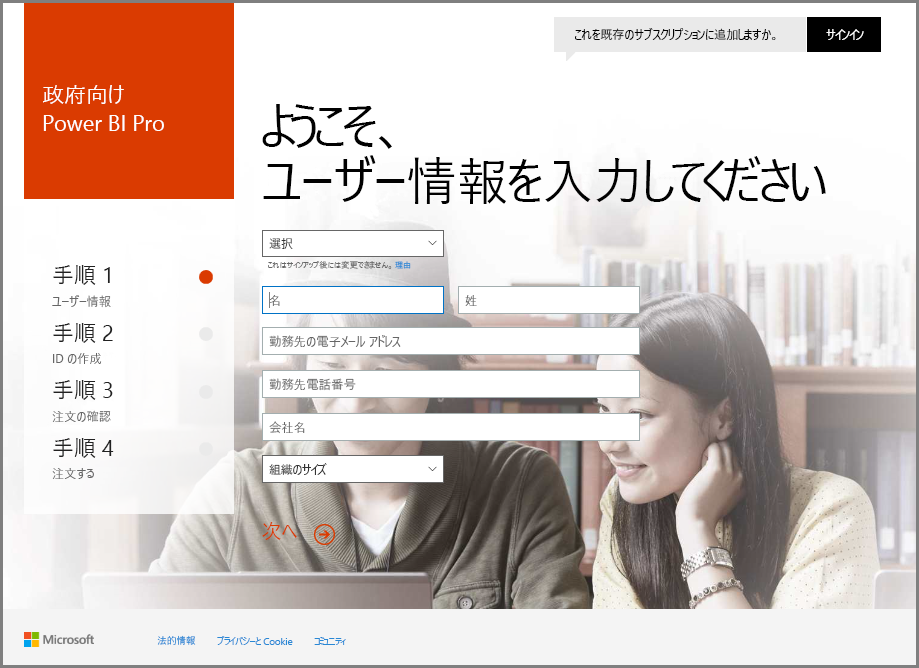
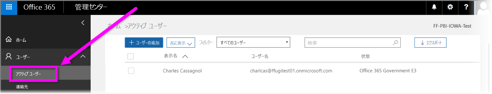

# Power BI サービスに米国政府組織を登録する
**Power BI サービス**には、**Office 365 US Government Community** サブスクリプションの一部として米国政府顧客が利用できるバージョンがあります。 この記事で説明する **Power BI サービス**のバージョンは、米国政府顧客向けに特に設計されており、**Power BI サービス**の市販バージョンとは独立した別のものです。

米国政府向け **Power BI サービス**の機能や制限などの詳細については、「[米国政府顧客向け Power BI - 概要](service-govus-overview.md)」をご覧ください。

> [!NOTE]
> この記事は、米国政府組織を Power BI にサインアップする権限を持つ管理者を対象にした内容です。 エンドユーザーの場合は、米国政府向け Power BI へのサブスクリプションの取得については管理者に問い合わせてください。
> 
> 

## 米国政府組織の適切なサインアップ プロセスを選択する
米国政府組織は、**Office Government Cloud** を初めて使用する場合と、既にサブスクリプションを持っている場合があります。 以下のセクションでは Office Government Cloud と Power BI の使用状況に基づくサインアップ手順の詳細を説明します。これは既存のサブスクリプションによって異なります。

米国政府向け Power BI にサインアップした後、営業またはサポート担当者がオンボーディング プロセスを完了するまで、一部の機能を使用できないことがあります。 詳しくは、「[米国政府顧客向け Power BI - 概要](service-govus-overview.md)」をご覧ください。 オンボーディング プロセスを完了してこれらの機能を有効にするには、営業またはサポート担当者にご連絡ください。

### Office Cloud の新しい顧客である米国政府組織
**Office Government Cloud** を新しく使用する組織の場合は、次の手順のようにします。

> [!NOTE]
> 以下の手順は、ポータル管理者が行う必要があります。
>

1. [https://products.office.com/en-us/government/office-365-web-services-for-government](https://products.office.com/en-us/government/office-365-web-services-for-government) に移動します。

>[!NOTE]
>今はまだ Office Government Cloud にサインアップしたくない場合は、営業担当者にご相談ください。
>

2. Office G3 を選び、Office 試用版のフォームに入力します
3. Office Cloud の顧客になったら、以下の「既存の Office Government Cloud 顧客」の手順に従います。

### 既存の Office Government Cloud 顧客
組織が既存の **Office Government Cloud** 顧客の場合であっても、**Power BI** のサブスクリプション (無料またはその他の) がない場合は、次のようにします。

> [!NOTE]
> 以下の手順は、ポータル管理者が行う必要があります。
> 
> 

1. 既存の Office Government Cloud アカウントにログインし、管理ポータルに移動します
2. **[Billing]** (支払い) を選びます。
3. **[Purchase Service]** (サービスの購入) を選びます。
4. Power BI Pro Government Option を選び、**[Try]** または **[Buy Now]** を選びます
5. 注文を完了します。
6. ユーザーをアカウントに割り当てます。
   
   
7. [https://app.powerbigov.us](https://app.powerbigov.us) で米国政府顧客向け **Power BI サービス**にログインします。

## サインアップに関する追加の情報
ライセンス移行のさまざまなケースで、**米国政府向け Power BI** にサインアップする場合の追加の情報を以下に示します。

### Power BI 試用版から Power BI Pro への直接的な顧客のオンボーディング
* [Billing] > [Purchase Service] > [Power BI Pro Gov] の順にクリックして、試用ではなく購入を選択する
* 必要な情報を入力してライセンスを取得する
* Power BI Pro 試用版を削除するか古いライセンスを削除して、新しいものをユーザーに割り当てる
* [https://app.powerbigov.us](https://app.powerbigov.us) にログインする

### 販売店による Power BI 試用版から Power BI Pro への顧客のオンボーディング
**[支払い]、[サブスクリプション]** の順に移動し、**[政府向け Power BI Pro サブスクリプション]** を選択します。 次の項目が表示されます。

* 入手可能
* 割り当て済み
* ユーザーへの割り当てリンク
* まだ評価版が割り当てられている場合:
  * [試用版] サブスクリプションの下にある **[割り当て済み]** をクリックし、有料に追加するユーザーを削除する
  * [有料] サブスクリプションに移動し、削除したユーザーを割り当てる

### ホワイトリストの手順
*ホワイトリスト*とは、Power BI のエンジニアリング チームが商用クラウド環境から、セキュリティが強化された政府向けクラウド環境にお客様を移動する場合に使用するプロセスです。 これにより、米国政府向けクラウドで使用可能な機能が期待どおりに動作するようになります。 米国政府向け **Power BI** サービスを初めて購入するすべての既存 (または新規) 米国政府顧客は、以下のホワイトリスティング プロセスを開始する*必要があります*。 米国政府向け **Power BI** サービスのセットアップまたはサービスへの移行を行う前に、プロセスを完了する必要があります。 

テナントを米国政府向けクラウドの "*ホワイトリストに登録*" するには、Microsoft アカウント チームにお問い合わせください。 この依頼ができるのは管理者だけです。 *ホワイトリストに登録する*プロセスには約 3 週間かかります。その間、テナントが米国政府向けクラウドで正しく動作するように Power BI のエンジニアリング チームが変更を行います。

Power BI **無償版**ライセンスから **米国政府向け Power BI** に移行する場合 (また、定義上、この記事で先に説明した関連 **Pro** ライセンス機能に移行する場合)、Power BI エンジニアリング チームがテナントを*ホワイトリストに登録する*までこの記事の次のセクションで説明する問題が発生します。

### 無償版ライセンスと米国政府テナント Pro ライセンスの混在
無償版ライセンスと米国政府 Pro ライセンスの両方がテナントに存在する場合、無償版ライセンスと (米国政府) Pro ライセンスの両方が残りますが、どちらかのライセンス タイプが正常に機能しません。 テナントが*ホワイトリストに登録される*と、次のようになります。

* 無償版ライセンス ユーザーは **Power BI Desktop** を利用して Power BI にログインできなくなり、次のセクションで説明するように、一部の機能が使用できなくなります。
* 米国政府 Pro ライセンスを割り当てられているすべてのクライアントは予想どおりに動作します。ゲートウェイ、Power BI Desktop、モバイル アプリも利用できます。

無償版ライセンスと米国政府 Pro ライセンスが混在しているとき、*ホワイトリストに登録する*と、次のことが予想されます。

***ホワイトリスト * に登録する前**:

* 無償版ライセンスのユーザーは商用クラウドで実行されます
* 米国政府 Pro ライセンスがポータルに表示され、管理者はそのライセンスをユーザーに割り当てることができます。 管理者が米国政府 Pro ライセンスを割り当てた後、米国政府 Pro ライセンス ユーザーが無償版ライセンスのデータを失うことはありません。 ライセンスが割り当てられたユーザーは米国政府顧客向け Power BI Pro の機能にアクセスできますが、テナントが*ホワイトリストに登録される*まで、次の一覧にあるように機能が制限されます。
  
  * ゲートウェイ、モバイル、Power BI Desktop を認証できません
  * Azure の商用データ ソースにアクセスできません
  * PBIX ファイルを商用 Power BI サービスから手動でアップロードする必要があります
  * Power BI モバイル アプリを使用できません

*** ホワイトリスト * に登録した後 **:

* 商用 Power BI サービスで実行されている無償版ユーザーはそのまま実行を続行できますが、想定どおり認証は停止されます。
* 米国政府クラウドで実行されている Pro ユーザーは**米国政府顧客向け Power BI** サービスを想定どおり使用できます。

Power BI の無償版ライセンスを実行しているユーザーをテナントで識別するために、管理者はライセンス レポートを実行できます。このレポートの実行後、無償版ライセンス ユーザーが **Power BI 標準**として表示されます。

## 次の手順
Power BI を使うと、さまざまなことを行えます。 サービスにサインアップする方法を説明する記事など、詳細および学習については、次のリソースをご覧ください。

* [米国政府向け Power BI の概要](service-govus-overview.md)
* [Power BI のガイド付き学習](guided-learning/gettingstarted.yml?tutorial-step=1)
* [Power BI サービスの概要](service-get-started.md)
* [Power BI Desktop とは何ですか?](desktop-what-is-desktop.md)

