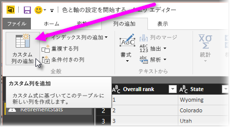

# ヒストグラム
Power BI では複数の方法でヒストグラムを構築できます。 最初に最も単純なものから説明します。

## 単純なヒストグラム
最初に、ヒストグラム作成の基準とするフィールドが含まれているクエリを判別します。  クエリの *[参照]* オプションを使用して、新しいクエリを作成し、 *"FieldName Histogram"*という名前を付けます。 **[変換]** リボンの **[グループ化]** オプションを使用し、 **[行のカウント]** 集計を選択します。 結果の集計列のデータ型が数値であることを確認してください。 その後、このデータをレポート ページで視覚化できます。 このアプローチでは短時間で簡単に作成できますが、データ ポイントの数が多い場合はうまく機能せず、ビジュアル間でのブラッシングは許可されません。

## ヒストグラムを作成するバケットの定義
ヒストグラム作成の基準とするフィールドが含まれているクエリを判別します。 クエリの *[参照]* オプションを使用して、新しいクエリを作成し、 *"FieldName"*という名前を付けます。  ルールを使用してバケットを定義します。 **[列の追加]** リボンの **[カスタム列の追加]** オプションを使用し、カスタム ルールを作成します。

結果の集計列のデータ型が数値であることを確認してください。 **「最も単純なヒストグラム」** (この記事で前述) で説明した手法でグループを使用して、ヒストグラムを完成させます。 このオプションでは、より多くのデータ ポイントを処理しますが、ブラッシングはやはり使用できません。

## ブラッシングをサポートするヒストグラムを定義
ブラッシングとは、ビジュアルが相互リンクされている状態のことです。つまり、あるビジュアルでユーザーがデータ ポイントを選択すると、レポート ページの他のビジュアルでは、選択されたデータ ポイントに関連するデータ ポイントが強調表示またはフィルター処理されます。  クエリ時にはデータを操作するので、テーブル間のリレーションシップを作成し、どの詳細項目がヒストグラムのバケットに関連するか、またその逆方向の関連性を把握しておく必要があります。

プロセスを開始するため、ヒストグラム作成の基準とするフィールドが含まれているクエリの *[参照]* オプションを使用します。  新しいクエリに *Buckets* という名前を付けます。  この例では、元のクエリを *Details* と呼ぶことにしましょう。  次に、ヒストグラムのバケットとして使用する列以外の列をすべて削除します。  その後、クエリの *[重複の削除]* 機能を使用します。この機能は、列を選択したときに右クリック メニューとして表示されます。そのため、列では残りの値は固有の値になります。 10 進数がある場合は、「バケットを定義してヒストグラムを作成」のヒントを使用すると、管理可能なバケットのセットを取得できます。  ここで、クエリのプレビューに表示されるデータを確認します。 空白の値または null が表示される場合は、それらを修正してからリレーションシップを作成する必要があります。 「データに null または空白の値が含まれている場合のリレーションシップの作成」を参照してください。 この方法では並べ替えが必要となるため、問題が生じる可能性があります。 バケットを正しく並べ替えるには、「並べ替えの順序: カテゴリを必要な順序で表示」を参照してください。 

> [!NOTE]
> ビジュアルを作成する前に並べ替え順序を考えておくことをお勧めします。   
> 
> 

プロセスの次の手順では、バケットの列で *Buckets* クエリと *Details* クエリのリレーションシップを定義します。  *Power BI Desktop* のリボンで、*[リレーションシップ管理]* をクリックします。  *Buckets* が左側のテーブル、*Details* が右側のテーブルに表示されるリレーションシップを作成し、ヒストグラムに使用するフィールドを選択します。 

最後の手順は、ヒストグラムの作成です。 *"Buckets"* テーブルから [バケット] フィールドをドラッグします。 結果として得られる縦棒グラフから、既定のフィールドを削除します。  その後、 *"Details"* テーブルのヒストグラム フィールドを同じビジュアルまでドラッグします。 このフィールドで、既定の集計を [カウント] に変更します。 これでヒストグラムの完成です。 ツリーマップのようなビジュアルを "Details" テーブルから作成する場合は、ツリーマップのデータ ポイントを選択して、ヒストグラムの強調表示を確認し、データ シート全体の傾向に関連する選択済みデータ ポイントのヒストグラムを表示します。

