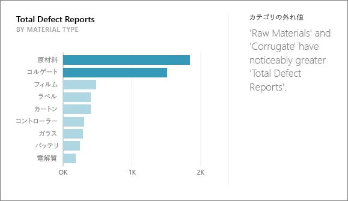
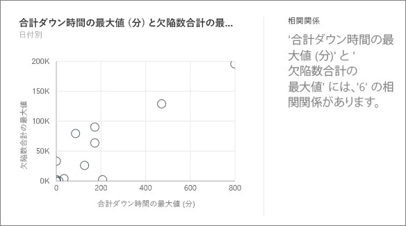
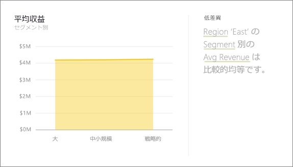
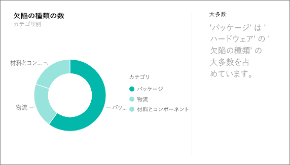
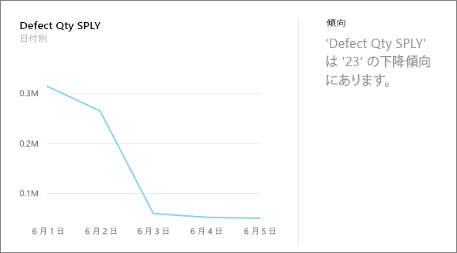
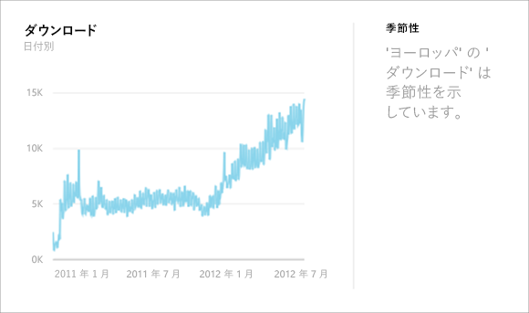
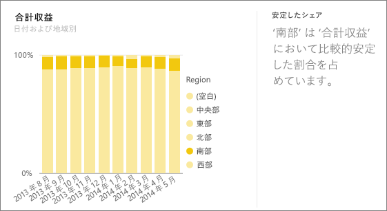
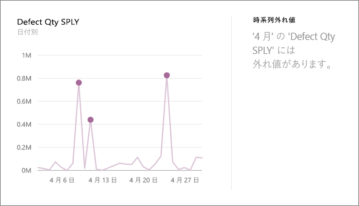

# Power BI でサポートされているインサイトの種類
## インサイトのしくみ
Power BI は、興味がある可能性のある情報を検出するために一連の高度なアルゴリズムを適用しながら、データセットのさまざまなサブセットをすばやく検索します。 Power BI は、割り当てられた時間で、可能な限り多くのデータセットをスキャンします。

データセットまたはダッシュボードのタイルに対して、インサイトを実行できます。   

## 見つけることができる情報の種類
使用されているアルゴリズムの一部を以下に示します。

## カテゴリ外れ値 (上/下)
モデル内のメジャーとして、ディメンションの 1 つまたは 2 つのメンバーが、ディメンションの他のメンバーよりも値がはるかに大きいケースを強調表示します。  

## 時系列の変更点
データの時系列の傾向で、大きな変化があったときに強調表示します。

## 相関関係
データセット内のディメンションに対してプロットした場合に、複数のメジャーで相互の相関関係が示されるケースを検出します。

## 低差異
データ ポイントが平均から離れていないケースを検出します。

## マジョリティ (主要因子)
別のディメンションによって分類した場合に、合計値の大部分が単一の因子に帰する可能性があるケースを検索します。  

## 時系列の全体的な傾向
時系列データの上昇または下降の傾向を検出します。

## 時系列の周期性
週単位、月単位、または年単位の周期性などの時系列データの定期的なパターンを見つけます。

## 安定した共有
連続した変数にわたる親の全体の値に関連して、子の値のシェア間に親子の相関関係があるケースを強調表示します。

## 時系列外れ値
時系列全体にわたるデータに対して、その他の日付/時刻値と大きく異なる値を持つ特定の日付や時刻がある場合を検出します。

## 次の手順
[Power BI のインサイト](service-insights.md)

データセットを所有している場合は、[インサイト用に最適化します](service-insights-optimize.md)

他にわからないことがある場合は、 [Power BI コミュニティを利用してください](http://community.powerbi.com/)。

