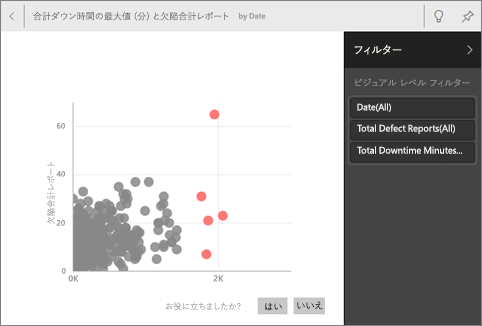

# Power BI によるクイック インサイト
新しいデータセットがあるが、どこから始めたらよいかわからない場合。  ダッシュボードをすばやく構築する必要がある場合。  不足している情報をすばやく探したい場合。

クイック インサイトを実行して、データに基づいて、興味のある対話型の視覚化を生成します。 クイック分析情報は、データセット全体に対して実行することも (クイック分析情報)、特定のダッシュボード タイルに対して実行することもできます (範囲指定の分析情報)。 分析情報に対してクイック分析情報を実行することもできます。

> **注**: クイック インサイトは、DirectQuery では機能しません。Power BI にアップロードされたデータに限り機能します。
> 
> 

クイック インサイト機能の基となっているのは、Microsoft Research と共同開発して拡大を続けている[高度な分析アルゴリズムのセット](service-insight-types.md)です。引き続きこれを使って、より多くの人が新しい直感的な方法でデータから詳細情報を見つけられるようにしていきます。

## データセットへのクイック インサイトの実行
Amanda がクイック分析情報をデータセットに対して実行し、フォーカス モードで分析情報を開き、クイック分析情報の 1 つをダッシュボード上にタイルとして固定し、ビジュアルに対してクイック分析情報を取得します。その様子をご覧ください。

<iframe width="560" height="315" src="https://www.youtube.com/embed/et_MLSL2sA8" frameborder="0" allowfullscreen></iframe>

次はあなたの番です。 [サプライヤー クオリティ分析サンプル](sample-supplier-quality.md)を使用してクイック インサイトを試してみます。

1. **[データセット]** タブから省略記号 [...] を選び、**[詳細情報の取得]** を選びます。
   
    
   
    
2. Power BI は[さまざまなアルゴリズム](service-insight-types.md)を使用して、データセット内の傾向を検索します。
   
    
3. 数秒で、情報を取得する準備が整います。  **[詳細情報の表示]** を選択して、視覚化を表示します。
   
    
   
   > **注**: データが統計的に有意でないためにクイック分析情報を生成できないデータセットもあります。  詳細については、「[Power BI クイック インサイト用のデータの最適化](service-insights-optimize.md)」を参照してください。
   > 
   > 
4. 視覚化は、最大 32 個の個別のインサイト カードとともに特別な **[クイック分析情報]** キャンバスに表示されます。 各カードには、グラフまたはグラフと簡単な説明が含まれます。
   
    

## クイック分析情報カードとの対話
  

1. ダッシュボードに視覚化を追加するには、カードの上にポインターを移動してピン アイコンを選択します。
2. カードを全画面表示するには、カードの上にポインターを移動して [フォーカス モード] アイコンを選択します。
   
    
3. フォーカス モードでは次のことができます。
   
   * 視覚化を[フィルター処理](service-interact-with-a-report-in-reading-view.md)。  フィルターを表示するには、右上隅の矢印を選択し、[フィルター] ウィンドウを展開します。
     
        
   * ピン  アイコンまたは **[ビジュアルをピン留めする]** を選択して、分析情報カードをダッシュボードにピン留めします。
   * カード自体に対するクイック分析情報の実行。 これは**範囲指定クイック インサイト**と呼ばれます。 右上隅にある電球アイコン  または **[詳細情報の取得]** を選択します。
     
       
     
     クイック分析情報が左側に表示され、その単一のクイック分析情報のデータにのみ基づく新しいカードが右側に表示されます。
     
       
4. 元の [クイック分析情報] キャンバスに戻るには、左上隅にある **[フォーカス モードの終了]** を選択します。

## ダッシュボード タイルへのクイック インサイトの実行
データセット全体から情報を検索する代わりに、単一のダッシュボード タイルの作成に使用するデータに検索対象を絞り込みます。 これは**範囲指定クイック インサイト**と呼ばれます。

1. ダッシュボードを開きます。
2. タイルを選択し、[フォーカス モードでタイルを開きます](service-focus-mode.md)。
3. 右上隅で、**[詳細情報の取得]** を選びます。
   
    
4. Power BI は、タイルの右側に分析情報カードを表示します。
   
    
5. 興味をそそる情報がありましたか? 詳細に確認するには、その分析情報カードを選択します。 選択したクイック分析情報が左側に表示され、右側には、その単一のクイック分析情報に含まれるデータのみに基づく新しい分析情報カードが表示されます。
6. 引き続きデータを掘り下げ、興味があるクイック分析情報が見つかったら、右上隅から **[ビジュアルをピン留めする]** を選んで、そのビジュアルをダッシュボードにピン留めします。 また、フィードバックを送信して、特定のクイック分析情報が役に立ったかどうかをデータセットの所有者に知らせることもできます。
   
    

## 次の手順
データセットを所有している場合は、[クイック分析情報用に最適化します](service-insights-optimize.md)。

使用できるクイック分析情報の種類については[こちら](service-insight-types.md)を参照してください。

他にわからないことがある場合は、 [Power BI コミュニティを利用してください](http://community.powerbi.com/)。

