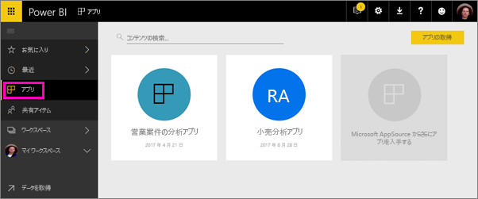
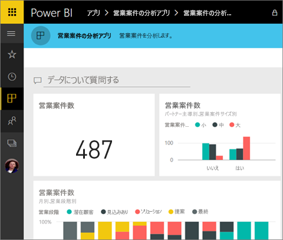
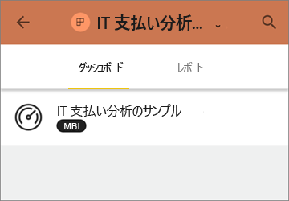
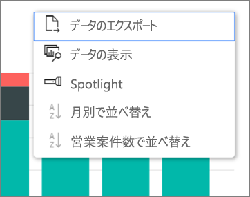

# Power BI でダッシュボードとレポートを含むアプリをインストールして使用する
Power BI では、*アプリ*が関連のあるダッシュボードやレポートをまとめて 1 つの場所に表示します。 組織内のユーザーは主要なビジネス情報でアプリを作成し、配布できます。 既にご利用中かもしれませんが、Google アナリティクスや Microsoft Dynamics CRM など、[外部サービス](service-connect-to-services.md)も Power BI アプリを提供します。 

アプリは Power BI サービス ([https://powerbi.com](https://powerbi.com)) とモバイル デバイスで簡単に検索してインストールすることができます。 アプリのインストール後は、さまざまなダッシュボードの名前を覚えておく必要がありません。ブラウザーまたはモバイル デバイス上のアプリにまとめて表示されるためです。

アプリの作者が更新プログラムを公開するたびに、自動的に変更が反映されます。 作成者はデータの更新頻度も制御するため、最新の状態が維持されているかを気にする必要はありません。 

アプリを作成する予定がありますか? 詳細については、[Power BI でのアプリの作成および発行](service-create-distribute-apps.md)に関するページをご覧ください。

## 新しいアプリを取得する
さまざまな方法でアプリを入手できます。 アプリの作成者は、ユーザーの Power BI アカウントに自動的にアプリをインストールしたり、アプリへの直接リンクを送信したりできます。あるいはユーザーが AppSource でアプリを検索することもできます。AppSource にはユーザーがアクセスできるアプリがすべて表示されます。 モバイル デバイスの Power BI の場合、直接リンクからのみインストールできます。AppSource からはインストールできません。 アプリの作成者が自動的にアプリをインストールした場合は、アプリの一覧に表示されます。

### 直接リンクからのアプリをインストールする
新しいアプリを自分でインストールする最も簡単な方法は、アプリの作成者から直接リンクを取得することです。 Power BI では、作成者が送信できるインストール リンクが作成されます。

**コンピューターで** 

電子メールのリンクをクリックすると、ブラウザーで Power BI サービス ([https://powerbi.com](https://powerbi.com)) が開きます。 アプリのインストールを確認すると、アプリのランディング ページが開きます。

**iOS または Android モバイル デバイスで** 

モバイル デバイスで電子メールにあるリンクをクリックすると、アプリが自動的にインストールされ、アプリのコンテンツ リストが開きます。 

### Microsoft AppSource からアプリを取得する
アクセス許可のあるアプリを、Microsoft AppSource から検索してインストールすることもできます。 

1. **[アプリ]** ![左側のナビゲーション ウィンドウの [アプリ]](media/service-install-use-apps/power-bi-apps-bar.png)、**[アプリの取得]** の順に選択します。 
   
     ![[アプリの取得] アイコン](media/service-install-use-apps/power-bi-service-apps-get-apps-oppty.png)
2. [AppSource] の **[My organization (自分の組織)]** で、結果を絞り込むための検索を行って、探しているアプリを見つけることができます。
   
     ![AppSource の [自分の所属組織]](media/service-install-use-apps/power-bi-appsource-my-org.png)
3. **[Get it now (今すぐ取得)]** を選択して、[アプリ] ページにアプリを追加します。 

## アプリのダッシュボードとレポートを操作する
これで、アプリのダッシュボードおよびレポートのデータを探索できます。 フィルター処理、強調表示、並べ替え、ドリル ダウンなど、Power BI の標準機能にすべてアクセスできます。 [Power BI でレポートを使用する方法](service-reading-view-and-editing-view.md)に関するページをご覧ください。 

変更内容を保存することはできませんが、レポート内のテーブルや他のビジュアルから [Excel にデータをエクスポートする](power-bi-visualization-export-data.md)ことはいつでも可能です。

## 次の手順
* [Power BI でのアプリの作成および発行](service-create-distribute-apps.md)
* [外部サービス用の Power BI アプリ](service-connect-to-services.md)
* わからないことがある場合は、 [Power BI コミュニティで質問してみてください](http://community.powerbi.com/)。

