# Power BI での自動化 された機械学習 (プレビュー)

自動 (AutoML) のため machine learning のデータフローをトレーニング、検証、および Power BI で直接、Machine Learning モデルを呼び出すビジネス アナリストを使用できます。 これには、アナリストが自分のデータフローを使用して、モデルのトレーニングの入力データを指定する、新しい ML モデルを作成するための簡単なエクスペリエンスが含まれます。 サービス自動的に抽出しに最も関連の機能を適切なアルゴリズムを選択してとをチューニングし、ML モデルを検証します。 モデルをトレーニングすると、Power BI は自動的にパフォーマンスを説明する検証の結果とするアナリストの結果を含むレポートを生成します。 モデルは、データ フロー内の新しいまたは更新されたデータで起動できます。

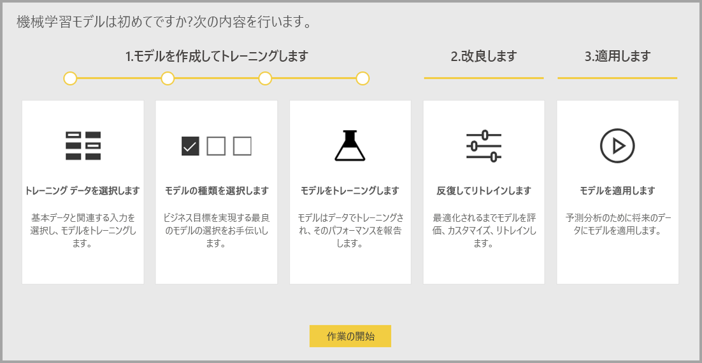

自動化された machine learning は、Power BI Premium および Embedded 容量のみでホストされているデータフローの使用可能なは。 このプレビューで AutoML は二項予測、分類、回帰モデルの機械学習モデルをトレーニングすることができます。

## AutoML の操作

[Power BI のデータフロー](service-dataflows-overview.md)ビッグ データ用セルフ サービスのデータ準備ツールを提供します。 AutoML では、Power BI 内で直接、機械学習モデルを構築するため、データの準備作業を活用することができます。

Power BI で AutoML では、Power BI のスキルだけを使用してデータフローを使用して簡略化されたエクスペリエンスでの機械学習モデルを構築するデータ アナリストを使用できます。 ML モデルの作成の背後にあるデータ サイエンスのほとんどは、生成されたモデルが、品質と ML モデルを作成するために使用するプロセスの完全な洞察を提供するために可視性を持つようにするための guardrails の Power BI によって自動化されます。

AutoML の作成をサポートする**二項予測**、**分類**、および**回帰**のデータフローのモデル。 これらは、他の観測値の結果を予測する過去の観測値の既知の結果から学んでは教師あり機械学習モデルの種類です。 AutoML、モデルのトレーニングの入力データセットは、レコードのセットを**というラベルの付いた**で既知の結果。

Power BI で AutoML 統合[自動 ML](https://docs.microsoft.com/azure/machine-learning/service/concept-automated-ml)から、 [Azure Machine Learning サービス](https://docs.microsoft.com/azure/machine-learning/service/overview-what-is-azure-ml)ML モデルを作成します。 ただし、Power BI で AutoML を使用する Azure サブスクリプションを必要はありません。 トレーニングと ML モデルをホストしているプロセスは、すべての Power BI サービスによって管理されます。

ML モデルをトレーニングすると、AutoML は自動的に、ML モデルの可能性の高いパフォーマンスを説明する Power BI レポートを生成します。 AutoML は、モデルによって返される予測に影響を与える、入力間での主要な影響元を強調表示で、explainability を強調します。 レポートには、ML モデルの種類に応じて、モデルの主要な指標も含まれています。

生成されたレポートの他のページでは、モデルとトレーニングの詳細の統計サマリーを表示します。 統計の概要では、モデルのパフォーマンスの標準的なデータ サイエンスのメジャーを表示したいユーザーにとって重要です。 トレーニングの詳細については、関連付けられているモデリング パラメーターを使用して、モデルを作成するために実行されたすべてのイテレーションをまとめたものです。 また、各入力が使用して ML モデルを作成する方法も説明します。

スコア付けデータに、ML モデルを適用することができます。 データ フローが更新されると、予測、ML モデルを自動的にデータに適用されます。 Power BI には、各 ML モデルを生成する特定の予測スコアの個別の説明も含まれています。

## Machine learning モデルを作成します。

このセクションでは、AutoML 学習モデルを作成する方法について説明します。 

### データ準備の ML モデルを作成します。

Power BI での機械学習モデルを作成するには、まずに結果の履歴情報の ML モデルをトレーニングするために使用されるデータのデータ フローを作成する必要があります。 データ フローの構成の詳細については、次を参照してください。[セルフ サービスのデータ準備の Power BI で](service-dataflows-overview.md)します。

現在のリリースでは、Power BI は、ML モデルのトレーニングに 1 つのエンティティのみからデータを使用します。 したがって、履歴データが複数のエンティティで構成される場合は、データを単一のデータフローのエンティティに結合する必要があります手動でしました。 強力な予測の結果を予測しようとしている可能性のあるビジネス メトリックの計算列を追加することも必要があります。

AutoML には、機械学習モデルをトレーニングするための特定のデータ要件があります。 これらの要件はそれぞれのモデルの種類に基づいて、以下のセクションで説明します。

### ML モデルの入力を構成します。

AutoML モデルを作成するには、ML のアイコンを選択、**アクション**列をクリックし、履歴データは、データ フローのエンティティの**機械学習モデルを追加**します。

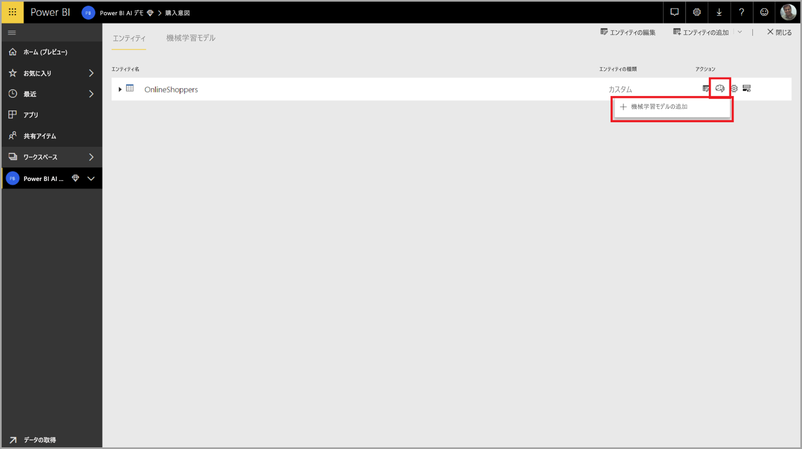

ML モデルを作成するプロセスをガイドするウィザードで構成されるシンプルなエクスペリエンスを起動します。 ウィザードには、次の簡単な手順が含まれています。

1. 履歴の結果のデータと予測の対象となるフィールドを持つエンティティを選択します。
2. 表示するには予測の種類に基づくモデルの種類を選択します。
3. モデルの予測のシグナルとして使用する入力を選択します。
4. モデルの名前を指定し、構成を保存

履歴の結果のフィールドは、次の図に示すように、ML モデルのトレーニング ラベル属性を指定します。

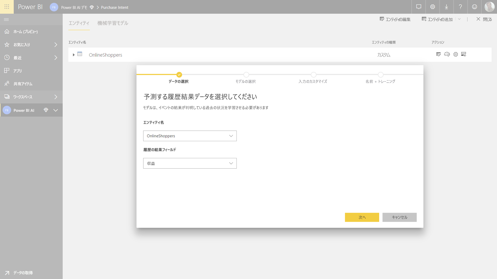

履歴の結果フィールドを指定すると、AutoML はそのデータをトレーニングできます ML モデルの種類を識別するラベルのデータを分析し、トレーニングを受けることが最も高い ML モデルの種類を提案します。 

> [!NOTE]
> モデルの種類によっては、選択したデータのサポートされていない可能性があります。

AutoML では、ML モデルのトレーニングに使用できる入力を提案する、選択したエンティティのすべてのフィールドも分析します。 このプロセスは、おおよそは統計分析に基づいて、使用される入力を確認する必要があります。 履歴の結果フィールド (または、ラベル フィールド) に依存する任意の入力は必要がありますのパフォーマンスに影響があるため、ML モデルのトレーニングには使用されません。

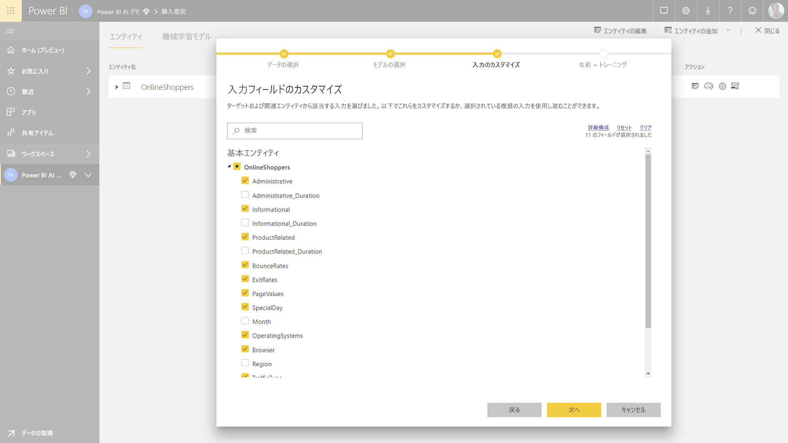

最後の手順では、モデルの名前し、その設定を保存します。

この段階では、ML モデルのトレーニング プロセスを開始するデータ フローを更新するように求められます。

### ML モデルのトレーニング

AutoML モデルのトレーニングは、データ フローの更新の一部です。 AutoML はまず、トレーニング データを準備します。

AutoML をトレーニング セットとテスト データセットに指定した履歴データを分割します。 テスト データセットは、トレーニング後のモデルのパフォーマンスを検証するために使用される予約セットです。 これらとして実現されます**トレーニング セットとテスト**データ フロー内のエンティティ。 AutoML は、モデル検証のためのクロス検証を使用します。

次に、各入力フィールドが分析され、補完が適用された代入値と共に、欠損値を置換します。 2 つの異なる補完戦略は、AutoML によって使用されます。 次に、すべての必要なサンプリングと正規化は、データに適用されます。

AutoML が適用されるいくつかの変換とは、データ型とその統計のプロパティに基づいて選択された各入力フィールド。 AutoML では、これらの変換を使用して、ML モデルのトレーニングで使用するための機能を抽出します。

AutoML モデルのトレーニング プロセスは、別のモデリング アルゴリズムと最適なパフォーマンスのモデルを見つけてハイパーパラ メーターの設定を使用する最大 50 のイテレーションで構成されます。 これらの各モデルのパフォーマンスは、提示されたテスト データセットを使用した検証によって評価されます。 このトレーニング手順中には、AutoML は、これらのイテレーションのトレーニングと検証の複数のパイプラインを作成します。 モデルのパフォーマンスを評価するプロセスには、数時間、データセットと使用可能な専用容量リソースのサイズに応じて数分から任意の場所の時間がかかります。

場合によっては、生成された最終的なモデルはアンサンブル学習、予測的なパフォーマンスが向上を提供する複数のモデルが使用されているを使用できます。

### AutoML モデル explainability

モデルのトレーニングが完了したら、AutoML は入力の features とモデルの出力間のリレーションシップを分析します。 マグニチュードと各入力機能の提示されたテスト データセットのモデル出力への変更の方向を評価します。 これと呼ばれますが、*機能の重要度*します。

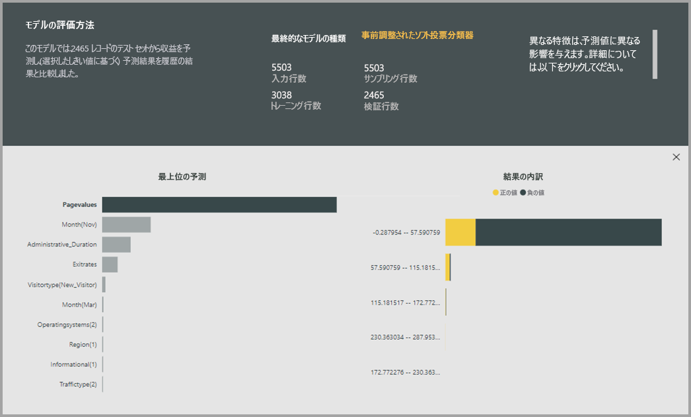

### AutoML モデル レポート

AutoML では、グローバルの特徴の重要度と共に、検証中に、モデルのパフォーマンスを要約した Power BI レポートを生成します。 レポートから提示されたテスト データの ML モデルを適用して、既知の結果の値を使用した予測を比較する結果をまとめたものです。

そのパフォーマンスを把握するモデル レポートをレビューすることができます。 モデルの主要な影響元が既知の結果に関するビジネスの洞察を揃えることを検証することもできます。

グラフとレポートでモデルのパフォーマンスの記述に使用されるメジャーは、モデルの種類によって異なります。 これらのパフォーマンス グラフとメジャーについては、次のセクションで説明します。

レポート内の他のページには、データ サイエンスの観点から、モデルに関する統計的尺度可能性がありますについて説明します。 たとえば、**二項予測**レポートには、利益チャートと、モデルの ROC 曲線が含まれています。

含めることも、レポート、**トレーニングの詳細を**モデルのトレーニングし、反復するたびに、モデルのパフォーマンスを記述するグラフが含まれるの説明を含むページが実行されます。

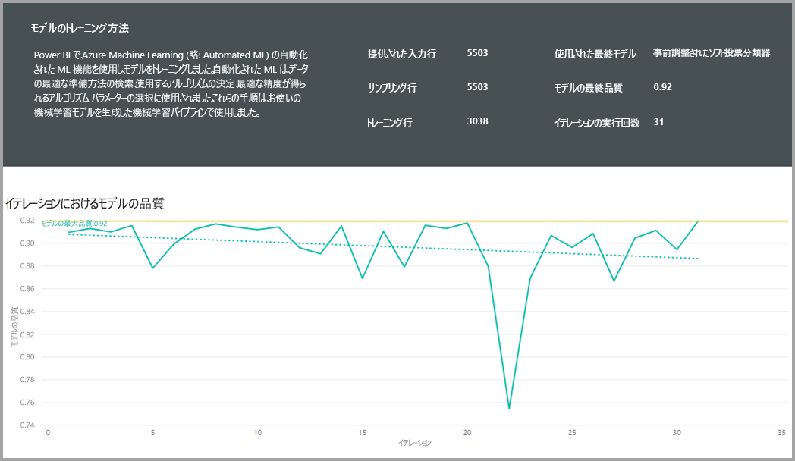

このページで別のセクションでは、補完メソッドの使用方法の入力のフィールドの不足値の入力も方法と、各入力フィールドは、モデルで使用する機能を抽出する変換がについて説明します。 最終的なモデルで使用するパラメーターも含まれています。

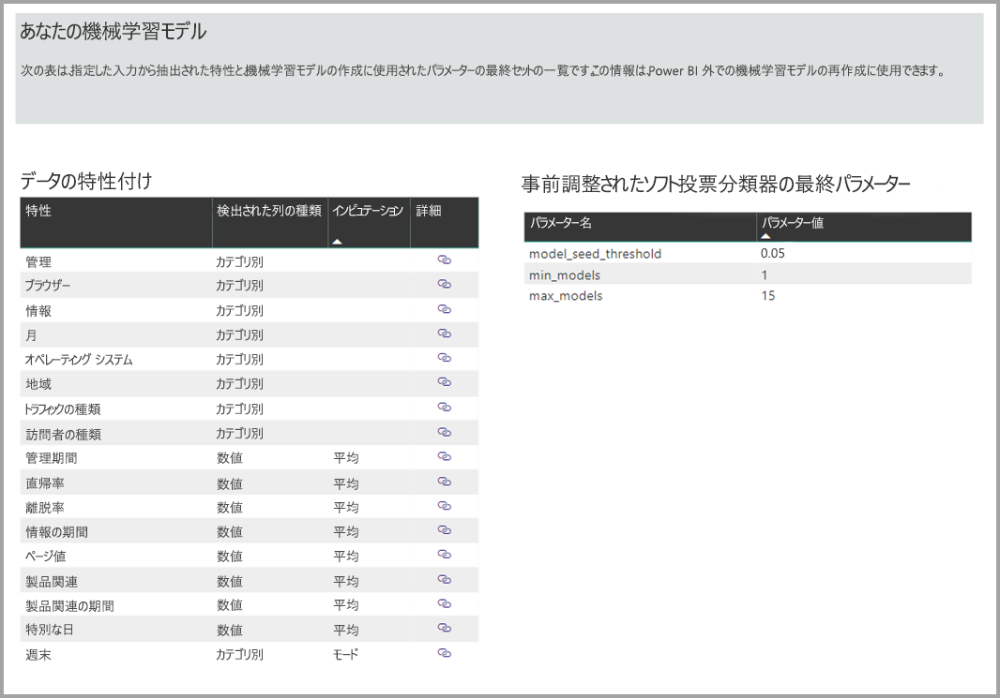

生成されたモデルは、アンサンブル学習を使用している場合、**トレーニングの詳細を**ページには、そのパラメーターと同様に、アンサンブルで構成要素である各モデルの重みを説明したセクションも含まれています。

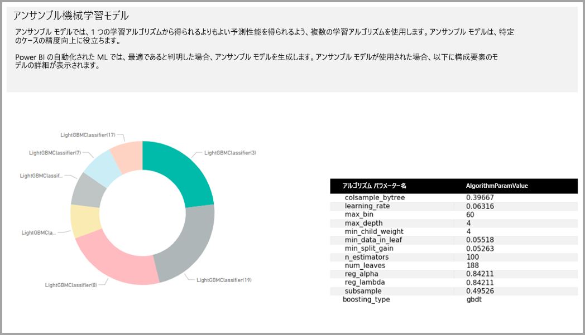

## AutoML モデルを適用します。

作成された ML モデルのパフォーマンスに満足場合は、適用できます新しいまたは更新されたデータ、データ フローが更新されたときにします。 これを行う、レポート モデルから選択して、**適用**右上隅にあるボタンをクリックします。

ML モデルを適用するには、モデルの出力をこのエンティティに追加される列にそれを適用する必要が、エンティティとプレフィックスの名前を指定する必要があります。 列名の既定のプレフィックスは、モデルの名前です。 *適用*関数は、モデルの種類に固有の追加のパラメーターを含めることができます。

サフィックスを持つ、新しいエンティティをデータ フローを作成する ML モデルを適用する**拡充 < model_name >** します。 たとえば、適用する場合、 _PurchaseIntent_モデルを_OnlineShoppers_エンティティ、出力が生成されます、 **OnlineShoppers 拡充 PurchaseIntent**。

現時点では、出力エンティティを使用して、Power Query エディターで ML モデルの結果をプレビューすることはできません。 出力列常に null として表示結果。 2 番目のサフィックスを持つエンティティの出力結果を表示するには、 **< model_name > プレビューの拡充**モデルが適用されるときに作成されます。

クエリ エディターで結果をプレビューするために、データフローを更新する必要があります。

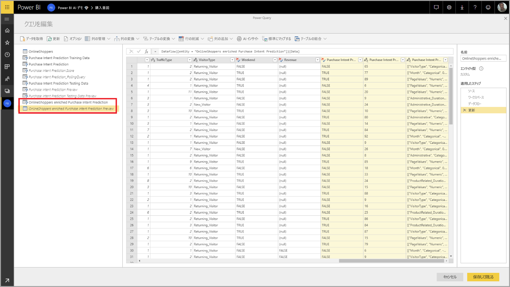

モデルを適用すると AutoML 常に最新、予測、データ フローが更新されたときにします。

AutoML には、出力エンティティをスコア付けする行ごとに個別の説明も含まれています。

Power BI Desktop を使用してから、insights と ML モデルから予測を Power BI レポートで使用する出力のエンティティに接続できます、**データフロー**コネクタ。

## 二項予測モデル

二項予測モデルでは、正式と呼ばれる**二項分類モデル**を使用してデータセットを 2 つのグループに分類されます。 請求書は時間; に支払われるかどうか、販売機会は変換するかどうかなどのバイナリの結果をアカウントが変更頻度、かどうかがイベントを予測するために使用している、トランザクションとは、不正なとでかどうか。

Power BI にラベル付けされている既知の結果をブール値のバイナリの予測モデルのラベルが必要ですが、結果はバイナリであるため**true**または**false**します。 たとえば、販売機会変換モデルで営業案件獲得された場合は true。 ラベルが付けられます、false の場合、ラベル付けが失われているものとオープンの販売の機会に null のラベルが付けられます。

二項予測モデルの出力は、真とラベルの値に対応する結果を達成することが発生する可能性を示す確率スコアです。

### 二項予測モデルのトレーニング

二項予測モデルを作成するには、トレーニング データを含む入力エンティティは、過去の既知の結果を識別するために履歴の結果フィールドとしてブール値フィールドが必要です。

前提条件:

* ブール型フィールドは、履歴の結果フィールドとして使用する必要があります。
* 履歴データの 50 行の最小値が結果のクラスごとに必要です。

一般に、過去の結果が別のデータ型のフィールドによって識別され場合、は、これらの Power Query を使用してブール値に変換する計算列を追加できます。

作成のプロセスの二項予測モデルに依存して、同じ手順のセクションで説明されているその他の AutoML モデル、 **ML モデルの入力を構成する**上。

### バイナリの予測モデルのレポート

二項予測モデルは、レコードが True としてラベルがブール値によって定義された結果を達成する確率を出力として生成します。 レポートには、上記と確率のしきい値を下回るスコアの解釈方法に影響する確率のしきい値のスライサーが含まれています。

レポートには、モデルの観点でのパフォーマンスがについて説明します*真陽性*、*偽陽性*、*真陰性*と*偽陰性*. 誤検知と真陰性の true は、結果データの 2 つのクラスを正しく予測結果です。 偽陽性は、結果は、False の値の実際のブール値のラベルが True として予測されたのです。 逆に、偽陰性は、結果しますが、ブール型の実際のラベルの値が True、False として予測されました。

精度と再現率などのメジャーでは、予測結果の確率のしきい値の効果について説明します。 確率のしきい値のスライサーを使用すると、精度と再現率バランスの取れた妥協を達成するしきい値を選択します。

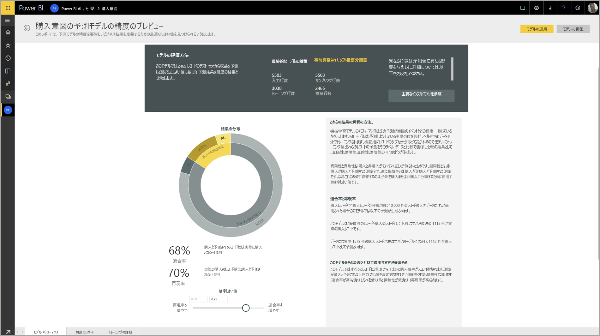

**精度レポート**モデル レポートのページが含まれています、*累積増加*モデル用のグラフと、ROC 曲線します。 これらは、モデルのパフォーマンスの統計的尺度です。 レポートには、表示されるグラフの説明が含まれます。

![精度 [レポート] 画面](media/service-machine-learning-automated/automated-machine-learning-power-bi-11.png)

### 二項予測モデルを適用します。

二項予測モデルを適用するには、ML モデルから予測を適用するデータをエンティティを指定する必要があります。 その他のパラメーターには、出力列名のプレフィックスと、予測結果の分類の確率のしきい値が含まれます。

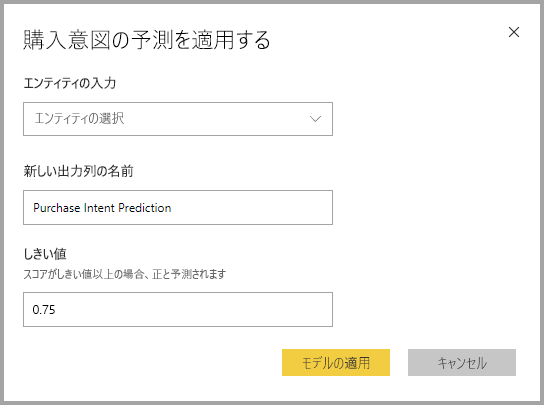

二項予測モデルが適用されるときに、出力の強化されたエンティティに 3 つの出力列を追加します。 これらは、 **PredictionScore**、 **PredictionOutcome**と**PredictionExplanation**します。 エンティティ内の列名では、モデルが適用されるときに指定されたプレフィックスがあります。

**PredictionOutcome**列がラベルを予測結果を表します。 確率のしきい値を超えた場合にレコードが、結果を実現する可能性があると予測され、結果を実現する可能性は低いと予測される以下のようです。

**PredictionExplanation**列にしていた入力機能には、特定の影響を与えると説明が含まれています、 **PredictionScore**します。 これは、予測の入力特徴の重みの JSON 形式のコレクションです。

## 分類モデル

分類モデルは、複数のグループまたはクラスにデータセットを分類に使用されます。  されるため、顧客に非常に高い、高、中、または低の有効期間値を持つ可能性が高いかどうかなど、複数の考えられる結果のいずれかのイベントを予測するには既定のリスクが高、中、低、または非常に低い; がかどうかなどなど。

分類モデルの出力は、レコードが特定のクラスの条件を実現する可能性を示す確率スコアです。

### 分類モデルのトレーニング

分類モデルのトレーニング データを含む入力エンティティは、過去の既知の結果を識別する履歴の結果フィールドとして文字列または数値フィールドが必要です。

前提条件:

* 履歴データの 50 行の最小値が結果のクラスごとに必要です。

作成のプロセスの分類モデルに依存して、同じ手順のセクションで説明されているその他の AutoML モデル、 **ML モデルの入力を構成する**上。

### 分類モデルのレポート

モデル レポートは、提示されたパラメーターの ML モデルを適用することで生成された分類では、データと実際の既知のクラスを使用して、レコードの予測クラスを比較することをテストします。

モデル レポートには、既知の各クラスの適切かつ正しく分類されたレコードの内訳を含むグラフが含まれています。

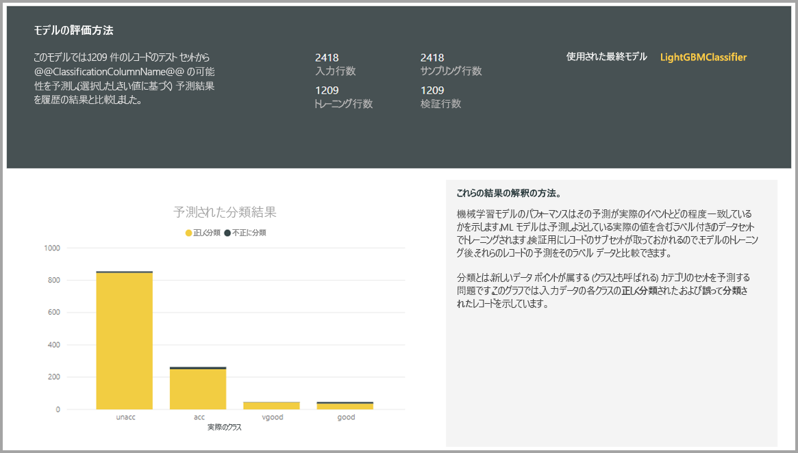

さらにクラス固有ドリルダウンは、既知のクラスの予測の分散方法を分析できます。 これには、クラスの既知のレコードの誤分類される可能性の高い他のクラスが含まれます。

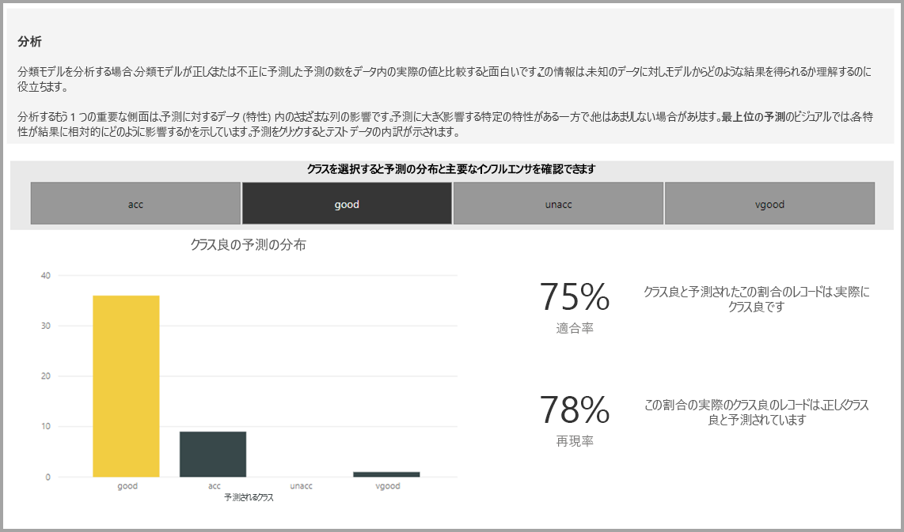

レポート モデルについてには、各クラスの最上位の予測子も含まれています。

分類モデルのレポートも含まれています、ページの他の種類のモデルのようなトレーニングの詳細ページのセクションで説明した**AutoML モデル レポート**この記事で前述しました。

### 分類モデルを適用します。

分類 ML モデルを適用するには、入力データと出力列名のプレフィックス エンティティを指定する必要があります。

分類モデルが適用されるときに、3 つの出力列、出力の強化されたエンティティを追加します。 これらは、 **PredictionScore**、 **PredictionClass**と**PredictionExplanation**します。 エンティティ内の列名では、モデルが適用されるときに指定されたプレフィックスがあります。

**PredictionClass**列には、レコードの最も可能性の高い予測クラスが含まれています。 **PredictionScore**列には、可能な各クラスのレコードに対する確率スコアの一覧が含まれています。

**PredictionExplanation**列にしていた入力機能には、特定の影響を与えると説明が含まれています、 **PredictionScore**します。 これは、予測の入力特徴の重みの JSON 形式のコレクションです。

## 回帰モデル

営業案件、アカウントの有効期間の値、売掛金の請求書が支払われる可能性がありますが、日付、支払われる可能性がある請求書の金額を実現する可能性が高い収益などの値を予測する回帰モデルを使用します。などなど。

回帰モデルの出力は、予測された値です。

### 回帰モデルのトレーニング

回帰モデルのトレーニング データを格納している入力のエンティティを過去の既知の結果の値を識別する履歴の結果フィールドと数値フィールドが必要です。

前提条件:

* 履歴データの 100 行の最小値は、回帰モデルに必要

作成のプロセスの回帰モデルに依存して、同じ手順のセクションで説明されているその他の AutoML モデル、 **ML モデルの入力を構成する**上。

### 回帰モデルのレポート

その他の AutoML モデル レポートと同様に回帰レポートは、提示されたテスト データにモデルを適用した結果に基づいています。

モデル レポートには、予測値対実際の値を比較するグラフが含まれています。 このグラフでは、対角線からの距離は、予測のエラーを示します。

残存エラー グラフでは、提示されたテスト データセット内の異なる値の平均エラー率の分布を示します。 水平軸は、その範囲内で、頻度または値の数を示すバブルのサイズは、グループの実際の値の平均を表します。 垂直軸は、待機の平均誤差です。

回帰モデルのレポートも含まれています、レポートの他の種類のモデルのようなトレーニングの詳細ページのセクションで説明した**AutoML モデル レポート**上。

### 回帰モデルを適用します。

ML の回帰モデルを適用するには、入力データと出力列名のプレフィックスでエンティティを指定する必要があります。

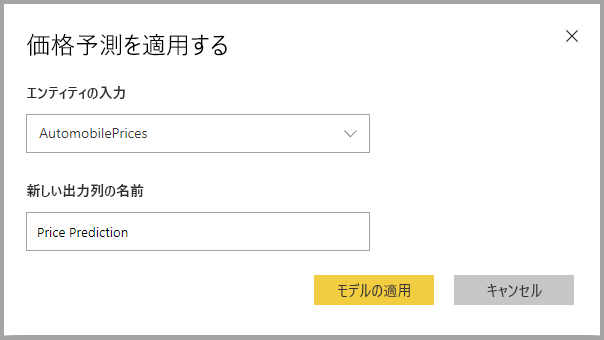

回帰モデルが適用されるときに、出力の強化されたエンティティに 2 つの出力列を追加します。 これらは、 **PredictionValue**、および**PredictionExplanation**します。 エンティティ内の列名では、モデルが適用されるときに指定されたプレフィックスがあります。

**PredictionValue**列には、入力フィールドに基づくレコードに対する予測値が含まれています。 **PredictionExplanation**列にしていた入力機能には、特定の影響を与えると説明が含まれています、 **PredictionValue**します。 これは、入力特徴の重みの JSON 形式のコレクションです。

## 次の手順

この記事では、Power BI サービスでのデータフローの Machine Learning の自動化の概要を提供します。 次の記事も役に立ちます。

* [チュートリアル:Power BI (プレビュー) での Machine Learning モデルを構築します。](service-tutorial-build-machine-learning-model.md)
* [チュートリアル:Power BI での Cognitive Services の使用](service-tutorial-use-cognitive-services.md)
* [チュートリアル:Power BI での Machine Learning Studio モデルの呼び出し (プレビュー)](service-tutorial-invoke-machine-learning-model.md)
* [Power BI での Cognitive Services (プレビュー)](service-cognitive-services.md)
* [Azure Machine Learning の Power BI への統合 (プレビュー)](service-machine-learning-integration.md)

データフローの詳細については、以下の記事をご覧ください。
* [Power BI でのデータフローの作成と使用](service-dataflows-create-use.md)
* [Power BI Premium で計算されたエンティティの使用](service-dataflows-computed-entities-premium.md)
* [オンプレミス データ ソースでのデータフローの使用](service-dataflows-on-premises-gateways.md)
* [Power BI のデータフローに関する開発者向けリソース](service-dataflows-developer-resources.md)
* [データフローと Azure Data Lake の統合 (プレビュー)](service-dataflows-azure-data-lake-integration.md)

