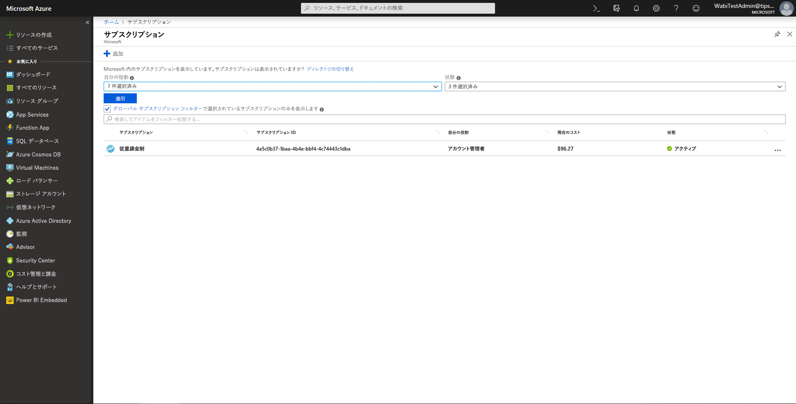
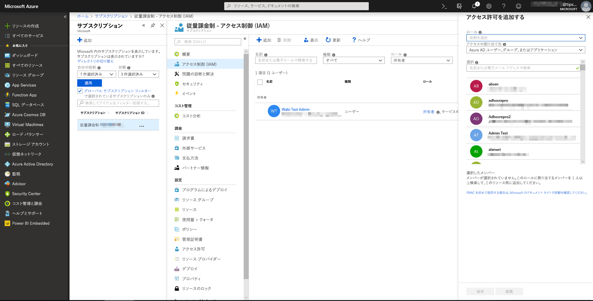
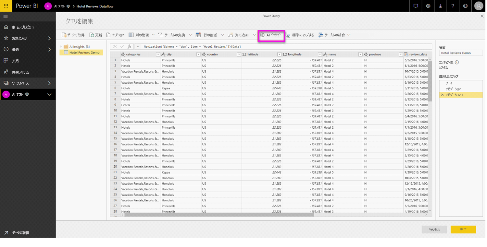
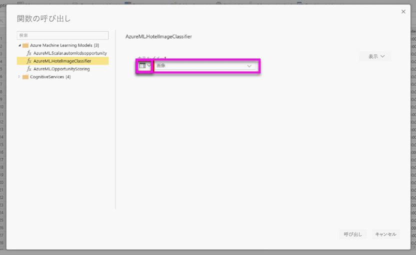
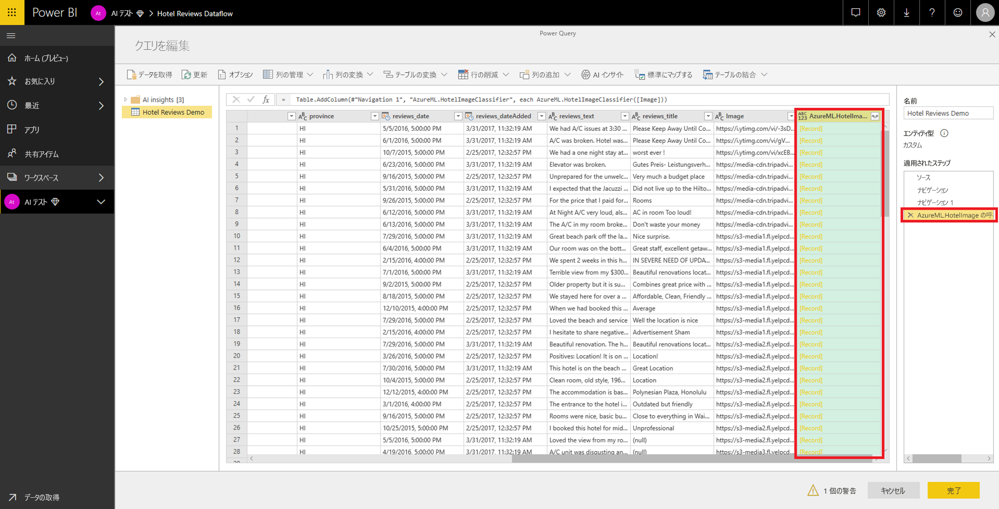
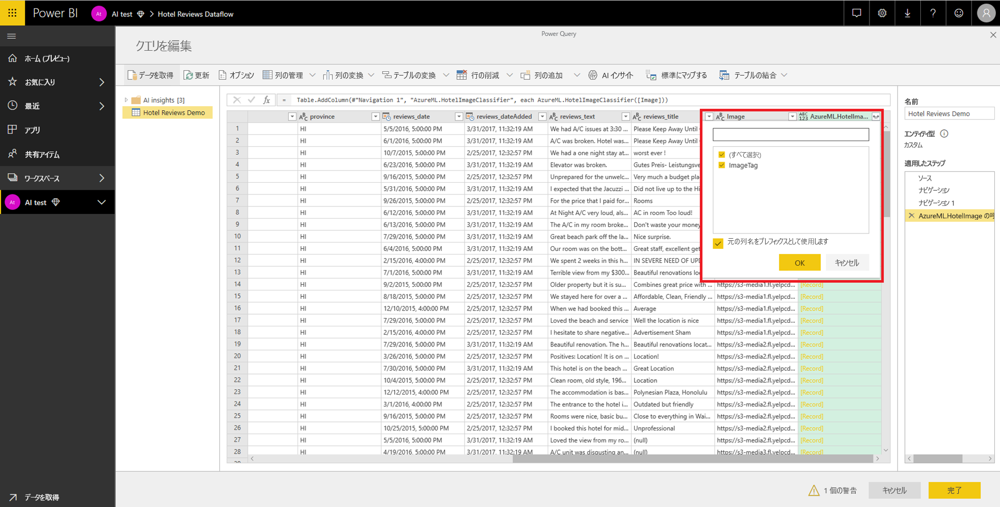

# Azure Machine Learning の Power BI への統合 (プレビュー)

多くの組織が **Machine Learning** モデルを使用して、ビジネスに関する分析情報の質や予測を向上させています。 これらのモデルからの分析情報は、レポートやダッシュボードなどの分析で視覚化したり、呼び出したりできるので、その情報を最も必要としているビジネス ユーザーに提供することが可能です。  Power BI では、ポイントアンドクリック ジェスチャを使用するだけで、Azure Machine Learning service 上でホストされているモデルから、簡単に分析情報を取り込めるようになりました。

この機能を使用するには、最初にデータ サイエンティストが Azure portal を使用して、Azure ML モデルへのアクセス権を BI アナリストに付与します。  次に、Power Query が、セッションが開始されるたびに、ユーザーがアクセス可能なすべての Azure ML モデルを検出して、動的な Power Query 関数として公開します。  ユーザーがこれらの関数を呼び出すには、Power Query エディター内のリボンからこれらの関数にアクセスするか、M 関数を直接呼び出します。 また、一連の行のパフォーマンスを向上させるため、Power BI は、Azure ML モデルを呼び出すときに、アクセス要求を自動的にバッチ処理します。

現在、この機能がサポートされるのは、Power BI データフローと、Power BI サービスの Power Query オンラインのみです。

データフローの詳細については、「[Self-service data prep in Power BI (Power BI でのセルフサービス データの準備)](service-dataflows-overview.md)」を参照してください。

Azure Machine Learning の詳細については、以下を参照してください。

- 概要:「[What is Azure Machine Learning service? (Azure Machine Learning について)](https://docs.microsoft.com/azure/machine-learning/service/overview-what-is-azure-ml)」
- Azure Machine Learning のクイック スタートおよびチュートリアル:「[Azure Machine Learning のドキュメント](https://docs.microsoft.com/azure/machine-learning/)」

## Power BI ユーザーに Azure ML モデルへのアクセス権を付与する

Power BI から Azure ML モデルにアクセスするには、Azure サブスクリプションへの**読み取り**アクセス権が必要です。  このほか、以下のアクセス権も必要です。

- Machine Learning Studio モデルの場合は、Machine Learning Studio Web サービスへの**読み取り**アクセス権
- Machine Learning service モデルの場合は、Machine Learning service ワークスペースへの**読み取り**アクセス権

Azure ML service 上でホストされているモデルへのアクセス権を付与することにより、Power BI ユーザーがこの Power Query 関数としてのモデルにアクセスできるようにする手順を以下に示します。  詳細については、[RBAC および Azure portal を使用したアクセスの管理](https://docs.microsoft.com/azure/role-based-access-control/role-assignments-portal)に関する記事を参照してください。

1. [Azure portal](https://portal.azure.com) にサインインします。

2. **[Subscriptions]\(サブスクリプション\)** ページに移動します。 Azure portal の左側のナビゲーション メニューにある **[すべてのサービス]** リストに **[サブスクリプション]** ページがあります。

    ![[Azure サブスクリプション] ページ](media/service-machine-learning-integration/machine-learning-integration_01.png)

3. サブスクリプションを選択します。

    

4. **[アクセス制御 (IAM)]** を選択してから、 **[追加]** ボタンを選択します。

    

5. ロールとして **[閲覧者]** を選択します。 Azure ML モデルへのアクセス権を付与する Power BI ユーザーを選択します。

    ![ロールとして [閲覧者] を選択する](media/service-machine-learning-integration/machine-learning-integration_04.png)

6. **[保存]** を選択します。

7. 上記の 3 ～ 6 の手順を繰り返し、特定の Machine Learning Studio Web サービスのユーザー、*または*モデルをホストしている Machine Learning service ワークスペースのユーザーに **[閲覧者]** アクセス権を付与します。

## Machine Learning service モデルのスキーマの検出

データ サイエンティストは、Machine Learning service の機械学習モデルを開発する際、さらにはデプロイする際にも、主に Python を使用しています。  モデルのスキーマ ファイルの作成タスクを自動化する Machine Learning Studio とは異なり、Machine Learning service の場合、データ サイエンティストは、Python を使用して、スキーマ ファイルを明示的に生成する必要があります。

このスキーマ ファイルは、次に含める必要があります:

## Power BI で Azure ML モデルを呼び出す

アクセス権があれば、どの Azure ML モデルでも、データフロー内の Power Query エディターから直接呼び出すことができます。 下図に示すように、Azure ML モデルにアクセスするには、Azure ML モデルからの分析情報で強化するエンティティの **[編集]** ボタンを選択します。

**[編集]** ボタンを選択すると、データフロー内でエンティティの Power Query エディターが開きます。

リボン内で **[AI Insights]** ボタンを選択した後、左側のナビゲーション メニューから _[Azure Machine Learning Models]\(Azure Machine Learning モデル\)_ フォルダーを選択します。 アクセス権があるすべての Azure ML モデルが Power Query 関数としてここに一覧表示されます。 また、Azure ML モデルの入力パラメーターは、対応する Power Query 関数のパラメーターとして自動的にマップされます。

Azure ML モデルを呼び出すには、選択したエンティティのいずれかの列を、ドロップダウン リストからの入力として指定します。 入力ダイアログの左側にある列アイコンを切り替えることにより、入力として使用する定数値を指定することもできます。

**[呼び出し]** を選択すると、Azure ML モデルの出力のプレビューが、エンティティのテーブルの新しい列として表示されます。 また、モデル呼び出しが、クエリに適用された手順として表示されます。

モデルから複数の出力パラメーターが返された場合、それらのパラメーターは、出力列内で 1 つのレコードとしてグループ化されます。 列を展開すると、個々の出力パラメーターを別々の列内に生成できます。

データフローを保存すると、データフローの更新時に (エンティティ テーブルの行の新規作成や更新に対して) モデルが自動的に呼び出されます。

## 次の手順

この記事では、Machine Learning を Power BI サービスに統合する手順を概説しました。 以下の記事も興味深い内容で、役立つかもしれません。 

* [チュートリアル:Power BI での Machine Learning Studio モデルの呼び出し (プレビュー)](service-tutorial-invoke-machine-learning-model.md)
* [チュートリアル:Power BI での Cognitive Services の使用](service-tutorial-use-cognitive-services.md)
* [Power BI での Cognitive Services (プレビュー)](service-cognitive-services.md)

データフローの詳細については、以下の記事をご覧ください。
* [Power BI でのデータフローの作成と使用](service-dataflows-create-use.md)
* [Power BI Premium で計算されたエンティティの使用](service-dataflows-computed-entities-premium.md)
* [オンプレミス データ ソースでのデータフローの使用](service-dataflows-on-premises-gateways.md)
* [Power BI のデータフローに関する開発者向けリソース](service-dataflows-developer-resources.md)
* [データフローと Azure Data Lake の統合 (プレビュー)](service-dataflows-azure-data-lake-integration.md)

