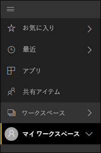
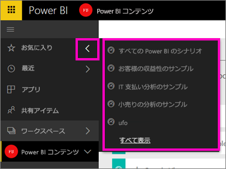
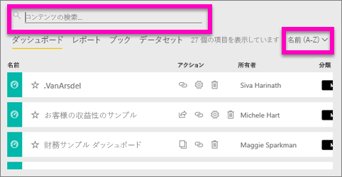
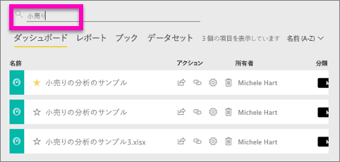
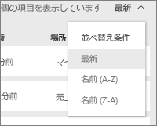

# Power BI でコンテンツを検索したり並べ替える
Power BI サービスでは、Power BI の自動での整理、ユーザーのタグ付け、検索、および並べ替えの組み合わせにより、必要なものをすばやく検索することができます。

## Power BI を利用してコンテンツ間を移動する方法
Power BI サービスには、コンテンツを整理する方法がいくつかあります。  まず、コンテンツはダッシュボード、レポート、ブック、およびデータセットに分割されます。 この編成は Power BI の多数の画面で見られます。 次に、Power BI サービスはより簡単に必要なものを迅速に見つけることができる方法でコンテンツを分類します。 左ナビゲーションを見てください。

自分で使用するためのコンテンツは **[マイ ワークスペース]** に、自分が作成してグループで共有するコンテンツは **[ワークスペース]** に、すばやくアクセスするコンテンツは **[お気に入り]** に、自分と共有するコンテンツは **[自分と共有]** に、最後に表示したコンテンツは **[最近]** にあります。

詳細については、「[Power BI - Power BI サービスの基本的な概念](service-basic-concepts.md)」を参照してください。

> **注**: コンテンツを整理するもう 1 つの方法は、最も頻繁に参照すると思われるダッシュボードを選択し、それを*おすすめ*のダッシュボードとして設定することです。 Power BI サービスを開くたびに、このダッシュボードが最初に表示されます。 詳細については、「[Power BI のおすすめのダッシュボード](service-dashboard-featured.md)」を参照してください。
> 
> 

## おすすめのダッシュボードとアプリ
頻繁に参照するダッシュボードとアプリがたくさんありますか? それらを[*お気に入り*に設定すると、](service-dashboard-favorite.md)常に左ナビゲーション バーから使用できます。

お気に入りを使用する方法の詳細については、この記事の「[Power BI のお気に入りのダッシュボード](service-dashboard-favorite.md)」を参照してください。

## ワークスペースでの検索および並べ替え
ワークスペースには、ダッシュボード、レポート、ブックおよびデータセットの 4 つのコンテンツ タブがあります。  これらのタブにはそれぞれ、検索フィールドと並べ替えボタンがあります。  Power BI サービスを使用し始めたばかりの場合、タブごとにアイテムが 1 つか 2 つしかないので、これらはあまり役に立たないかもしれません。しかし、使用するうちに、コンテンツが多数表示されるようになる場合もあります。  並べ替えと検索を使用すると、必要なものを簡単に検索できます。

* 現在の画面で、検索する検索用語を入力します。
  
   
* 並べ替えボタンを選択し、現在のページのオプションを表示します。 オプションは、名前または所有者で並べ替えられます。
  
   

## 考慮事項とトラブルシューティング
* データセットでは、所有者で **[並べ替え]** は使用できません。

## 次の手順
[Power BI - 基本的な概念](service-basic-concepts.md)

他にわからないことがある場合は、 [Power BI コミュニティを利用してください](http://community.powerbi.com/)。

