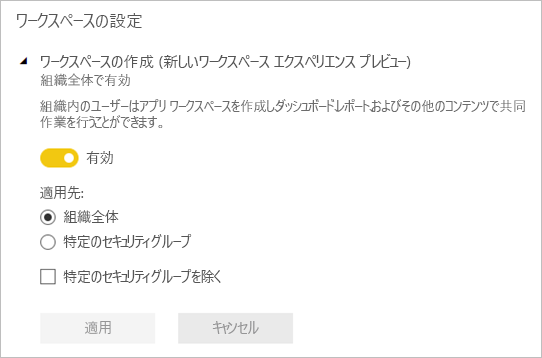

# Power BI で、新しいワークスペースで作業を整理する (プレビュー)

ワークスペースは、同僚と共同でダッシュボードやレポートを作り、集める場所です。 その後、集めたものをまとめて*アプリ* にバンドルし、所属の組織全体や特定のユーザーまたはグループに配布できます。 Power BI では、新しいワークスペース エクスペリエンスがプレビューとして導入されています。 

新しいワークスペース プレビューでは、次の作業を行うことができます。

- ワークスペース ロールをユーザー グループのセキュリティ グループ、配布リスト、Office 365 グループ、個人に割り当てる。
- Office 365 グループを作成せずに、Power BI でワークスペースを作成する。
- ワークスペースでより柔軟なアクセス許可の管理を行うために、より細分化されたワークスペース ロールを使用する。

新しいワークスペースを作成する方法については[こちら](service-create-the-new-workspaces.md)をご覧ください。
 
新しいワークスペースのいずれかを作成するときに、基になる、関連する Office 365 グループは作成しません。 ワークスペースの管理はすべて Office 365 ではなく、Power BI で行われます。 引き続き Office 365 グループをワークスペースに追加し、Office 365 グループを介したコンテンツへのユーザー アクセスの管理を続行できます。 しかし、さらにセキュリティ グループや配布リストを使用することで、Power BI 内で直接個人を追加して、ワークスペースへのアクセスを柔軟に管理できます。 Power BI 内でワークスペースを管理するようになったため、組織内のだれがワークスペースを作成できるかは Power BI 管理者が決定します。 管理ポータルの**ワークスペース設定**で、管理者は組織の全員に対してワークスペースの作成を許可したり、禁止したりできます。 特定のセキュリティ グループのメンバーに作成を限定することもできます。

Power BI 管理ポータルの詳細については[こちら](service-admin-portal.md)をご覧ください。

## 新しいワークスペースをロールアウトする

プレビュー期間中は、古いワークスペースと新しいワークスペースを並行して共存させることができ、いずれも作成可能です。 新しいワークスペースのプレビューが終了し、一般公開されるようになっても、古いワークスペースは当面は存在できます。 古いワークスペースは作成できなくなり、ご利用のワークスペースを新しいワークスペースのインフラストラクチャに移行する準備が必要になります。 心配はありません。移行の完了に数か月が与えられます。

## 新しいワークスペースのロール

新しいワークスペースには、ユーザー グループや個人をメンバー、共同作成者、または管理者として追加します。 ユーザー グループのすべてのユーザーには、定義されたロールが与えられます。 個人が複数のユーザー グループ内に存在する場合は、ロールによって提供される最高レベルのアクセス許可が与えられます。

ワークスペースに追加するすべてのユーザーに、Power BI Pro のライセンスが必要となります。 ワークスペースでは、より広範な対象ユーザーや、場合によっては組織全体に発行する予定のダッシュボードやレポートで、これらすべてのユーザーが共同作業を行うことができます。 組織内部の他のユーザーにコンテンツを配布する場合は、Power BI Pro ライセンスをそのユーザーに割り当てるか、Power BI Premium 容量にワークスペースを配置することができます。

ロールを使用すれば、ワークスペースで誰が何を行うことができるかを管理できるため、チームでの共同作業が可能になります。 新しいワークスペースでは、ロールを個人、およびユーザー グループのセキュリティ グループ、Office 365 グループ、配布リストに割り当てることができます。 

ユーザー グループにロールを割り当てると、グループ内の個人がコンテンツにアクセスできるようになります。 ユーザー グループを入れ子にすると、含まれているすべてのユーザーにアクセス許可が付与されます。 さまざまなロールを持ついくつかのユーザー グループ内のユーザーには、最高レベルのアクセス許可が付与されます。 

新しいワークスペースでは、管理者、メンバー、共同作成者という 3 つのロールが提供されます。

**管理者は次のことを行うことができます。**

- ワークスペースの更新と削除。 
- 他の管理者を含む、ユーザーの追加と削除。
- メンバーが行うことができるすべての作業の実行。

**メンバーは次のことを行うことができます。** 

- メンバーやその他の下位のアクセス許可を持つユーザーの追加。
- アプリの発行と更新。
- アイテムの共有やアプリの共有。
- 他のユーザーに対するアイテムの再共有の許可。
- 共同作成者が行うことができるすべての作業の実行。

**共同作成者は次のことを行うことができます。** 

- ワークスペースでのコンテンツの作成、編集、削除。 
- ワークスペースへのレポートの公開と、コンテンツの削除。
- 新しいユーザーにコンテンツへのアクセスを許可することはできません。 新しいコンテンツを共有することはできませんが、ワークスペース、アイテム、またはアプリを既に共有しているユーザーとは共有が可能です。 
- グループのメンバーを変更することはできません。
 
アクセス権のないユーザーが要求できるように、サービス全体のアクセス権の要求ワークフローを作成中です。 現在、ダッシュボード、レポート、アプリ用のアクセス権の要求ワークフローが存在します。

## 古いワークスペースを新しいワークスペースに変換する

プレビュー期間中は、古いワークスペースを新しいものに自動的に変換することはできません。 しかしながら、新しいワークスペースを作成し、自分のコンテンツを新しい場所に発行することはできます。 

新しいワークスペースが一般公開 (GA) された場合は、古いものを自動的に移行するよう選択できます。 GA 後のある時点で、移行する必要があります。

## 新しいワークスペースと現在のワークスペースの違いは何ですか?

新しいワークスペースでは、一部の機能が再設計されています。 プレビューと、永続的となることが予想される変更は以下のようになります。 

* ワークスペースを作成しても、現在のワークスペースのように Office 365 で対応するエンティティは作成されません。 (ロールを割り当てることで、引き続き、ご利用のワークスペースに Office 365 グループを追加することはできます)。 
* 現在のワークスペースでは、メンバーおよび管理者リストに追加できるのは個人のみです。 新しいワークスペースでは、ユーザーが管理しやすいように、複数の AD セキュリティ グループ、配布リスト、Office 365 グループをこれらのリストに追加することができます。 
- 現在のワークスペースから組織のコンテンツ パックを作成することができます。 新しいワークスペースからは作成できません。
- 現在のワークスペースから組織のコンテンツ パックを利用することができます。 新しいワークスペースからは利用できません。
- プレビュー期間中は、新しいワークスペースについては一部の機能をご利用いただけません。 詳細については、[予定されている新しいアプリ ワークスペース プレビューの機能](service-new-workspaces.md#planned-new-workspace-preview-features)に関する次のセクションを参照してください。

## 制限事項と考慮事項

注意すべき制限事項:

- ワークスペースに格納できるのは、最大で 1,000 データセット、またはデータセットあたり 1,000 レポートです。 
- Power BI Pro ライセンスを持つユーザーは、最大 250 ワークスペースのメンバーになることができます。

## 予定されている新しいワークスペース プレビューの機能

プレビューを開始しますが、他にも開発中の新しいワークスペース プレビュー機能がいくつかあります。それらはまだご利用いただけません。

- **[ワークスペースからの脱退]** ボタンはありません。
- 利用状況の指標はまだサポートされていません。
- Premium のしくみ:Premium 容量でのワークスペースの割り当てや作成は可能ですが、容量間でワークスペースを移動する場合は、ワークスペースの設定に移動します。
- SharePoint Web パーツの埋め込みはまだサポートされていません。
- [データを取得] や [ファイルの取得] に Office 365 グループに対応する **[OneDrive]** ボタンはありません。

## 動作が異なるワークスペースの機能

新しいワークスペースの一部の機能の動作は、現在のワークスペースとは異なります。 このような違いは、お客様からのフィードバックに基づく意図的なものであり、ワークスペースでの共同作業をより柔軟にするためのものです。

- メンバーが再共有できる、またはできない: 共同作成者ロールに置き換えられます。
- 読み取り専用ワークスペース:ユーザーにワークスペースへの読み取り専用アクセスを許可する代わりに、近日公開予定のビューアー ロールにユーザーを割り当てます。これにより、ワークスペースのコンテンツに対する同様の読み取り専用アクセス権が許可されます。

## 既知の問題

この機能はプレビューであるため、注意する必要がある制限がいくつかあります。 次のような既知の問題があり、修正プログラムが開発中です。

- メールにサブスクリプションの受信者として追加された無料ユーザーやユーザー グループが、受信できるはずのメールを受信できない場合があります。 新しいワークスペースの 1 つが Premium 容量にあるものの、サブスクリプションを作成するユーザーのマイ ワークスペースが Premium 容量にない場合に、この問題が発生します。 マイ ワークスペースが Premium 容量にある場合、無料ユーザーおよびユーザー グループはメールを受信します。
- ワークスペースが Premium 容量から共有容量に移動された後、場合によっては、無料ユーザーおよびユーザー グループが受信できないはずのメールを引き続き受信します。 サブスクリプションを作成するユーザーのマイ ワークスペースが Premium 容量にある場合に、この問題が発生します。

## 次の手順
* [Power BI で新しいワークスペース (プレビュー) を作成する](service-create-the-new-workspaces.md)
* [現在のワークスペースを作成する](service-create-workspaces.md)
* [Power BI にアプリをインストールし、使用する](service-create-distribute-apps.md)
* わからないことがある場合は、 [Power BI コミュニティで質問してみてください](http://community.powerbi.com/)。
