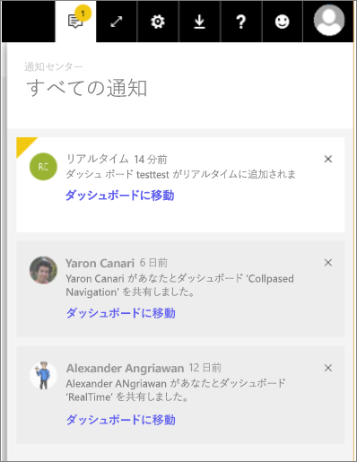

# Power BI の通知
通知センターは、Power BI の利用に関連する情報のシーケンシャルなフィードです。 これを開くと、共有されている新しいダッシュボードに関するメッセージ、グループ領域の変更、Power BI のイベントや会議、設定したアラートなどに関する情報が表示されます。 [Power BI サービスでアラートを設定](service-set-data-alerts.md)できます。Power BI モバイル アプリでもアラートを設定できます。

Amanda が受け取った通知を確認し、通知を管理し、返信するのをご覧ください。 その後、ビデオで説明されている手順に従って、ご自分でやってみてください。

<iframe width="560" height="315" src="https://www.youtube.com/embed/bZMSv5KAlcE" frameborder="0" allowfullscreen></iframe>

1. Power BI にサインインすると、オフラインの間に送信された新しい通知がフィードに追加されます。 新しい通知があると、Power BI では、黄色いバブルと新しいアイテムの数が表示されます。
   
   
2. Power BI メニュー バーで、通知アイコンを選択します。
   
   
3. 最新の通知から先に表示され、未読のメッセージは強調表示されます。 通知は、削除するか、100 件の上限に達するまで 90 日間保持されます。
   
   
4. 通知を破棄するには、[X] アイコンを選択します。

### 次の手順
* [Power BI サービスでのデータ アラート](service-set-data-alerts.md)
* [Power BI データ アラートでトリガーされる Microsoft Flow を作成する](service-flow-integration.md)
* [iPhone アプリでデータ アラートを設定する (Power BI for iOS)](mobile-set-data-alerts-in-the-mobile-apps.md)
* [Windows 10 用の Power BI モバイル アプリでデータ アラートを設定する](mobile-set-data-alerts-in-the-mobile-apps.md)
* 他にわからないことがある場合は、 [Power BI コミュニティを利用してください](http://community.powerbi.com/)。

