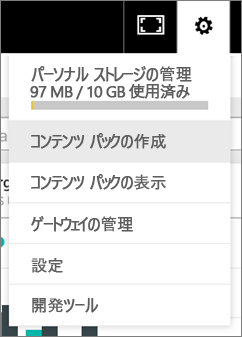
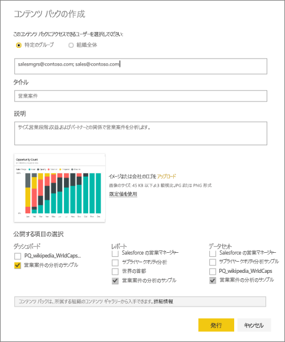
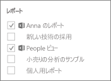
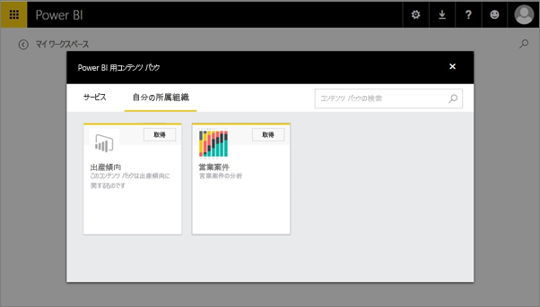

# Power BI の組織のコンテンツ パックを作成して発行する (チュートリアル)
> [!NOTE]
> 新しい*アプリ*のことは、もうご存知でしょうか。 アプリは、Power BI で多数の対象ユーザーにコンテンツを配布する新しい方法です。 組織のコンテンツ パックや読み取り専用ワークスペースの代わりにアプリを使用することをお勧めします。 アプリの詳細については、[こちら](service-install-use-apps.md)を参照してください。
> 
> 

このチュートリアルでは、組織のコンテンツ パックを作成して、特定のグループにアクセス許可を付与し、そのコンテンツ パックを Power BI の組織のコンテンツ パック ライブラリに発行します。

コンテンツ パックの作成は、ダッシュ ボードを共有すること、またはグループ内でダッシュボードで共同作業を行うこととは異なります。 状況に応じた最適なオプションを決定するには、「[How should I collaborate on and share dashboards and reports?](service-how-to-collaborate-distribute-dashboards-reports.md)」(ダッシュボードとレポートで共同作業と共有を行う方法) を参照してください。

> [!NOTE]
> 組織のコンテンツ パックを作成するには、あなたとあなたの同僚が使用する [Power BI Pro アカウント](https://powerbi.microsoft.com/pricing)が必要となります。
> 
> 

あなたは Contoso のリリース マネージャーで、新製品の発売の準備をしています。  レポートでダッシュボードを作成しており、それを発売を管理している他の従業員と共有したいと思います。 同僚が使用できるようにソリューションとしてダッシュボードとレポートをパッケージする手段が必要です。 

どうしたらよいでしょうか? [Power BI サービス](https://powerbi.com)で、**[データの取得] > [サンプル] > [営業案件の分析のサンプル]** > **[接続]** に移動し、自分用のコピーを取得します。 

1. 左側のナビゲーション ウィンドウで、 **[営業案件の分析のサンプル]** ダッシュボードを選びます。
2. 上部のナビゲーション バーで、歯車アイコン  > **[コンテンツ パックの作成]** の順に選択します。    
   
3. **[コンテンツ パックの作成]** ウィンドウで、次の情報を入力します。  
   
   組織のコンテンツ パック ライブラリには、最終的に、組織やグループに対して発行された何百ものコンテンツ パックが格納される可能性があります。 時間をとって、コンテンツ パックにわかりやすい名前を付け、ふさわしい説明を追加して、対象ユーザーを適切に絞り込んでください。  あなたのコンテンツ パックが検索で簡単に見つかるような語を使用してください。
   
   1.  **[特定のグループ]** を選び、個々のユーザーの完全なメール アドレス、[Office 365 グループ](https://support.office.com/article/Create-a-group-in-Office-365-7124dc4c-1de9-40d4-b096-e8add19209e9)、配布グループ、またはセキュリティ グループを入力します。 例:
      
         salesmgrs@contoso.com; sales@contoso.com
      
      このチュートリアルでは、あなたもしくはグループの電子メール アドレスを使用してみてください。
   
   2.  コンテンツ パックに「**営業案件**」という名前を付けます。
   
      > [!TIP]
      > コンテンツ パックの名前には、ダッシュボードの名前を含めることをお勧めします。 そうすると、同僚がコンテンツ パックに接続した後、ダッシュボードを見つけやすくなります。
      > 
      > 
   
   3.  推奨: **説明**を追加します。 説明を付けると、同僚が必要とするコンテンツ パックを簡単に見つけやすくなります。 説明に加えて、同僚がこのコンテンツ パックを検索するときに使用する可能性があるキーワードを追加します。 同僚が質問したり、サポートを必要としたりするときに備えて連絡先情報を含めます。
   
   4.  グループ メンバーがコンテンツ パックを簡単に見つけられるように**画像またはロゴをアップロード**します。画像の方が、テキストを検索する場合よりもすばやく見つけることができます。 以下のスクリーン ショットでは、営業案件数 100% 縦棒グラフのタイルの画像を使用しています。
   
   5.  **[営業案件の分析のサンプル]** ダッシュボードを選択し、コンテンツ パックに追加します。  Power BI によって、関連するレポートとデータセットが自動的に追加されます。 必要に応じて、他にも追加することができます。
   
      > [!NOTE]
      >  自分が編集できるダッシュボード、レポート、データセット、ブックのみが一覧表示されます。 そのため、共有を受けたものはリストに表示されません。
      > 
      > 
   
       
   
   6. Excel ブックがある場合は、[レポート] に Excel アイコン付きで表示されます。 この Excel ブックをコンテンツ パックに追加することもできます。
   
     
   
      > [!NOTE]
      > グループのメンバーが Excel ブックを表示できない場合は、必要に応じて [OneDrive for Business でメンバーとブック](https://support.office.com/en-us/article/Share-documents-or-folders-in-Office-365-1fe37332-0f9a-4719-970e-d2578da4941c)を共有します。
      > 
      > 
4. **[発行]** を選択し、グループの組織コンテンツ パック ライブラリにコンテンツ パックを追加します。  
   
   正常に発行されると、成功メッセージが表示されます。 
5. グループのメンバーが、**[データの取得] > [組織]** の順に選択し、検索ボックスに「営業案件」と入力します。
   
    
6. 作成したコンテンツ パックがメンバーに表示されます。  
    
   
   > [!TIP]
   > ブラウザーに表示される URL は、このコンテンツ パックの一意のアドレスです。  この新しいコンテンツ パックについて同僚に知らせる場合には、  この URL を電子メールに貼り付けてください。
   > 
   > 
7. 同僚が **[接続]** を選ぶと、[コンテンツ パックを表示して作業](service-organizational-content-pack-copy-refresh-access.md)できるようになります。 

### 次の手順
* [組織のコンテンツ パックの概要](service-organizational-content-pack-introduction.md)  
* [組織のコンテンツ パックを管理、更新、削除する](service-organizational-content-pack-manage-update-delete.md)  
* [Power BI でのグループの作成](service-create-distribute-apps.md)  
* [OneDrive for Business とは?](https://support.office.com/en-us/article/What-is-OneDrive-for-Business-187f90af-056f-47c0-9656-cc0ddca7fdc2)
* 他にわからないことがある場合は、 [Power BI コミュニティを利用してください](http://community.powerbi.com/)。

