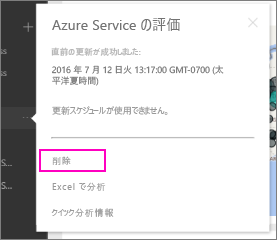

# Power BI の組織のコンテンツ パックへの接続を削除する
同僚がコンテンツ パックを作成しました。 それを AppSource で見つけて、Power BI ワークスペースに追加しました。 それが必要なくなった場合、  どのように削除できますか。

コンテンツ パックを削除するには、そのデータセットを削除します。  

* 左側のナビゲーション ウィンドウで、データセットの右側にある省略記号を選び、**[削除] \> [はい]** を選びます。  
  
  

データセットを削除すると、関連するすべてのレポートとダッシュボードも削除されます。 ただし、コンテンツ パックへの接続を削除しても、コンテンツ パックは組織の AppSource から削除されません。  いつでも AppSource に戻って、目的のコンテンツ パックをワークスペースに再び追加できます。 コンテンツの作成者である場合にのみ、[AppSource からコンテンツ パックを削除](service-organizational-content-pack-manage-update-delete.md)できます。

## 次の手順
* [組織のコンテンツ パックの概要](service-organizational-content-pack-introduction.md) 
* [Power BI でのアプリの作成および配布](service-create-distribute-apps.md) 
* [Power BI - 基本的な概念](service-basic-concepts.md)  
* 他にわからないことがある場合は、 [Power BI コミュニティを利用してください](http://community.powerbi.com/)。

