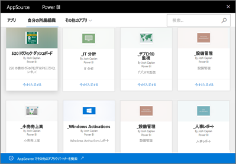

# Power BI での組織のコンテンツ パックの概要
> [!NOTE]
> 新しいワークスペース エクスペリエンス プレビューでは、組織のコンテンツ パックを作成したり、インストールしたりすることはできません。 コンテンツ パックをアプリにまだアップグレードしていない場合は、今がそのよい機会です。 新しいワークスペース エクスペリエンスの詳細については、[こちら](service-create-the-new-workspaces.md)を参照してください。
> 

チームのメンバーにメールで定期的にレポートを配布する場合は、 自分のダッシュボード、レポート、Excel ブック、およびデータセットをパッケージ化し、 *組織のコンテンツ パック* としてチームに公開してください。 すべてのコンテンツ パックは AppSource にあるので、チームは簡単に見つけることができます。 ライブラリは Power BI に含まれているので、インタラクティブなデータ探索、新しいビジュアル、Q&A、他のデータ ソースとの統合、データ更新、その他 Power BI の機能のすべてを活用できます。

コンテンツ パックの作成は、ダッシュ ボードを共有すること、またはアプリ ワークスペース内のダッシュボードで共同作業を行うこととは異なります。 状況に応じた最適なオプションを決定するには、「[How should I collaborate on and share dashboards and reports?](service-how-to-collaborate-distribute-dashboards-reports.md)」(ダッシュボードとレポートで共同作業と共有を行う方法) を参照してください。 

組織全体、配布グループ、セキュリティ グループ、および[所属する Office 365 グループ](https://support.office.com/article/Create-a-group-in-Office-365-7124dc4c-1de9-40d4-b096-e8add19209e9)に対して発行されたコンテンツ パックは、AppSource で参照または検索することができます。 特定のグループのメンバーではないユーザーには、そのグループで共有されるコンテンツ パックは表示されません。 同じグループのすべてのメンバーは、コンテンツ パック データ、レポート、ブック、ダッシュボードに対して同じ読み取り専用アクセス権が与えられます (ただし、SQL Server Analysis Services (SSAS) データ ソースは除きます。この場合、ユーザーの権限がデータ ソースと共に継承されます)。

ダッシュボード、レポート、Excel ブックは読み取り専用ですが、自分のカスタマイズされたバージョンのコンテンツ パックを作成するために、カスタマイズの起点としてダッシュボードとレポートをコピーおよび使用することができます。

> [!NOTE]
> 組織のコンテンツ パックは、自分と同僚が [Power BI Pro](service-free-vs-pro.md) を持っている場合にのみ利用できます。
> 
> 

## *AppSource* とは
組織のコンテンツ パックを発行すると、そのコンテンツ パックは AppSource に追加されます。  これは一元的なリポジトリで、メンバーは自分に対して発行されたダッシュボード、レポート、データセットを簡単に参照して、見つけることができます。  

* AppSource を表示するには、**[データの取得]** > **[自分の所属組織]** > **[取得]** の順に選びます。

詳細については、「[Power BI で組織のコンテンツ パックを検索して開く](service-organizational-content-pack-find-and-open.md)」を参照してください。

## 組織のコンテンツ パックのライフ サイクル
Power BI Pro のすべてのユーザーは、組織のコンテンツ パックを作成、発行、アクセスできます。 コンテンツ パックの作成者だけが、ブックやデータセットを変更したり、スケジュールを更新したり、削除したりすることができます。

ライフ サイクルは次のようになります。

1. Power BI Pro で、Nate がコンテンツ パックを作成し、マーケティング配布グループに発行した場合を考えます。 更新設定は、データセットに伴って継承され、Nate だけが変更できます。
   
   > [!NOTE]
   > Nate が、自分が属する [Power BI アプリ ワークスペース](service-create-distribute-apps.md)内からコンテンツ パックを作成した後、そのワークスペースを抜けたとしても、Power BI のワークスペース内の他のユーザーが所有権を引き継ぐことができます。
   > 
   > 
2. Nate が配布グループにメールを送信して新しいコンテンツ パックについて説明します。
3. Power BI Pro では、マーケティング配布グループのメンバーである Jane が、AppSource でこのコンテンツ パックを検索し、接続します。 彼女が今使用しているのは読み取り専用コピーです。  左側のナビゲーション ウィンドウにあるダッシュボード名とレポート名の左側に共有アイコンが表示されているので、これが読み取り専用であると認識できます。 さらに、ダッシュボードを選択すると、ロック アイコンが表示されているので、表示されているのがコンテンツ パックのダッシュボードであることがわかります。 
4. 彼女がこれをカスタマイズすることにしたと想定します。 こうして、彼女は自分用のダッシュボードとレポートのコピーを持つようになりました。 作業をしてもソース、元のコンテンツ パックは変わらず、配布グループの他のメンバーには影響しません。 こうして、彼女は自分用のダッシュボードとレポートのコピーで作業できるようになりました。
5. Nate はダッシュボードを更新し、準備ができたらコンテンツ パックの新しいバージョンを発行します。
   
   * 別の配布グループのメンバーである Julio は、元のコンテンツ パックをカスタマイズしませんでした。 新しい変更は、彼のバージョンのコンテンツ パックに自動的に適用されます。  
   * Jane はコンテンツ パックをカスタマイズしました。 彼女は、新しいバージョンがあるという通知を受け取ります。  そこで、AppSource に移動して、自分のパーソナライズ バージョンを失わずに、更新されたコンテンツ パックを入手できます。 そうすると、彼女は自分のパーソナライズ バージョンと更新されたコンテンツ パックの 2 つのバージョンを持つことになります。
6. Nate がセキュリティ設定を変更するとします。 Julio と Jane は、コンテンツにアクセスできなくなります。 または、彼らがマーケティング配布グループから削除されたとします。
   
   * Julio は元のコンテンツ パックをカスタマイズしなかったため、コンテンツは自動的に削除されます。 
   * Jane はコンテンツ パックをカスタマイズしました。 次に彼女がダッシュボードを開くと、元のコンテンツ パックからのタイルはまったく表示されませんが、他のレポートからピン留めしていたタイル (彼女がまだ使用のアクセス許可を持っている) は引き続き表示されます。 関連付けられたレポートとデータセットは使用できなくなります (彼女の左側のナビゲーション ウィンドウに表示されません)。
7. または、Nate がコンテンツ パックを削除したとします。
   
   * Julio は元のコンテンツ パックをカスタマイズしなかったため、コンテンツは自動的に削除されます。 
   * Jane はコンテンツ パックをカスタマイズしました。 次に彼女がダッシュボードを開くと、元のコンテンツ パックからのタイルはまったく表示されませんが、他のレポートからピン留めしていたタイルは引き続き表示されます。 関連付けられたレポートとデータセットは使用できなくなります (彼女の左側のナビゲーション ウィンドウに表示されません)。

## データのセキュリティ
データに対して配布グループ メンバー全員にコンテンツ パック作成者と同じアクセス許可が与えられます。 1 つの例外は、SQL Server Analysis Services (SSAS) オンプレミス表形式データセットです。 レポートとダッシュボードはオンプレミス SSAS モデルにライブ接続しているので、個々の配布グループ メンバーがアクセスできるデータは、そのメンバーの資格情報を使用して決定されます。

## 次の手順
* [組織のコンテンツ パックの作成と発行](service-organizational-content-pack-create-and-publish.md)
* [Power BI でのアプリの作成および配布](service-create-distribute-apps.md) 
* [Power BI - 基本的な概念](service-basic-concepts.md)
* 他にわからないことがある場合は、 [Power BI コミュニティを利用してください](http://community.powerbi.com/)。

