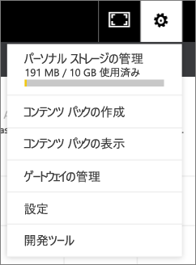

# 組織のコンテンツ パックを管理、更新、削除する
> [!NOTE]
> 新しい*アプリ*のことは、もうご存知でしょうか。 アプリは、Power BI で多数の対象ユーザーにコンテンツを配布する新しい方法です。 組織のコンテンツ パックは間もなく廃止される予定です。そのため、アプリの使用をお勧めします。 アプリの詳細については、[こちら](service-install-use-apps.md)を参照してください。
> 
> 

自分のダッシュボード、レポート、Excel ブック、データセットを[組織のコンテンツ パック](service-organizational-content-pack-introduction.md)にパッケージ化して、仕事仲間と共有できます。 同僚はそのまま使用するか、独自のコピーを作成することができます。

コンテンツ パックの作成は、ダッシュ ボードを共有すること、またはグループ内でダッシュボードで共同作業を行うこととは異なります。 状況に応じた最適なオプションを決定するには、「[How should I collaborate on and share dashboards and reports?](service-how-to-collaborate-distribute-dashboards-reports.md)」(ダッシュボードとレポートで共同作業と共有を行う方法) を参照してください。

組織のコンテンツ パックのタスクのいくつかは、コンテンツ パック作成者しか実行できません。

* 再発行
* コンテンツ パックへのアクセスの制限または拡張
* スケジュール設定された更新の設定と変更
* コンテンツ パックの削除

## 組織のコンテンツ パックの変更と再発行
元のコンテンツ パック ダッシュボード、レポート、または Excel ブックを変更すると、Power BI から再発行するように求められます。 さらに、コンテンツ パックの作成者であれば、元のコンテンツ パックの作成時に [コンテンツ パックの作成] ウィンドウで選んだオプションをどれでも更新できます。 

## 新しいコンテンツで再発行する
コンテンツ パックに含めたダッシュボードに変更を加えて保存すると、Power BI では他のユーザーが変更を確認できるようにダッシュボードを更新するよう通知します。 たとえば、新しいタイルをピン留めしたり、単純にダッシュボードの名前を変更したりした場合などです。

1. メッセージ内の **[コンテンツ パックの表示]** を選びます。
   
   
2. または、右上隅にある歯車アイコン  を選び、**[コンテンツ パックの表示]** を選びます。
   
   
   
   警告アイコン  にご注目ください。  これは、何らかの方法でコンテンツ パックを変更し、発行されたものと一致しなくなったことを知らせます。
3. **[編集]** をクリックします。  
4. **[コンテンツ パックの更新]** ウィンドウで任意の必要な変更を加え、 **[更新]** をクリックします。 **成功** メッセージが表示されます。
   
   * コンテンツ パックをカスタマイズしていないグループ メンバーの場合、更新内容は自動的に適用されます。
   * コンテンツ パックをカスタマイズしたグループ メンバーの場合、新しいバージョンがあるという通知を受け取ります。  そこで、AppSource に移動して、自分のパーソナライズ バージョンを失わずに、更新されたコンテンツ パックを入手できます。  その場合、自分のパーソナライズ バージョンと更新されたコンテンツ パックの 2 つのバージョンを持つことになります。  パーソナライズ バージョンでは、元のコンテンツ パックからのすべてのタイルが失われます。  ただし、他のレポートからピン留めしていたタイルは引き続きレンダリングされます。    

## 対象ユーザーの更新: アクセスの拡張または制限
コンテンツ パックの作成者が行うことのできる別の変更は、コンテンツ パックへのアクセスの拡張と制限です。  コンテンツ パックを大勢の対象ユーザーに対して発行し、より小さいグループにアクセスを制限することができます。  

1. 歯車アイコン  を選び、**[コンテンツ パックの表示]** を選びます。
2. **[編集]** をクリックします。 
3. **[コンテンツ パックの更新]** ウィンドウで任意の必要な変更を加え、 **[更新]** をクリックします。 たとえば、 **[特定のグループ]** フィールドで元の配布グループを削除し、より少ないメンバーを持つ別の配布グループに置き換えます。
   
   成功メッセージが表示されます。
   
   新しいエイリアスの一部ではない同僚の場合:
   
   * コンテンツ パックをカスタマイズしていないグループ メンバーの場合、そのコンテンツ パックに関連付けられているダッシュボードとレポートは利用できなくなり、コンテンツ パックは [ナビゲーション] ウィンドウに表示されません。
   * コンテンツ パックをカスタマイズしたグループ メンバーの場合、次回、カスタマイズしたダッシュボードを開くと、元のコンテンツ パックにあったすべてのタイルはなくなっています。  ただし、他のレポートからピン留めしていたタイルは引き続きレンダリングされます。 元のコンテンツ パックのレポートとデータセットは利用できなくなり、コンテンツ パックは [ナビゲーション] ウィンドウに表示されません。   

## 組織のコンテンツ パックを更新する
コンテンツ パックの作成者であれば、[データセットの更新をスケジュール設定](refresh-data.md)できます。  コンテンツ パックを作成しアップロードすると、その更新スケジュールはデータセットと一緒にアップロードされます。 更新スケジュールを変更すると、コンテンツ パックを再発行する必要があります (上記を参照)。

## AppSource から組織のコンテンツ パックを削除する
コンテンツの作成者だけが、AppSource からコンテンツ パックを削除できます。 アプリ ワークスペースで組織のコンテンツ パックを作成した場合、そのワークスペースを削除するときは、必ず最初にコンテンツ パックを削除してください。 コンテンツ パックを先に削除しないでワークスペースを削除すると、コンテンツ パックにアクセスできなくなり、Microsoft サポートに支援を依頼する必要があります。 

> [!TIP]
> 作成していない[コンテンツ パックへの接続を削除する](service-organizational-content-pack-disconnect.md)ことはできます。 接続を削除しても、コンテンツ パックは AppSource から削除されません。
> 
> 

1. AppSource からコンテンツ パックを削除するには、コンテンツ パックを作成したアプリ ワークスペースに移動し、歯車アイコン  を選んでから、**[コンテンツ パックの表示]** を選びます。
2. **[削除] \> [削除]** の順に選びます。 
   
   * コンテンツ パックをカスタマイズしていないグループ メンバーの場合、そのコンテンツ パックに関連付けられているダッシュボードとレポートは自動的に削除されます。 それらは利用できなくなり、コンテンツ パックは [ナビゲーション] ウィンドウに表示されません。
   * コンテンツ パックをカスタマイズしたグループ メンバーの場合、次回、カスタマイズしたダッシュボードを開くと、元のコンテンツ パックにあったすべてのタイルはなくなっています。  ただし、他のレポートからピン留めしていたタイルは引き続きレンダリングされます。 元のコンテンツ パックのレポートとデータセットは利用できなくなり、コンテンツ パックは [ナビゲーション] ウィンドウに表示されません。   

## 次の手順
* [組織のコンテンツ パックの概要](service-organizational-content-pack-introduction.md)
* [Power BI でのアプリの作成および配布](service-create-distribute-apps.md) 
* 他にわからないことがある場合は、 [Power BI コミュニティを利用してください](http://community.powerbi.com/)。

