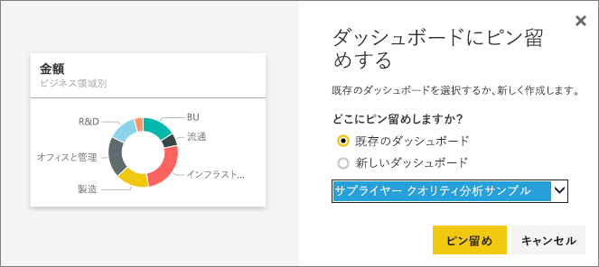
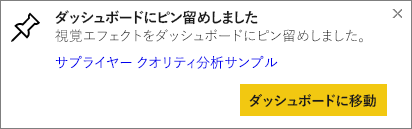

# ダッシュボードから別のダッシュボードにタイルをピン留め
新しい[ダッシュボード タイル](service-dashboard-tiles.md)を追加する 1 つの方法は、別のダッシュボードからコピーすることです。 これらの各タイルは、Q&A とレポートのどちらであれ、クリックすると作成元に戻るリンクです。 

> [!NOTE]
> 共有のダッシュボードからタイルをピン留めすることはできません。
> 
> 

## 別のダッシュボードにタイルをピン留めする
1. [データの取得](service-get-data.md)。 この例では、[IT Spend Analysis サンプル](sample-it-spend.md)を使います。
2. [ダッシュボード](service-dashboards.md)を開きます。
3. ピン留めするタイルにポインターを合わせ、[...] を選択し、ピン  アイコンを選びます。  
   
   
4. タイルを既存のダッシュボードまたは新しいダッシュボードにピン留めします。 
   
   * **既存のダッシュボード**: ドロップダウン リストから、ダッシュボードの名前を選択します。
   * **新しいダッシュボード**: 新しいダッシュボードの名前を入力します。
   
   
5. \[Pin] \(ピン留め) を選びます。
   右上隅の近くに成功メッセージが表示されたら、選んだダッシュボードに視覚化がタイルとして追加されたことがわかります。
   
   
6. **[ダッシュボードへ移動]** を選択してピン留めされたタイルを表示します。 ピン留めされた視覚化の[名前変更、サイズ変更、リンク、移動](service-dashboard-edit-tile.md)をそこで行うことができます。

## 次の手順
[Power BI のタイル](service-dashboard-tiles.md)  
[Power BI のダッシュボード](service-dashboards.md)  
他にわからないことがある場合は、 [Power BI コミュニティを利用してください](http://community.powerbi.com/)。

