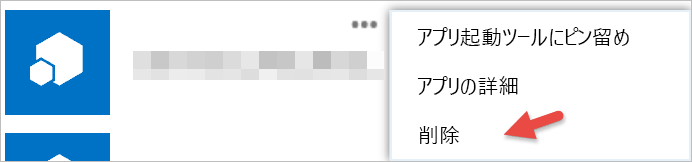

# サード パーティのアプリの概要
Power BI では、Microsoft 以外の会社または個人によってビルドされたアプリを使用できます。 たとえば、カスタムにビルドされた Web アプリケーションに統合されるサード パーティ製アプリを使用することも可能です。 サード パーティ製アプリを使用する場合は、Power BI アカウントとリソースへの特定のアクセスをそのアプリケーションに許可することを求められます。 既知で信頼のおけるアプリケーションにだけ、アクセス許可を付与することが重要です。 アプリケーションへのアクセス許可は、いつでも取り消すことができます。 「[サード パーティ製のアプリのアクセス許可の取り消し](#revoke)」を参照してください。

ここでは、アプリケーションが要求するアクセス権の種類を説明します。

## Power BI アプリのアクセス許可
* **ダッシュボードをすべて表示**
  
  * このアクセス許可は、アクセスできるすべてのダッシュボードを表示する機能をアプリケーションに提供します。 これには、自分が所有しているダッシュボード、コンテンツ パックから取得したダッシュボード、共有されているダッシュボード、所属するグループのダッシュボードが含まれます。 アプリケーションは、ダッシュボードに変更を加えることはできません。 特に、この許可は、アプリケーションがダッシュボードの内容をエクスペリエンスに組み込むために使用できます。
* **レポートをすべて表示**
  
  * このアクセス許可は、アクセスできるすべてのレポートを表示する機能をアプリケーションに提供します。 これには、自分が所有しているレポート、コンテンツ パックから取得したレポート、所属しているグループのレポートが含まれます。 レポートの表示は、レポート内のデータをアプリケーションが表示できることを意味しています。 アプリケーションは、レポート自体に変更を加えることはできません。 特に、この許可は、アプリケーションがレポートの内容をエクスペリエンスに組み込むために使用できます。
* **すべてのデータセットの表示**
  
  * このアクセス許可は、アクセスできるすべてのデータセットをリストする機能をアプリケーションに提供します。 これには、自分が所有しているデータセット、コンテンツ パックから取得したレポート、所属しているグループのレポートが含まれます。 アプリケーションでは、テーブル名や列名を含む構造と同様に、すべてのデータセットの名前を参照できます。 このアクセス許可は、データセットのデータを読み取る権限を付与します。 このアクセス許可によって、データセットに追加や変更をする権限がアプリケーションに与えられるわけではありません。
* **すべてのデータセットの読み取りと書き込み**
  
  * このアクセス許可は、アクセスできるすべてのデータセットをリストする機能をアプリケーションに提供します。 これには、自分が所有しているデータセット、コンテンツ パックから取得したレポート、所属しているグループのレポートが含まれます。 アプリケーションでは、テーブル名や列名を含む構造と同様に、すべてのデータセットの名前を参照できます。 このアクセス許可は、データセットのデータの読み取りと書き込みの権限を付与します。 アプリケーションは、新しいデータセットの作成または既存のデータセットの変更を行うこともできます。 これは、Power BI に直接データを送信するアプリケーションによって一般的に使用されます。
* **ユーザーのグループの表示**
  
  * このアクセス許可は、メンバーになっているすべてのグループをリストする機能をアプリケーションに提供します。 この許可は、特定のグループの内容を表示または更新するためにリストされた、他の許可の一部と合わせて使用できます。 アプリケーションは、グループ自体には変更を加えることはできません。

<a name="revoke"/>

## サード パーティ製のアプリのアクセス許可の取り消し
サード パーティ製アプリのアクセス許可を取り消すには、Office 365 のマイ アプリ サイトに移動します。

**Office 365 のマイ アプリ** サイトに、サード パーティ製のアクセス許可の取り消し方法が記載されています。

1. [Office 365 のマイ アプリ](https://portal.office.com/myapps) サイトに移動します。
2. **[マイ アプリ]** ページで、サード パーティのアプリを検索します。
3. アプリケーションのタイルをポイントし、 **(...)** ボタンをクリックして **[削除]** をクリックします。
   
   

