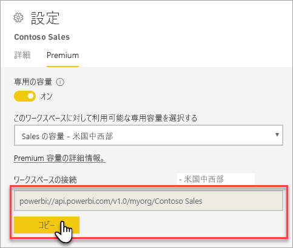
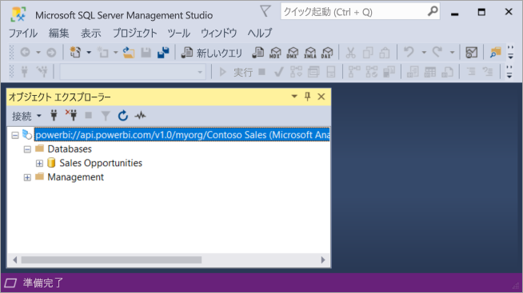

# クライアント アプリケーションとツール (プレビュー) のデータセットへの接続します。

Power BI Premium ワークスペースとデータセットのサポート*読み取り専用*Microsoft とサード パーティ製のクライアント アプリケーションおよびツールからの接続。 

> [!NOTE]
> この記事では、Power BI Premium ワークスペース、およびデータセットに読み取り専用の接続の紹介のみを対象としています。 これは、*ない*プログラミング、特定のツールとアプリケーション、アーキテクチャ、およびワークスペースとデータセットの管理に関する詳細な情報を提供するためのものです。 ここで説明したサブジェクトには、Analysis Services 表形式モデル データベースのアーキテクチャと管理の理解が必要です。

## プロトコル

Power BI Premium は、 [XML for Analysis](https://docs.microsoft.com/bi-reference/xmla/xml-for-analysis-xmla-reference) (XMLA) プロトコル クライアント アプリケーションと、ワークスペースとデータセットを管理するエンジンと通信します。 これらの通信は、対処は一般に呼ば XMLA エンドポイントです。 XMLA は、内部的には、Power BI のセマンティック モデリング、ガバナンス、ライフ サイクル、およびデータ管理を実行する Microsoft Analysis Services エンジンによって使用される同じ通信プロトコルです。 

大半のクライアント アプリケーションおよびツールに明示的に通信すること、エンジン XMLA エンドポイントを使用しています。 代わりに、クライアント アプリケーションと通信して、XMLA を使用してのみ、エンジンの間の仲介役としての MSOLAP、ADOMD、AMO などのクライアント ライブラリが使用しています。

## サポートされているツール

これらのツールは、Power BI Premium ワークスペースとデータセットを読み取り専用のアクセスをサポートします。

**SQL Server Management Studio (SSMS)** -クエリをサポートしている DAX、MDX、XMLA、および TraceEvent。 18.0 のバージョンが必要です。 ダウンロード[ここ](https://docs.microsoft.com/sql/ssms/download-sql-server-management-studio-ssms)します。 

**SQL Server Profiler** -SSMS 18.0 (プレビュー) に含まれている、このツールは、トレースとサーバー イベントのデバッグします。 キャプチャでき、各イベントに関するデータをファイルまたは後で分析するテーブルに保存できます。 SQL Server の公式に非推奨、中に、Profiler は SSMS に含まれるは引き続きし、Analysis Services および Power BI Premium では、サポートされています。 詳細についてを参照してください。 [SQL Server Profiler](https://docs.microsoft.com/sql/tools/sql-server-profiler/sql-server-profiler)します。

**DAX Studio** - オープン ソースの Analysis Services に対してクエリを実行し、DAX を分析するためのコミュニティ ツールです。 バージョン 2.8.2 以降。 詳細についてを参照してください。 [daxstudio.org](https://daxstudio.org/)します。

**Excel のピボット テーブル**-Office 16.0.11326.10000 以上クリック クイック実行バージョンが必要です。

**サード パーティ製**- クライアント データのビジュアル化アプリケーションとツールに接続できるクエリ、およびデータセットは Power BI Premium を使用します。 ほとんどのツールは、MSOLAP クライアント ライブラリの最新バージョンを必要としますが、いくつか ADOMD を使用することがあります。

## クライアント ライブラリ

クライアント ライブラリは、Power BI Premium ワークスペースに接続するには、クライアント アプリケーションおよびツールの必要があります。 Analysis Services への接続に使用する同じクライアント ライブラリは、Power BI Premium でもサポートされます。 Excel、SQL Server Management Studio (SSMS) および SQL Server Data Tools (SSDT) などの Microsoft クライアント アプリケーションでは、3 つのクライアント ライブラリがすべてインストールし、通常のアプリケーションの更新プログラムと共にそれらを更新します。 場合によっては、サード パーティ製のアプリケーションとツール、特にでは、新しいバージョンのクライアント ライブラリをインストールする必要があります。 クライアント ライブラリは、毎月更新されます。 詳細についてを参照してください。 [Analysis Services に接続するためのクライアント ライブラリ](https://docs.microsoft.com/azure/analysis-services/analysis-services-data-providers)します。

## Premium ワークスペースに接続します。

Premium 専用容量に割り当てられているワークスペースに接続することができます。 専用容量に割り当てられているワークスペースでは、URL の形式で接続文字列があります。 

Power BI でのワークスペース接続文字列を取得する**ワークスペースの設定**の**Premium**  タブの **ワークスペース接続**、 をクリックして**のコピー**.

ワークスペース接続では、次の URL 形式を使用して、Analysis Services のサーバー名のようにワークスペースをアドレスします。   
`powerbi://api.powerbi.com/v1.0/[tenant name]/[workspace name]` 

例えば `powerbi://api.powerbi.com/v1.0/contoso.com/Sales Workspace`
> [!NOTE]
> `[workspace name]` 大文字と小文字、スペースを含めることができます。 

### SSMS で接続するには

**サーバーへの接続** > **サーバーの種類**、 **Analysis Services**します。 **サーバー名**URL を入力します。 **認証**を選択します**Active Directory - MFA サポートで汎用**、し、**ユーザー名**、組織のユーザー ID を入力します。 

Analysis Services サーバーとして、ワークスペースが示すように接続すると、およびデータベースとして、ワークスペース内のデータセットが表示されます。  

### 初期カタログ

SQL Server Profiler などのいくつかのツールを指定する必要があります、 *Initial Catalog*します。 ワークスペースにデータセット (データベース) を指定します。 **サーバーへの接続**、 をクリックして**オプション**します。 **サーバーへの接続**ダイアログで、**接続プロパティ**] タブの [**データベースへの接続**データセットの名前を入力します。

### ワークスペース名が重複しています

別のワークスペースと同じ名前のワークスペースに接続するときに次のエラーが発生した可能性があります。**Powerbi://api.powerbi.com/v1.0/[テナント名] に接続できません/[ワークスペース名]。**

ワークスペースの名前だけでなく、このエラーを回避するには、URL 内の objectID がワークスペースからコピーできる ObjectIDGuid を指定します。 接続 URL には、オブジェクト Id を追加します。 たとえば、' powerbi://api.powerbi.com/v1.0/myorg/Contoso 販売 - 9d83d204-82a9-4b36-98f2-a40099093830'

### データセット名が重複しています

に、同じワークスペース内の別のデータセットと同じ名前のデータセットを接続するときに、データセット名をデータセット guid を追加します。 両方のデータセット名を取得できます*と*SSMS でのワークスペースに接続しているときの guid。 

### データセットの表示の遅延します。

ワークスペースへの接続時に新しい、削除、および名前を変更したデータセットからの変更に表示されるまで 5 分はかかります。 

### サポートされていないデータセット

XMLA のエンドポイントを使用して、次のデータセットにアクセスできません。 これらのデータセット*されません*SSMS で、またはその他のツールでは、ワークスペースの下に表示されます。 

- Analysis Services のモデルにライブ接続データセット。 
- データセットを REST API を使用してデータをプッシュします。
- Excel ブックのデータセット。 

Power BI サービスでは、次のデータセットはサポートされていません。   

- Power BI のデータセットにライブ接続データセット。

## 監査ログ 

クライアント アプリケーションとツールは、ワークスペースに接続して、XMLA エンドポイント経由のアクセスは、Power BI 監査ログに記録されます、 **GetWorkspaces**操作。 詳細についてを参照してください。 [Power BI の監査](service-admin-auditing.md)します。

## 参照

[Analysis Services の参照](https://docs.microsoft.com/bi-reference/#pivot=home&panel=home-all)   
[SQL Server Management Studio](https://docs.microsoft.com/sql/ssms/sql-server-management-studio-ssms)   
[SQL Server Analysis Services 表形式のプロトコル](https://docs.microsoft.com/openspecs/sql_server_protocols/ms-ssas-t/b98ed40e-c27a-4988-ab2d-c9c904fe13cf)   
[動的管理ビュー (Dmv)](https://docs.microsoft.com/sql/analysis-services/instances/use-dynamic-management-views-dmvs-to-monitor-analysis-services)   

他にわからないことがある場合は、 [Power BI コミュニティで質問してみてください](https://community.powerbi.com/)。
