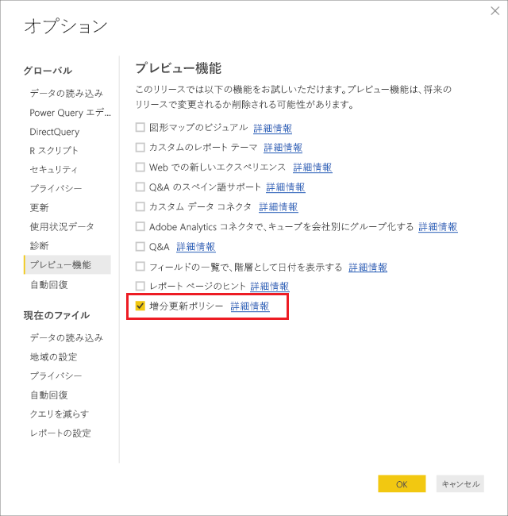
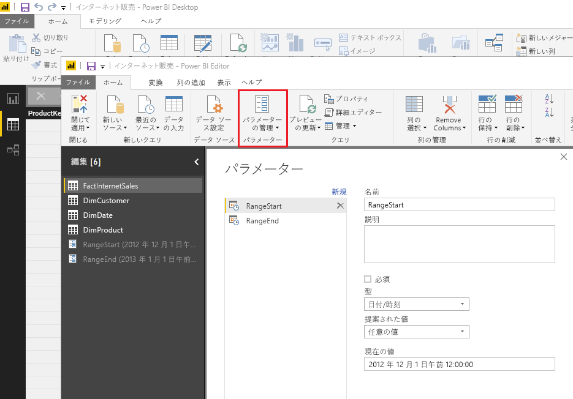
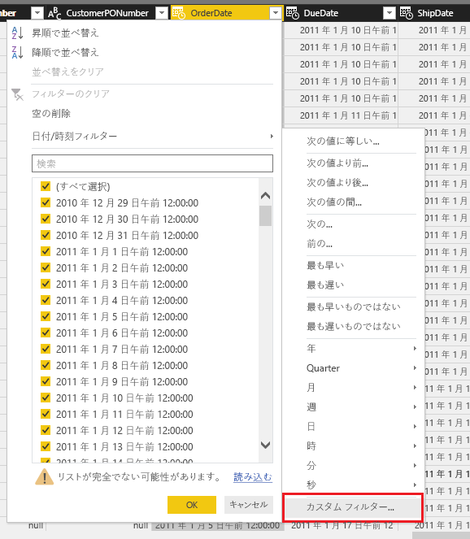
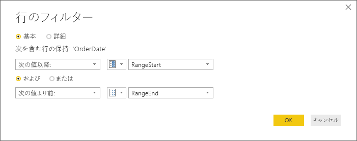
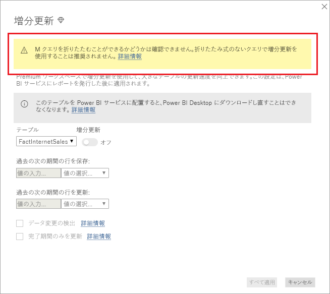
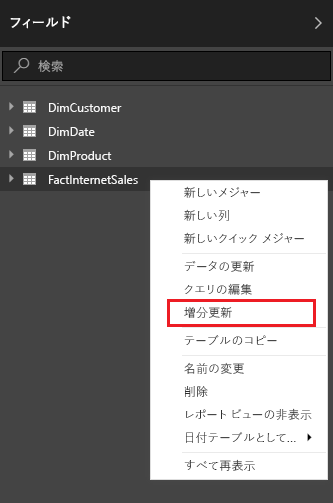
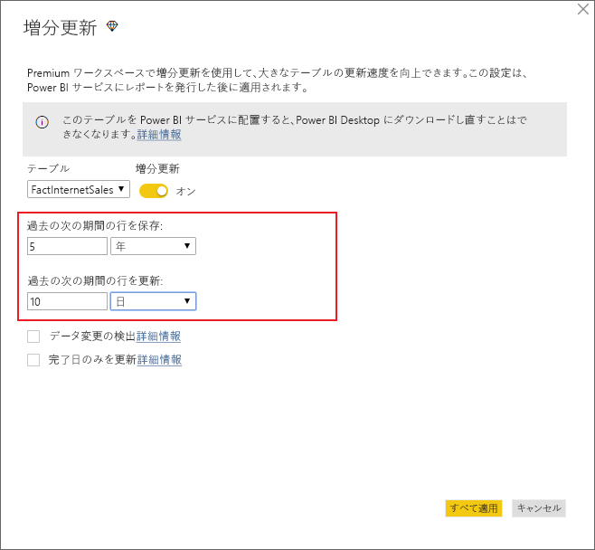
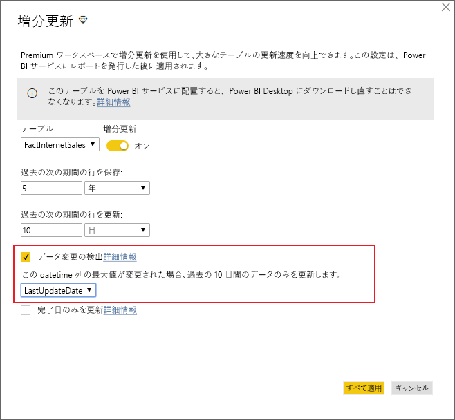
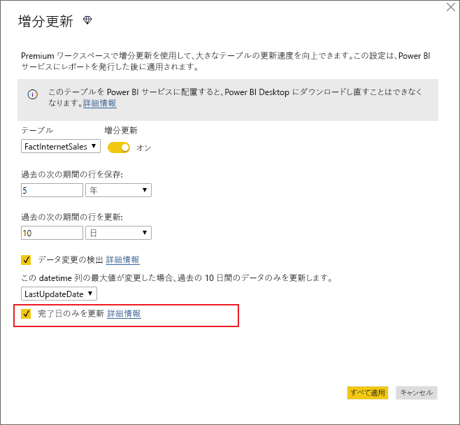
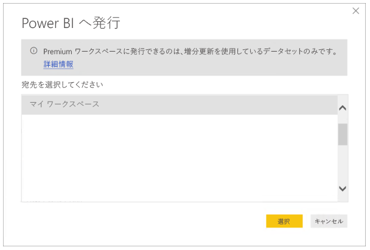

# <a name="incremental-refresh-in-power-bi-premium"></a>Power BI Premium での増分更新

増分更新により Power BI Premium サービスで非常に大きいデータセットを有効にすると次の利点があります。

- **更新が高速化される** - 更新する必要があるのは変更されたデータのみです。 たとえば、10 年間のデータセットのうち過去 5 日間だけを更新します。

- **更新の信頼性が高くなる** - 揮発性のソース システムに対して長時間の接続を維持する必要がなくなります。

- **リソースの消費量が減る** - 更新するデータが少ないと、メモリや他のリソースの全体的な消費量が減少します。

## <a name="configure-incremental-refresh"></a>増分更新を構成する

増分更新ポリシーは、Power BI Desktop で定義し、発行されると Power BI サービスに適用されます。

最初に、 **[プレビュー機能]** で増分更新を有効にします。



### <a name="filter-large-datasets-in-power-bi-desktop"></a>Power BI Desktop で大きいデータセットをフィルター処理する

PBIX ファイルはデスクトップ コンピューターで利用可能なメモリ リソースによって制限されるため、数十億行になる可能性のある大きいデータセットは Power BI Desktop モデルに収まらない場合があります。 したがって、そのようなデータセットは、一般に、インポート時にフィルター処理されます。 この種のフィルター処理には、増分更新を使用するかどうかどうかが適用されます。 増分更新の場合は、Power Query の日付/時刻パラメーターを使用してフィルター処理します。

#### <a name="rangestart-and-rangeend-parameters"></a>RangeStart パラメーターと RangeEnd パラメーター

増分更新の場合、大文字と小文字が区別される予約済みの名前 **RangeStart** と **RangeEnd** で、Power Query の日付/時刻パラメーターを使用して、データセットがフィルター処理されます。 これらのパラメーターは、Power BI Desktop にインポートされるデータをフィルター処理するためだけでなく、Power BI サービスに発行された複数の範囲に動的にデータをパーティション分割するためにも使用されます。 パラメーターの値は、サービスによってパーティションごとにフィルター処理のために置き換えられます。 発行すると、パラメーター値は Power BI サービスによって自動的にオーバーライドされます。 サービスのデータセットの設定で設定する必要はありません。 発行すると、パラメーター値は Power BI サービスによって自動的にオーバーライドされます。 

既定値でパラメーターを定義するには、Power Query エディターで **[パラメーターの管理]** を選択します。



パラメーターを定義した後は、列の **[カスタム フィルター]** メニュー オプションを選択してフィルターを適用することができます。



列の値が "**RangeStart***以降で***RangeEnd** *より前*" になるように、行がフィルター処理されることを確認します。



> [!TIP]
> パラメーターのデータ型は日付/時刻でなければなりませんが、データ ソースの要件に合うように変換できます。 たとえば、次の Power Query 関数は、*yyyymmdd* という形式の整数代理キーと同じように日付/時刻値を変換します。これは、データ ウェアハウスの一般的な形式です。 この関数は、フィルター手順から呼び出すことができます。
>
> `(x as datetime) => Date.Year(x)*10000 + Date.Month(x)*100 + Date.Day(x)`

Power Query エディターで **[適用して閉じる]** を選びます。 Power BI Desktop にデータセットのサブセットが存在する必要があります。

#### <a name="filter-date-column-updates"></a>日付列の更新をフィルター処理する

Power BI サービスで日付列のフィルターを使用して、複数の範囲にデータを動的にパーティション分割します。 増分更新は、フィルター処理された日付列をソース システムでも更新するようには設計されていません。 更新は、実際の更新ではなく、挿入と削除として解釈されます。 削除が増分の範囲でなく、履歴の範囲で発生する場合は、ピックアップされません。 この場合、パーティション キーの競合によって、データ更新エラーが発生する可能性があります。

#### <a name="query-folding"></a>クエリの折りたたみ

更新操作のためにクエリが送信されるときに、パーティション フィルターがソース システムにプッシュされることが重要です。 フィルターをプッシュ ダウンするには、データ ソースでクエリの折りたたみがサポートされている必要があります。 SQL クエリをサポートするほとんどのデータ ソースは、クエリの折りたたみをサポートしています。 ただし、フラット ファイル、BLOB、Web、OData フィードなどのデータ ソースでは、通常はサポートされていません。 フィルターがデータ ソース バックエンドでサポートされていない場合、プッシュ ダウンすることはできません。 そのような場合、フィルターはマッシュアップ エンジンによってローカルで補われて適用されます。そのためには、データ ソースから完全なデータセットを取得する必要が生じる場合があります。 これにより、増分更新が非常に低速になり、Power BI サービスまたはオンプレミスのデータ ゲートウェイ (使用されている場合) でプロセスがリソース不足になる可能性があります。

各データ ソースでさまざまなレベルのクエリの折りたたみがサポートされている場合は、ソースのクエリにフィルター ロジックが含まれていることを確認するための検証を実行することをお勧めします。 これを簡単にするため、Power BI Desktop ではこの検証の自動実行が試みられます。 検証できない場合は、増分更新ポリシーを定義するときに、増分更新ダイアログで警告が表示されます。 SQL、Oracle、Teradata などの SQL ベースのデータ ソースでは、この警告を利用できます。 他のデータ ソースでは、クエリをトレースしないと検証できない場合があります。 Power BI Desktop で確認できない場合は、次の警告が表示されます。

 

### <a name="define-the-refresh-policy"></a>更新ポリシーを定義する

増分更新は、ライブ接続モデルを除く、テーブルのコンテキスト メニューで使用できます。



#### <a name="incremental-refresh-dialog"></a>[増分更新] ダイアログ

[増分更新] ダイアログが表示されます。 トグルを使用してダイアログを有効にします。


> [!NOTE]
> テーブルに対する Power Query の式が予約された名前のパラメーターを参照していない場合は、トグルが無効になっています。

ヘッダー テキストでは次のことが説明されています。

- 増分更新は、Premium 容量のワークスペースについてのみサポートされます。 更新ポリシーは Power BI Desktop で定義され、サービスでの更新操作によって適用されます。

- Power BI サービスから増分更新ポリシーが含まれる PBIX ファイルをダウンロードできたとしても、それを Power BI Desktop で開くことはできません。 これは将来的にはサポートされる可能性がありますが、これらのデータセットは非常に大きくなる可能性があり、標準的なデスクトップ コンピューター上でダウンロードして開くことは実際的ではないということに注意してください。

#### <a name="refresh-ranges"></a>更新範囲

次の例では、丸 5 年間のデータと、現在の日付までの今年のデータを格納し、10 日間のデータを増分更新するように、更新ポリシーを定義します。 最初の更新操作では、履歴データを読み込みます。 その後の更新は増分的であり、(毎日実行するようにスケジュールされている場合は) 次の操作が実行されます。

- 新しい日のデータが追加されます。

- 現在の日付までの 10 日分が更新されます。

- 現在の日付より 5 年以上前のデータが削除されます。 たとえば、今日の日付が 2019 年 1 月 1 日の場合は、2013 年が削除されます。

Power BI サービスの最初の更新では、丸 5 年間のすべてをインポートするのに長くかかる可能性があります。 その後の更新は、わずかな時間で完了する可能性があります。



> [!NOTE]
> これらの範囲の定義がすべて必要な場合は、後の発行操作にすぐに進むことができます。 追加のドロップダウンは高度な機能用です。

### <a name="advanced-policy-options"></a>高度なポリシーのオプション

#### <a name="detect-data-changes"></a>データ変更の検出

10 日間の増分更新は、5 年間の完全更新より効率的です。 ただし、さらによくすることができます。 **[データ変更の検出]** チェック ボックスをオンにすると、識別に使用する日付/時刻列を選択して、データが変更された日だけを更新することができます。 この場合、そのような列がソース システムに存在するものとします。一般的にこれは監査目的です。 **RangeStart パラメーターや RangeEnd パラメーターでデータをパーティション分割するために使用される列と同じ列にはしないでください。** この列の最大値が、増分範囲の各期間に対して評価されます。 前回の更新以降変更されていない場合、その期間を更新する必要はありません。 例では、増分更新される日数がさらに 10 日から約 2 日に減るはずです。



> [!TIP]
> 現在の設計では、データの変更を検出する列は永続化されてメモリにキャッシュされる必要があります。 次のいずれかの手法を使ってカーディナリティとメモリ消費量を減らすことを検討することが必要な場合があります。
>
> おそらく Power Query 関数を使って、更新時にこの列の最大値のみを保持します。
>
> 更新頻度の要件で許容されるレベルに有効桁数を減らします。
>
> データ変更検出のカスタム クエリを後で定義できるようにする予定です。 これを使うと、列の値をすべて永続化しなくても済みます。

#### <a name="only-refresh-complete-periods"></a>完了期間のみを更新

たとえば、毎朝午前 4 時に更新を実行するようスケジュールされているものとします。 この 4 時間の間にソース システムに追加されたデータは考慮しないようにする必要があります。 石油ガス業界における 1 日あたりバレル数のような一部のビジネス メトリックでは、部分的な日には意味がありません。

別の例としては、前月のデータが 12 日に承認されるような財務システムからのデータ更新があります。 増分の範囲を 1 か月に設定し、12 日に実行するように更新をスケジュールします。 このオプションをオンにすると、たとえば 1 月のデータは 2 月 12 日に更新されます。



> [!NOTE]
> サービスの更新操作は、UTC 時刻で実行されます。 これにより、有効な日付を決定して、完全な期間に影響を与えることができます。 更新操作の有効日をオーバーライドする機能を追加する予定です。

## <a name="publish-to-the-service"></a>サービスへの公開

増分更新は Premium のみの機能であるため、発行ダイアログでは Premium 容量上のワークスペースのみを選択できます。



これで、モデルを更新できるようになりました。 最初の更新は、履歴データをインポートするため長くかかる可能性があります。 その後の更新は、増分更新を使用するため大幅に短縮できます。

## <a name="query-timeouts"></a>クエリのタイムアウト

[更新のトラブルシューティング](https://docs.microsoft.com/power-bi/refresh-troubleshooting-refresh-scenarios)に関する記事では、Power BI サービスでの更新操作がタイムアウトの対象になることが説明されています。 クエリは、データ ソースの既定のタイムアウトによっても制限できます。 ほとんどのリレーショナル ソースでは、M 式でタイムアウトをオーバーライドできます。 たとえば、次の例では、[SQL Server のデータ アクセス関数](https://msdn.microsoft.com/query-bi/m/sql-database)を使って 2 時間に設定しています。 ポリシーの範囲によって定義されている各期間が、コマンド タイムアウトの設定に従ってクエリを送信します。

```
let
    Source = Sql.Database("myserver.database.windows.net", "AdventureWorks", [CommandTimeout=#duration(0, 2, 0, 0)]),
    dbo_Fact = Source{[Schema="dbo",Item="FactInternetSales"]}[Data],
    #"Filtered Rows" = Table.SelectRows(dbo_Fact, each [OrderDate] >= RangeStart and [OrderDate] < RangeEnd)
in
    #"Filtered Rows"
```

## <a name="limitations"></a>制限事項

現在のところ、[複合モデル](desktop-composite-models.md)、sql、Oracle、増分更新がサポートされているし、Teradata データ ソースのみです。
