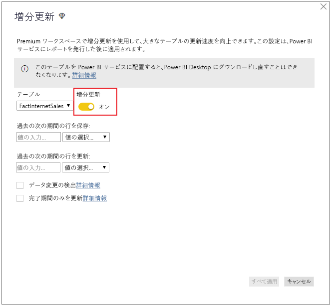

# Power BI Premium とは

Power BI Premium では、お客様の組織を対象にして Power BI サービスを実行するための専用の拡張リソースが提供されます。 例:

- より大きなスケールとパフォーマンス
- 容量別にライセンスされる柔軟性
- セルフサービスとエンタープライズ BI を統合
- Power BI Report Server を使用してオンプレミスの BI を拡張
- 地域別にデータの所在地をサポート (Multi-geo)
- ユーザー別ライセンスを購入することなくどのユーザーともデータを共有できる

この記事は、Power BI Premium のすべての機能について深く掘り下げて詳しく説明したものではありません。実際、概要を示すのみになっています。 必要に応じて、より詳細な情報が記載されているその他の記事へのリンクが提供されています。

## サブスクリプションとライセンス

Power BI Premium は、2 つの SKU (Stock Keeping Unit) ファミリで利用可能なテナントレベルの Office 365 サブスクリプションです。

- **EM** SKU (EM1 から EM3) - 埋め込み、年間契約が必要、1 か月単位での課金。 EM1 および EM2 SKU は、ボリューム ライセンス プランを通してのみ利用できます。 直接購入することはできません。
- **P** SKU (P1 から P3) - 埋め込みおよびエンタープライズ機能、月間契約または年間契約が必要、1 か月単位での課金。オンプレミスの Power BI Report Server をインストールするライセンスも含まれている。

別の方法としては、**Azure Power BI Embedded** サブスクリプションを購入することもできます。これには、埋め込みおよび容量テストの目的でのみ使用する単一の **A** (A1 から A6) SKU ファミリが含まれます。 すべての SKU で、容量を作成するための仮想コアが提供されますが、EM SKU はより小さなスケールの埋め込みに限定されています。 仮想コアが 4 個未満の EM1、EM2、A1、および A2 の SKU は、専用インフラストラクチャ上では実行されません。

この記事では P SKU を重点的に取り上げていますが、説明されている内容の多くは A SKU にも関連しています。 Premium サブスクリプションとは対照的に、Azure SKU では期間契約の必要がなく、1 時間ごとに課金されます。 こちらは完全な弾力性を備え、スケール アップ、スケール ダウン、一時停止、再開、および削除が可能です。 

この記事で Azure Power BI Embedded はほとんど扱われていませんが、記事「Premium 容量を最適化する」の「[テスト アプローチ](service-premium-capacity-optimize.md#testing-approaches)」セクションに、ワークロードをテストおよび測定するための実践的かつ経済的なオプションとして説明されています。 Azure SKU の詳細については、[Azure Power BI Embedded のドキュメント](https://azure.microsoft.com/services/power-bi-embedded/)を参照してください。

### 購入

Power BI Premium サブスクリプションは、Microsoft 365 管理センター内の管理者によって購入されます。 具体的には、Office 365 グローバル管理者または課金管理者のみが SKU を購入できます。 購入すると、"*仮想コア プール*" と呼ばれる容量に割り当てられる対応した数の仮想コアがテナントに届きます。 たとえば、P3 SKU を購入すると、32 個の仮想コアがテナントに提供されます。 詳細については、「[How to purchase Power BI Premium](service-admin-premium-purchase.md)」(Power BI Premium の購入方法) を参照してください。

## 専用の容量

Power BI Premium では、"*専用の容量*" が提供されます。 他の顧客と共有された計算リソース上でワークロードが実行される共有された容量とは対照的に、専用の容量は組織によって排他的に使用されます。 これは、ホストされるコンテンツに対して信頼性が高く一貫したパフォーマンスを提供する専用の計算リソースを使用して隔離されます。 

ワークスペースは容量内に存在します。 各 Power BI ユーザーには、**マイ ワークスペース**と呼ばれる個人用のワークスペースが用意されます。 追加のワークスペースを作成することで、コラボレーションや配置を有効にすることができます。これらは**アプリのワークスペース**と呼ばれます。 既定では、ワークスペース (個人用のワークスペースも含む) は、共有された容量内に作成されます。 Premium 容量をお持ちの場合は、マイ ワークスペースとアプリ ワークスペースの両方を Premium 容量に割り当てることができます。

### 容量ノード

「[サブスクリプションとライセンス](#subscriptions-and-licensing)」セクションで説明したように、Power BI Premium SKU ファミリには次の 2 つがあります: **EM** と **P**。Power BI Premium SKU はすべて、容量 "*ノード*" として利用でき、それぞれは、プロセッサ、メモリ、およびストレージから成る一定量のリソースを表しています。 リソースの他に、各 SKU には、1 秒あたりの DirectQuery 接続および Live Connection 接続の数と並列モデル更新の数についても運用上の制限があります。

処理は、バックエンドとフロントエンドの間で均等に分割された設定された数の仮想コアによって実現されます。

**バックエンド仮想コア**は、中心的な Power BI 機能を担当します。これには、クエリ処理、キャッシュ管理、R サービスの実行、モデルの更新、自然言語処理 (Q&A)、サーバー側でのレポートとイメージのレンダリングなどがあります。 バックエンド仮想コアには、アクティブ データセットとも呼ばれるモデルを主にホストするのに使用される固定量のメモリが割り当てられています。

**フロントエンド仮想コア**は、Web サービス、ダッシュボードとレポート ドキュメントの管理、アクセス権の管理、スケジューリング、API、アップロードとダウンロード、および一般にユーザー エクスペリエンスに関連するすべてのことを担当します。

ストレージは、**容量ノードごとに 100 TB** に設定されます。

次の表に、各 Premium SKU (および同等にサイズ指定された A SKU) のリソースと制限を示します。

| 容量ノード | 合計 v コア数 | バックエンド v コア数 | RAM (GB) | フロントエンド v コア数 | DirectQuery/ライブ接続 (秒あたり) | モデル更新並列処理 |
| --- | --- | --- | --- | --- | --- | --- |
| EM1/A1 | 1 | 0.5 | 2.5 | 0.5 | 3.75 | 1 |
| EM2/A2 | 2 | 1 | 5 | 1 | 7.5 | 2 |
| EM3/A3 | 4 | 2 | 10 | 2 | 15 | 3 |
| P1/A4 | 8 | 4 | 25 | 4 | 30 | 6 |
| P2/A5 | 16 | 8 | 50 | 8 | 60 | 12 |
| P3/A6 | 32 | 16 | 100 | 16 | 120 | 24 |
| | | | | | | |

### 容量のワークロード

容量のワークロードは、ユーザーが利用できるようにされているサービスです。 既定で、Premium 容量および Azure 容量によってサポートされるのは、Power BI クエリの実行に関連付けられるデータセット ワークロードのみです。 データセット ワークロードを無効にすることはできません。 [AI (Cognitive Services)](https://powerbi.microsoft.com/blog/easy-access-to-ai-in-power-bi-preview/)、[データフロー](service-dataflows-overview.md#dataflow-capabilities-on-power-bi-premium)、および[ページ分割されたレポート](paginated-reports-save-to-power-bi-service.md)に対する追加のワークロードを有効にすることができます。 これらのワークロードは、Premium のサブスクリプションのみでサポートされます。 

各追加のワークロードでは、ワークロードで使用できる最大メモリを (使用可能な合計メモリの割合として) 構成できます。 最大メモリの既定値は、SKU によって決定されます。 使用する場合にのみそれらの追加のワークロードを有効にすることで、ご利用の容量の使用可能なリソースを最大限に活用することができます。 そして、メモリ設定を変更するのは、既定の設定では容量のリソース要件が満たされないことが判明した場合のみにしてください。 [管理ポータル](service-admin-portal.md)の **[容量の設定]** を使用するか、または [Capacities REST APIs](https://docs.microsoft.com/rest/api/power-bi/capacities) を使用して、容量管理者は容量に対してワークロードを有効にしたり構成したりすることができます。  

詳細については、「[Premium 容量でワークロードを構成する](service-admin-premium-workloads.md)」を参照してください。 

### 容量はどのように機能するのか

Power BI サービスでは常に、容量に課されている制限を超えることなく、容量リソースが最大限に活用されます。

容量の操作は、"*対話型*" または "*バックグラウンド*" のいずれかに分類されます。 対話型の操作には、要求のレンダリング、ユーザーとのやりとりでの応答 (フィルター処理、Q&A クエリなど) などが含まれます。 一般に、インポート モデルのクエリではメモリ リソースの使用率が高いのに対して、DirectQuery モデルと Live Connection モデルのクエリでは CPU の使用率が高くなります。 バックグラウンド操作には、データフローおよびインポート モデルの更新や、ダッシュボード クエリのキャッシングなどがあります。

可能な限り最適なユーザー エクスペリエンスを確保するために対話型の操作が常にバックグラウンド操作よりも優先されることを理解するのが重要です。 リソースが不足している場合、バックグラウンド操作はキューに追加され、リソースが解放されたときに処理されます。 データセットの更新などのバックグラウンド操作は、Power BI サービスによってプロセスの途中で停止され、キューに追加される場合があります。

インポート モデルは、クエリまたは更新のいずれも行えるように、メモリに完全に読み込む必要があります。 Power BI サービスでは、使用可能なメモリを確実に最大限活用できるように高度なアルゴリズムを使用してメモリ使用量が管理されており、容量の上限を超えてしまうこともあります。容量にはインポート モデルを多数格納することが可能です (Premium 容量あたり最大で 100 TB)。しかし、それらのディスク ストレージの合計がサポートされているメモリを超えた場合 (クエリと更新のために追加のメモリが必要になります)、すべてをメモリに同時に読み込むことはできません。

したがって、インポート モデルは使用量に応じてメモリに読み込まれたり、メモリから削除されたりします。 インポート モデルは、クエリ実行の対象となり (対話型の操作) まだメモリに存在していない場合、または更新される場合 (バックグラウンド操作) に読み込まれます。

モデルをメモリから除去することは、"*削除*" と呼ばれています。 これは、Power BI がモデルのサイズに応じて迅速に実行できる操作です。 容量にメモリ不足が発生していない場合、モデルはそのままメモリに読み込まれ、メモリ内に残ります。 ただし、モデルを読み込むために利用できるメモリが不十分である場合、Power BI サービスでまずメモリを解放する必要があります。 過去 3 分間 \[[1](#endnote-1)\] に使用されていないモデルを探すことによって非アクティブになっているモデルを検出してからそれらを削除することによって、メモリが解放されます。 削除できる非アクティブ モデルが存在しない場合、Power BI サービスではバックグラウンド操作用に読み込まれたモデルの削除が試みられます。 試行が失敗してから 30 秒後 \[[1](#endnote-1)\] に行われる最終手段は、対話型の操作を失敗させるというものです。 この場合、レポート ユーザーには、エラーと共に、しばらくしてから再試行することを促す提案が通知されます。 場合によっては、サービスの操作のせいでモデルがメモリからアンロードされることがあります。

データセットの削除は通常の想定される動作であることを強調することが重要です。 合計サイズが使用可能メモリを超える可能性があるモデルを読み込みおよびアンロードすることで、メモリを最大限に活用できるように努めています。 これは、仕様上、レポート ユーザーには完全に透過的に行われます。 高い削除レートは、必ずしも容量に配分されているリソースが不足していることを意味するものではありません。 ただし、高い削除レートが原因でクエリまたは更新の応答性が損なわれる場合、それは問題になる可能性があります。

インポート モデルの更新では、モデルをメモリに読み込む必要があるため、常にメモリの使用率が高くなります。 処理のために追加のメモリが必要です。 完全更新では、モデルに必要なメモリ量の約 2 倍が使用される可能性があります。 これにより、更新が完了して新しいモデル データが使用できるようになるまでクエリが既存のモデルに送信されるので、処理中であってもモデルに対して確実にクエリを実行することができます。 増分更新は、必要なメモリがより少なくて済み、より早く完了することが可能なため、容量リソースへの負担を大幅に減らすことができます。 モデルの更新では CPU が集中的に使用されます。特に、複雑な Power Query 変換を含むモデルや、複雑であったり大きなテーブルを基にしていたりする計算テーブル/列を含むモデルの場合はそのようになります。

クエリ値と同様に更新でも、モデルをメモリに読み込む必要があります。 メモリが不足している場合、Power BI サービスでは非アクティブ モデルの削除が試みられ、これが不可能な場合は (すべてのモデルがアクティブであるため)、更新ジョブがキューに入れられます。 更新では、通常、CPU が集中的に使用されます。それはクエリの場合よりもさらに高くなります。 このため、同時更新の数に対して容量の制限があり、1.5 × バックエンド仮想コア数 (切り上げ) に設定されています。 同時更新の数が多すぎる場合は、スケジュールされた更新がキューに入れられます。 このような状況が発生すると、更新が完了するまでの時間がより長くなります。 ユーザー要求または API 呼び出しによってトリガーされる更新などのオンデマンド更新は、3 回再試行されます \[[1](#endnote-1)\]。 それでも十分なリソースがない場合、更新は失敗します。

セクションに関する注意事項:   
\[1\] 変更される可能性があります。

### 地域のサポート

新しい容量を作成するとき、Office 365 グローバル管理者と Power BI サービス管理者は、容量に割り当てられたワークスペースを置く地域を指定することができます。 これは、**Multi-Geo** と呼ばれています。 Multi-Geo を使用することで、組織は Office 365 サブスクリプションが存在する地域とは異なる場合でも、特定の地域にあるデータセンターにコンテンツを配置することで、データの所在地要件を満たすことができます。 詳細については、「[Multi-Geo support for Power BI Premium](service-admin-premium-multi-geo.md)」 (Power BI Premium の Multi-Geo のサポート) を参照してください。

### 容量管理

Premium 容量の管理では、容量の作成または削除、管理者の割り当て、ワークスペースの割り当て、ワークロードの構成、監視、容量パフォーマンスを最適化するための調整を行う必要があります。 

Office 365 グローバル管理者および Power BI サービス管理者は、利用可能な仮想コアから Premium 容量を作成することも、既存の Premium 容量を変更することもできます。 容量を作成するときには、容量のサイズと地理的な地域を指定し、少なくとも 1 人の容量管理者を割り当てます。 

容量が作成されると、[管理ポータル](service-admin-portal.md)での管理タスクの大部分は完了します。

容量管理者は、容量へのワークスペースの割り当て、ユーザーのアクセス許可の管理、他の管理者の割り当てを行うことができます。 容量管理者はまた、ワークロードの構成、メモリ割り当ての調整、さらに必要に応じて、容量の再起動、容量の上限を超えた場合の操作のリセットを行うこともできます。

容量管理者は、容量が円滑に運用されているかどうかを確認することもできます。 管理者ポータルですぐに容量の健全性を監視することも、Premium 容量メトリク アプリを使用して監視することもできます。

容量の作成、管理者の割り当て、およびワークスペースの割り当ての詳細については、「[Premium 容量を管理する](service-premium-capacity-manage.md)」を参照してください。 ロールの詳細については、「[Power BI に関連する管理者ロール](service-admin-administering-power-bi-in-your-organization.md#administrator-roles-related-to-power-bi)」をご覧ください。

### 監視

Premium 容量を監視することで、容量がどのように実行されているかを管理者は把握することができます。 管理ポータルおよび [Power BI Premium 容量メトリック](https://app.powerbi.com/groups/me/getapps/services/capacitymetrics) アプリを使用することで、容量は監視できます。

ポータルによる監視では、大まかなメトリックに関するクイック ビューが表示され、過去 7 日間にわたりかけられた負荷および使用している容量によって利用されたリソースの平均が示されます。 

**Power BI Premium 容量メトリック** アプリからは、ご利用の容量がどのように実行されているかについてかなり詳細な情報が提供されます。 このアプリには、大まかなダッシュボードとより詳細なレポートが用意されています。

アプリのダッシュボードでメトリック セルをクリックすると、詳細なレポートが開きます。 レポートには、詳細なメトリックに加えて、ご利用の容量の円滑な運用を維持するのに必要となる最も重要な情報にドリルダウンするフィルタリング機能があります。

容量の監視方法の詳細については、[Power BI 管理ポータルでの監視](service-admin-premium-monitor-portal.md)および[Power BI Premium 容量メトリック アプリを使用した監視](service-admin-premium-monitor-capacity.md)に関するページを参照してください。

### 容量の最適化

ご利用の容量を最大限に活用することは、ユーザーに対して確実にパフォーマンスを発揮し、Premium への投資に見合う最大限の価値を確実に得る上で重要です。 主要なメトリックを監視することにより、管理者はボトルネックをトラブルシューティングして必要な措置を取るために最適な方法を判断することができます。 詳細については、「[Premium 容量を最適化する](service-premium-capacity-optimize.md)」と「[Premium 容量のシナリオ](service-premium-capacity-scenarios.md)」を参照してください。

### Capacities REST API

Power BI REST API には、[Capacities API](https://docs.microsoft.com/rest/api/power-bi/capacities) のコレクションが含まれています。 API を使用すれば、管理者は、ワークロードの有効化および無効化、容量へのワークスペースの割り当てなど、ご利用の Premium 容量のさまざまな側面をプログラムで管理できます。

## 大規模なデータセット

SKU に応じて、Power BI Premium では、Power BI Desktop (.pbix) モデル ファイルのアップロードが最大で **10 GB**のサイズまでサポートされています。 読み込まれたら、モデルは Premium 容量に割り当てられたワークスペースに公開することができます。 さらに、データセットのサイズは、最大 **12 GB** まで更新することができます。

### サイズに関する考慮事項

モデルの規模が大きいと、リソースが集中的に使用される可能性があります。 1 GB を超えるモデルには少なくとも P1 SKU を用意する必要があります。 最大 A3 までの A SKU に支えられたワークスペースへの大規模なモデルの発行は機能するでしょうが、それらの更新については機能しません。

次の表に、さまざまな .pbix のサイズに対して推奨される SKU を示します。

   |SKU  |.pbix のサイズ   |
   |---------|---------|
   |P1    | < 3 GB        |
   |P2    | < 6 GB        |
   |P3、P4、P5    | 最大 10 GB   |

Power BI Embedded の A4 SKU は P1 SKU と、A5 は P2 と、A6 は P3 とそれぞれ同等です。 なお、大規模なモデルを A および EM SKU に発行した場合、共有された容量のサイズ制限エラーに固有ではないエラーが返される場合があります。 A および EM SKU の大規模なモデルの更新エラーは、タイムアウトを示す可能性があります。 

.pbix ファイルは、"*圧縮率の高い状態*" のデータを表しています。 データはメモリに読み込まれるときに数回展開される場合があります。データの更新中に、そこからさらに数回展開される場合があります。

大規模なデータセットのスケジュールされた更新には時間がかかることがあり、リソースが集中的に使用される場合があります。 あまり多くの更新が重複しないようにスケジュールすることが重要です。 より高速で、信頼性がより高く、消費リソースがより少ないことから、[増分更新](service-premium-incremental-refresh.md)を構成することをお勧めします。

前回のデータセットの使用から時間が経っている場合、大規模なデータセットの最初のレポートの読み込みに時間がかかる場合があります。 読み込みに時間がかかるレポートの読み込みバーには、読み込みの進行状況が表示されます。

Premium 容量ではクエリごとのメモリと時間の制約値は大幅に高くなりますが、フィルターとスライサーを使用して、必要なビジュアルだけを表示することをお勧めします。

## 増分更新

Power BI Premium で大規模なデータセットを用意して管理する上で、増分更新は不可欠な部分です。 増分更新には多くの利点があります。たとえば、変更されたデータを更新するだけで済むので、更新がより迅速に行われます。 揮発性のソース システムに対して長時間の接続を維持する必要がないため、更新の信頼性が高くなります。 更新するデータが少ないと、メモリや他のリソースの全体的な消費量が減少するので、リソースの消費量が減ります。 増分更新ポリシーは、**Power BI Desktop** で定義し、Premium 容量内のワークスペースに発行すると適用されます。 

詳細については、「[Power BI Premium での増分更新](service-premium-incremental-refresh.md)」を参照してください。

## ページ分割されたレポート

P1 から P3 の SKU および A4 から A6 の SKU でサポートされているページ分割されたレポートは、SQL Server Reporting Services のレポート定義言語 (RDL) テクノロジに基づいています。 RDL テクノロジをベースにしてはいますが、これは、オンプレミスにインストールできるダウンロード可能なレポート プラットフォームである Power BI Report Server (これも Power BI Premium にも含まれている) と同じではありません。 ページ分割されたレポートは、印刷または共有することができるページ上にうまく収まるように書式設定されます。 テーブルが複数のページにまたがる場合でも、データはテーブル内に表示されます。 無料の [**Power BI レポート ビルダー**](https://go.microsoft.com/fwlink/?linkid=2086513) Windows デスクトップ アプリケーションを使用して、ユーザーはページ分割されたレポートを作成し、サービスに公開することができます。

Power BI Premium では、ページ分割されたレポートは管理ポータルを使用して容量に対して有効にする必要があるワークロードです。 容量管理者は、有効にしてから、容量のメモリ リソース全体に対するパーセンテージとしてメモリ量を指定することができます。 他の種類のワークロードとは異なり、ページ分割されたレポートは容量内に含まれる領域で Premium によって実行されます。 ワークロードがアクティブかどうかに関係なく、この領域に指定した最大メモリが使用されます。 既定値は 20% です。 

詳細については、[Power BI Premium のページ分割されたレポート](paginated-reports-report-builder-power-bi.md)に関するページを参照してください。 ページ分割されたレポート ワークロードを有効にする方法の詳細については、[ワークロードの構成](service-admin-premium-workloads.md)に関するページを参照してください。

## Power BI Report Server
 
Power BI Premium に含まれている Power BI Report Server は Web ポータルを備えた*オンプレミス* レポート サーバーです。 オンプレミスで BI 環境を構築し、組織のファイアウォールの内側でレポートを配布することができます。 Report Server により、ユーザーは SQL Server Reporting Services の豊富な対話型エンタープライズ レポート作成機能にアクセスすることができます。 ユーザーは、ビジュアル データを調査してすばやくパターンを発見し、より良い決定をより迅速に行うことができます。 Report Server では、ご自分のペースでガバナンスを適用できます。 その時が来れば、Power BI Report Server はクラウドに容易に移行できるようになります。そうなれば、組織はすべての Power BI Premium 機能を最大限に活用することができます。

詳細については、[Power BI Report Server](report-server/get-started.md) に関するページを参照してください。

## 無制限のコンテンツの共有

Premium を使用すれば、組織内外いずれのユーザーも、個別ライセンスを購入することなく、ページ分割されたレポートや対話式のレポートなど、ご利用の Power BI コンテンツを表示できます。 

Premium では、コンテンツを表示する受信者に Pro ライセンスを要求することなく、Pro ユーザーによるコンテンツの広範囲な配信が可能になります。 コンテンツ作成者の場合は Pro ライセンスが必要です。 作成者は、データ ソースに接続し、データをモデル化し、ワークスペースのアプリとしてパッケージ化されたレポートおよびダッシュボードを作成できます。 

詳細については、[Power BI ライセンス](service-admin-licensing-organization.md)に関するページを参照してください。

## ツールの接続 (プレビュー)

内部では、企業で実証済みの Microsoft  **Analysis Services Vertipaq エンジン**によって Power BI データセットが強化されます。 Analysis Services では、オープンスタンダードの XMLA プロトコルをサポートするクライアント ライブラリと API を介して、プログラミング機能やクライアント アプリケーションおよびツールがサポートされます。 現在、Power BI Premium データセットでは、Microsoft およびサードパーティのクライアント アプリケーションおよびツールから **XMLA エンドポイント**を経由して行う*読み取り専用*操作がサポートされています。 

SQL Server Management Studio や SQL Server Profiler などの Microsoft のツール、および DAX Studio やデータ視覚化アプリケーションなどのサードパーティ アプリでは、XMLA、DAX、MDX、DMV、および Trace イベントを使用して Premium データセットに接続し、それに対してクエリを実行することができます。 

詳細については、[クライアント アプリケーションとツールを使用してデータセットに接続](service-premium-connect-tools.md)に関するページを参照してください。

## 次の手順

> [!div class="nextstepaction"]
> [Premium 容量を管理する](service-premium-capacity-manage.md)

他にわからないことがある場合は、 [Power BI コミュニティで質問してみてください](https://community.powerbi.com/)。

||||||
