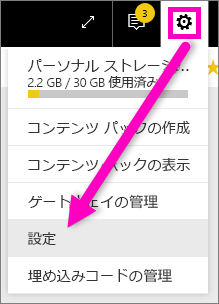
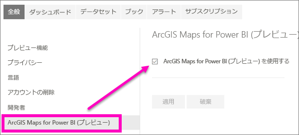

# Power BI プレビュー機能のオプトイン
## *プレビュー機能* とは
Power BI の機能向上を行ったときは、新しい機能を *プレビュー機能* としてリリースします。 プレビュー機能を有効および無効にして、試すことができます。

> [!TIP]
> 質問やフィードバックがある場合は、 [Power BI のコミュニティ フォーラムを利用してください](http://community.powerbi.com/t5/Navigation-Preview-Forum/bd-p/NavigationPreview)。
> 
> 

## プレビューを探して有効 (または無効) にする
1. Power BI 画面の右上隅にある歯車アイコンをクリックして **[設定]** を選び、[設定] メニューを開きます。
   
   
2. **[全般]** タブを選びます。プレビューが存在する場合、**[プレビュー機能]** オプションが表示されるか、または左側にプレビュー機能の一覧が表示されます。  次の例では、プレビューの一覧には ArcGIS Maps が表示されています。 
   
   
3. 新しいエクスペリエンスを試すには、**[オン]** のラジオ ボタンを選ぶか、チェック ボックスをオンにします。 そして、**[適用]** を選びます。
4. プレビュー機能を無効にするには、上記の手順 1 と 2 を行った後、手順 3 で、**[オフ]** を選ぶか、チェック ボックスをオフにして、**[適用]** を選びます。

質問やフィードバックがある場合は、 [Power BI のコミュニティ フォーラムを利用してください](http://community.powerbi.com/t5/Navigation-Preview-Forum/bd-p/NavigationPreview)。

