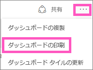
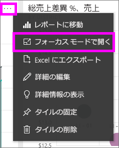
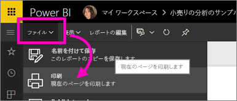

# Power BI サービスからの印刷
Power BI サービスから、ダッシュボード全体、ダッシュボード タイル、レポート ページ、またはレポートのビジュアルを印刷します。 レポートは、一度に 1 ページのみを印刷できます。レポート全体を一度に印刷することはできません。

> [!NOTE]
> 印刷は、Power BI サービスでのみ利用できます。Power BI Desktop では利用できません。
> 
> 

次のビデオで、ダッシュボードとレポートから印刷する方法をご覧ください。 その後、ビデオで説明されている手順に従って、ご自分でやってみてください。

<iframe width="560" height="315" src="https://www.youtube.com/embed/jtlLGRKBvXY" frameborder="0" allowfullscreen></iframe>

## ダッシュボードの印刷
1. 印刷するダッシュボードを開きます。
2. 右上隅で省略記号 (...) を選択し、 **[ダッシュボードを印刷]**を選択します。
   
    
3. お使いのブラウザーの [印刷] ウィンドウが開きます。 設定と出力先を選択して、 **[印刷]**を選択します。
   
   > [!NOTE]
   > 表示される印刷ダイアログ ボックスは、お使いのブラウザーによって異なります。
   > 
   > 
   
    

## ダッシュボード タイルの印刷
1. 省略記号を選んでフォーカス アイコン  を選び、[タイルをフォーカス モードで開きます](service-focus-mode.md)。
   
    
2. 上部ナビゲーション バーの全画面表示アイコン  を選ぶことにより、[全画面表示モード](service-fullscreen-mode.md)でタイルを開きます。
3. タイルの上にカーソルを移動して、[オプション] メニューを表示します。
   
    
4. [印刷] アイコン  を選びます。     
   
   > [!NOTE]
   > 表示される印刷ダイアログ ボックスは、お使いのブラウザーによって異なります。
   > 
   > 

## レポート ページの印刷
レポートは、一度に 1 ページを印刷できます。

1. 読み取りビューまたは編集ビューでレポートを開きます。
2. 現在のレポート ページを印刷するには、**[ファイル]** > **[印刷]** の順に選択します。
   
    
3. お使いのブラウザーの [印刷] ウィンドウが開きます。
   
   > [!NOTE]
   > 表示される印刷ダイアログ ボックスは、お使いのブラウザーによって異なります。
   > 
   > 

## レポートのビジュアルの印刷
1. タイルをポイントし、右上隅のフォーカス アイコン  を選ぶことにより、[フォーカス モードでビジュアルを開きます](service-focus-mode.md)。
2. 上記の「*レポート ページの印刷*」にある手順 2 ～ 3 に従って操作します。

## 考慮事項とトラブルシューティング
* Q: **[印刷]** ボタンが見つかりません。    
* A: Power BI Desktop を使用している場合、印刷はサポートされていません。  印刷は、Power BI サービスでのみ機能します。
* Q: すべてのレポート ページを一度に印刷できません。    
* A: これは正しい動作です。 レポートは、一度に 1 ページのみ印刷できます。
* Q: PDF に出力できません。    
* A: このオプションは、ブラウザーに PDF ドライバーを構成している場合のみ表示されます。    
* Q: **[印刷]** を選択したときに表示される画面が、ここに示されている図と一致しません。    
* A: 印刷画面は、ブラウザーとソフトウェアのバージョンによって異なります。
* Q: 印刷の拡大/縮小が正しく行われません。  ダッシュボードがページに収まりません。 印刷の向きなどに問題があります。    
* A: 印刷結果が Power BI サービスでの表示と必ず同じになることは保証できません。 拡大/縮小、余白、ビジュアルの詳細、向き、サイズなどは、Power BI によって制御されません。 このような問題については、お使いのブラウザーのマニュアルを参照してください。      

## 次の手順
[同僚や他のユーザーとダッシュボードやレポートを共有する](service-share-dashboards.md)

他にわからないことがある場合は、 [Power BI コミュニティを利用してください](http://community.powerbi.com/)。

