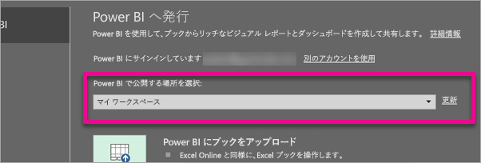
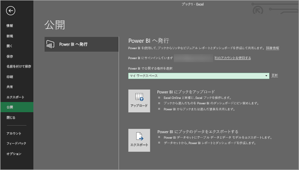
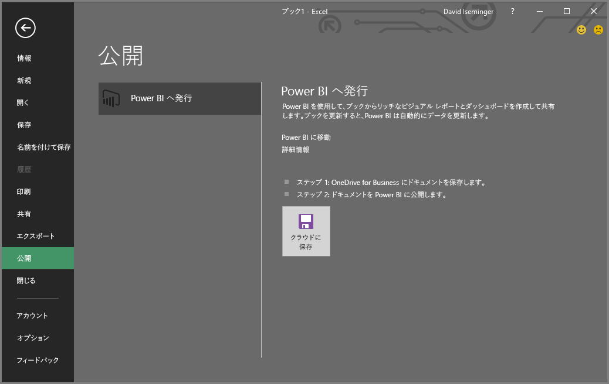
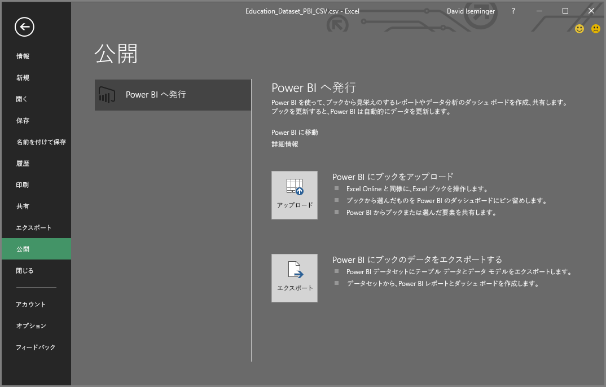
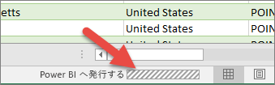

# Excel 2016 から Power BI へ発行する
Excel 2016 では、Excel ブックのデータに基づいて対話性の高いレポートやダッシュボードを作成できる [Power BI](https://powerbi.microsoft.com) サイトに Excel ブックを直接発行できます。 これにより、分析情報を組織内のユーザーと共有できます。

詳しい説明の前に、次の点に注意してください。

* Power BI に発行する前に、ブックを OneDrive for Business に保存する必要があります。
* Office、OneDrive for Business、Power BI へのサインインに使用するアカウントは同じアカウントである必要があります。
* 空白のブックや、Power BI でサポートされているコンテンツが含まれていないブックを発行することはできません。
* 暗号化されたブック、パスワードで保護されたブック、または Information Protection Management が使用されているブックは発行できません。
* Power BI に発行するには、先進認証が有効 (既定値) になっている必要があります。 無効になっている場合、[ファイル] メニューの [発行] オプションは使用できません。

## Excel ブックを公開するには
Excel で、**[ファイル]** > **[発行]** の順に選択します。

### ローカル ファイルの発行
2017 年 2 月の更新以降、Excel 2016 で Excel のローカル ファイルを発行できるようになりました。 OneDrive for Business や SharePoint Online に保存する必要はありません。

> [!IMPORTANT]
> ローカル ファイルは、Office 365 サブスクリプションがある Excel 2016 のみで発行できます。 Excel 2016 スタンドアロン インストールでは引き続き、Excel ブックを OneDrive for Business または SharePoint Online に保存する必要がある "発行" のみの動作となります。
> 
> 

**[発行]** を選択する際に、発行先のワークスペースを選択できます。 アクセス可能な個人またはグループのワークスペースを指定できます。

Power BI でブックを取得する方法に関する 2 つのオプションが表示されます。

発行後、ローカル ファイルとは別に、Power BI にコピーとして保存されます。 Power BI でファイルを更新する場合は、更新バージョンを再び発行する必要があります。 Power BI のブックまたはデータセットでデータを更新したり、更新スケジュールを設定したりできます。

### Excel スタンドアロンからの発行
ブックがまだ OneDrive に保存されていない場合は、最初に OneDrive に保存する必要があります。 [クラウドに保存] を選択し、OneDrive for Business の場所を選択します。

OneDrive にブックが保存されている状態で **[発行]** を選択すると、Power BI でブックを取得する方法に関する 2 つのオプションが表示されます。

#### Upload your workbook to Power BI (ブックを Power BI にアップロードする)
このオプションを選択すると、ブックは、Excel Online を使用しているときと同じように Power BI に表示されます。 ただし、Excel Online とは異なり、ワークシートの要素をダッシュボードにピン留めするのに役立ついくつかの優れた機能を利用できます。

Power BI で開いているブックを編集することはできません。ただし、変更を加える必要がある場合は、**[編集]** を選択して、Excel Online でブックを編集するか、自分のコンピューターの Excel で開くかを選択できます。 ブックに加えたすべての変更は、OneDrive 上のブックに保存されます。

ブックをアップロードするとき、Power BI にデータセットは作成されません。 ブックは、ワークスペース ナビゲーション ウィンドウの [レポート] に表示されます。 Power BI にアップロードされたブックは、アップロード済みの Excel ブックであることを示す特殊な Excel アイコンで表示されます。

このオプションは、データがワークシートにのみ存在する場合や、Power BI で表示したいピボットテーブルやグラフがある場合に選択します。
Excel の [Power BI へ発行] から [アップロード] を使用することは、ブラウザーの Power BI から [データの取得]、[ファイル]、[OneDrive for Business]、[Power BI で Excel に接続し、管理し、表示する] の順に選択することと同じです。

#### Export workbook data to Power BI (ブックのデータを Power BI にエクスポートする)
このオプションを選択すると、テーブルやデータ モデル内のサポートされているデータがすべて、Power BI の新しいデータセットにエクスポートされます。 Power View シートがある場合、これらは Power BI でレポートとして再作成されます。

ブックは引き続き編集できます。 変更を保存すると、通常約 1 時間以内に Power BI のデータセットと同期されます。 直ちに同期する必要がある場合は、もう一度 [発行] を選択します。これだけで、その場ですぐに変更をエクスポートできます。 レポートとダッシュボードに視覚エフェクトがあれば、それらも更新されます。

このオプションは、データの取得と変換機能または Power Pivot を使用してデータをデータ モデルに読み込んでいる場合や、Power BI で表示したい視覚エフェクトが含まれる Power View シートがブックにある場合に選択します。

Excel の [Power BI へ発行] から [エクスポート] を使用することは、ブラウザーの Power BI から [データの取得]、[ファイル]、[OneDrive for Business]、[Export Excel data into Power BI]\(Excel データを Power BI にエクスポートする) の順に選択することと同じです。

## 発行
いずれかのオプションを選択すると、Excel は、現在のアカウントで Power BI にサインインし、Power BI サイトにブックを発行します。 Excel のステータス バーに注意してください。 処理が実行されていることが示されます。

完了すると、Excel から Power BI を直接開くことができます。

## 次の手順
[Power BI の Excel データ](service-excel-workbook-files.md)  
他にわからないことがある場合は、 [Power BI コミュニティを利用してください](http://community.powerbi.com/)。

