# Power BI から Web への公開

Power BI で **Web に公開**すると、対話型の Power BI の視覚化をブログ投稿記事、Web サイト、メールやソーシャル メディアなどにオンラインで簡単に埋め込むことができます。

また、発行したビジュアルを簡単に編集、更新、共有解除することもできます。

> [!WARNING]
> **[Web に公開]** を使用した場合、インターネット上のすべてのユーザーが、その公開したレポートまたはビジュアルを表示できることにご注意ください。 これらのレポートを表示するときに認証は使用されません。 インターネット上の誰でも (一般の非認証メンバー) 見て差し支えないレポートやデータのみに [Web に公開] をご使用ください。 これには、レポートで集計される詳細レベルのデータが含まれます。 このレポートを公開する前に、データや視覚エフェクトをパブリックに共有する権限を持っていることを確認します。 機密情報は公開しないでください。 不確かな場合は、発行する前に組織のポリシーを確認します。

## [Web に公開] の使用方法

**[Web に公開]** は編集可能な個人用またはグループ用ワークスペースにあるレポートで使用できます。  他のユーザーが自分と共有したレポート、または行レベル セキュリティを使用してデータを保護しているレポートには [Web に公開] を使用できません。 Web への公開がサポートされない場合をすべて示した一覧については、以下の「**制限事項**」のセクションを参照してください。 [Web に公開] を使用する前に、前述の「**警告**」をご確認ください。

以下の *短いビデオ*で、この機能がどのように動作するかを見ることができます。 次の手順に従い、実際に使用してみてください。

<iframe width="560" height="315" src="https://www.youtube.com/embed/UF9QtqE7s4Y" frameborder="0" allowfullscreen></iframe>

次の手順では、 **Publish to Web**を使用する方法について説明します。

1. ワークスペースにある編集可能なレポートで、**[ファイル] > [Web に公開]** を選びます。
   
   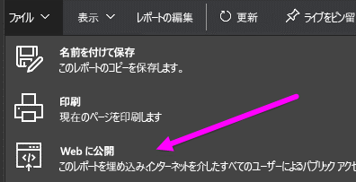

2. ダイアログの内容を確認し、次のダイアログにある **[埋め込みコードの作成]** を選びます。
   
   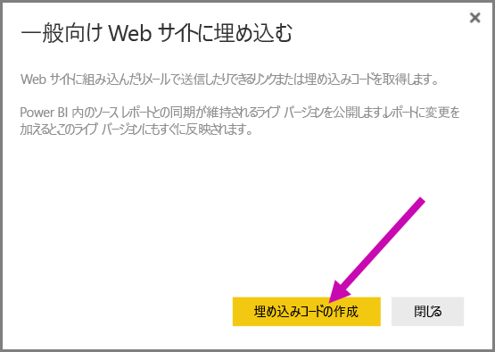

3. 次のダイアログに表示されている警告を確認し、データをパブリックな Web サイトに埋め込んでも問題がないことを確認します。 問題がなければ、 **[発行]**を選びます。
   
   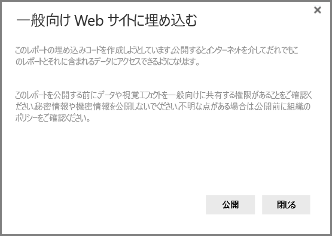

4. リンクが記載されたダイアログが表示されます。これをコードに埋め込んで (iFrame など) メールで送信できます。あるいは、Web ページまたはブログに直接貼り付けることができます。
   
   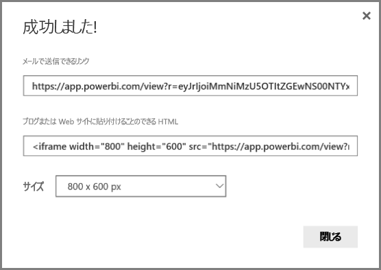

5. 以前にレポート用に埋め込みコードを作成している場合は、その埋め込みコードがすぐに表示されます。 各レポートに 1 つだけ埋め込みコードを作成できます。
   
   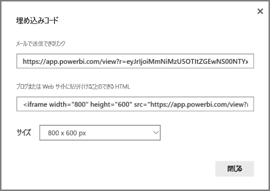

## 表示モードのヒントとテクニック

ブログの投稿でコンテンツを埋め込む際、通常、特定のサイズの画面に収まるようにする必要があります。  必要に応じて、iFrame タグで高さと幅を調整することもできますが、レポートが iFrame の特定の領域内に収まることを確認しなければならない場合もあります。そのため、レポートの編集時に、適切な表示モードを設定する必要もあります。

以下の表では、表示モードとそれが埋め込まれた場合にどのように表示されるかについての指針を示します。

| 表示モード | 埋め込まれた場合の表示方法 |
| --- | --- |
|  |**[ページに合わせる]** は、レポートのページの高さと幅に合わせます。 ページを 16:9 や 4:3 などの "動的な" 比率に設定した場合、コンテンツは指定した iFrame に合わせて拡大縮小されます。 iFrame に埋め込んだ場合、**[ページに合わせる]** を使うと、**レターボックス処理**が行われ、iFrame に合わせてコンテンツが拡大縮小された後、iFrame の領域にグレーの背景が表示されます。 できるだけレターボックス処理が行われないようにするには、iFrame の高さと幅を適切に設定します。 |
|  |**[実際のサイズ]** では、レポートのサイズはレポート ページで設定された内容に保たれます。 その結果、iFrame にスクロール バーが表示されることがあります。 スクロール バーが表示されないように iFrame の高さと幅を設定します。 |
|  |**[幅に合わせる]** は、iFrame の水平方向の領域内に収まるようにコンテンツを調整します。 この場合にも境界線は表示されますが、水平方向の表示スペース全体を使用するよう、コンテンツは拡大縮小されます。 |

## iFrame の高さと幅に関するヒントとテクニック

[Web に公開] を実行した後に受け取る埋め込みコードは、次のようになります。

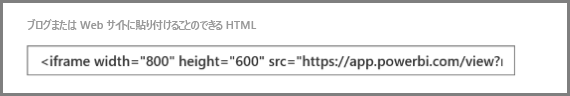

幅と高さを手動で編集して、埋め込み先のページにどのように収めるかを細かく調整できます。

より完全に適合させるために、iFrame の高さに 56 ピクセルを追加してみることができます。 これにより、下部バーの現在のサイズに合わせることができます。 レポート ページで動的なサイズを使用している場合、レターボックス処理なしで適合させるために使用できるサイズを次の表にいくつか示します。

| 比率 | サイズ | ディメンション (幅 x 高さ) |
| --- | --- | --- |
| 16:9 |小 |640 x 416 ピクセル |
| 16:9 |中 |800 x 506 ピクセル |
| 16:9 |大 |960 x 596 ピクセル |
| 4:3 |小 |640 x 536 ピクセル |
| 4:3 |中 |800 x 656 ピクセル |
| 4:3 |大 |960 x 776 ピクセル |

## 埋め込みコードの管理

**[Web に公開]** 埋め込みコードを作成したら、作成したコードを Power BI サービスの **[設定]** メニューで管理できます。 埋め込みコードの管理には、コードの宛先ビジュアルやレポートを削除できる (埋め込みコードを使用できなくする) ことや、埋め込みコードをもう一度入手することが含まれます。

1. **Publish to web** 埋め込みコードを管理するには、 **[設定]** の歯車を開き、 **[埋め込みコードの管理]**を選びます。
   
   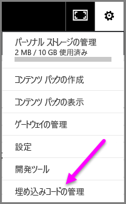

2. 次の図のように、作成した埋め込みコードの一覧が表示されます。
   
   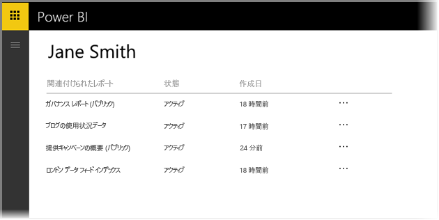

3. 一覧にある **Web に公開**される埋め込みコードに対して、埋め込みコードの取得、または埋め込みコードの削除を実行できます。削除した場合、そのレポートまたはビジュアルへのリンクは機能しなくなります。
   
   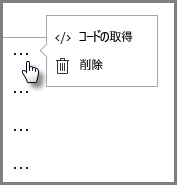

4. **[削除]** を選んだ場合、埋め込みコードを本当に削除するか確認されます。
   
   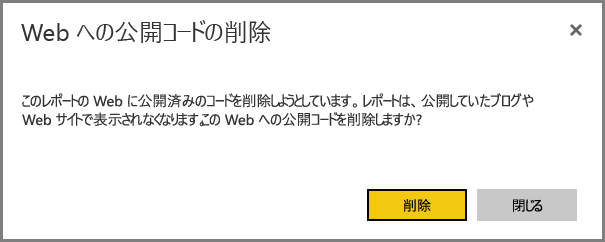

## レポートへの更新とデータ更新

**[Web に公開]** 埋め込みコードを作成して共有した後は、加えられた変更を反映してレポートが更新されます。 しかし、更新内容がユーザーに表示されるまで、しばらく時間がかかることにご注意ください。 レポートまたはビジュアルへの更新が [Web に公開] 埋め込みコードに反映されるまで、約 1 時間かかります。

最初に **[Web に公開]** を使用して埋め込みコードを取得すると、埋め込みコードのリンクはすぐにアクティブになり、リンクを開く誰もが表示できるようになります。  最初の [Web に公開] 操作後、[Web に公開] リンクの宛先として設定されているレポートやビジュアルに更新を加えると、それがユーザーに表示されるまでに約 1 時間かかる可能性があります。

詳しくは、この記事で後述する「**機能方法**」をご覧ください。 更新をすぐに反映する必要がある場合は、埋め込みコードを削除し、新しいコードを作成することができます。

## データ更新

データ更新は、埋め込まれたレポートまたはビジュアルに自動的に反映されます。 更新されたデータが埋め込みコードから表示できるようになるまで、約 1 時間かかることがあります。 レポートで使用されるデータセットのスケジュールで **[更新しない]** を選べば、自動更新を無効にできます。  

## カスタム ビジュアル

**[Web に公開]** では、カスタム ビジュアルがサポートされています。 [Web に公開] を使用する場合、公開済みビジュアルの共有先ユーザーは、カスタム ビジュアルを有効にせずにレポートを表示できます。

## 制限事項

**[Web に公開]** は Power BI サービスの大半のデータ ソースおよびレポートでサポートされていますが、現時点で以下のものは [Web に公開] でサポートされていないか、使用できません。

1. 行レベルのセキュリティを使用するレポート
2. ライブ接続データ ソースを使うレポート (Analysis Services 表形式でホストされたオンプレミスの Analysis Service 多次元、Azure Analysis Services、Power BI Service など)。
3. 直接共有されているか、組織のコンテンツ パックを経由して共有されているレポート
4. 編集メンバーではないグループ内のレポート
5. 現時点では、[Web に公開] レポートで "R" ビジュアルはサポートされていません。

## テナントの設定

Power BI 管理者は、Web に公開機能を有効または無効にすることができます。 また、特定のグループにアクセスを制限することもできます。 埋め込みコードを作成できるかどうかは、この設定で決まります。

|おすすめ |組織全体に対して有効にする |組織全体に対して無効にする |特定のセキュリティ グループ   |
|---------|---------|---------|---------|
|**[ファイル]** メニューの下の **[Web に公開]**。|すべてのユーザーに対して有効|すべてのユーザーに対して非表示|承認されたユーザーまたはグループに対してのみ表示されます。|
|**[設定]** の下の **[埋め込みコードの管理]**|すべてのユーザーに対して有効|すべてのユーザーに対して有効|すべてのユーザーに対して有効  * **[削除]** オプションは、承認されたユーザーまたはグループの場合にのみ使用可能です。 * **[コードを取得]** は、すべてのユーザーに対して有効になります。|
|管理ポータル内の **[埋め込みコード]**|状態には次のいずれかが反映されます。 * アクティブ * サポートされていません * ブロック|状態は **[無効]** と表示|状態には次のいずれかが反映されます。 * アクティブ * サポートされていません * ブロック  ユーザーがテナント設定に基づいて承認されていない場合、状態は **[侵害]** となります。|
|既存の公開済みレポート|すべて有効|すべて無効|すべてのユーザーに対して、レポートの表示が続行されます。|

## 埋め込みコードの状態列について

**Web に公開**される埋め込みコードの **[埋め込みコードの管理]** ページを表示すると、状態列が表示されます。 埋め込みコードは既定ではアクティブですが、次のような状態が発生する可能性があります。

| 状態 | 説明 |
| --- | --- |
| **アクティブ** |レポートは、インターネット ユーザーが表示および対話的に操作できます。 |
| **ブロック** |レポートの内容が [Power BI サービス条項](https://powerbi.microsoft.com/terms-of-service)に違反しています。 Microsoft によってブロックされています。 内容が間違ってブロックされたと思われる場合は、サポートにお問い合わせください。 |
| **サポートされていません** |レポートのデータ セットで行レベルのセキュリティを使用しているか、別のサポートされていない構成を使用しています。 詳細なリストについては、「**制限事項**」を参照してください。 |
| **侵害** |埋め込みコードは定義されたテナント ポリシー外です。 通常、これは埋め込みコードが作成されてから、埋め込みコードを所有するユーザーを除外するために、Web に公開のテナント設定が変更された場合に発生します。 テナント設定が無効になっているか、ユーザーが埋め込みコードを作成できなくなった場合、既存の埋め込みコードの状態は **[侵害]** となります。 |

## [Web に公開] コンテンツに関する問題を報告する方法

Web サイトまたはブログに埋め込まれた **[Web に公開]** コンテンツに関する問題を報告するには、次の図に示す、下部にあるバーの **[フラグ]** アイコンを使用します。 問題について説明するメールを Microsoft に送信するよう求められます。 Microsoft は Power BI サービス契約に基づいてコンテンツを評価し、適切な措置を講じます。

問題を報告するには、表示している [Web に公開] レポートの下部にあるバーの **[フラグ]** アイコンを選びます。

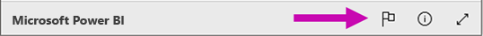

## ライセンスと価格

**[Web に公開]** を使用するには、Microsoft Power BI ユーザーである必要があります。 レポートの使用者 (読者、閲覧者) が Power BI ユーザーである必要はありません。

## 機能方法 (技術的な詳細)

**[Web に公開]** を使用して埋め込みコードを作成すると、インターネット上のユーザーがレポートを見られるようになります。 公開であるため、閲覧者は今後ソーシャル メディアを通してレポートを簡単に共有できます。 直接パブリック URL を開くか、Web ページやブログに埋め込まれているレポートを表示して、ユーザーがレポートを表示すると、Power BI はレポート定義と、レポートを表示するために必要なクエリの結果をキャッシュします。 この方法によって、パフォーマンスに影響を及ぼすことなく大勢のユーザーが同時にレポートを表示することができます。  

キャッシュは長期間存在します。そのため、レポート定義を更新する (たとえば、その表示モードを変更する場合)、またはレポート データを更新する場合、ユーザーが表示するレポートのバージョンに変更が反映されるまで、約 1 時間かかる場合があります。 したがって、作業を前もって計画的に行い、設定に問題がないことを十分に確認してから、**Web に公開**される埋め込みコードを作成するようお勧めします。

他にわからないことがある場合は、 [Power BI コミュニティを利用してください](http://community.powerbi.com/)。