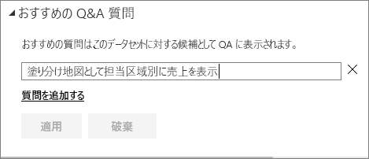
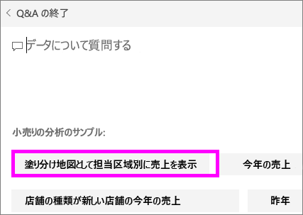
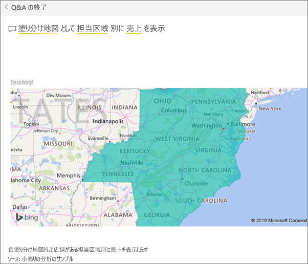

# Power BI Q&A のおすすめの質問を作成する
データセットがある場合、そのデータセットにおすすめの質問を追加できます。  Power BI Q&A では、データセットを使用する同僚におすすめの質問が表示されます。  同僚は、データセットについて確認できる質問の種類についておすすめの質問をヒントにすることができます。 任意のおすすめの質問を追加できます。よくある質問、興味深い結果が表示される質問、表現しづらい質問などを追加してください。

Will がおすすめの質問をいくつか Power BI Q&A に追加した後、追加したおすすめの質問を使用してデータセットを探索する様子をご覧ください。 その後、ビデオで説明されている手順に従って、ご自分でやってみてください。

<iframe width="560" height="315" src="https://www.youtube.com/embed/E1mIAyEXuF4" frameborder="0" allowfullscreen></iframe>

> [!NOTE]
> [iPad、iPhone、iPod Touch デバイスの iOS 用の Microsoft Power BI アプリ](mobile-apps-ios-qna.md)で Q&A も利用できます。
> 
> 

この記事では、[小売の分析サンプル](sample-datasets.md)を使用します。

1. Q&A の質問ボックスを選択します。   Q&A には、データセットに出現する用語の一覧が表示されるので、既定のままでも便利です。
2. この一覧に追加するには、Power BI の右上にある歯車アイコンを選択します。  
   
3. **[設定]** &gt; **[データセット]** &gt; **[小売りの分析のサンプル]** &gt; **[おすすめの Q&A 質問]** を選びます。  
4. **[質問の追加]**を選択します。
   
   
5. テキスト ボックスに質問を入力し、 **[適用]**を選択します。   必要に応じて、 **[質問の追加]**を選択して別の質問を追加します。  
   
6. Power BI ダッシュボードに戻って小売りの分析のサンプルを表示し、Q&A の質問ボックスにカーソルを置きます。   
   
7. 追加したおすすめの質問の **[Sales by territory as a map]** (担当地域別の売上の地図) が一覧の最初に表示されます。 その質問を選択します。  
8. 塗り分け地図の視覚化として答えが表示されます。  
   

### 次の手順
[Power BI での Q&A](service-q-and-a.md)  
[チュートリアル: Power BI Q&A の概要](power-bi-visualization-introduction-to-q-and-a.md)  
[Power BI - 基本的な概念](service-basic-concepts.md)  
他にわからないことがある場合は、 [Power BI コミュニティを利用してください](http://community.powerbi.com/)。

