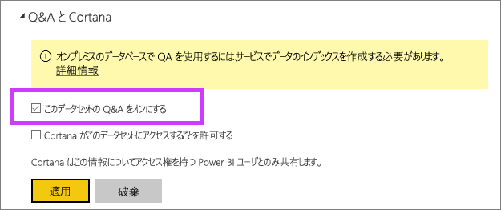

# Power BI で Q&A のライブ接続を有効にする
## オンプレミス データ ゲートウェイとは何ですか。  ライブ接続とは
Power BI のデータセットを Power BI にインポートするか、データセットへのライブ接続を作成することができます。 ライブ「オンプレミス」としては、データセットと呼ばれますが接続を使用します。 ライブ接続は[ゲートウェイ](service-gateway-onprem.md)を使用して管理され、データとクエリはライブ クエリを使用して送受信されます。

## オンプレミス データ ゲートウェイ データセットの Q&A
ゲートウェイ経由でアクセスするデータセットで Q&A を使用する場合は、まずデータセットを有効にしておく必要があります。

データセットが有効になると、Power BI は、データ ソースのインデックスを作成し、データのサブセットを Power BI にアップロードして、質問できる状態にします 最初のインデックスを作成するまで数分かかることがあります。以降、データの変更に応じて、Power BI がインデックスを管理して自動的に更新します。 これらのデータセットに対する Q&A の使用は、Power BI に公開されたデータと同じように動作します。 どちらの場合も、Cortana によるデータ ソースの使用を含めて、Q&A エクスペリエンスで利用できるすべての機能がサポートされます。

Power BI で質問が行われると、Q&A は、データセットのインデックスを使用して質問に答えるための画面やレポートに適したビジュアルを決定します。 考えられる最善の回答を決定した後、Q&A は、DirectQuery を使って、ゲートウェイ経由でデータ ソースからライブ データをフェッチしてチャートやグラフに入力します。 これにより、Power BI Q&A は、常に最新のデータを、基になるデータ ソースから直接表示できます。

Power BI Q&A は、データ ソースのテキスト値とスキーマ値を使用して、基になるモデルにどのように回答を問い合わせるかを決定するため、特定の新しいテキスト値の検索 (たとえば、新しく追加されたテキスト レコードに関連する顧客名を質問する) や削除済みのテキスト値の検索の結果は、最新の値に更新された最新のインデックスによって決まります。 Power BI は、変更の 60 分以内に、テキストとスキーマのインデックスを自動的に更新して最新の状態にします。

詳細については、次のトピックを参照してください。

* [オンプレミス データ ゲートウェイ](service-gateway-onprem.md)とは
* [消費者向けの power BI Q & A](consumer/end-user-q-and-a.md)

## Q&A を有効する
データ ゲートウェイをセットアップした後、Power BI からデータに接続します。  ダッシュボードを作成します。オンプレミス データを使用するか、オンプレミス データを使用する .pbix ファイルをアップロードします。  共有されているダッシュボード、レポート、およびデータセットに、オンプレミス データが既に存在する場合もあります。

1. Power BI の右上隅の歯車アイコン  を選択し、 **[設定]** を選択します。
   
   ![[設定] メニュー](media/service-q-and-a-direct-query/powerbi-settings.png)
2. **[データセット]** を選択し、Q&A を有効にするデータセットを選択します
   
   ![[設定] メニューの [データセット] 画面](media/service-q-and-a-direct-query/power-bi-q-and-a-settings.png)
3. **[Q&A と Cortana]** を展開し、 **[Turn on Q&A for this dataset (このデータセットで Q&A を有効にする)]** チェックボックスをオンにし、 **[適用]** を選択します。
   
    

## キャッシュされるデータとプライバシーの保護方法
オンプレミス データに対して Q&A を有効にすると、データのサブセットがサービスにキャッシュされます。 これは、Q&A が適切なパフォーマンスで実行されることを保証するために行われます。 24 文字を超える値は、Power BI によりキャッシュ処理から除外されます。 キャッシュは、 **[Turn on Q&A for this dataset (このデータセットで Q&A を有効にする)]** をオフにして Q&A を無効にするか、データセットを削除した後、数時間以内に削除されます。

## 考慮事項とトラブルシューティング
この機能では、いくつかの制限があります。

* この機能は、最初は SQL Server 2016 Analysis Services の表形式のデータ ソースでのみ使用できます。 この機能は、表形式のデータで動作するように最適化されています。 Q & A エクスペリエンスはまだサポートされていません多次元です。 オンプレミス データ ゲートウェイによってサポートされる他のデータ ソースは、徐々に追加される予定です。
* SQL Server Analysis Services で定義されている行レベル セキュリティに対する完全サポートは最初に使用できません。 Q & A で質問をするときに、「オートコンプリート」」と入力できる文字列値がユーザーを表示中の質問へのアクセスがありません。 ただし、レポートとグラフのビジュアルではモデルに定義されている RLS が適用されるため、基になる数値データが開示されることはありません。 この動作を制御するためのオプションが、今後の更新でリリースされる予定です。
* オブジェクト レベル セキュリティ (OLS) はサポートされていません。 Q & A は、オブジェクト レベルのセキュリティを順守していませんし、それらへのアクセスを持たないユーザーには、テーブルまたは列の名前を表示することができます。 また、データ値が適切にセキュリティで保護されるようにするには、RLS を有効にする必要があります。 
* ライブ接続は、オンプレミス データ ゲートウェイでのみサポートされています。 その結果、これは、personal gateway で使用できません。

## 次の手順

- [オンプレミス データ ゲートウェイ](service-gateway-onprem.md)  
- [データ ソースの管理 - Analysis Services](service-gateway-enterprise-manage-ssas.md)  
- [Power BI:基本的な概念](consumer/end-user-basic-concepts.md)  
- [Power BI Q&A の概要](consumer/end-user-q-and-a.md)  

他にわからないことがある場合は、 [Power BI コミュニティで質問してみてください](http://community.powerbi.com/)。

