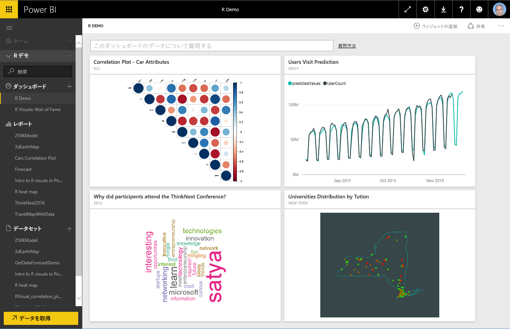
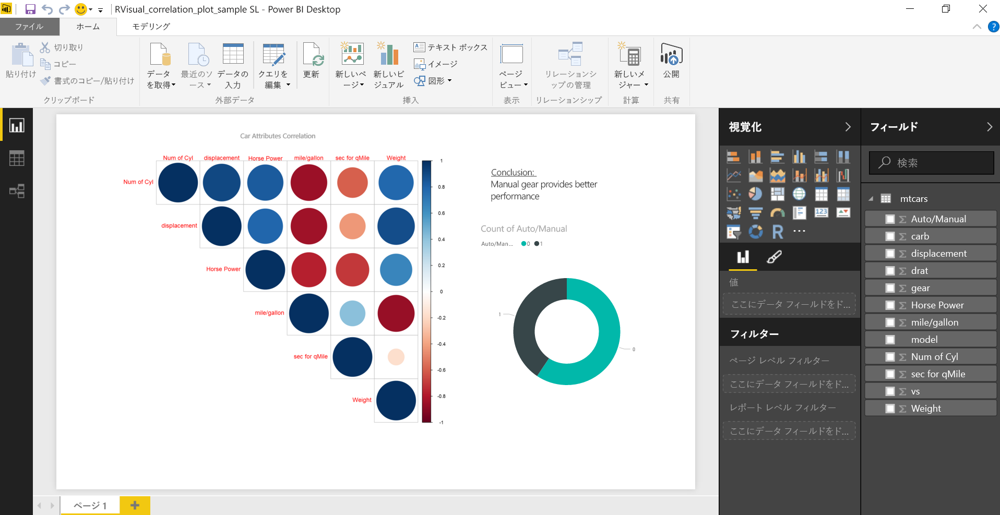
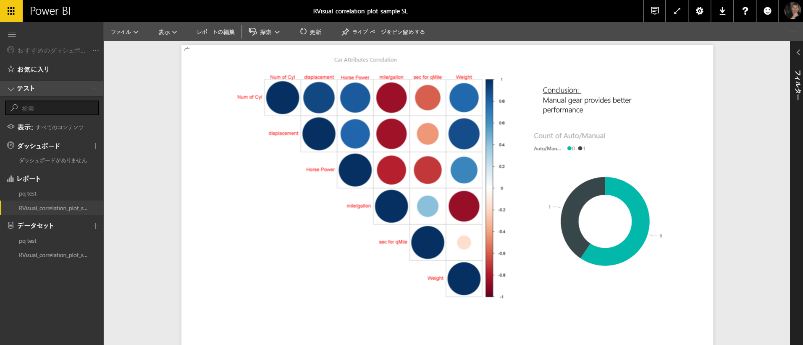
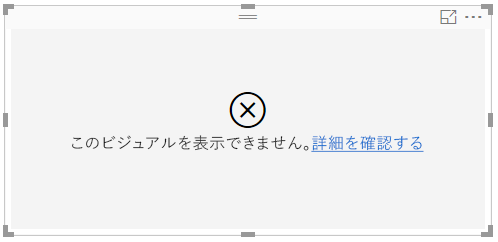
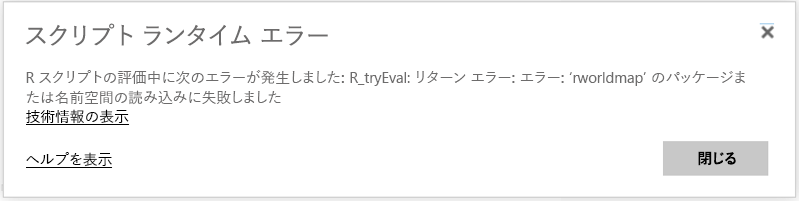
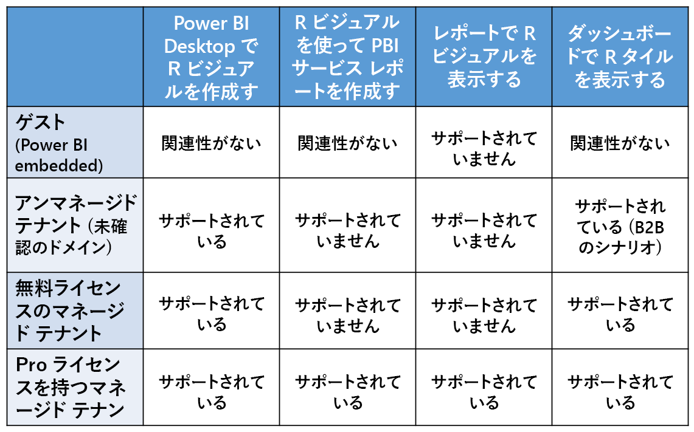

# Power BI サービスで R ビジュアルを作成する
Power BI サービスでは、R スクリプトで作成したビジュアルの表示と操作がサポートされています。 R スクリプトで作成したビジュアルは一般的に *R ビジュアル*と呼ばれ、R の豊富な分析と視覚化の機能を使用した高度なデータ整形と予測などの分析に使用できます。

> [!NOTE]
> [R プログラミング言語](https://www.r-project.org/)は、統計学者、データ科学者、ビジネス アナリストの間で最も広く使用されているプログラミング言語です。 R 言語には、7,000 を超えるアドオン パッケージを提供しているオープン ソース コミュニティや、広く利用されている [R ユーザー グループ](http://msdsug.microsoft.com/)があります。 Power BI サービスに展開されている R のバージョンは *Revolution R Open 3.2.2* です。
> 
> 

次の図は、高度な分析に使用される Power BI ダッシュボードと R ビジュアルのコレクションを示しています。

R ビジュアルは、次の図に示すレポートのような [Power BI Desktop レポート](desktop-get-the-desktop.md)内に作成します。

**Power BI Desktop** でレポートを作成すると、1 つ以上の R ビジュアルを含むレポートを Power BI サービスに発行できます。 R ビジュアルは現在、**Power BI Desktop** でのみ作成でき、その後 Power BI サービスに発行できます。 R ビジュアルの作成の詳細については、Power BI Desktop での「[R を使用した Power BI ビジュアルの作成 ](desktop-r-visuals.md)」を参照してください。

サービスでサポートされていない R パッケージもあることに注意してください。 Power BI サービスで現在サポートされているパッケージを確認するには、この記事の最後にあるサポート対象パッケージの一覧を参照してください。

[Power BI Desktop サンプル ファイル](http://download.microsoft.com/download/D/9/A/D9A65269-D1FC-49F8-8EC3-1217E3A4390F/RVisual_correlation_plot_sample SL.pbix) (.pbix ファイル) をダウンロードして、いくつかの R ビジュアルの動作を確認し、さまざまな使い方を試すことができます。

**Power BI Desktop** で作成し、Power BI サービスに発行した R ビジュアルは、ほとんどの部分で Power BI サービスの他のビジュアルと同様に動作し、対話的な操作、フィルター処理、スライス、ダッシュボードへの固定、他のユーザーとの共有ができます。 ダッシュボードとビジュアルの共有の詳細については、「[同僚や他のユーザーとのダッシュボードの共有](service-share-dashboards.md)」を参照してください。 他のビジュアルとの違いとして、R ビジュアルにはツール ヒントを表示できません。また、R ビジュアルを使って他のビジュアルをフィルター処理することはできません。

次の図に示すように、Power BI サービスの R ビジュアルは、ダッシュボードとレポートのどちらに表示されるかにかかわらず、ほとんど他のビジュアルと同様に表示され、動作します。ユーザーは基になる R スクリプトを意識する必要がありません。

## R スクリプトのセキュリティ
R ビジュアルは R スクリプトから作成されますが、R スクリプトにはセキュリティやプライバシーのリスクとなる可能性のあるコードが含まれる場合があります。

このようなリスクが存在するのは主に作成の段階です。作成の段階では、スクリプトの作成者が自身のコンピューターでスクリプトを実行します。

Power BI サービスには、ユーザーとサービスをセキュリティのリスクから保護するために*サンドボックス*技術が適用されます。

この*サンドボックス* アプローチでは、Power BI サービスで実行する R スクリプトに一定の制限が適用され、インターネットへのアクセスや、R ビジュアルの作成に不要な他のリソースへのアクセスなどが制限されます。

## R スクリプトのエラー エクスペリエンス
R スクリプトでエラーが発生した場合、R ビジュアルはプロットされず、エラー メッセージが表示されます。 エラーの詳細については、次の図に示すように、キャンバス上の R ビジュアル エラーから **[詳細を確認する]** を選択します。

もう 1 つの例として、Azure に R パッケージがないために R スクリプトを正常に実行できなかった場合、次の図のようなエラー メッセージが表示されます。

## ライセンス
R ビジュアルのレポートでの表示、更新、フィルター、クロス フィルターには、[Power BI Pro](service-self-service-signup-for-power-bi.md) のライセンスが必要です。 Power BI Pro のライセンスの詳細および無料ライセンスとの違いについては、「[Power BI Pro コンテンツとは](service-premium.md)」を参照してください。

Power BI 無料版のユーザーは、共有されたタイルのみを使用できます。 詳細については、「[Power BI Pro を購入する](service-admin-purchasing-power-bi-pro.md)」を参照してください。

次の表に、R ビジュアルの機能をライセンス別に示します。

## 既知の制限事項
Power BI サービスの R ビジュアルには、一定の制限があります。

* R ビジュアルのサポートは次のページに示すパッケージに限定されています。<make this a link to the supported packages page per my excel> 現在のところ、カスタム パッケージはサポートされていません。
* データ サイズの制限 – プロット作成で R ビジュアルが使用するデータは、150,000 行に制限されています。 150,000 を超える行が選択されている場合は、上位の 150,000 の行のみが使用され、メッセージがイメージに表示されます。
* 計算時間の制限 – R ビジュアル計算で実行時間が 60 秒を超えると、エラーが発生します。
* R ビジュアルは、データ更新、フィルター処理、および強調表示の際に更新されます。 ただし、イメージ自体は対話に対応しておらず、ツール ヒントはサポートされていません。
* R ビジュアルは他のビジュアルの強調表示に応答しますが、他の要素をクロス フィルター処理するために R ビジュアルの要素をクリックすることはできません。
* 現在のところ、R ビジュアルで *Time* データ型はサポートされていません。 代わりに Date/Time を使用してください。
* **[Web に公開]** を使用するとき、R ビジュアルは表示されません。
* 現在のところ、R ビジュアルはダッシュボードとレポートの印刷機能では印刷されません。
* 現在のところ、R ビジュアルは Analysis Services の DirectQuery モードでサポートされていません。
* 中国語、日本語、韓国語のフォントを Power BI サービスで正しく表示するには、次の追加手順をすべて実行する必要があります。
  
  * 最初に、R パッケージ *showtext* とそのすべての依存関係をインストールします。 このインストールは、次のスクリプトで実行できます。
    
        *install.packages("showtext")*
  * 次に、R スクリプトの先頭に次の行を追加します。
    
        powerbi_rEnableShowTextForCJKLanguages =  1

## R パッケージの概要
R パッケージは、適切に定義された形式で結合された R 関数、データ、およびコンパイル済みコードのコレクションです。 R のインストールには標準のパッケージ セットが付属しており、他のパッケージはダウンロードしてインストールできます。 インストールした R パッケージを使うには、セッションに読み込む必要があります。 無料の R パッケージの主要なソースは、CRAN ([Comprehensive R Archive Network](https://cran.r-project.org/web/packages/available_packages_by_name.html)) です。

**Power BI Desktop** では、どのような種類の R パッケージでも制限なく使うことができます。 **Power BI Desktop** で使う R パッケージをユーザー自身がインストールできます (たとえば、[RStudio IDE](https://www.rstudio.com/) を使って)。

**Power BI サービス**の R ビジュアルは、[この記事](service-r-packages-support.md)の「**サポートされるパッケージ**」セクションで示されているパッケージによってサポートされます。 サポートされるパッケージの一覧に目的のパッケージがない場合は、パッケージのサポートを要求できます。 サポートを要求する方法については、「[Power BI サービスの R パッケージ](service-r-packages-support.md)」を参照してください。

### R パッケージの要件と制限事項
R パッケージにはいくつかの要件と制限があります。

* Power BI サービスは、ほとんどの場合、無料の R パッケージと、GPL-2、GPL-3、MIT+ などのオープン ソース ソフトウェア ライセンスをサポートします。
* Power BI サービスは、CRAN で公開されているパッケージをサポートします。 サービスは、プライベートまたはカスタムの R パッケージをサポートしません。 ユーザーには、Power BI サービスでパッケージを使用できるようにすることを要求する前に、プライベート パッケージを CRAN で使用できるようにすることをお勧めします。
* **Power BI Desktop** には、R パッケージの 2 つのバリエーションがあります。
  
  * R ビジュアルの場合は、カスタム R パッケージを含むすべてのパッケージをインストールできます。
  * カスタム R ビジュアルの場合は、パブリック CRAN パッケージのみがパッケージの自動インストールに対してサポートされます。
* セキュリティおよびプライバシー上の理由から、World Wide Web 経由でクライアント サーバー クエリを提供する R パッケージ (RgoogleMaps など) は、現在はサービスでサポートされていません。 このような試みに対してはネットワークがブロックされます。 サポート対象およびサポート非対象の R パッケージの一覧は、「[Power BI サービスの R パッケージ](service-r-packages-support.md)」を参照してください。
* 新しい R パッケージの組み込みに関する承認プロセスには、依存関係のツリーがあります。サービスにインストールするために必要な一部の依存関係はサポートできません。

### サポートされているパッケージ:
サポート対象の R パッケージの長い一覧 (およびサポート非対象のパッケージの短い一覧) は、次の記事を参照してください。

* [Power BI サービスの R パッケージ](service-r-packages-support.md)

