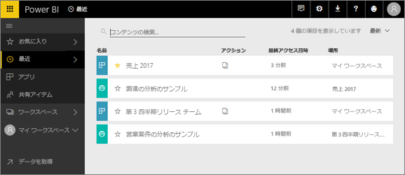
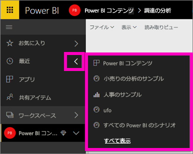
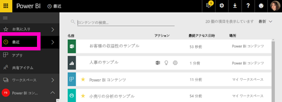

# Power BI サービスの **[最近]** のコンテンツ

## 最近のコンテンツとは
最近のコンテンツとは、Power BI サービスで最近表示した最大 20 個の項目です。  これには、すべてのワークスペースのダッシュボード、レポート、アプリ、およびブックが含まれます。

Amanda による Power BI サービスの **[最近]** コンテンツの一覧の入力方法のデモンストレーションを見たら、下のビデオの手順に従ってご自分で試してください。

<iframe width="560" height="315" src="https://www.youtube.com/embed/G26dr2PsEpk" frameborder="0" allowfullscreen></iframe>

## 最近のコンテンツを表示する
最近アクセスした 5 つのアイテムを確認するには、左ナビゲーションの **[最近]** の右の矢印を選択します。  ここからは、最近のコンテンツを選んで開くことができます。 最近の 5 つのアイテムのみが一覧表示されます。

最近アクセスしたアイテムが 5 つを超える場合、**[See all (すべて表示)]** を選択して [最近] 画面 (下記参照) を開きます。 左ナビゲーションから **[最近]** または [最近] ![[最近] アイコン](media/service-recent/power-bi-recent-icon.png) アイコンを選ぶことでもきます。

ここからは、[**[ダッシュボード]**](service-dashboards.md)、[**[レポート]**](service-reports.md)、および **[ブック]** タブ、および [**[アプリ]**](service-install-use-apps.md) 画面と同様にそれぞれコンテンツを扱うことができます。

## 次の手順
[Power BI サービス アプリ](service-install-use-apps.md)

他にわからないことがある場合は、 [Power BI コミュニティを利用してください](http://community.powerbi.com/)。

