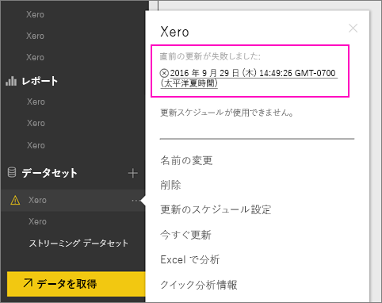
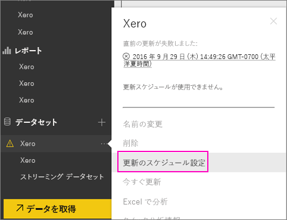
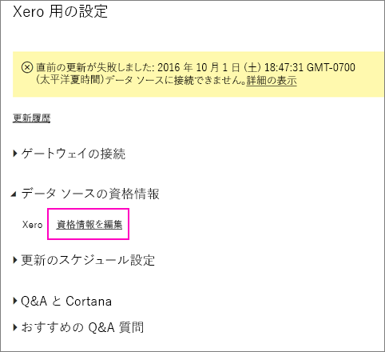
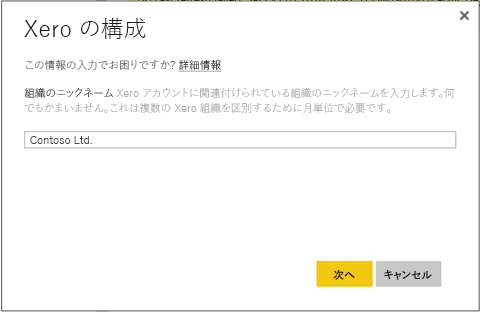
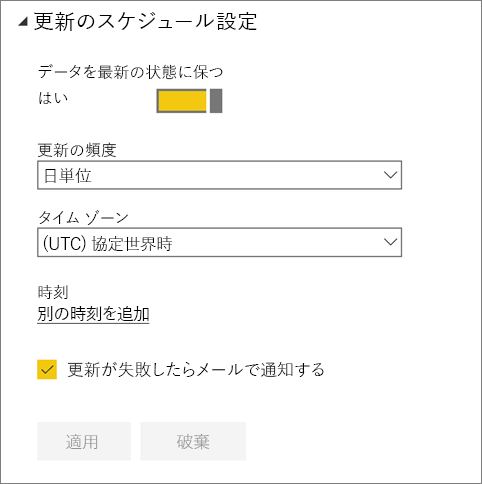
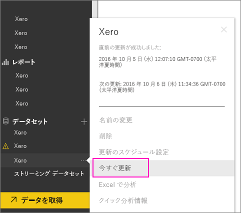

# 更新が失敗した場合に Xero コンテンツ パックの資格情報を更新する方法
Xero Power BI コンテンツ パックを使用している場合は、最近の Power BI サービス インシデントによって、コンテンツ パックの毎日の更新で問題が発生する可能性があります。

以下のスクリーンショットに示すように、Xero データセットの前回の更新の状態を確認すると、コンテンツ パックが正常に更新されたかどうかを確認できます。

このように更新が失敗したことが示されている場合は、以下の手順に従ってコンテンツ パックの資格情報を更新してください。

1. Xero データセットの横にある省略記号 (...) をクリックし、**[更新のスケジュール設定]** をクリックします。 Xero コンテンツ パックの設定ページが開きます。
   
    
2. **[Settings for Xero]** (Xero の設定) ページで、**[データ ソースの資格情報]** > **[資格情報を編集]** を選びます。
   
    
3. 組織の名前を入力し、**[次へ]** を選びます。
   
    
4. Xero アカウントでサインインします。
   
    
5. これで資格情報が更新されました。次に、更新スケジュールが毎日実行されるように設定されていることを確認しましょう。 Xero データセットの横にある省略記号 (...) をクリックし、**[更新のスケジュール設定]** をもう一度クリックして確認できます。
   
    
6. 直ちにデータセットを更新することもできます。 Xero データセットの横にある省略記号 (...) をクリックし、**[今すぐ更新]** をクリックします。
   
    

更新の問題が解決しない場合は、[http://support.powerbi.com](http://support.powerbi.com) からお問い合わせください。 

Power BI 用 Xero コンテンツ パックの詳細については、[Xero コンテンツ パックのヘルプ ページ](service-connect-to-xero.md)を参照してください。

### 次の手順
* 他にわからないことがある場合は、 [Power BI コミュニティを利用してください](http://community.powerbi.com/)。

