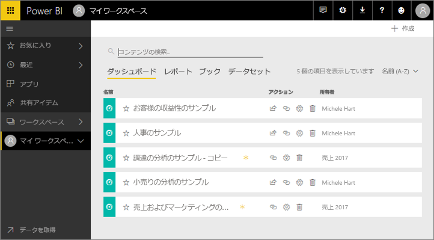
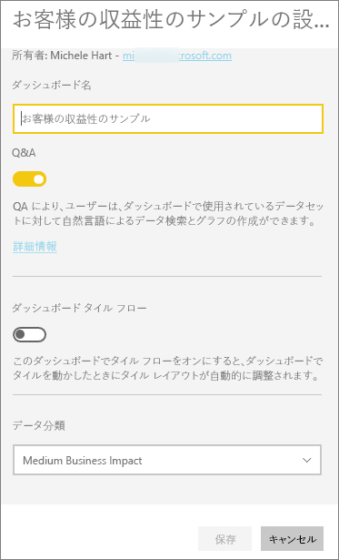
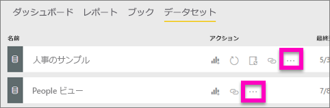
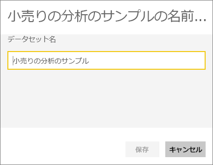
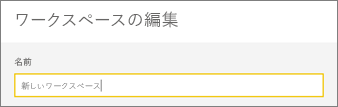

# Power BI サービスのほとんどすべてのものの名前を変更する
この記事では、Power BI サービスのダッシュボード、レポート、レポートのページ、ブック、データセット、アプリ、ワークスペースの名前を変更する方法について説明します。

**名前を変更できるもの**

| コンテンツの種類 | 作成者 | 自分と共有 |
| --- | --- | --- |
| ワークスペースのダッシュボード |はい |いいえ |
| ワークスペースのレポート |はい |いいえ |
| ワークスペースのブック |はい |いいえ |
| ワークスペースのデータセット |はい |いいえ |
| アプリ ワークスペース |はい (所有者の場合、または管理者アクセス許可を持っている場合) |いいえ |
| 発行されたアプリ |[アプリ] 画面からはできませんが、管理者アクセス許可がある場合はアプリ ワークスペースでアプリの名前を変更して新しい名前で再発行できます |いいえ |
| アプリのコンテンツ (ダッシュボード、レポート、ブック、データセット) |[アプリ] 画面からはできませんが、管理者アクセス許可がある場合はアプリ ワークスペースでアプリのコンテンツの名前を変更して新しい名前で再発行できます |いいえ |
| **[自分と共有]** のコンテンツ |いいえ |いいえ |

## ダッシュボード、レポート、ブックの名前を変更する
1. ワークスペースで **[ダッシュボード]**、**[レポート]**、または **[ブック]** タブを選びます。名前を変更するアイテムをポイントし、歯車アイコン  を選びます。 歯車アイコンが表示されない場合は、名前を変更するアクセス許可がありません。
   
   
2. [設定] ページで、新しい名前を入力して **[保存]** を選びます。
   
   

## データセットの名前を変更する
1. ワークスペースで **[データセット]** タブを選びます。
   
   
2. 名前を変更するアイテムをポイントし、省略記号 [...] を選んで、**[名前の変更]** を選びます。  
   
      
   
   > [!NOTE]
   > ドロップダウンのオプションは変化します。
   > 
   > 
3. [設定] ページで、新しい名前を入力して **[保存]** を選びます。
   
     

## アプリ ワークスペースの名前を変更する
管理者アクセス許可を持つユーザーはアプリ ワークスペースの名前を変更できます。

1. 名前を変更するワークスペースに移動します。
2. 右上隅の省略記号 [...] を選び、**[ワークスペースの編集]** を選びます。 このオプションが表示されない場合は、このワークスペースの名前を変更するアクセス許可がありません。 
   
    
3. 新しいワークスペース名を入力し、**[保存]** を選びます。
   
   

## レポートのページの名前を変更する
Power BI レポートのページの名前を変更するには、  1 回クリックするだけです。 ページの名前は[レポート編集ビュー](service-interact-with-a-report-in-editing-view.md)で変更できます。

1. レポートを[編集ビュー](service-reading-view-and-editing-view.md)で開きます。
2. Power BI ウィンドウの下部にあるレポート ページのタブを探します。
   
    
3. タブを選び、名前を変更するレポート ページを開きます。
4. タブ上の名前をダブルクリックして、強調表示にします。  
   
    
5. レポート ページの新しい名前を入力して、Enter キーを押します。
   
    

## 考慮事項とトラブルシューティング
* 名前を変更しようとするアイテムが自分と共有されている場合、またはコンテンツ パックの一部である場合は、歯車アイコンは表示されず、[設定] にはアクセスできません。
* **[データセット]** タブに省略記号 [...] が表示されていない場合は、ブラウザーのウィンドウを広げます。

他にわからないことがある場合は、 [Power BI コミュニティを利用してください](http://community.powerbi.com/)。

