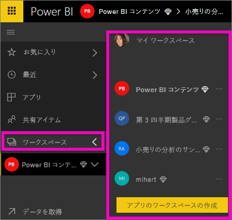
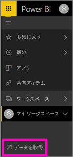
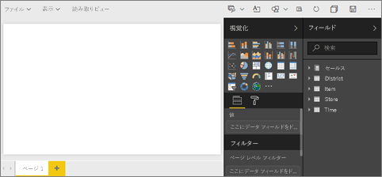
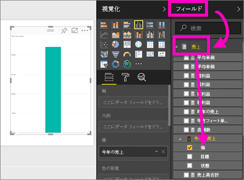
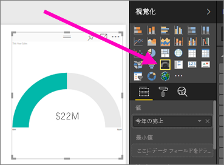
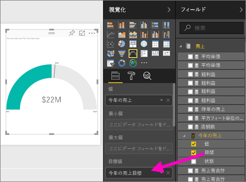
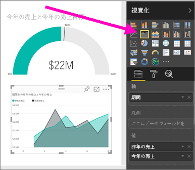
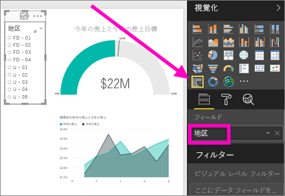

# データセットをインポートすることで、Power BI サービスでレポートを作成します。
[Power BI のレポート](consumer/end-user-reports.md)を読んで、次は自分のレポートを作成しようと思われるでしょう。 レポートを作成するさまざまな方法はあります。 この記事で、Excel データセットから Power BI サービスで基本的なレポートの作成から始めます。 レポートの作成の基本を理解するとチェック アウト、[次のステップ](#next-steps)詳細については、最後に詳細レポートに関するトピック。  

## 前提条件
- [Power BI サービスにサインアップ](service-self-service-signup-for-power-bi.md)します。 Power BI Desktop を使用してレポートを作成するには、次を参照してください。 [Desktop のレポート ビュー](desktop-report-view.md)します。 
- [小売りの分析のサンプル Excel データセットをダウンロード](http://go.microsoft.com/fwlink/?LinkId=529778)またはローカルでの OneDrive for Business に保存します。

## データセットをインポートする
この方法でのレポート作成は、データセットと空白のレポート キャンバスから始まります。 小売りの分析のサンプル Excel データセット内に沿ったをフォローできます。

1. いますします、Power BI サービス ワークスペースにレポートを作成、ため既存のワークスペースを選択したり、1 つ作成します。
   
   
2. 左側のナビゲーション ウィンドウの下部にある、次のように選択します。**データを取得する**します。
   
   
3. **[ファイル]** を選択し、小売りの分析のサンプルを保存した場所に移動します。
   
    ![[ファイル] の選択](media/service-report-create-new/power-bi-select-files.png)
4. この演習では、 **[インポート]** を選択します。
   
   ![[インポート] の選択](media/service-report-create-new/power-bi-import.png)
5. データセットをインポートしたら、 **[データセットの表示]** を選択します。
   
   ![[データセットの表示] の選択](media/service-report-create-new/power-bi-view-dataset.png)
6. データセットを表示すると、実際にはレポート エディターが開きます。  空白のキャンバスとレポート編集ツールが表示されます。
   
   

> [!TIP]
> レポート編集キャンバスに詳しくない場合は、復習[レポート エディターのツアー](service-the-report-editor-take-a-tour.md)続行する前にします >。 
> 

## レポートに放射状ゲージを追加する
データセットがインポートされたので、質問への回答を始めましょう。  最高マーケティング責任者 (CMO) は、今年の売上目標にどれだけ近づいているかを知りたいと考えています。 ゲージは、このような種類の情報を表示するために[適した視覚化の選択肢](visuals/power-bi-report-visualizations.md)です。

1. [フィールド] ウィンドウで、 **[Sales (売上)]**  >  **[This Year Sales (今年の売上)]**  >  **[値]** を選びます。
   
    
2. ゲージのテンプレート  を **[視覚化]** ウィンドウから選択して、ビジュアルをゲージに変換します。
   
    
3. **\[Sales] \(売上)**  >  **\[This Year Sales] \(今年の売上)**  >  **[目標]** を **[目標値]** にドラッグします。 目標に非常に近づいているようです。
   
    
4. 良いレポートを保存するようになりましたでしょう。
   
   ![[ファイル] メニュー](media/service-report-create-new/powerbi-save.png)

## 面グラフとスライサーをレポートに追加する
CMO に対して、その他いくつかの質問に応える必要があります。 CMO は、昨年と比較して今年の売上がどうであるかを知りたいと考えています。 また、地区ごとの調査結果を見たいと言っています。

1. まず、キャンバスに空き領域を作りましょう。 ゲージを選択し、右上隅に移動します。 次に、四隅のいずれかをつかんでドラッグし、サイズを小さくします。
2. ゲージの選択を解除します。 [フィールド] ウィンドウで、 **[Sales (売上)]**  >  **[This Year Sales (今年の売上)]**  >  **[値]** を選択し、 **[Sales (売上)]**  >  **[Last Year Sales (昨年の売上)]** を選択します。
   
    
3. 面グラフのテンプレート  を **[視覚化]** ウィンドウから選択し、ビジュアルを面グラフに変換します。
4. **[Time (時間)]**  >  **[Period (期間)]** を選択して、[Period (期間)] を **[軸]** に追加します。
   
    
5. 視覚化を期間で並べ替えるには、省略記号を選んで、 **[Sort by Period]\(期間別に並べ替え\)** を選びます。
6. 次にスライサーを追加しましょう。 キャンバスの空いている領域を選択して、スライサー  テンプレートを選択します。 キャンバスに空のスライサーがあるようになりました。
   
        
7. [フィールド] ウィンドウから **[District (地区)]**  >  **[District (地区)]** の順に選択します。 スライサーを移動し、サイズを変更します。
   
      
8. スライサーを使用して地区ごとのパターンや洞察を探します。
   
     

データの調査と視覚エフェクトの追加を続けます。 特に興味深い分析情報が見つかったら、[ダッシュボードにピン留め](service-dashboard-pin-tile-from-report.md)します。

## 次の手順

* [視覚化をダッシュボードにピン留めする](service-dashboard-pin-tile-from-report.md)方法の詳細   
* 他にわからないことがある場合は、 [Power BI コミュニティを利用してください](http://community.powerbi.com/)。

