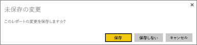
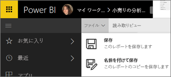
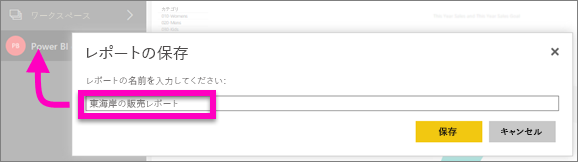

# Power BI サービスおよび Power BI Desktop でレポートを保存する
Power BI でレポートを変更した後、そのレポートを保存したり、新しい名前を付けて保存したり、変更を保存せずに閉じたりできます。 たとえば、レポートを開き、視覚化を作成し、それをダッシュボードにピン留めしたとします。 変更を保存せずにレポートをすぐに閉じた場合、タイルはダッシュボードに残りますが、視覚化はレポートに保存されていません。 ダッシュボードでそのタイルをクリックすると、レポートが開きますが、視覚エフェクトはレポートに存在しなくなっています。

> [!TIP]
> アクティブなワークスペースに注目すると、保存されたレポートがわかります。 レポートは、アクティブなワークスペースに保存されます。
> 
> 

### レポートを保存するには:
1. レポートを変更した後、レポートから別の場所に移動しようとすると、レポートを保存するかどうか確認するメッセージが表示されます。
   
   
2. レポートを保存するもう 1 つの方法としては、**[ファイル]** \> **[保存]** または **[名前を付けて保存]** を選びます。 読み取りビューの場合は、[[名前を付けて保存]](service-reading-view-and-editing-view.md) のみが表示されます。 
   
   
3. 新しいレポート ([保存]) または既存のレポートの新しいバージョン ([名前を付けて保存]) の場合は、わかりやすい名前を付けます。  **レポートは、アクティブなワークスペースに追加されます**。
   
    

### 次の手順
[Power BI のレポート](service-reports.md)で詳細を確認する

[Power BI - 基本的な概念](service-basic-concepts.md)

他にわからないことがある場合は、 [Power BI コミュニティを利用してください](http://community.powerbi.com/)。

