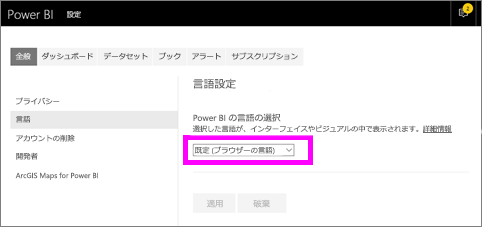
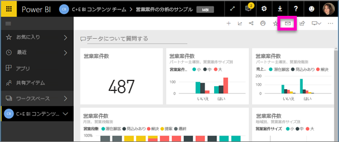
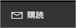
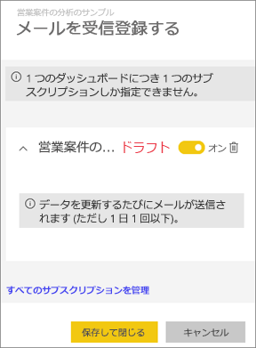
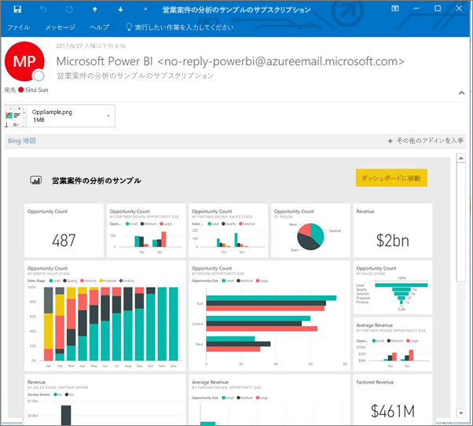
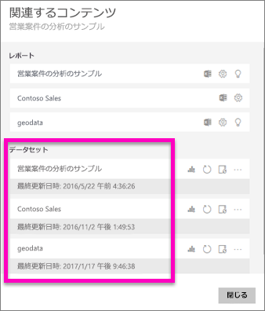
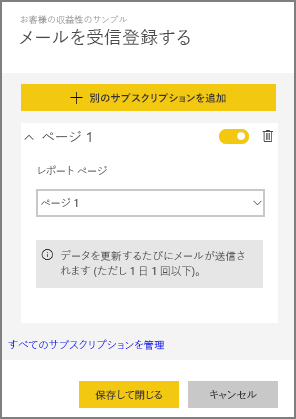
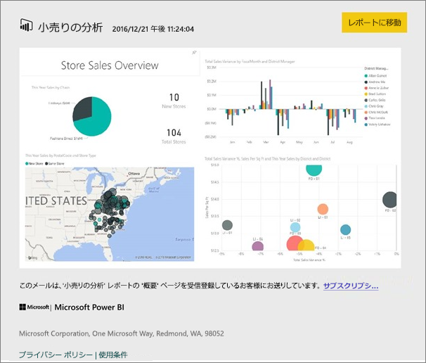
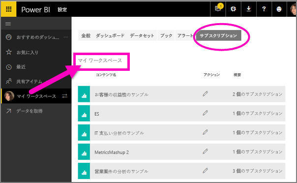

# Power BI サービスのレポートやダッシュボードを購読する (app.powerbi.com)
最も重要なダッシュボードとレポートを簡単に最新の状態に維持できます。 最も重要なレポート ページとダッシュボードを購読すると、Power BI はスナップショットを電子メールでユーザーの受信トレイに送信します。 メールの受信頻度は日に 1 回から週に 1 回の範囲で選択できます。 

メールとスナップショットでは、Power BI 設定で指定されている言語が使用されます (「[Power BI でサポートされる言語と国/地域](supported-languages-countries-regions.md)」参照)。 言語が定義されていない場合、Power BI では現在のブラウザーのロケール設定に基づいて言語を使用します。 言語の優先順位を表示または設定するには、歯車アイコン   **> [設定] > [全般] > [言語]** の順に選択します。 

> [!NOTE]
> サブスクリプションは、Power BI サービスでのみ作成できます。 受信したメールには、[レポートに移動]/[ダッシュボードに移動] リンクが含まれます。 Power BI アプリがインストールされたモバイル デバイスでこのリンクを選ぶと、アプリが起動します (Power BI Web サイトでレポートまたはダッシュボードを開く既定の操作とは異なります)。
> 
> 

レポート用にメール サブスクリプションを設定するところをご覧ください。 その後、ビデオで説明されている手順に従って、ご自分でやってみてください。

<iframe width="560" height="315" src="https://www.youtube.com/embed/saQx7G0pxhc" frameborder="0" allowfullscreen></iframe>

## 要件
サブスクリプションの**作成**は Power BI Pro の機能であり、コンテンツ (ダッシュボードまたはレポート) の表示または編集アクセス許可が必要です。

## ダッシュボードを購読する

1. ダッシュボードを開きます。
2. 上部のメニュー バーで **[受信登録する]** または封筒アイコン  を選びます。
   
   
3. 黄色のスライダーを使うと、サブスクリプションのオン/オフを切り替えることができます。  スライダーをオフにしても、サブスクリプションが削除されることはありません。 サブスクリプションを削除するには、ごみ箱アイコンを選択します。
   
   
4. サブスクリプションを保存するには、**[保存して閉じる]** を選択します。 基になるデータセットのいずれかが変わるたびに、ダッシュボードのスナップショットがメールで送信されます。 ダッシュボードが 1 日に複数回更新されても、スナップショット メールが届くのは最初の更新後の 1 回だけです。
   
   
   
   > [!TIP]
   > メールをすぐに見たい場合は、 ダッシュボードに関連付けられているデータセットの 1 つを更新することで、メールをトリガーします (データセットの編集アクセス許可を持っていない場合は、アクセス許可を持っているユーザーに頼む必要があります)。ダッシュボードの作成に使われているデータセットを調べるには、ダッシュボードから **[関連の表示]** アイコン ![[関連の表示] アイコン](media/service-report-subscribe/power-bi-view-related.png) を選択し、**[関連コンテンツ]** を開いて更新アイコン  を選択します。 
   > 
   > 
   
   

## レポート ページをサブスクライブする
1. [閲覧モード](service-reading-view-and-editing-view.md)でレポートを開きます。
2. 上部のメニュー バーから、**[購読]** を選択します。
   
   
3. 一度にサブスクライブできるレポート ページは 1 件に限られます。 ドロップダウンからレポート ページを選択してください。
   
   
   
   レポート ページを追加します。
4. 黄色のスライダーを使用すると、各ページのサブスクリプションのオン/オフを切り替えることができます。  スライダーをオフにしても、サブスクリプションが削除されることはありません。 サブスクリプションを削除するには、ごみ箱アイコンを選択します。
   
   
5. サブスクリプションを保存するには、**[保存して閉じる]** を選択します。 レポートが更新されると、各レポート ページのスナップショットがメールで届きます。 レポートが更新されなかった場合、その日はスナップショット メールが届きません。  レポートが 1 日に複数回更新されても、スナップショット メールが届くのは最初の更新後の 1 回だけです。
   
   
   
   > [!TIP]
   > メールをすぐに見たい場合は、 データセットを開いて **[今すぐ更新]** を選ぶことで、メールをトリガーします。 データセットの編集アクセス許可を持っていない場合は、アクセス許可を持っているユーザーに頼む必要があります。
   > 
   > ![[データセット] タブの [今すぐ更新] アイコン](media/service-report-subscribe/power-bi-refresh-now.png)
   > 
   > 

## レポートのメール スケジュールを決定する方法
次の表では、メールを受信する頻度について説明します。 すべては、ダッシュボードまたはレポートの元になっているデータセットの接続方法 (DirectQuery、ライブ接続、Power BI へのインポート、OneDrive または SharePoint Online の Excel ファイル) および使用可能で選択されているサブスクリプション オプション (毎日、毎週、なし) によって決まります。

|  | **DirectQuery** | **ライブ接続** | **スケジュールされた更新 (インポート)** | **OneDrive/SharePoint Online の Excel ファイル** |
| --- | --- | --- | --- | --- |
| **レポート/ダッシュボードの更新頻度** |15 分ごと |Power BI は 15 分ごとにチェックし、レポートが変更されている場合はデータセットを更新します。 |ユーザーは、なし、毎日、または毎週を選びます。 毎日は、最大で 1 日に 8 回まで指定できます。 毎週は、実際にはユーザーが作成する週単位のスケジュールであり、最低 1 週間に 1 回から最高毎日までの範囲で、更新を設定します。 |1 時間ごと |
| **サブスクリプション メールのスケジュールをユーザーが制御できる範囲** |オプション: 毎日または毎週 |オプションなし: レポートが更新されるとメールが送信されます。ただし、最高 1 日 1 回です。 |更新スケジュールが毎日の場合、オプションは毎日および毎週です。  更新スケジュールが毎週の場合、オプションは毎週だけです。 |オプションなし: データセットが更新されるたびにメールが送信されます。ただし、最高 1 日 1 回です。 |

## サブスクリプションを管理する
サブスクリプションの管理画面には、2 とおりの方法でアクセスできます。  最初の方法は、**[メールを受信登録する]** ダイアログから **[すべてのサブスクリプションを管理]** を選択することです (上記の手順 3 参照)。 2 つ目の方法は、上部のメニュー バーから Power BI 歯車アイコン  を選択し、**[設定]** を選択することです。

![[設定] の選択](media/service-report-subscribe/power-bi-subscribe-settings.png)

表示されるサブスクリプションは、現在アクティブになっているワークスペースによって変わります。  すべてのワークスペースのすべてのサブスクリプションを一度に表示するには、**[マイ ワークスペース]** をアクティブにします。 ワークスペースの概要については、「[Workspaces in Power BI](service-create-distribute-apps.md)」 (Power BI のワークスペース) を参照してください。

Pro ライセンスの有効期限が切れた場合、所有者がダッシュボードまたはレポートを削除した場合、またはサブスクリプションの作成に使われたユーザー アカウントが削除された場合、サブスクリプションは終了します。

## 考慮事項とトラブルシューティング
* 現在のところ、コンテンツ パックまたは Power BI アプリから送られるダッシュボードまたはレポートについては、サブスクリプションを利用できません。 ただし、回避策があります。レポート/ダッシュボードのコピーを作成し、代わりにそのバージョンにサブスクリプションを追加します。
* レポート ページのサブスクリプションは、レポート ページの名前に関連付けられています。 レポート ページにサブスクライブし、名前を変更する場合は、サブスクリプションを再作成する必要があります。
* ライブ接続データセットでのメール サブスクリプションの場合、データが変更されたときにだけメールを受け取ります。 したがって、更新が発生してもデータが変わらない場合は、メールは送信されません。
* メール サブスクリプションは、ほとんどの[カスタム ビジュアル](power-bi-custom-visuals.md)をサポートしていません。  例外は[認定](power-bi-custom-visuals-certified.md)されているカスタム ビジュアルです。  
* メール サブスクリプションは、レポートの既定のフィルターとスライサーの状態で送信されます。 サブスクライブする前に既定値を変更しても、メールには反映されません。    
* メール サブスクリプションは、Power BI Desktop のサービスへのライブ接続機能で作成されたレポート ページではまだサポートされていません。    
* ダッシュボードのサブスクリプションに限り、特定の種類のタイルはまだサポートされていません。  ストリーミング タイル、ビデオ タイル、カスタム Web コンテンツ タイルなどです。     
* テナントの外部の同僚とダッシュボードを共有する場合、同僚はダッシュボードまたはそれに関連付けられているレポート ページを購読することはできません。 したがって、ユーザー aaron@xyz.com は anyone@ABC.com と共有することができます。しかし、anyone@ABC.com は共有されたコンテンツを購読することはできません。    
* メールのサイズ制限のため、ダッシュボードまたはレポートに非常に大きい画像が含まれると、サブスクリプションが失敗する場合があります。    
* Power BI は、2 か月より長くアクセスされていないダッシュボードおよびレポートに関連付けられているデータセットの更新を自動的に一時停止します。  ただし、ダッシュボードまたはレポートにサブスクリプションを追加した場合は、アクセスがなくても一時停止されません。    
* サブスクリプション メールが送られてこない場合は、ユーザー プリンシパル名 (UPN) でメールを受信できることを確認してください。 [Power BI チームはこの要件を緩和する作業を行っている](https://community.powerbi.com/t5/Issues/No-Mail-from-Cloud-Service/idc-p/205918#M10163)ので、お待ちください。 
* 送信されるレポートやダッシュボードは、ユーザーの Power BI の言語設定を使用します。 既定の言語は英語です。 言語の優先順位を表示または設定するには、歯車アイコン   **> [設定] > [全般] > [言語]** の順に選択します。

## 次の手順
* 他にわからないことがある場合は、 [Power BI コミュニティで質問してみてください](http://community.powerbi.com/)。    
* [ブログの投稿をお読みください](https://powerbi.microsoft.com/blog/introducing-dashboard-email-subscriptions-a-360-degree-view-of-your-business-in-your-inbox-every-day/)

